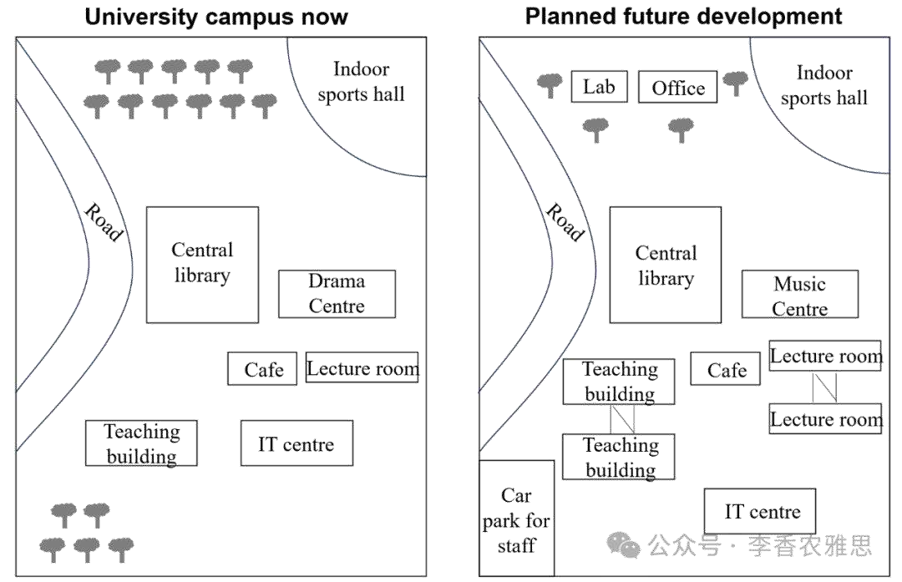

# 地图（Map）

> 地图题描述的是**空间布局及其变化**。它不考趋势，考的是**方位（左右/南北/中央）+ 设施增减 + 功能转换**。
>
> 地图题最常见是"同一地点两个年份的对比"。处理原则：**先说整体布局，再按方位或设施一项项比变化**，用 `was replaced by / converted into / added` 这类"变动动词"。
>
> 下面用 Part 1 主线程的同一套小作文流程走一遍：**首段改写 → Overview（主要变化）→ 主体段（按方位/设施列变化 + 分析主要不同）→ 改写润色（实词替换 / 句式升级）**。

---

## 代表真题（学生宿舍平面图 · 2010 vs now）

> **The maps below show the layout of a student accommodation building in 2010 and the present day.**
> **Summarise the information by selecting and reporting the main features, and make comparisons where relevant.**

---

## ① 首段改写（有什么数据，先写一句出来）

题目说"学生宿舍 2010 和现在的平面图"。改写时把 `maps show` 升级，点出对比本质：

> 初稿改写：`The maps show a student building in 2010 and now.`
> 升级改写：`The maps illustrate the layout of a student accommodation building in 2010 and the present day, highlighting the changes that have taken place over the period.`

**要点**：把 `maps show` 换成 `maps illustrate the layout of`；补 `highlighting the changes` 点明这是"变化对比"题，比原题更准。

---

## ② Overview

看完全图，先想"最大的变化是什么"：
- 房间数量明显增多（多了独立卧室 / 套间），公共区域被压缩或重新分配。
- 某些设施被替换：比如旧的公用厨房/休息室变成了新房间，或新增了设施（如电梯、洗衣房）。

> Overview 初稿：`Overall, the building has more rooms now, and some shared spaces were changed into bedrooms.`
> Overview 升级：`Overall, the most noticeable change is the increase in the number of private rooms, achieved mainly by converting former shared facilities into individual bedrooms, while the remaining common areas were reorganized.`

**要点**：Overview 不写每个房间，只写"房间变多 + 怎么变多（公共区改卧室）"这个**主导变化**。

---

## ③ 主体段

**Body 1（左侧 / 上层变化）**：

列变化试水句：
> In 2010, the left side had a big common room and two shared bedrooms. Now, the common room is gone and there are four small bedrooms instead. The two old bedrooms are still there but smaller.

分析不同试水句：
> The biggest change on this side is that the shared lounge became bedrooms, so students have more private space but less shared space.

中文思路：按"方位 + 原设施 → 现设施"逐格对比。重点是"公共休息室被改成卧室"这种**功能转换**，用 `was converted into` 最准。

**Body 2（右侧 / 下层变化）**：

列变化试水句：
> On the right, the old kitchen and dining area are now split into a smaller kitchen and two more bedrooms. A new laundry room was added near the entrance. The bathroom in the middle stayed the same.

分析不同试水句：
> The right side kept its kitchen but lost the dining space, and gained a laundry room. Only the central bathroom did not change.

中文思路：右侧重点是"厨房保留但餐厅没了、新增洗衣房、卫生间不变"。把"保留 / 消失 / 新增"三种变动都点出来，对比才完整。

---

## ④ 改写润色

**Body 1 列变化句升级**：
- 普通：The common room is gone and there are four small bedrooms instead.
- 升：`The former common room has been converted into four individual bedrooms, significantly increasing the building's capacity for private accommodation.`（`converted into` 替 gone/became；`increasing capacity` 补结果）
- 普通：The two old bedrooms are still there but smaller.
- 升：`The two original bedrooms remain, though their floor area has been reduced to accommodate the new layout.`（`remain` 替 still there；`floor area reduced` 精准）

**Body 2 列变化句升级**：
- 普通：A new laundry room was added near the entrance.
- 升：`A new laundry room has been added adjacent to the entrance, a facility absent from the 2010 plan.`（`adjacent to` 替 near；`a facility absent from` 点出"新增"）
- 普通：The bathroom in the middle stayed the same.
- 升：`The central bathroom, by contrast, has been left unchanged throughout the redevelopment.`（`by contrast` 衔接；`left unchanged` 替 stayed the same）

把升后句子拼起来，就是下方⑤完整范文主体段。

---

## ⑤ 完整范文
The maps illustrate the layout of a student accommodation building in 2010 and the present day, highlighting the changes that have taken place over the period.

On the left wing, the 2010 plan featured a large common room alongside two shared bedrooms. In the present layout, the former common room has been converted into four individual bedrooms, significantly increasing the building's capacity for private accommodation. The two original bedrooms remain, though their floor area has been reduced to accommodate the new layout.

On the right side, the old kitchen and dining area have been split into a smaller kitchen and two additional bedrooms. A new laundry room has been added adjacent to the entrance, a facility absent from the 2010 plan. The central bathroom, by contrast, has been left unchanged throughout the redevelopment.

Overall, the most noticeable change is the increase in the number of private rooms, achieved mainly by converting former shared facilities into individual bedrooms, while the remaining common areas were reorganized to include new amenities such as a laundry room.

---

## ⑥ 同类型变体（规划图 · 生物学院）

这篇也是地图，但是"一张规划图（非双年对比）"。看它怎么处理**单一布局的描述顺序**。

**The map below shows the proposed plan for a biological sciences building at a university.**

The map illustrates the proposed layout of a biological sciences building, with its main entrance facing south and a central atrium connecting the wings.

As shown, the ground floor is dominated by teaching spaces: two large lecture theatres sit on the western side, while a row of laboratories occupies the eastern wing. The central atrium, flanked by a reception area and a café, serves as the building's core. On the upper floor, the laboratories expand further northward, and a dedicated research library replaces the lecture theatres above. A greenhouse is planned for the rooftop, accessible via the eastern staircase.

Overall, the design separates teaching functions on the ground floor from research activities above, with shared amenities clustered around the central atrium to maximise circulation.

---

## 地图要点回顾

- 首段改写：点出是"布局 / 两个年份对比 / 规划图"；用 `illustrate the layout of` 而非 `show`。
- Overview：写"主导变化是什么"（房间增多？功能转换？设施新增？），不列每个房间。
- 主体段：**按方位或设施一项项比**。双年图用 `was converted into / has been replaced by / added / left unchanged`；规划图用 `sits on / occupies / flanked by` 描述静态位置。
- 润色：`gone` → `has been converted into`；`stayed the same` → `has been left unchanged`；善用 `former / adjacent to / by contrast`。
- 方位词要稳定：left wing / right side / central / northern — 让读者能在脑中"看见"图。
