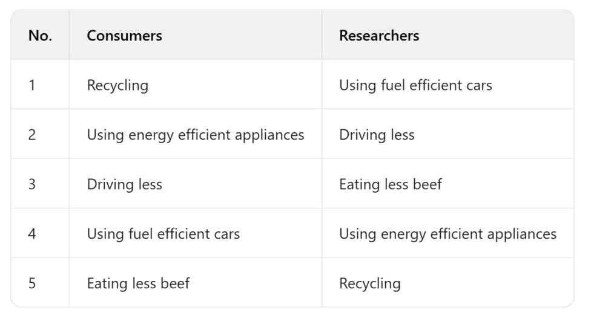

# F 系列：非数据类表格题

> F 系列（`F-01.png` / `F-02.png` / `F-03.png`）**是"非数据类表格题"**——也就是表格里装的不是统计数字，而是**排名、分类、优先级、群体看法对比**这类定性信息（如"消费者 vs 研究者对环保行动的优先级排序"）。
>
> 它的处理和普通表格一脉相承：**首段改写 → Overview（主要差异）→ 主体段（列类别/排名 + 分析错位对比）→ 改写润色**。区别在于：主体段不写"上升了 10%"，而是写"X 把 A 排第一，而 Y 把 A 排最后"这种**错位对比**——这才是 F 系列的得分命门。
>
> 下面用 Part 1 主线程的同一套小作文流程走一遍。

---

## 代表真题（两类群体对环保行动的优先级排序）

> **The tables below show how two groups of people — consumers and environmental researchers — ranked six proposed environmental actions in order of priority (1 = highest, 6 = lowest).**
> **Summarise the information by selecting and reporting the main features, and make comparisons where relevant.**

---

## ① 首段改写（有什么数据，先写一句出来）

题目说"消费者和研究者对六项环保行动排了优先级"。改写时把 `tables show` 升级，点出"排名"本质：

> 初稿改写：`The tables show how consumers and researchers ranked six actions.`
> 升级改写：`The tables compare the priority rankings that consumers and environmental researchers assigned to six proposed environmental actions, where 1 indicates the highest priority and 6 the lowest.`

**要点**：把 `tables show` 换成 `tables compare the priority rankings`；明确 `1 = highest, 6 = lowest` 这个刻度，否则读者看不懂数字含义。

---

## ② Overview

看完全表，先想"最大的错位是什么"：
- 两类群体在" recycle at home "和" boycott polluting brands "上排名接近。
- 最大分歧在" lobby government "：研究者排第一，消费者排第五——**同一项行动，两群人眼里的位置天差地别**。

> Overview 初稿：`Overall, the two groups agreed on some actions but disagreed a lot on others.`
> Overview 升级：`Overall, while the two groups assigned similar ranks to everyday actions such as recycling, they diverged sharply on systemic measures: researchers prioritised lobbying government and funding clean technology, whereas consumers placed these near the bottom.`

**要点**：Overview 不列每个排名，只写"日常行动共识、系统性措施分歧"这个**结构关系**，并点出最极端的错位（政府游说）。

---

## ③ 主体段

**Body 1（共识项 + 消费者视角）**：

列排名试水句：
> Consumers ranked "recycle at home" first (1) and "reduce personal driving" second (2). They put "lobby government" fifth (5) and "fund clean tech" last (6). Researchers also put recycling high, at second (2).

分析不同试水句：
> Consumers cared most about things they can do themselves. They did not think government or technology actions were their job.

中文思路：先写消费者视角——个人行动排前面、系统性行动排后面。这是"个人责任优先"的逻辑。

**Body 2（研究者视角 + 错位对比）**：

列排名试水句：
> Researchers ranked "lobby government" first (1) and "fund clean tech" second (2). They put "recycle at home" only second (2), same as consumers, but "reduce personal driving" they ranked fourth (4). So the two groups swapped places on lobbying and recycling.

分析不同试水句：
> Researchers saw system change as the top priority, the exact opposite of consumers. The biggest gap is on lobbying government: rank 1 vs rank 5.

中文思路：再写研究者视角，然后**直接点出错位**——政府游说（1 vs 5）、清洁能源资助（2 vs 6）。把"同一项行动两群人排名对调"写出来，就是 F 系列最该写的对比。

---

## ④ 改写润色

**Body 1 列排名句升级**：
- 普通：Consumers ranked "recycle at home" first (1) and "reduce personal driving" second (2).
- 升：`Consumers assigned the highest priority (rank 1) to recycling at home, followed closely by reducing personal driving (rank 2).`（`assigned the highest priority` 替 ranked first；`followed closely by` 替 second）
- 普通：They put "lobby government" fifth (5) and "fund clean tech" last (6).
- 升：`By contrast, they placed lobbying the government near the bottom (rank 5) and funded clean-technology initiatives last (rank 6), treating systemic measures as least urgent.`（`By contrast` 衔接；`treating... as least urgent` 补定性）

**Body 2 列排名句升级**：
- 普通：Researchers ranked "lobby government" first (1) and "fund clean tech" second (2).
- 升：`Environmental researchers, however, inverted this order: they ranked lobbying government first (1) and funding clean technology second (2), viewing structural intervention as the most effective lever.`（`inverted this order` 点出"对调"；`viewing... as the most effective lever` 补原因）
- 普通：The two groups swapped places on lobbying and recycling.
- 升：`The most striking discrepancy lies in lobbying government, which topped researchers' list yet ranked only fifth among consumers — a reversal of nearly the entire scale.`（`The most striking discrepancy lies in` 替 swapped；`a reversal of nearly the entire scale` 强调错位幅度）

把升后句子拼起来，就是下方⑤完整范文主体段。

---

## ⑤ 完整范文
The tables compare the priority rankings that consumers and environmental researchers assigned to six proposed environmental actions, where 1 indicates the highest priority and 6 the lowest.

Consumers assigned the highest priority (rank 1) to recycling at home, followed closely by reducing personal driving (rank 2). They also rated boycotting polluting brands third (3). By contrast, they placed lobbying the government near the bottom (rank 5) and funded clean-technology initiatives last (rank 6), treating systemic measures as least urgent.

Environmental researchers, however, inverted this order: they ranked lobbying government first (1) and funding clean technology second (2), viewing structural intervention as the most effective lever. Recycling at home, although still valued, was placed second (2) rather than first, and reducing personal driving slipped to fourth (4). The most striking discrepancy lies in lobbying government, which topped researchers' list yet ranked only fifth among consumers — a reversal of nearly the entire scale.

Overall, while the two groups assigned similar ranks to everyday actions such as recycling, they diverged sharply on systemic measures: researchers prioritised lobbying government and funding clean technology, whereas consumers placed these near the bottom.

---

## ⑥ 同类型变体（F-02 / F-03 · 分类与群体看法）

F 系列另两图（F-02、F-03）是同类"非数据表格"的变体：一张可能是**按可行性给措施分类**（easy / moderate / difficult），另一张可能是**不同城市居民对同政策的支持度排序**。写法完全一致——抓"错位"：

- **分类表**（F-02）：不写数字，写"X 被归为 easy，Y 被归为 difficult"，重点是比较各类别里有哪些措施、有无跨类争议项。
- **群体看法表**（F-03）：写法同代表题，但对比的是"城市居民 A vs B"或"青年 vs 老年"，同样找"同一项两群人排名对调"的极端错位。

> 示例框架（F-03 居民支持度）：
> The table compares how residents of City A and City B rated their support for five urban policies, from 1 (strongly support) to 5 (strongly oppose).
> As seen, both cities strongly backed public transport expansion (rank 1–2), showing consensus on transit. However, they diverged on congestion charging: City A ranked it 2nd, while City B placed it last (5), reflecting different tolerance for road pricing. The widest gap appeared in high-rise housing, which City A favoured (rank 2) but City B resisted (rank 4).
> Overall, the two cities agreed on transit investment but split sharply on market-based and density policies.

---

## F 系列要点回顾

- 首段改写：必须解释排名/刻度含义（1=最高 或 strongly support），否则数字无意义。
- Overview：写"哪类项目两群人共识、哪类分歧最大"，不列每个排名。
- 主体段：**先分群体写各自排名，再点错位**。F 系列的精华是"同一项行动两群人排名对调"（如 lobbying：1 vs 5），用 `inverted this order / a reversal of nearly the entire scale` 点出。
- 润色：`ranked first` → `assigned the highest priority`；`put last` → `placed... last, treating... as least urgent`；善用 `By contrast / however / The most striking discrepancy lies in`。
- 没有真实统计数字时，用"排名 + 定性"代替趋势描述，逻辑依然是"分组 + 对比 + 极值"。
