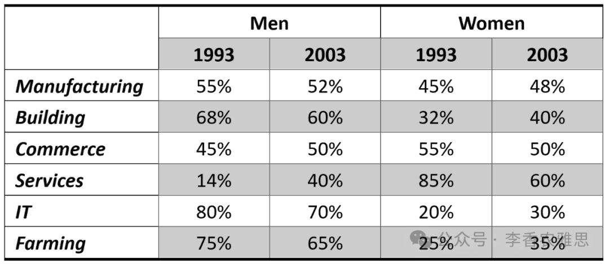

# 2024 年 12 月 7 日雅思写作真题
## Task 1

> **图表类型标注**：表格（新西兰男女就业模式）

**The table below shows employment patterns for males and females in New Zealand in 1993 and 2003. Summarise the information by selecting and reporting main features, and make comparisons where relevant.**



The table illustrates changes in the employment rates of males and females in manufacturing, building, commerce, services, IT, and farming in New Zealand between 1993 and 2003.

As seen, the proportion of males employed in IT was the highest across all sectors, despite it decreasing from 80% in 1993 to 70% in 2003. In contrast, the percentage of females in IT rose significantly from 20% to 30%. A similar trend was observed in farming, where male employment declined from 75% to 65%, while the female workforce increased from 25% to 35%. Manufacturing and building followed a comparable pattern, with male employment dropping slightly from 55% to 52% and female participation increasing from 45% to 48%. In building, the proportion of men fell from 68% to 60%, whereas that of women experienced growth from 32% to 40%.

On the other hand, in services, women dominated in 1993, making up 85% of the workforce. However, that figure dropped significantly to 60% in 2003. Conversely, male employment in that sector rose sharply from 15% to 40%. Commerce saw a similar shift, with the data on males climbing from 45% to 50%, while the proportion of females slid from 55% to the same level as that of men in 2003.

Overall, although male employment rates generally declined over the decade, they remained higher in most sectors. Moreover, the rate of employed females increased in several fields, particularly IT and farming, but their dominance in services diminished significantly.

---

### 精析

#### ① 结构分析（精简）

本题属于 **Table** 类 Task 1，涉及 6 个行业（manufacturing, building, commerce, services, IT, farming）中男性和女性在 1993 和 2003 年的就业率变化。

本文采用 **"总-分-总"** 三段式结构：

- **Paragraph 1 — Introduction（开头段）**
  - 改写题目要素：`employment rates of males and females`（替换原题 `employment patterns for males and females`）
  - 明确对象：manufacturing, building, commerce, services, IT, farming + 地点（New Zealand）+ 时间（1993 and 2003）

- **Paragraph 2 — Body Details（主体段：按趋势分组）**
  - **男性下降、女性上升组**：IT, farming, manufacturing, building
    - IT：男性从 80% 降至 70%，女性从 20% 升至 30%
    - Farming：男性从 75% 降至 65%，女性从 25% 升至 35%
    - Manufacturing：男性从 55% 微降至 52%，女性从 45% 升至 48%
    - Building：男性从 68% 降至 60%，女性从 32% 升至 40%
  - **男性上升、女性下降组**：services, commerce
    - Services：女性从 85% 降至 60%，男性从 15% 升至 40%
    - Commerce：男性从 45% 升至 50%，女性从 55% 降至 50%（与男性持平）

- **Paragraph 3 — Overview（总结段）**
  - 男性就业率总体下降，但在大多数行业仍保持较高水平
  - 女性在 IT 和 farming 等领域就业率上升，但在 services 的主导地位显著减弱

> **结构亮点**：作者采用"四降二升"的分组策略，将 IT、farming、manufacturing、building 归为男性下降/女性上升组，services 和 commerce 归为相反趋势组。这种分组方式抓住了数据的核心特征。特别值得注意的是，作者在描述 commerce 时，特意标注了 2003 年女性比例与男性 "the same level"，这种细节捕捉体现了对数据的细致观察。

#### ② 数据组织与对比策略（标注有效写法）

| 写法 | 原文示例 | 技巧说明 |
|------|---------|---------|
| **同步对比** | `male employment declined from 75% to 65%, while the female workforce increased from 25% to 35%` | 用 while 连接男性和女性的相反变化，形成鲜明对比 |
| **占比描述+趋势** | `women dominated in 1993, making up 85% of the workforce. However, that figure dropped significantly to 60%` | 用 dominated 描述主导地位，making up 补充具体占比，However 转折描述变化 |
| **类比概括** | `Manufacturing and building followed a comparable pattern` | 用 comparable pattern 概括两个行业的相似趋势，避免重复描述 |
| **排名变化** | `the proportion of females slid from 55% to the same level as that of men in 2003` | 用 slid 描述下降，the same level as 标注女性降至与男性持平的特殊节点 |

> **数据亮点**：作者对 services 的描述尤为精彩。不仅给出女性从 85% 降至 60% 的大幅变化，还给出男性从 15% 升至 40% 的对应变化。用 "dominated" 描述1993年女性的绝对主导地位（85%），再用 "dropped significantly" 描述其后的急剧下降，形成了强烈的反差。此外，commerce 中 "the same level as that of men" 的标注，捕捉到了性别比例趋于平等的关键节点。

#### ③ 四项能力维度分析（TA / CC / LR / GRA）

- **TA**：作者采用"四降二升"的分组策略，将 IT、farming、manufacturing、building 归为男性下降/女性上升组，services 和 commerce 归为相反趋势组。这种分组方式抓住了数据的核心特征。特别值得注意的是，作者在描述 commerce 时，特意标注了 2003 年女性比例与男性 "the same level"，这种细节捕捉体现了对数据的细致观察。 作者对 services 的描述尤为精彩。不仅给出女性从 85% 降至 60% 的大幅变化，还给出男性从 15% 升至 40% 的对应变化。用 "dominated" 描述1993年女性的绝对主导地位（85%），再用 "dropped significantly" 描述其后的急剧下降，形成了强烈的反差。此外，commerce 中 "the same level as that of men" 的标注，捕捉到了性别比例趋于平等的关键节点。
- **CC**：作者的衔接手段功能明确。"despite" 在段落开头就引入让步，"A similar trend" 实现组内类比，"On the other hand" 实现组间转换，"Conversely" 描述反向变化。这种"让步→类比→转换→反向"的衔接层次，使文章结构严谨且富有变化。
- **LR**：见模块⑤词汇表，含 `proportion`、`significantly` 等精准词
- **GRA**：见模块⑤句式亮点

#### ④ 可迁移句型骨架（直接套用）（图表类型：表格（新西兰男女就业模式））

**骨架 1 — 开头改写（表格/图通用）**
> The [chart] illustrates changes in ______ in [entities] in [years], along with ______.

**骨架 2 — 极值+对比（Body 通用）**
> ______ had [number], which was considerably higher than the figures for the other [n] [entities].

**骨架 3 — 排名变化/超越（含动态时）**
> ______ saw the second-largest rise and surpassed ______, with its figure growing from ______ to ______.

**骨架 4 — 双维度收尾（Overview 通用）**
> Overall, ______ had by far the largest number..., while ______ recorded the lowest figures on both measures.

#### ⑤ 衔接 / 词汇 / 句式亮点（去水版）

| 衔接类型 | 原文表达 | 功能 |
|---------|---------|------|
| **让步转折** | `despite it decreasing from 80% in 1993 to 70% in 2003` | 先承认 IT 行业男性就业率最高，再转折描述其下降趋势 |
| **类比衔接** | `A similar trend was observed in farming...` | 用 similar trend 实现 IT 和 farming 两个行业的类比过渡 |
| **对比过渡** | `On the other hand, in services...` | 从男性下降组转向女性下降组，明确分组界限 |
| **反向对比** | `Conversely, male employment in that sector rose sharply...` | 用 Conversely 描述 services 行业中男性的反向变化，强化对比 |

> **衔接亮点**：作者的衔接手段功能明确。"despite" 在段落开头就引入让步，"A similar trend" 实现组内类比，"On the other hand" 实现组间转换，"Conversely" 描述反向变化。这种"让步→类比→转换→反向"的衔接层次，使文章结构严谨且富有变化。

| 词汇/短语 | 中文含义 | 词性/用法 | 替代普通表达 |
|-----------|----------|----------|-------------|
| **proportion** | 比例；占比 | 名词 | percentage / share |
| **significantly** | 显著地；大幅地 | 副词 | greatly / notably |
| **comparable** | 类似的；可相比的 | 形容词 | similar / alike |
| **dominated** | 占主导地位 | 动词 | controlled / led |
| **slid** | 下滑；下跌 | 动词 | dropped / fell |
| **diminished** | 减弱；缩小 | 动词 | decreased / reduced |

**1. 让步状语+主句描述**
> *"...the proportion of males employed in IT was the highest across all sectors, **despite it decreasing from 80% in 1993 to 70% in 2003**."*

**技巧**：despite 引导的让步结构先强调 IT 行业男性就业率的最高地位，主句再转折描述其下降趋势。这种"最高地位+下降趋势"的反差，突出了数据的变化特征。

**2. 定语从句+分词短语**
> *"A similar trend was observed in farming, **where male employment declined from 75% to 65%, while the female workforce increased from 25% to 35%**."*

**技巧**：用 where 引导的定语从句描述 farming 行业的具体数据，while 连接男性和女性的相反变化。这种"类比概括+具体数据+同步对比"的结构，信息密度高且层次分明。

**3. 分词短语+转折+结果**
> *"...in services, women dominated in 1993, **making up 85% of the workforce**. **However**, that figure dropped significantly to 60% in 2003."*

**技巧**：making up 现在分词短语补充说明女性主导地位的具体数据，However 转折描述其后的急剧下降。这种"主导地位+具体数据+急剧下降"的结构，形成了强烈的叙事张力。

**4. 对比结构+同步变化**
> *"Commerce saw a similar shift, **with the data on males climbing from 45% to 50%, while the proportion of females slid from 55% to the same level as that of men in 2003**."*

**技巧**：用 with 独立主格结构描述 commerce 行业的变化，while 连接男性和女性的相反变化，the same level as 标注两者最终持平。这种"变化+对比+特殊节点"的结构，完整呈现了数据的核心特征。

---

#### ⑥ 可提升空间 + 仿写任务

**可提升空间（通用要点，按篇酌情采纳）：**
- Overview 建议前置或明确独立成段，让阅卷人先抓全局（TA 更稳）。
- 双维度数据（如比率/占比）尽量也收进 Overview，避免只在正文提一次。
- 跨段对比（如 A 反超 B）可集中到一句呈现，衔接更紧凑。

**本文针对性可改进点（按篇分析，点到即止）：**
- 术语失准：表格给的是各行业内男女**所占比例**（两者相加为 100%），文中一律说 `employment rates of males and females`，容易被理解成"男女就业率"；改为 `the proportion of male and female workers in each sector` 更贴合数据性质。
- 冗余最明显的问题：男女数据互为补数，全文却对六个行业逐一双向复述（75%→65% 配 25%→35%，68%→60% 配 32%→40%……），字数翻倍但信息未增；只写一方并加一句 `with the female share moving in the opposite direction` 即可，省下的篇幅用于跨行业对比更划算。
- `Manufacturing and building followed a comparable pattern, with male employment dropping slightly from 55% to 52%` 把两个行业并提却只给了 manufacturing 的数字，下一句才补 building，读者会误以为 55%→52% 是两者共有；建议写成 `in manufacturing... while in building...`。

**仿写任务**：用「极值+对比」骨架写一句：描述『2020 年 X 国指标远高于其他三国』。
## Task 2

> **话题与题型标注**：环境类 · Agree/Disagree

**Long distance flights use more fuel than cars and bring pollution to the environment. Some people think that we should discourage nonessential flights rather than limit the use of car. To what extend do you agree or disagree ?**

**长途航班比汽车消耗更多燃料，并对环境造成污染。有人认为，我们应该限制不必要的航班，而不是限制汽车的使用。你在多大程度上同意或不同意这一观点？**

Long-distance flights have garnered significant attention because of their high fuel consumption and greater contribution to pollution compared to private cars. While some argue that discouraging nonessential flights is a more effective measure than restricting car usage, I disagree with prioritizing the reduction of air travel over car use to mitigate environmental harm.

相对于私家车，长途航班因其高燃油消耗和更大的污染而引起广泛关注。尽管一些人认为限制非必要航班比限制汽车使用更能有效减少污染，我不同意将减少航空旅行置于限制汽车使用之上的优先考虑来减轻环境危害。

Discouraging flights may seem like a viable solution to reducing pollution; however, prioritizing the reduction of car usage should take precedence due to its significant environmental impact and high energy consumption per person. Cars are among the largest contributors to air pollution globally, particularly in urban areas. They release significant amounts of carbon dioxide and other harmful gases which are major drivers of climate change and poor air quality. This impact is magnified by the sheer number of vehicles on the road, with millions in use daily, which lead to traffic congestion that exacerbates the problem. While air travel seems to consume much fossil energy, its utilization is less frequent for the average individual, and its per capita consumption is much lower than car driving. Consequently, its environmental effect, although serious, is not as pervasive on a daily basis as the cumulative effect of cars.

限制航班似乎是减少污染的一个可行解决方案；然而，优先减少汽车使用应该更为重要，因为汽车对环境的影响巨大，且人均能耗较高。汽车是全球空气污染的主要来源之一，尤其是在城市地区。它们排放大量二氧化碳和其他有害气体，这些气体是气候变化和空气质量差的主要因素。由于道路上汽车的数量庞大，每天都有数百万辆车上路，这加剧了交通拥堵问题，从而使污染问题更加严重。虽然航空旅行确实消耗大量化石能源，但对于普通人来说，航空旅行的频率较低，且人均能耗远低于开车。因此，尽管航空旅行对环境的影响严重，但相比汽车的日常累积影响，其污染效应并不那么广泛。

Additionally, discouraging nonessential flights could have severe economic and social repercussions, particularly for the global tourism industry. Air travel plays a vital role in connecting people worldwide, facilitating business and tourism, despite the fact that planes consume much energy per kilometer. For long-distance travel, especially international journeys, there are few practical alternatives. A significant reduction in nonessential flights could harm industries reliant on tourism and international trade, resulting in job losses, economic downturns, and decreased living standards. In contrast, reducing car usage through policies like congestion charges or promoting cleaner vehicle technologies can lead to positive economic and social outcomes, for such measures improve urban air quality, reduce healthcare costs, and foster new green industries. Aside from that, limiting car use brings additional benefits, such as improved public health, reduced congestion, and more livable cities, which likely outweigh the social costs of curbing air travel.

此外，限制非必要航班可能会产生严重的经济和社会影响，尤其是对全球旅游业。尽管飞机每公里消耗大量能源，但航空旅行在全球范围内连接人们，促进商业和旅游，发挥着重要作用。对于长途旅行，特别是国际航班，几乎没有什么实际的替代方式。大幅减少所谓的非必要航班可能会损害依赖旅游和国际贸易的行业，导致失业、经济衰退和生活水平下降。相比之下，通过政策如拥堵费来减少汽车使用，或促进更清洁的车辆技术，可以带来积极的经济和社会效益，因为这些措施改善了城市空气质量、降低了医疗保健成本，并促进了绿色产业的发展。除此之外，限制汽车使用还带来了额外的好处，例如改善公共卫生、减少拥堵和提升城市宜居性，这些益处很可能超过了限制航空旅行的社会成本。

In conclusion, limiting the use of vehicles should take priority due to the substantial impact of cars on local air quality and the numerous social benefits of reducing reliance on them. Although air travel is environmentally harmful, it remains an essential means of long-distance connection, so it is less feasible to prioritize the reduction of their use.

总之，由于汽车对空气质量的重大影响以及减少对汽车依赖带来的众多社会福利，限制汽车使用应当优先考虑。虽然航空旅行对环境有害，但它仍然是长途联系的重要方式，因此，优先减少航空旅行的使用不太可行。

---

### 精析

#### ① 结构分析（精简）

本题属于 **Agree/Disagree** 类题型。此类题型的核心策略是：明确表明立场，然后通过多个论点支撑自己的立场，最后总结重申观点。

本文采用 **"让步-反驳-综合"** 四段式结构：

- **Paragraph 1 — Introduction（开头段）**
  - 改写题目（paraphrase）：`discouraging nonessential flights is a more effective measure than restricting car usage`（替换原题 `we should discourage nonessential flights rather than limit the use of car`）
  - 表明立场：`I disagree with prioritizing the reduction of air travel over car use`（不同意优先限制航空旅行）
  - 预告框架：先论证限制汽车使用的优先性，再讨论限制航班的经济和社会影响

- **Paragraph 2 — Body 1（论证限制汽车的优先性）**
  - 主题句：`prioritizing the reduction of car usage should take precedence due to its significant environmental impact and high energy consumption per person`
  - 论点1：汽车是全球空气污染的主要来源 → 排放大量二氧化碳和有害气体 → 导致气候变化和空气质量差
  - 论点2：汽车数量庞大，每天数百万辆上路 → 交通拥堵加剧污染 → 人均能耗远高于航空旅行

- **Paragraph 3 — Body 2（论证限制航班的负面影响）**
  - 主题句：`discouraging nonessential flights could have severe economic and social repercussions`
  - 论点1：航空旅行连接全球，促进商业和旅游 → 长途旅行几乎没有替代方式 → 减少航班会损害旅游业和国际贸易
  - 论点2：限制汽车使用可带来积极经济和社会效益 → 改善空气质量、降低医疗成本、促进绿色产业 → 额外好处包括改善公共卫生、减少拥堵、提升城市宜居性

- **Paragraph 4 — Conclusion（结尾段）**
  - 重申立场：`limiting the use of vehicles should take priority`
  - 总结升华：航空旅行虽有环境危害，但仍是长途联系的重要方式，优先减少其使用不太可行

> **结构亮点**：作者采用"先立后破"的策略，先论证限制汽车的优先性（环境原因），再论证限制航班的负面影响（经济和社会原因）。这种结构既展示了思维的全面性，又明确表达了立场。特别值得注意的是，作者在 Body 2 中不仅讨论了限制航班的负面后果，还对比了限制汽车的积极效益，这种"正反对比"增强了论证的说服力。

#### ② 论证逻辑链拆解（标注有效写法）

**Body 1（限制汽车的优先性）的逻辑链条：**

```
汽车使用（前提A）
    ↓ [环境影响]
→ 空气污染主要来源（中间结果B）
    ↓ [具体表现]
├── 排放二氧化碳和有害气体（分支C1）
│   ↓
│   气候变化和空气质量差（结果D1）
│
└── 数量庞大导致交通拥堵（分支C2）
    ↓
    人均能耗远高于航空（结果D2） → 日常累积影响更严重（延伸结果E）
```

**Body 2（限制航班的负面影响）的逻辑链条：**

```
限制航班（前提E）
    ↓ [经济和社会影响]
→ 损害旅游业和国际贸易（中间结果F）
    ↓ [具体表现]
├── 失业和经济衰退（分支G1）
│   ↓
│   生活水平下降（结果H1）
│
└── 限制汽车的积极效益（分支G2，对比论证）
    ↓
    改善空气质量、降低医疗成本（结果H2） → 促进绿色产业（延伸结果I）
```

> **逻辑亮点**：Body 1 采用"分类论证+对比论证"，从环境影响和人均能耗两个维度论证限制汽车的优先性，并与航空旅行进行对比。Body 2 采用"分类论证+正反对比"，先讨论限制航班的负面后果，再对比限制汽车的积极效益。特别值得注意的是，Body 1 中 "its per capita consumption is much lower than car driving" 的对比，以及 Body 2 中 "In contrast" 的正反对比，使论证更具张力。

#### ③ 四项能力维度分析（TA / CC / LR / GRA）

- **TA**：作者采用"先立后破"的策略，先论证限制汽车的优先性（环境原因），再论证限制航班的负面影响（经济和社会原因）。这种结构既展示了思维的全面性，又明确表达了立场。特别值得注意的是，作者在 Body 2 中不仅讨论了限制航班的负面后果，还对比了限制汽车的积极效益，这种"正反对比"增强了论证的说服力。 Body 1 采用"分类论证+对比论证"，从环境影响和人均能耗两个维度论证限制汽车的优先性，并与航空旅行进行对比。Body 2 采用"分类论证+正反对比"，先讨论限制航班的负面后果，再对比限制汽车的积极效益。特别值得注意的是，Body 1 中 "its per capita consumption is much lower than car driving" 的对比，以及 Body 2 中 "In contrast" 的正反对比，使论证更具张力。
- **CC**：作者的衔接手段功能明确。"While... I disagree" 在开头段就明确立场，"due to" 在 Body 1 内部解释原因，"Additionally" 实现段落间的递进，"In contrast" 实现同一段落内的正反对比。这种"立场→原因→递进→对比"的衔接层次，使文章结构严谨且富有变化。
- **LR**：见模块⑤词汇表，含 `garnered`、`mitigate` 等精准词
- **GRA**：见模块⑤句式亮点

#### ④ 可迁移句型骨架（直接套用）（题型：Agree/Disagree）

**骨架 1 — 先退后进亮立场（Intro）**
> Although ______ deserves a central place because ______, I disagree with the view that ______.

**骨架 2 — 分类论证起手（Body）**
> From the perspective of ______, doing X helps ______ and ______. Meanwhile, X also offers ______ that go beyond ______.

**骨架 3 — 抽象→具体例证（Body）**
> For example, a course on ______ may show how ______ have harmed ______, as illustrated by ______.

#### ⑤ 衔接 / 词汇 / 句式亮点（去水版）

| 衔接类型 | 原文表达 | 功能说明 |
|---------|---------|---------|
| **让步转折** | `While some argue that... I disagree with...` | 先承认对方观点，再明确表达自己的立场 |
| **因果推导** | `due to its significant environmental impact and high energy consumption per person` | 解释限制汽车优先的原因，强化论证逻辑 |
| **递进扩展** | `Additionally...` | 从环境影响推进到经济和社会影响，丰富论证层次 |
| **对比过渡** | `In contrast, reducing car usage...` | 在 Body 2 内部从限制航班的负面后果转向限制汽车的积极效益，形成正反对比 |

> **衔接亮点**：作者的衔接手段功能明确。"While... I disagree" 在开头段就明确立场，"due to" 在 Body 1 内部解释原因，"Additionally" 实现段落间的递进，"In contrast" 实现同一段落内的正反对比。这种"立场→原因→递进→对比"的衔接层次，使文章结构严谨且富有变化。

| 词汇/短语 | 中文含义 | 词性/用法 | 替代普通表达 |
|-----------|----------|----------|-------------|
| **garnered** | 获得；博得（关注） | 动词 | attracted / received |
| **mitigate** | 减轻；缓解 | 动词 | reduce / lessen |
| **precedence** | 优先；优先权 | 名词 | priority / preference |
| **exacerbates** | 加剧；使恶化 | 动词 | worsens / aggravates |
| **pervasive** | 普遍存在的；无处不在的 | 形容词 | widespread / extensive |
| **repercussions** | （不良）影响；后果 | 名词（复数） | consequences / effects |
| **curbing** | 抑制；限制 | 动词（现在分词） | limiting / restricting |

**1. 让步状语从句+主句立场**
> *"**While some argue that** discouraging nonessential flights is a more effective measure than restricting car usage, **I disagree with prioritizing** the reduction of air travel over car use to mitigate environmental harm."*

**技巧**：用 While 引导让步从句，先承认对方观点的合理性，主句再明确表达自己的立场。prioritizing... over... 的结构清晰表达了"优先顺序"的核心争议，mitigate environmental harm 明确了论证的目标。

**2. 定语从句+结果推导**
> *"They release significant amounts of carbon dioxide and other harmful gases **which are major drivers of** climate change and poor air quality."*

**技巧**：用 which 引导的定语从句，将汽车排放与气候变化和空气质量差关联起来。major drivers of 是精妙的表达，将有害气体比喻为"主要驱动力"，既形象又准确。

**3. 分词短语+因果推导**
> *"This impact is magnified by the sheer number of vehicles on the road, with millions in use daily, **which lead to** traffic congestion **that exacerbates** the problem."*

**技巧**：用 with 独立主格补充说明汽车数量庞大，which 引导的定语从句推导交通拥堵，that 引导的定语从句进一步推导加剧污染。这种"数量→拥堵→加剧"的链式推导，使因果逻辑清晰且层次分明。

**4. 对比结构+综合概括**
> *"**Although air travel is environmentally harmful, it remains an essential means of** long-distance connection, **so it is less feasible to** prioritize the reduction of their use."*

**技巧**：用 Although 引导让步从句，先承认航空旅行的环境危害，主句再转折强调其必要性，so 引导的结果从句推导结论。这种"让步→必要性→结论"的结构，在结论段既总结了全文，又明确表达了最终立场。

#### ⑥ 可提升空间 + 仿写任务

**可提升空间（通用要点，按篇酌情采纳）：**
- 结论段避免复读开头，应「推进」而非「重复」立场。
- 让步段衔接词（this perspective 等）回指别太远，可加限定词收紧。
- 同一话题词（如 career / benefit）避免三现，用近义替换。

**本文针对性可改进点（按篇分析，点到即止）：**
- 核心论断缺支撑：`its per capita consumption is much lower than car driving` 是全文立论的支点，却既无数据也无限定条件，而单次长途飞行的人均排放通常并不低；应加限定（如"就普通人全年累计出行而言"）或补一组量化对比，否则容易被判为 unsupported claim。同句比较对象也不平行，应为 `than that of car travel`。
- Body 2 主题句只承诺讲"限制航班的经济社会代价"，段落后半却整段转去讲"限制汽车的好处"，一段两主题；把 `In contrast, reducing car usage...` 之后的内容拆成独立一段或收进结论更清爽。
- 两处指代/一致性小错：`with millions in use daily, which lead to traffic congestion` 中 which 指代模糊且应为 leads；结论 `prioritize the reduction of their use` 的 their 回指单数的 air travel，应改为 its。
- 全文无一个具体例证（既无城市限行案例，也无航空业就业数据），论证始终停在概括层；任一主体段补一例即可明显提升 TA。

**仿写任务**：用「先退后进」骨架重写：*Some think space exploration is a waste of money.*
