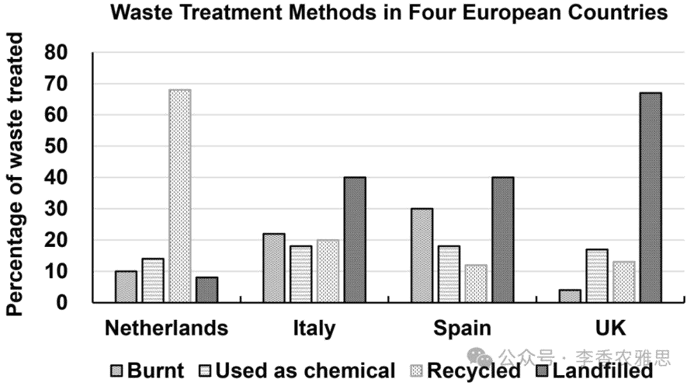

# 2024 年 12 月 14 日雅思写作真题
## Task 1

> **图表类型标注**：柱状图（四国废物处理方式）

**The graph below shows four methods of dealing with waste in four countries. Summarise the information by selecting and reporting the main features and make comparisons where relevant.**



The bar chart illustrates the percentage of waste processed through various methods, namely burning, chemical use, recycling, and landfilling, in the Netherlands, Italy, Spain, and the UK.

As seen, recycling is the dominant method in the Netherlands, accounting for nearly 68% of the total waste treatment. The remaining three methods are significantly less utilized, with the amount of waste disposed through them ranging around 10%. Among those, landfilling represents the smallest proportion (8%). 

In contrast, Italy and Spain adopt a more evenly distributed approach to waste management. Landfilling emerges as the most common method in both countries where 40% of waste is buried. Burning is the second most prominent method, but the figure is higher in Spain, at 30%, compared to the 21% in Italy, whereas the same proportion of waste, 18%, is processed chemically. Recycling, however, plays a relatively minor role, especially in Spain, where it accounts for just 12%. 

The UK relies overwhelmingly on landfilling, with almost 67% of waste managed through this method, the highest proportion in the four countries. Both chemical use and recycling contribute approximately 15% each, while burning is negligible, used for just 4% of the nation’s waste.

Overall, landfilling is the primary waste disposal method in Italy, Spain, and the UK, whereas recycling predominates in the Netherlands. Moreover, among the countries, Italy demonstrates the most balanced use of the four methods.

---

### 精析

#### ① 结构分析（精简）

本题属于 **Bar Chart** 类 Task 1，涉及 4 个国家（Netherlands, Italy, Spain, UK）使用 4 种方法（burning, chemical use, recycling, landfilling）处理垃圾的比例。

本文采用 **"分述-综合"** 三段式结构：

- **Paragraph 1 — Introduction（开头段）**
  - 改写题目要素：`the percentage of waste processed through various methods`（替换原题 `four methods of dealing with waste`）
  - 明确对象：burning, chemical use, recycling, landfilling + 国家（Netherlands, Italy, Spain, UK）

- **Paragraph 2 — Body Details（主体段：按国家分组）**
  - **Recycling 主导型**：Netherlands
    - Recycling：近 68%（主导）
    - 其他三种方法：均约 10%，landfilling 最小（8%）
  - **Landfilling 主导型**：Italy 和 Spain
    - Landfilling：均为 40%（最常用）
    - Burning：Spain 30%，Italy 21%
    - Chemical use：均为 18%
    - Recycling：Spain 仅 12%，Italy 相对较低
  - **Landfilling 绝对主导型**：UK
    - Landfilling：近 67%（四国最高）
    - Chemical use 和 recycling：各约 15%
    - Burning：仅 4%（可忽略）

- **Paragraph 3 — Overview（总结段）**
  - Landfilling 是 Italy、Spain 和 UK 的主要方法，recycling 在 Netherlands 占主导
  - Italy 在四种方法的使用上最为均衡

> **结构亮点**：作者采用"一国一段"的分述策略，分别描述 Netherlands、Italy/Spain 和 UK 的垃圾处理方式。这种结构清晰明了，便于读者对比不同国家的差异。特别值得注意的是，作者将 Italy 和 Spain 合并在一段，因为两国模式相似（均以 landfilling 为主），这种灵活处理避免了段落的过度碎片化。

#### ② 数据组织与对比策略（标注有效写法）

| 写法 | 原文示例 | 技巧说明 |
|------|---------|---------|
| **占比描述** | `recycling is the dominant method... accounting for nearly 68%` | 用 dominant 描述主导地位，accounting for 补充具体占比 |
| **同步对比** | `the figure is higher in Spain, at 30%, compared to the 21% in Italy` | 用 compared to 实现 Spain 和 Italy 的同步对比，突出差异 |
| **极端标注** | `burning is negligible, used for just 4%` | 用 negligible 描述 Burning 在 UK 的可忽略比例，just 强调程度 |
| **均衡描述** | `Italy demonstrates the most balanced use of the four methods` | 用 balanced 概括 Italy 的特点，避免了罗列所有数据的冗长 |

> **数据亮点**：作者对 UK 的描述尤为精彩。用 "overwhelmingly" 强调其对 landfilling 的极度依赖（67%），用 "negligible" 描述 burning 的可忽略比例（4%），形成了强烈的反差。此外，作者在概述段用 "most balanced" 概括 Italy 的特点，这种抽象概括比罗列具体数字更能揭示数据背后的特征。

#### ③ 四项能力维度分析（TA / CC / LR / GRA）

- **TA**：作者采用"一国一段"的分述策略，分别描述 Netherlands、Italy/Spain 和 UK 的垃圾处理方式。这种结构清晰明了，便于读者对比不同国家的差异。特别值得注意的是，作者将 Italy 和 Spain 合并在一段，因为两国模式相似（均以 landfilling 为主），这种灵活处理避免了段落的过度碎片化。 作者对 UK 的描述尤为精彩。用 "overwhelmingly" 强调其对 landfilling 的极度依赖（67%），用 "negligible" 描述 burning 的可忽略比例（4%），形成了强烈的反差。此外，作者在概述段用 "most balanced" 概括 Italy 的特点，这种抽象概括比罗列具体数字更能揭示数据背后的特征。
- **CC**：作者的衔接手段功能明确。"with... ranging around" 实现了数据范围的简洁补充，"In contrast" 实现了国家间的对比过渡，"however" 在段落内部制造转折。特别值得注意的是 "Moreover" 在概述段的使用，不仅总结了主要趋势，还补充了 Italy 的均衡性这一细节，使总结更全面。
- **LR**：见模块⑤词汇表，含 `dominant`、`utilized` 等精准词
- **GRA**：见模块⑤句式亮点

#### ④ 可迁移句型骨架（直接套用）（图表类型：柱状图（四国废物处理方式））

**骨架 1 — 开头改写（表格/图通用）**
> The [chart] illustrates changes in ______ in [entities] in [years], along with ______.

**骨架 2 — 极值+对比（Body 通用）**
> ______ had [number], which was considerably higher than the figures for the other [n] [entities].

**骨架 3 — 排名变化/超越（含动态时）**
> ______ saw the second-largest rise and surpassed ______, with its figure growing from ______ to ______.

**骨架 4 — 双维度收尾（Overview 通用）**
> Overall, ______ had by far the largest number..., while ______ recorded the lowest figures on both measures.

#### ⑤ 衔接 / 词汇 / 句式亮点（去水版）

| 衔接类型 | 原文表达 | 功能 |
|---------|---------|------|
| **范围补充** | `with the amount of waste disposed through them ranging around 10%` | 用 with 独立主格补充说明其他三种方法的比例范围，简洁高效 |
| **对比过渡** | `In contrast, Italy and Spain adopt a more evenly distributed approach...` | 从 Netherlands 的 recycling 主导转向 Italy/Spain 的 landfill 主导，明确分组界限 |
| **让步转折** | `Recycling, however, plays a relatively minor role...` | 用 however 转折，强调 recycling 在 Italy/Spain 的次要地位 |
| **递进补充** | `Moreover, among the countries...` | 在概述段补充 Italy 的特殊性（最均衡），丰富总结内容 |

> **衔接亮点**：作者的衔接手段功能明确。"with... ranging around" 实现了数据范围的简洁补充，"In contrast" 实现了国家间的对比过渡，"however" 在段落内部制造转折。特别值得注意的是 "Moreover" 在概述段的使用，不仅总结了主要趋势，还补充了 Italy 的均衡性这一细节，使总结更全面。

| 词汇/短语 | 中文含义 | 词性/用法 | 替代普通表达 |
|-----------|----------|----------|-------------|
| **dominant** | 占主导的；最主要的 | 形容词 | main / leading |
| **utilized** | 被使用；被利用 | 动词（过去分词） | used |
| **emerges** | 显现为；成为 | 动词 | appears / becomes |
| **prominent** | 突出的；重要的 | 形容词 | important / significant |
| **negligible** | 微不足道的；可忽略的 | 形容词 | insignificant / tiny |
| **overwhelmingly** | 压倒性地；绝大部分地 | 副词 | mostly / mainly |
| **predominates** | 占主导；居首位 | 动词 | dominates / leads |

**1. 分词短语补充说明**
> *"...recycling is the dominant method in the Netherlands, **accounting for nearly 68%** of the total waste treatment."*

**技巧**：用 accounting for 现在分词短语补充说明 recycling 的具体占比。这种"地位+数据"的结构，既描述了方法的主导性，又给出了具体证据。

**2. 定语从句+对比结构**
> *"Burning is the second most prominent method, **but the figure is higher in Spain, at 30%, compared to the 21% in Italy**, whereas the same proportion of waste, 18%, is processed chemically."*

**技巧**：用 but 转折对比 Spain 和 Italy 的 burning 比例，compared to 实现精确对比，whereas 进一步对比 chemical use 的相同比例。这种"地位+对比+并列对比"的结构，在一句内传递了丰富的比较信息。

**3. 分词短语+极端描述**
> *"The UK relies overwhelmingly on landfilling, **with almost 67% of waste managed through this method, the highest proportion in the four countries**."*

**技巧**：用 with 独立主格补充说明 landfilling 的具体比例，the highest proportion in the four countries 进一步强调其极端地位。这种"依赖+数据+排名"的结构，突出了 UK 对 landfilling 的极度依赖。

**4. 对比并列结构**
> *"**Overall, landfilling is the primary waste disposal method in Italy, Spain, and the UK, whereas recycling predominates in the Netherlands.**"*

**技巧**：用 whereas 引导对比从句，将"landfilling 三国"与"recycling 一国"并列呈现。这种"总体对比+具体突出"的结构，在概述段精准概括了数据的核心特征。

---

#### ⑥ 可提升空间 + 仿写任务

**可提升空间（通用要点，按篇酌情采纳）：**
- Overview 建议前置或明确独立成段，让阅卷人先抓全局（TA 更稳）。
- 双维度数据（如比率/占比）尽量也收进 Overview，避免只在正文提一次。
- 跨段对比（如 A 反超 B）可集中到一句呈现，衔接更紧凑。

**本文针对性可改进点（按篇分析，点到即止）：**
- 数据缺口：Italy 的 recycling 具体百分比全篇没给（只写了 Spain 的 12%），可 Overview 却断言 `Italy demonstrates the most balanced use of the four methods`——这个结论无法从正文数据得到印证；补上 Italy 的回收比例，论证才闭环。
- `with the amount of waste disposed through them ranging around 10%` 搭配不成立，range 需要区间；改成 `hovering around 10%` 或 `ranging from 8% to 12%`。
- 首段从原稿带入了制表符/异常空白（`methods,→namely→burning,→chemical→use...`），誊写成文时应清理，考场手写不会有这个问题，但作为范文文本需修正。

**仿写任务**：用「极值+对比」骨架写一句：描述『2020 年 X 国指标远高于其他三国』。
## Task 2

> **话题与题型标注**：教育类 · Agree/Disagree

**Art classes, like painting and drawings are as important as other subjects, so they should be made compulsory in high school education. To what extent do you agree or disagree ?**

**艺术课程，如绘画和素描，与其他学科同样重要，因此应当在高中教育中成为必修课。你在多大程度上同意或不同意？**

Some argue that art, such as painting and drawing, is equally vital as education in other subjects and should therefore be mandatory in high school curricula. While art contributes to students’ emotional and social development, I believe it is more appropriate to offer art classes as optional rather than compulsory.

有人认为，艺术，如绘画和素描，与其他学科的教育同样重要，因此应当成为高中课程中的必修内容。尽管艺术对学生的情感和社会发展有着重要作用，我认为将艺术课程设为选修课比设为必修课更为合适。

Admittedly, art education offers significant benefits, particularly for high school students navigating the challenges of adolescence. It provides a valuable outlet for emotional expression and stress relief, helping students explore their feelings and build resilience. For instance, painting serves as non-verbal media for self-expression, which can enhance mental health by reducing anxiety and boosting self-esteem. Additionally, structured art programs foster teamwork and communication through group projects, while exposure to diverse artistic styles promotes cultural appreciation and global awareness. Thus, a compulsory art curriculum equips students with empathy and a deeper understanding of multicultural perspectives, preparing them to thrive in a diverse world. Aside from those, art classes encourage community engagement, as students often showcase their work in public exhibitions that strengthen connections between schools and local communities. These benefits underscore the significant role of art in fostering personal growth and social development among students .

不可否认，艺术教育确实带来了显著的好处，特别是对面临青春期挑战的高中生而言。艺术提供了一个有价值的情感表达和缓解压力的渠道，帮助学生探索情感并培养韧性。例如，绘画作为一种非语言媒介，有助于表达自我，通过减少焦虑和提升自尊来增强心理健康。此外，有组织的艺术课程通过小组项目培养团队合作和沟通能力，而接触多样的艺术风格还能促进文化欣赏和全球意识。因此，强制性艺术课程使学生具备同理心，并深入理解多元文化视角，为在多元化世界中茁壮成长做好准备。除此之外，艺术课程还能鼓励社区参与，因为学生经常通过公开展览展示他们的作品，从而加强学校与地方社区之间的联系。这些益处突显了艺术在促进学生个人成长和社会发展中的重要作用。

Despite the above-mentioned benefits of learning art, it would be preferable to make it an optional course rather than a compulsory part of high school curricula for the following reasons. Firstly, to attain the qualifications needed for competency-based jobs in digital age, many students, especially in Northeast Asian countries, must prioritize core subjects to stay competitive in post-secondary education. However, since college entrance examinations in these countries do not include art classes, focusing on art could reduce the time allocated to core subjects, potentially affecting academic performance. Secondly, not every student has a passion or aptitude for artistic endeavors. By keeping art classes optional, students can concentrate on areas where they are genuinely interested and excel. This tailored approach helps students build confidence and skill sets aligned with their personal goals, providing a more fulfilling educational experience. Compulsory participation, on the other hand, may lead to disengagement among students who are uninterested.

尽管学习艺术的上述益处不容忽视，但将艺术设为高中课程的选修课而非必修课可能更为适宜，理由如下。首先，为了在数字时代获得基于能力的工作的资格，许多学生，特别是东北亚国家的学生，必须优先学习核心学科以在高等教育中保持竞争力。然而，由于这些国家的大学入学考试并不包括艺术课程，过多关注艺术可能会减少核心学科的学习时间，从而影响学术表现。其次，并非每个学生都对艺术怀有热情或天赋。通过将艺术课程设为选修课，学生可以专注于他们真正感兴趣和擅长的领域。这种量身定制的方法有助于学生建立信心并掌握与个人目标相符的技能，为他们提供更加满足的教育体验。相比之下，强制性参与可能会导致对艺术不感兴趣的学生产生消极情绪。

In conclusion, although art education offers undeniable emotional and social benefits, making it required in high school curricula may not be the most practical approach. Making art classes optional creates a tailored and effective educational platform, in which students can focus on their individual interests and cultivate genuine engagement.

总之，尽管艺术教育提供了不可否认的情感和社会益处，但将其作为高中课程的必修内容可能不是最务实的做法。将艺术课程设为选修课能够创造一个量身定制且有效的教育平台，让学生专注于自己的个人兴趣，并培养真正的投入感。

---

### 精析

#### ① 结构分析（精简）

本题属于 **Agree/Disagree** 类题型。此类题型的核心策略是：明确表明立场，然后通过多个论点支撑自己的立场，最后总结重申观点。

本文采用 **"让步-反驳-综合"** 四段式结构：

- **Paragraph 1 — Introduction（开头段）**
  - 改写题目（paraphrase）：`art, such as painting and drawing, is equally vital as education in other subjects and should therefore be mandatory in high school curricula`（替换原题 `Art classes, like painting and drawings are as important as other subjects, so they should be made compulsory in high school education`）
  - 表明立场：`I believe it is more appropriate to offer art classes as optional rather than compulsory`（认为应设为选修课）
  - 预告框架：先承认艺术教育的好处，再论证设为选修课更合适

- **Paragraph 2 — Body 1（让步：艺术教育的好处）**
  - 主题句：`Admittedly, art education offers significant benefits, particularly for high school students navigating the challenges of adolescence`
  - 论点1：提供情感表达和压力缓解的渠道 → 绘画作为非语言媒介 → 减少焦虑、提升自尊
  - 论点2：培养团队合作和沟通能力 → 接触多元艺术风格 → 促进文化欣赏和全球意识
  - 论点3：鼓励社区参与 → 公开展览加强学校与社区联系

- **Paragraph 3 — Body 2（反驳：应设为选修课）**
  - 主题句：`Despite the above-mentioned benefits... it would be preferable to make it an optional course`
  - 论点1：学生需优先学习核心学科以保持竞争力 → 大学入学考试不包括艺术 → 过多关注艺术可能影响学术表现
  - 论点2：并非每个学生都有艺术热情或天赋 → 选修课让学生专注于真正感兴趣的领域 → 建立信心和技能

- **Paragraph 4 — Conclusion（结尾段）**
  - 重申立场：`making it required in high school curricula may not be the most practical approach`
  - 总结升华：选修课创造量身定制且有效的教育平台，让学生专注于个人兴趣

> **结构亮点**：作者采用"先扬后抑"的策略，先充分展开艺术教育的好处（整段充分展开），再转折论证设为选修课的合理性。这种结构既展示了思维的全面性，又明确表达了立场。特别值得注意的是，作者在 Body 2 中使用了 "Firstly... Secondly..." 的分类展开，使论证层次清晰。

#### ② 论证逻辑链拆解（标注有效写法）

**Body 1（艺术教育好处）的逻辑链条：**

```
艺术教育（前提A）
    ↓ [影响机制]
→ 情感表达和社交发展（中间结果B）
    ↓ [具体表现]
├── 情感表达和压力缓解（分支C1）
│   ↓
│   绘画作为非语言媒介（结果D1） → 减少焦虑、提升自尊（延伸结果E）
│
├── 团队合作和沟通能力（分支C2）
│   ↓
│   接触多元艺术风格（结果D2） → 文化欣赏和全球意识（延伸结果F）
│
└── 社区参与（分支C3）
    ↓
    公开展览（结果D3） → 加强学校与社区联系（延伸结果G）
```

**Body 2（应设为选修课）的逻辑链条：**

```
核心学科优先（前提E）
    ↓ [现实约束]
→ 大学入学考试不包括艺术（中间结果F）
    ↓ [具体表现]
├── 过多关注艺术影响学术表现（分支G1）
│   ↓
│   减少核心学科学习时间（结果H1）
│
└── 学生兴趣和天赋差异（分支G2）
    ↓
    选修课让学生专注真正感兴趣的领域（结果H2） → 建立信心和技能（延伸结果I）
```

> **逻辑亮点**：Body 1 采用"分类论证"，从情感表达、团队合作和社区参与三个维度展开。Body 2 采用"分类论证"，从核心学科优先和学生兴趣差异两个维度论证。两个主体段的逻辑链都遵循"前提→机制→结果"的递进模式，论证严密。特别值得注意的是，Body 2 中 "since college entrance examinations in these countries do not include art classes" 的现实约束，使论证更具说服力。

#### ③ 四项能力维度分析（TA / CC / LR / GRA）

- **TA**：作者采用"先扬后抑"的策略，先充分展开艺术教育的好处（整段充分展开），再转折论证设为选修课的合理性。这种结构既展示了思维的全面性，又明确表达了立场。特别值得注意的是，作者在 Body 2 中使用了 "Firstly... Secondly..." 的分类展开，使论证层次清晰。 Body 1 采用"分类论证"，从情感表达、团队合作和社区参与三个维度展开。Body 2 采用"分类论证"，从核心学科优先和学生兴趣差异两个维度论证。两个主体段的逻辑链都遵循"前提→机制→结果"的递进模式，论证严密。特别值得注意的是，Body 2 中 "since college entrance examinations in these countries do not include art classes" 的现实约束，使论证更具说服力。
- **CC**：作者的衔接手段功能明确且层次丰富。"While... I believe" 在开头段就明确立场，"For instance"、"Additionally"、"Aside from those" 实现了同一方向内的论点展开，"Despite the above-mentioned benefits" 实现了方向转换，"Firstly... Secondly..." 实现了新方向内的分类论证。这种"立场→展开→转换→分类"的衔接层次，使文章结构严谨且富有变化。
- **LR**：见模块⑤词汇表，含 `mandatory`、`navigating` 等精准词
- **GRA**：见模块⑤句式亮点

#### ④ 可迁移句型骨架（直接套用）（题型：Agree/Disagree）

**骨架 1 — 先退后进亮立场（Intro）**
> Although ______ deserves a central place because ______, I disagree with the view that ______.

**骨架 2 — 分类论证起手（Body）**
> From the perspective of ______, doing X helps ______ and ______. Meanwhile, X also offers ______ that go beyond ______.

**骨架 3 — 抽象→具体例证（Body）**
> For example, a course on ______ may show how ______ have harmed ______, as illustrated by ______.

#### ⑤ 衔接 / 词汇 / 句式亮点（去水版）

| 衔接类型 | 原文表达 | 功能说明 |
|---------|---------|---------|
| **让步承认** | `While art contributes to... I believe...` | 先承认艺术教育的好处，再明确表达自己的立场 |
| **分类展开** | `For instance... Additionally... Aside from those...` | 在 Body 1 内部分论点1、2、3，层次清晰 |
| **强烈转折** | `Despite the above-mentioned benefits...` | 从艺术教育好处转向应设为选修课，标志论证方向的重大转换 |
| **分类论证** | `Firstly... Secondly...` | 在 Body 2 内部分论点1和论点2，逻辑清晰 |

> **衔接亮点**：作者的衔接手段功能明确且层次丰富。"While... I believe" 在开头段就明确立场，"For instance"、"Additionally"、"Aside from those" 实现了同一方向内的论点展开，"Despite the above-mentioned benefits" 实现了方向转换，"Firstly... Secondly..." 实现了新方向内的分类论证。这种"立场→展开→转换→分类"的衔接层次，使文章结构严谨且富有变化。

| 词汇/短语 | 中文含义 | 词性/用法 | 替代普通表达 |
|-----------|----------|----------|-------------|
| **mandatory** | 强制的；必修的 | 形容词 | compulsory / required |
| **navigating** | 应对；穿越（难关） | 动词（现在分词） | dealing with / handling |
| **outlet** | 宣泄渠道；出口 | 名词 | channel / way |
| **resilience** | 心理韧性；抗压能力 | 名词 | toughness / strength |
| **aptitude** | 天赋；资质 | 名词 | talent / ability |
| **tailored** | 量身定制的 | 形容词 | customized / personalized |
| **disengagement** | 消极懈怠；投入度下降 | 名词 | withdrawal / detachment |

**1. 让步状语从句+主句立场**
> *"**While art contributes to** students' emotional and social development, **I believe it is more appropriate to** offer art classes as optional rather than compulsory."*

**技巧**：用 While 引导让步从句，先承认艺术教育的好处，主句再明确表达自己的立场。more appropriate to... rather than... 的结构清晰表达了"选修优于必修"的核心观点。

**2. 定语从句+结果推导**
> *"...painting serves as non-verbal media for self-expression, **which can enhance mental health by reducing anxiety and boosting self-esteem**."*

**技巧**：用 which 引导的定语从句，将绘画的非语言媒介特性与心理健康益处关联起来。by reducing... and boosting... 的并列结构，具体说明了增强心理健康的机制。

**3. 原因状语从句+结果推导**
> *"**Since college entrance examinations in these countries do not include art classes**, focusing on art could reduce the time allocated to core subjects, **potentially affecting academic performance**."*

**技巧**：用 Since 引导原因状语从句，说明大学入学考试不包括艺术的现实约束，主句推导过多关注艺术的后果，potentially affecting... 现在分词短语补充说明最终影响。这种"现实约束→行为后果→最终影响"的推导，使论证具有强烈的现实针对性。

**4. 对比结构+结论推导**
> *"**Compulsory participation, on the other hand, may lead to** disengagement among students who are uninterested."*

**技巧**：用 on the other hand 明确标示对比关系，将"选修课的积极效果"与"必修课的消极后果"对比。may lead to 描述了可能的负面结果，who 引导的定语从句限定了受影响的人群。这种"对比+负面后果+限定人群"的结构，使论证更具针对性。

#### ⑥ 可提升空间 + 仿写任务

**可提升空间（通用要点，按篇酌情采纳）：**
- 结论段避免复读开头，应「推进」而非「重复」立场。
- 让步段衔接词（this perspective 等）回指别太远，可加限定词收紧。
- 同一话题词（如 career / benefit）避免三现，用近义替换。

**本文针对性可改进点（按篇分析，点到即止）：**
- 让步段"帮倒忙"：Body 1 中间冒出 `Thus, a compulsory art curriculum equips students with empathy...`，直接替对方论证了"必修课"的好处，与本文"应设为选修"的立场自相矛盾；此处应把 compulsory 换成中性的 `exposure to art` 或 `art programmes`。
- 论据地域过窄：Body 2 第一条完全建立在"东北亚国家高考不考艺术"之上，用来支撑一个普适性主张略显以偏概全；可改成"在以升学考试为导向的教育体系中"，覆盖面更广。
- 反方最强反驳未处理：让步段已承认艺术能缓解青春期压力、培养同理心，那么改为选修后，最需要这些益处的"无兴趣学生"恰恰被排除在外——结论段对此只字未提；补一句折中方案（如低年级必修、高年级选修）会让立场更站得住。
- 一处语法与一处排版：`painting serves as non-verbal media` 中 media 是复数形式，此处应为 `a non-verbal medium`；Body 1 末句 `among students .` 句号前多了空格。

**仿写任务**：用「先退后进」骨架重写：*Some think space exploration is a waste of money.*
