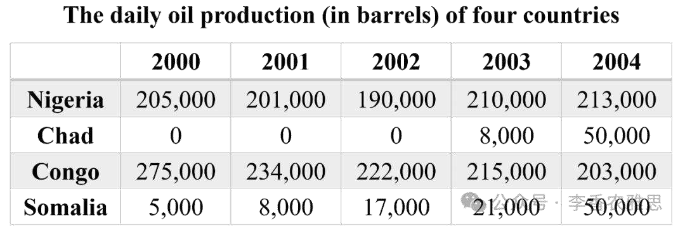

# 2025 年 1 月 4 日雅思写作真题
## Task 1

> **图表类型标注**：表格（四国每日石油产量）

**The table below shows daily oil production in four countries from 2000 to 2004. Summarise the information by selecting and reporting the main features, and make comparisons where relevant.**



The table illustrates changes in daily oil production in Nigeria, Chad, Congo, and Somalia between 2000 and 2004.

As seen, Congo began the period as the largest producer of oil, with an output of 275,000 barrels per day in 2000. However, its production consistently decreased over the years, dropping to 203,000 barrels by 2004, lower than Nigeria’s output in the same year. Somalia, on the other hand, had a much lower initial production at just 5,000 barrels daily in 2000. Nevertheless, its oil yield had a tenfold increase, equaling Chad’s in the final year.

Meanwhile, Nigeria produced 205,000 barrels of oil daily in 2000, making it the second-highest producer at that time. That figure declined slightly to 190,000 barrels in 2002 before rebounding steadily to reach 213,000 barrels in 2004, surpassing that for Congo and becoming the highest one. By contrast, Chad recorded no oil production during the first three years. However, starting in 2003, its output surged dramatically from 8,000 barrels per day to 50,000 barrels by 2004, representing the most significant growth among the four nations.

Overall, Congo was the main oil producer in 2000, but Nigeria claimed the top position in oil production by 2004. Furthermore, Chad and Somalia, witnessed remarkable growth in oil production during the given period, particularly in the latter half.

---

### 精析

#### ① 结构分析（精简）

本题属于 **Table** 类 Task 1，涉及 4 个国家（Nigeria, Chad, Congo, Somalia）在 5 年（2000-2004）间的日石油产量变化。

本文采用 **"总-分-总"** 三段式结构：

- **Paragraph 1 — Introduction（开头段）**
  - 改写题目要素：`changes in daily oil production`（替换原题 `daily oil production`）
  - 明确对象：Nigeria, Chad, Congo, Somalia + 时间（between 2000 and 2004）

- **Paragraph 2 — Body Details（主体段：按趋势分组）**
  - **高产量波动组**：Congo 和 Nigeria
    - Congo：2000年 275,000 桶（最高）→ 持续下降至 2004年 203,000 桶（低于 Nigeria）
    - Nigeria：2000年 205,000 桶（第二）→ 2002年微降至 190,000 桶 → 稳步回升至 2004年 213,000 桶（超越 Congo 成为最高）
  - **低产量增长组**：Chad 和 Somalia
    - Somalia：2000年仅 5,000 桶 → 十年增长十倍 → 2004年等于 Chad 的产量
    - Chad：前三年无产量 → 2003年 8,000 桶 → 2004年激增至 50,000 桶（四国中增长最显著）

- **Paragraph 3 — Overview（总结段）**
  - Congo 是 2000 年主要产油国，但 Nigeria 在 2004 年占据首位
  - Chad 和 Somalia 在考察期内石油产量显著增长，尤其后半期

> **结构亮点**：作者采用"两高两低"的分组策略，将 Congo 和 Nigeria 归为高产量波动组，Chad 和 Somalia 归为低产量增长组。这种分组方式抓住了数据的量级特征。特别值得注意的是，作者在描述 Chad 时，特意标注了 "representing the most significant growth among the four nations"，这种相对评价比单纯描述绝对数字更能揭示数据特征。

#### ② 数据组织与对比策略（标注有效写法）

| 写法 | 原文示例 | 技巧说明 |
|------|---------|---------|
| **起点+趋势+终点+排名变化** | `Congo began the period as the largest producer... consistently decreased... dropping to 203,000 barrels by 2004, lower than Nigeria's output` | 用 began as 描述起点地位，consistently decreased 描述趋势，dropping to 描述终点，lower than 描述排名变化 |
| **倍数增长** | `its oil yield had a tenfold increase` | 用 tenfold 描述 Somalia 的增长幅度，比给出具体数字更直观 |
| **超越描述** | `surpassing that for Congo and becoming the highest one` | 用 surpassing 描述 Nigeria 超越 Congo 的动态过程，becoming 描述新的排名地位 |
| **异常标注** | `representing the most significant growth among the four nations` | 用 most significant growth 标注 Chad 的独特性，与其他国家的下降趋势形成对比 |

> **数据亮点**：作者对 Nigeria 的描述尤为精彩。不仅给出起点（205,000 桶）、低谷（190,000 桶）和终点（213,000 桶），还标注了 "surpassing that for Congo and becoming the highest one" 的超越节点。这种"起点→低谷→回升→超越"的描述方式，使数据变化更具故事性。此外，"tenfold increase" 和 "most significant growth" 的相对评价，揭示了低产量国家的增长特征。

#### ③ 四项能力维度分析（TA / CC / LR / GRA）

- **TA**：作者采用"两高两低"的分组策略，将 Congo 和 Nigeria 归为高产量波动组，Chad 和 Somalia 归为低产量增长组。这种分组方式抓住了数据的量级特征。特别值得注意的是，作者在描述 Chad 时，特意标注了 "representing the most significant growth among the four nations"，这种相对评价比单纯描述绝对数字更能揭示数据特征。 作者对 Nigeria 的描述尤为精彩。不仅给出起点（205,000 桶）、低谷（190,000 桶）和终点（213,000 桶），还标注了 "surpassing that for Congo and becoming the highest one" 的超越节点。这种"起点→低谷→回升→超越"的描述方式，使数据变化更具故事性。此外，"tenfold increase" 和 "most significant growth" 的相对评价，揭示了低产量国家的增长特征。
- **CC**：作者的衔接手段层次分明。"However" 在段落开头就引入转折，"on the other hand" 实现了高低对比，"Meanwhile" 实现了组内补充，"By contrast" 和 "However" 强调了 Chad 的特殊性。这种"转折→对比→补充→强调"的衔接层次，使文章结构严谨且富有变化。
- **LR**：见模块⑤词汇表，含 `yield`、`tenfold` 等精准词
- **GRA**：见模块⑤句式亮点

#### ④ 可迁移句型骨架（直接套用）（图表类型：表格（四国每日石油产量））

**骨架 1 — 开头改写（表格/图通用）**
> The [chart] illustrates changes in ______ in [entities] in [years], along with ______.

**骨架 2 — 极值+对比（Body 通用）**
> ______ had [number], which was considerably higher than the figures for the other [n] [entities].

**骨架 3 — 排名变化/超越（含动态时）**
> ______ saw the second-largest rise and surpassed ______, with its figure growing from ______ to ______.

**骨架 4 — 双维度收尾（Overview 通用）**
> Overall, ______ had by far the largest number..., while ______ recorded the lowest figures on both measures.

#### ⑤ 衔接 / 词汇 / 句式亮点（去水版）

| 衔接类型 | 原文表达 | 功能 |
|---------|---------|------|
| **让步转折** | `However, its production consistently decreased...` | 先承认 Congo 的初始最高地位，再转折描述其下降趋势 |
| **对比过渡** | `Somalia, on the other hand, had a much lower initial production...` | 用 on the other hand 从 Congo 转向 Somalia，形成高低对比 |
| **递进补充** | `Meanwhile, Nigeria produced...` | 用 Meanwhile 补充 Nigeria 的数据，实现组内过渡 |
| **强烈转折** | `By contrast, Chad recorded no oil production during the first three years. However, starting in 2003...` | 用 By contrast 和 However 强调 Chad 从无到有的戏剧性变化 |

> **衔接亮点**：作者的衔接手段层次分明。"However" 在段落开头就引入转折，"on the other hand" 实现了高低对比，"Meanwhile" 实现了组内补充，"By contrast" 和 "However" 强调了 Chad 的特殊性。这种"转折→对比→补充→强调"的衔接层次，使文章结构严谨且富有变化。

| 词汇/短语 | 中文含义 | 词性/用法 | 替代普通表达 |
|-----------|----------|----------|-------------|
| **yield** | 产量；产出 | 名词 | production / output |
| **tenfold** | 十倍的 | 形容词 | ten times |
| **surpassing** | 超过；超越 | 动词（现在分词） | exceeding / going beyond |
| **claimed** | 夺得；占据 | 动词 | took / gained |
| **remarkable** | 显著的；引人注目的 | 形容词 | significant / notable |
| **representing** | 代表；构成 | 动词（现在分词） | showing / indicating |

**1. 分词短语+对比结构**
> *"As seen, Congo **began the period as** the largest producer of oil, **with an output of** 275,000 barrels per day in 2000."*

**技巧**：用 began the period as 描述 Congo 的初始地位，with 独立主格补充具体产量。这种"地位+数据"的结构，既描述了排名，又给出了证据。

**2. 让步状语+转折+结果**
> *"**However, its production consistently decreased over the years, dropping to** 203,000 barrels by 2004, **lower than** Nigeria's output in the same year."*

**技巧**：However 制造转折，consistently decreased 描述趋势，dropping to 分词短语补充终点数据，lower than 描述排名变化。这种"转折→趋势→终点→排名"的结构，完整呈现了 Congo 的变化全过程。

**3. 分词短语+对比描述**
> *"That figure declined slightly to 190,000 barrels in 2002 **before rebounding steadily to reach** 213,000 barrels in 2004, **surpassing that for Congo and becoming the highest one**."*

**技巧**：before rebounding steadily to reach 描述 Nigeria 的回升过程，surpassing 和 becoming 两个现在分词短语描述超越和新的排名地位。这种"低谷→回升→超越→新地位"的链式结构，使数据变化更具动态感。

**4. 对比结构+综合概括**
> *"**Overall, Congo was the main oil producer in 2000, but Nigeria claimed the top position in oil production by 2004.**"*

**技巧**：用 but 转折，将 Congo 的初始主导地位与 Nigeria 的最终领先地位对比。claimed 一词精准描述了 Nigeria "夺得"首位的过程，比 "became" 更具动态感。

---

#### ⑥ 可提升空间 + 仿写任务

**可提升空间（通用要点，按篇酌情采纳）：**
- Overview 建议前置或明确独立成段，让阅卷人先抓全局（TA 更稳）。
- 双维度数据（如比率/占比）尽量也收进 Overview，避免只在正文提一次。
- 跨段对比（如 A 反超 B）可集中到一句呈现，衔接更紧凑。

**本文针对性可改进点（按篇分析，点到即止）：**
- Somalia 的 "had a tenfold increase, equaling Chad's in the final year" 略显含糊：只给了起点 5,000 桶，终点数字（50,000）需读者自行推算，建议补出终值使数据自足。
- Overview 中 "Chad and Somalia, witnessed remarkable growth" 存在多余逗号，且该句与正文第 3 段的 Chad 描述信息重复度高，可改为直接点出"两国基数极小故增幅显著"这一新层次的概括。
- 全文对 Congo 的下降只用了 "consistently decreased"，缺少 Nigeria 那样的中间节点（如 2002 年数值），两国详略不够对称。

**仿写任务**：用「极值+对比」骨架写一句：描述『2020 年 X 国指标远高于其他三国』。
## Task 2

> **话题与题型标注**：工作类 · Two-Part Question

**An increasing number of people today are changing their careers. What are the reasons? Is it a positive or negative development for the society as a whole?**

**当今，越来越多的人正在改变他们的职业生涯。是什么原因导致这一现象？总体来说，这对社会是积极的还是消极的发展？**

The trend of people shifting jobs has become increasingly prominent, driven by factors such as the dynamic evolution of the job market, personal aspirations, and family circumstances. Although this phenomenon has multifaceted implications for society, I believe its overall impact is positive.

人们换工作的趋势变得越来越显著，这一现象受到诸多因素的推动，例如就业市场的动态发展、个人追求和家庭状况。尽管这一现象对社会有着多方面的影响，但我认为其总体影响是积极的。

There are several reasons why an increasing number of employees change jobs once or more in their lifetimes. Firstly, technological advancements have transformed the job market, prompting individuals with an adventurous spirit to view career changes as opportunities for personal growth. Automation and artificial intelligence, for instance, have rendered some roles obsolete while creating new ones, which drives many to upskill or switch careers to remain relevant. Secondly, a job change can provide a break from a monotonous routine and offer the chance to pursue personal growth or fulfillment. Younger generations, in particular, often view jobs as avenues for self-development, and dissatisfaction with current roles or organizational culture frequently motivates them to seek new opportunities. Finally, family considerations like a spouse's job transfer or the need to be closer to extended family for support, often necessitate career transitions, particularly in dual-career households where one partner may need to adjust or sacrifice their role to support the other.

越来越多的员工在其职业生涯中至少更换一次工作，这背后有多个原因。首先，技术进步已经改变了就业市场，促使具有冒险精神的人们将职业转变视为个人成长的机会。例如，自动化和人工智能使某些职位变得过时，同时创造了新的职位，这推动许多人通过技能提升或职业转换来保持竞争力。其次，工作变动可以帮助人们摆脱单调的日常，并提供追求个人成长或满足感的机会。特别是年轻一代，通常将工作视为自我发展的途径，而对当前岗位或组织文化的不满，常常促使他们寻找新的机会。最后，家庭因素，例如配偶的工作调动或需要靠近大家庭以获得支持，往往使职业转变成为必要，尤其是在双职工家庭中，一方可能需要调整或牺牲自己的角色以支持另一方的事业。

Despite the workforce instability caused by frequent career changes, this trend is generally positive for society. High turnover rates can indeed disrupt organizational continuity, increasing training costs and causing a loss of institutional knowledge. These challenges are particularly pronounced in sectors requiring specialized expertise, especially healthcare or education, in which consistency is critical. However, occupation switches also bring significant advantages. To start with, individuals transitioning to new fields often introduce fresh perspectives and transferable skills, which foster innovation and create dynamic, adaptive workplaces. The exchange of ideas strengthens the labor market, so businesses can access a broader and more diverse talent pool aligned with evolving industry demands. Aside from that, when individuals pursue careers that line up with their passions and abilities, they are more likely to experience higher productivity and satisfaction. This contributes to greater societal well-being and reduces healthcare costs associated with stress and burnout, so that the broader community benefits.

尽管频繁的职业更换会导致劳动力的不稳定，但这一趋势对社会总体来说是积极的。高流动率确实可能扰乱组织的连续性，增加培训成本并导致机构知识的流失。这些挑战在需要专业技能的行业中尤为明显，尤其是医疗或教育领域，稳定性尤为重要。然而，职业转换也带来了显著的优势。首先，转向新领域的个人通常会带来新的视角和可转移的技能，从而促进创新，创造充满活力和适应性的工作场所。思想的交流加强了劳动力市场，使企业能够获得更广泛且更多样化的人才库，以满足不断变化的行业需求。此外，当人们追求与其激情和能力相符的职业时，他们往往会更高效、更满意。这不仅提升了社会的整体福祉，还降低了与压力和倦怠相关的医疗成本，从而使整个社会受益。

In conclusion, the rising frequency of career changes is driven by technological advancements, personal aspirations, and family considerations. While it presents workforce instability, the benefits, which range from innovation and adaptability to enhanced personal fulfillment, highlight its overall positive effect on individuals and society.

总之，职业变动频率的上升主要由技术进步、个人追求和家庭因素驱动。尽管这一现象带来了劳动力的不稳定，但从创新和适应性到个人满足感的提升，其好处凸显了这一趋势对个人和社会的整体积极影响。

---

### 精析

#### ① 结构分析（精简）

本题属于 **Two-Part Question** 类题型。此类题型的核心策略是：分别回答两个问题（原因+观点），然后给出总结。

本文采用 **"分别回答"** 四段式结构：

- **Paragraph 1 — Introduction（开头段）**
  - 改写题目（paraphrase）：`The trend of people shifting jobs has become increasingly prominent, driven by factors such as the dynamic evolution of the job market, personal aspirations, and family circumstances`（替换原题 `An increasing number of people today are changing their careers`）
  - 表明立场：`I believe its overall impact is positive`（总体上是积极的）
  - 预告框架：先分析原因，再讨论积极和消极影响

- **Paragraph 2 — Body 1（回答原因）**
  - 主题句：`There are several reasons why an increasing number of employees change jobs once or more in their lifetimes`
  - 原因1：技术进步改变了就业市场 → 自动化和人工智能使某些职位过时，同时创造新职位 → 推动人们提升技能或转换职业以保持竞争力
  - 原因2：工作变动可以摆脱单调 routine → 追求个人成长或满足感 → 年轻一代将工作视为自我发展途径 → 对当前岗位或组织文化不满促使寻找新机会
  - 原因3：家庭因素（配偶工作调动、需要靠近大家庭） → 双职工家庭中一方可能需要调整或牺牲角色以支持另一方

- **Paragraph 3 — Body 2（回答观点：利弊分析）**
  - 主题句：`Despite the workforce instability caused by frequent career changes, this trend is generally positive for society`
  - 消极面：高流动率扰乱组织连续性 → 增加培训成本、导致机构知识流失 → 在需要专业技能的行业（医疗、教育）尤为明显
  - 积极面：转向新领域的个人带来新视角和可转移技能 → 促进创新，创造充满活力和适应性的工作场所 → 思想交流加强劳动力市场 → 企业获得更广泛多样化的人才库 → 追求与激情和能力相符的职业 → 更高生产力和满意度 → 提升社会整体福祉，降低与压力和倦怠相关的医疗成本

- **Paragraph 4 — Conclusion（结尾段）**
  - 总结原因：`driven by technological advancements, personal aspirations, and family considerations`
  - 总结观点：`While it presents workforce instability, the benefits... highlight its overall positive effect`
  - 升华：从创新和适应性到个人满足感的提升

> **结构亮点**：作者严格遵循 Two-Part Question 的答题结构，Body 1 回答"为什么"，Body 2 回答"积极还是消极"。这种结构清晰明了，完全符合题目要求。特别值得注意的是，作者在 Body 2 中采用了"先抑后扬"的策略，先简要承认消极面，再充分展开积极面，既展示了思维的全面性，又明确表达了立场。

#### ② 论证逻辑链拆解（标注有效写法）

**Body 1（原因分析）的逻辑链条：**

```
职业变动（前提A）
    ↓ [驱动因素]
→ 技术进步（中间结果B）
    ↓ [具体表现]
├── 自动化和人工智能（分支C1）
│   ↓
│   某些职位过时，新职位创造（结果D1） → 推动技能提升或职业转换（延伸结果E）
│
├── 个人追求（分支C2）
│   ↓
│   摆脱单调 routine（结果D2） → 追求个人成长（延伸结果F）
│
└── 家庭因素（分支C3）
    ↓
    配偶工作调动或家庭支持需求（结果D3） → 双职工家庭角色调整（延伸结果G）
```

**Body 2（利弊分析）的逻辑链条：**

```
职业变动趋势（前提E）
    ↓ [双面影响]
├── 消极面（分支F1）
│   ↓
│   高流动率扰乱组织连续性（结果G1） → 增加培训成本、机构知识流失（延伸结果H）
│
└── 积极面（分支F2）
    ↓
    新视角和可转移技能（结果G2） → 促进创新、创造适应性工作场所（延伸结果I） → 思想交流加强劳动力市场（延伸结果J） → 企业获得多样化人才库（延伸结果K） → 追求激情和能力相符的职业（延伸结果L） → 更高生产力和满意度（延伸结果M） → 提升社会福祉、降低医疗成本（最终收益N）
```

> **逻辑亮点**：Body 1 采用"分类论证"，从技术进步、个人追求和家庭因素三个维度分析原因。Body 2 采用"分类论证+递进推演"，先承认消极面，再充分展开积极面，并将积极面的逻辑从个人层面推至社会层面。特别值得注意的是，Body 2 中 "particularly in dual-career households" 的具体情境标注，使论证更具现实针对性。

#### ③ 四项能力维度分析（TA / CC / LR / GRA）

- **TA**：作者严格遵循 Two-Part Question 的答题结构，Body 1 回答"为什么"，Body 2 回答"积极还是消极"。这种结构清晰明了，完全符合题目要求。特别值得注意的是，作者在 Body 2 中采用了"先抑后扬"的策略，先简要承认消极面，再充分展开积极面，既展示了思维的全面性，又明确表达了立场。 Body 1 采用"分类论证"，从技术进步、个人追求和家庭因素三个维度分析原因。Body 2 采用"分类论证+递进推演"，先承认消极面，再充分展开积极面，并将积极面的逻辑从个人层面推至社会层面。特别值得注意的是，Body 2 中 "particularly in dual-career households" 的具体情境标注，使论证更具现实针对性。
- **CC**：作者的衔接手段功能明确。"Firstly"、"Secondly"、"Finally" 实现了原因分析的分类展开，"for instance" 用具体例子增强论证可信度，"Despite" 实现了让步转折，"To start with"、"Aside from that" 实现了积极面的分类展开。这种"分类→例子→转折→分类"的衔接层次，使文章结构严谨且富有变化。
- **LR**：见模块⑤词汇表，含 `shifting`、`prominent` 等精准词
- **GRA**：见模块⑤句式亮点

#### ④ 可迁移句型骨架（直接套用）（题型：Two-Part）

**骨架 1 — 先退后进亮立场（Intro）**
> Although ______ deserves a central place because ______, I disagree with the view that ______.

**骨架 2 — 分类论证起手（Body）**
> From the perspective of ______, doing X helps ______ and ______. Meanwhile, X also offers ______ that go beyond ______.

**骨架 3 — 抽象→具体例证（Body）**
> For example, a course on ______ may show how ______ have harmed ______, as illustrated by ______.

#### ⑤ 衔接 / 词汇 / 句式亮点（去水版）

| 衔接类型 | 原文表达 | 功能说明 |
|---------|---------|---------|
| **分类展开** | `Firstly... Secondly... Finally...` | 在 Body 1 内部分原因1、2、3，层次清晰 |
| **举例说明** | `Automation and artificial intelligence, for instance...` | 用具体例子（自动化和人工智能）说明技术如何改变就业市场，增强论证可信度 |
| **让步转折** | `Despite the workforce instability... this trend is generally positive` | 先承认消极面，再转折强调积极面，为后文论证做铺垫 |
| **递进扩展** | `To start with... Aside from that...` | 在 Body 2 内部分论点1和论点2，丰富论证层次 |

> **衔接亮点**：作者的衔接手段功能明确。"Firstly"、"Secondly"、"Finally" 实现了原因分析的分类展开，"for instance" 用具体例子增强论证可信度，"Despite" 实现了让步转折，"To start with"、"Aside from that" 实现了积极面的分类展开。这种"分类→例子→转折→分类"的衔接层次，使文章结构严谨且富有变化。

| 词汇/短语 | 中文含义 | 词性/用法 | 替代普通表达 |
|-----------|----------|----------|-------------|
| **shifting** | 转换；变动 | 动词（现在分词） | changing / moving |
| **prominent** | 显著的；突出的 | 形容词 | noticeable / significant |
| **rendered** | 使变得；致使 | 动词（过去分词） | made / caused |
| **obsolete** | 过时的；被淘汰的 | 形容词 | outdated / out of date |
| **upskill** | 提升技能 | 动词 | improve skills |
| **monotonous** | 单调乏味的 | 形容词 | boring / repetitive |
| **avenues** | 途径；渠道 | 名词（复数） | ways / paths |
| **turnover** | 人员流动率 | 名词 | change / replacement |
| **transferable** | 可迁移的；可转移的 | 形容词 | movable / adaptable |
| **aligned with** | 与…相契合；与…一致 | 形容词短语 | matched with / in line with |

**1. 分词短语+因果推导**
> *"Firstly, technological advancements have transformed the job market, **prompting individuals with an adventurous spirit to view career changes as opportunities for personal growth**."*

**技巧**：用 prompting 现在分词短语，描述技术进步如何促使人们将职业变动视为成长机会。individuals with an adventurous spirit 精准描述了特定人群，使论证更具针对性。

**2. 定语从句+结果推导**
> *"Automation and artificial intelligence, for instance, have rendered some roles obsolete while creating new ones, **which drives many to upskill or switch careers to remain relevant**."*

**技巧**：用 which 引导的定语从句，将技术变革与人们的应对行为关联起来。rendered... obsolete 和 creating new ones 形成对比，drives many to upskill or switch careers 推导行为后果，to remain relevant 说明目的。这种"技术变革→对比→行为→目的"的结构，使因果逻辑清晰。

**3. 时间状语从句+条件推导**
> *"**When individuals pursue careers that line up with their passions and abilities**, they are more likely to experience higher productivity and satisfaction."*

**技巧**：用 When 引导时间状语从句，描述人们追求与激情和能力相符的职业，主句推导更高生产力和满意度的结果。line up with 是精妙的表达，意为"与...一致"，比 "match" 更形象。

**4. 让步状语从句+综合概括**
> *"**While it presents workforce instability, the benefits, which range from innovation and adaptability to enhanced personal fulfillment, highlight its overall positive effect on individuals and society.**"*

**技巧**：用 While 引导让步从句，先承认劳动力不稳定的消极面，主句再强调积极面。which range from... to... 的非限制性定语从句列举了积极面的范围，highlight 强调了总体积极影响。这种"让步→范围列举→强调"的结构，在结论段既总结了全文，又明确表达了最终立场。

#### ⑥ 可提升空间 + 仿写任务

**可提升空间（通用要点，按篇酌情采纳）：**
- 结论段避免复读开头，应「推进」而非「重复」立场。
- 让步段衔接词（this perspective 等）回指别太远，可加限定词收紧。
- 同一话题词（如 career / benefit）避免三现，用近义替换。

**本文针对性可改进点（按篇分析，点到即止）：**
- Body 2 的消极面只用了三句就收束，而积极面铺陈了六句以上，让步部分偏单薄；可为"医疗/教育行业专业知识流失"补一个具体后果（如带教断层），让 concession 更有分量。
- 积极面第二个分论点连用 "This contributes to greater societal well-being and reduces healthcare costs associated with stress and burnout, so that the broader community benefits"，从"个人满意度"直跳到"降低医疗成本"，中间缺一环推理，属于论断缺支撑。
- Body 1 三个原因中，"family considerations" 一条的句子过长（一句涵盖配偶调动、靠近亲属、双职工取舍三层），建议拆为两句以提升可读性。

**仿写任务**：就本题用骨架写一句你的核心论证。
