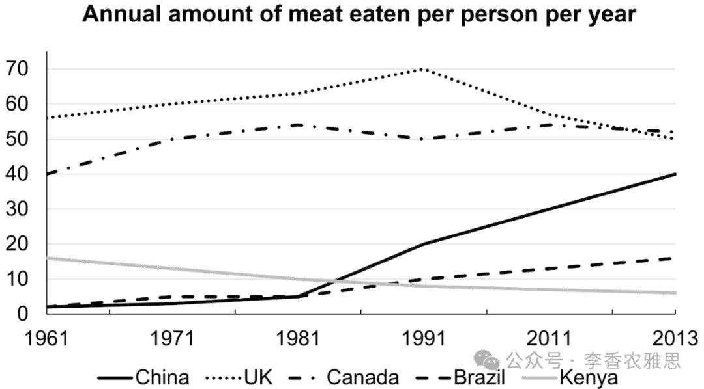

# 2025 年 2 月 22 日雅思写作真题
## Task 1

> **图表类型标注**：折线图（五国人均食肉量）

**The graph below shows annual amount (kg) of meat eaten by per person per year in five different countries from 1961 to 2013.**
**Summarise the information by selecting and reporting the main features, and make comparisons where relevant.**



The graph illustrates changes in the annual amount of meat consumed perperson in China, the UK, Canada, Brazil, and Kenya between 1961 and 2013.

As seen, Canada, China, and Brazil saw overall increases in meat consumption, with China recording the most rapid growth. Specifically, China's per capita intake of meat was below 5 kg and rose minimally in the first two decades before surging to 40 kg in 2013. A similar but less pronounced upturn was observed in Brazil. Initially, the annual meat consumption in that region matched China's but then steadily increased to about 18 kg. In contrast, Canada's figure stood at 40 kg in 1961 and, despite fluctuations, reached the highest value of 53 kg in 2013.

Conversely, the amounts of meat eaten in the UK and Kenya both declined significantly over the period. In the UK, although it rose from about 56 kg per person in 1961 to the peak at nearly 70 kg in 1991, it experienced a steady fall to just 50 kg in 2013. Kenya, on the other hand, consistently recorded much lower consumption levels. Starting at 17 kg per person, the figure gradually decreased to a mere 7 kg, the lowest among the figures for the four given countries from 1986 onwards.

Overall, while China and Brazil experienced rapid growths in meat consumption, Canada and the UK followed a rise-and-fall pattern in their meat intake.

---

### 精析

#### ① 结构分析（精简）

本题属于 **Line Graph（折线图）** 类 Task 1，涉及 1 个折线图展示五个国家1961-2013年间的人均肉类消费量变化。

本文采用 **"总-分-总" 三段式** 结构：

- **Paragraph 1 — Introduction（开头段）**
  - 改写题目要素：`The graph illustrates changes in the annual amount of meat consumed per person in China, the UK, Canada, Brazil, and Kenya between 1961 and 2013`（替换原题 `The graph below shows`）
  - 明确对象：五个国家（China, UK, Canada, Brazil, Kenya）+ 时间范围（1961-2013）

- **Paragraph 2 — Body Details（主体段：按趋势分组）**
  - **第一组（总体上升趋势）**：Canada, China, Brazil
    - China：起点低于5kg→前二十年微增→激增至2013年40kg（增长最快）
    - Brazil：起点与中国相同→稳步增至约18kg（增幅较小）
    - Canada：1961年40kg→波动中增至2013年53kg（最高值）
  - **第二组（下降趋势）**：UK, Kenya
    - UK：1961年56kg→1991年峰值近70kg→降至2013年50kg
    - Kenya：起点17kg→逐步降至仅7kg（1986年后四国最低）

- **Paragraph 3 — Overview（总结段）**
  - 核心发现1：China 和 Brazil 快速增长
  - 核心发现2：Canada 和 UK 呈现"上升-下降"模式

> **结构亮点**：本文采用"按趋势方向分组"的策略，将五个国家分为"上升"和"下降"两组。这种分组方式使对比非常清晰。在描述中国时，作者特别指出"rose minimally in the first two decades before surging"，精准捕捉了"先慢后快"的阶段性特征，体现了对数据细节的敏锐观察。

#### ② 数据组织与对比策略（标注有效写法）

| 写法 | 原文示例 | 技巧说明 |
|------|---------|---------|
| **起点+转折+终点** | `below 5 kg and rose minimally in the first two decades before surging to 40 kg in 2013` | 用阶段划分勾勒复杂趋势 |
| **同步对比** | `A similar but less pronounced upturn was observed in Brazil` | 在描述相似趋势时标注差异程度 |
| **交叉参照** | `Initially, the annual meat consumption in that region matched China's` | 用参照物替代重复数字 |
| **极值+排名** | `a mere 7 kg, the lowest among the figures for the four given countries from 1986 onwards` | 点明极值并标注时间范围 |

> **数据亮点**：作者在描述中国时选择了"below 5 kg""rose minimally""surging to 40 kg"三个关键节点，精准刻画了"起步低→增长慢→后来爆发"的三阶段特征。对 Kenya 的描述用"a mere 7 kg"配合"the lowest among..."，既给出了具体数字又明确了排名，信息效率极高。

#### ③ 四项能力维度分析（TA / CC / LR / GRA）

- **TA**：本文采用"按趋势方向分组"的策略，将五个国家分为"上升"和"下降"两组。这种分组方式使对比非常清晰。在描述中国时，作者特别指出"rose minimally in the first two decades before surging"，精准捕捉了"先慢后快"的阶段性特征，体现了对数据细节的敏锐观察。 作者在描述中国时选择了"below 5 kg""rose minimally""surging to 40 kg"三个关键节点，精准刻画了"起步低→增长慢→后来爆发"的三阶段特征。对 Kenya 的描述用"a mere 7 kg"配合"the lowest among..."，既给出了具体数字又明确了排名，信息效率极高。
- **CC**：本文的"A similar but less pronounced upturn was observed in Brazil"是一个优质表达——用"similar but less pronounced"精准描述了巴西与中国趋势相似但幅度较小的关系，避免了简单重复"also increased"。"pronounced"一词的使用也体现了词汇的高级性。
- **LR**：见模块⑤词汇表，含 `per capita intake`、`surging to` 等精准词
- **GRA**：见模块⑤句式亮点

#### ④ 可迁移句型骨架（直接套用）（图表类型：折线图（五国人均食肉量））

**骨架 1 — 开头改写（表格/图通用）**
> The [chart] illustrates changes in ______ in [entities] in [years], along with ______.

**骨架 2 — 极值+对比（Body 通用）**
> ______ had [number], which was considerably higher than the figures for the other [n] [entities].

**骨架 3 — 排名变化/超越（含动态时）**
> ______ saw the second-largest rise and surpassed ______, with its figure growing from ______ to ______.

**骨架 4 — 双维度收尾（Overview 通用）**
> Overall, ______ had by far the largest number..., while ______ recorded the lowest figures on both measures.

#### ⑤ 衔接 / 词汇 / 句式亮点（去水版）

| 衔接类型 | 原文表达 | 功能 |
|---------|---------|------|
| **分组衔接** | `As seen... In contrast...` | 按趋势方向分组推进 |
| **对比衔接** | `with China recording the most rapid growth` | 在同一句中比较多个对象 |
| **相似衔接** | `A similar but less pronounced upturn was observed...` | 标注趋势相似但幅度不同 |
| **时间衔接** | `before surging to... after which...` | 按时间顺序串联变化 |

> **衔接亮点**：本文的"A similar but less pronounced upturn was observed in Brazil"是一个优质表达——用"similar but less pronounced"精准描述了巴西与中国趋势相似但幅度较小的关系，避免了简单重复"also increased"。"pronounced"一词的使用也体现了词汇的高级性。

| 词汇/短语 | 中文含义 | 词性/用法 | 替代普通表达 |
|-----------|----------|----------|-------------|
| **per capita intake** | 人均摄入量 | 名词短语 | amount each person eats |
| **surging to** | 飙升至 | 动词短语 | quickly rising to |
| **a less pronounced upturn** | 一次不那么明显的回升 | 名词短语 | a smaller increase |
| **matched China's** | 与中国的数值持平 | 动词短语 | was the same as China's |
| **a steady fall** | 持续稳定的下降 | 名词短语 | went down steadily |
| **a mere 7 kg** | 仅仅 7 公斤 | 名词短语 | only 7 kg |

**1. 分词伴随比较句**
> *"Canada, China, and Brazil saw overall increases in meat consumption, **with China recording the most rapid growth**."*

**技巧**：主句陈述总体趋势，"with + 名词 + 现在分词"的独立主格结构标注出其中最突出的对象。这种句式将"总体"和"特例"压缩在一个句子中，信息密度高且层次分明。

**2. 阶段划分句**
> *"Specifically, China's per capita intake of meat was below 5 kg and **rose minimally in the first two decades before surging** to 40 kg in 2013."*

**技巧**：用"rose minimally... before surging"将中国的增长分为"缓慢期"和"爆发期"两个阶段。"before"作为时间介词，巧妙地将两个阶段连接在一个句子中，避免了分句的断裂感。

**3. 转折下降句**
> *"In the UK, although it rose from about 56 kg per person in 1961 to the peak at nearly 70 kg in 1991, **it experienced a steady fall** to just 50 kg in 2013."*

**技巧**：让步从句"although it rose..."描述前期的上升，主句"it experienced a steady fall"描述后期的下降。这种"先升后降"的句式结构精准对应了数据的变化模式，使描述与数据完全同步。

**4. 综合概述句**
> *"Overall, while China and Brazil experienced rapid growths in meat consumption, Canada and the UK followed a rise-and-fall pattern in their meat intake."*

**技巧**：概述段用"while"将"持续上升"和"先升后降"两种模式并置对比。"rise-and-fall pattern"是一个精准的概括表达，比"went up and then down"更加学术化。对 Kenya 的省略处理也体现了概述段只关注主要趋势的写作原则。

---

#### ⑥ 可提升空间 + 仿写任务

**可提升空间（通用要点，按篇酌情采纳）：**
- Overview 建议前置或明确独立成段，让阅卷人先抓全局（TA 更稳）。
- 双维度数据（如比率/占比）尽量也收进 Overview，避免只在正文提一次。
- 跨段对比（如 A 反超 B）可集中到一句呈现，衔接更紧凑。

**本文针对性可改进点（按篇分析，点到即止）：**
- Overview 与正文打架：正文把 Canada 归入"总体上升、2013 年达到最高的 53 kg"，Overview 却说 Canada 与 UK 同属 rise-and-fall；同时 Overview 完全没提 Kenya，五国只覆盖四国。
- Overview 称 Brazil 为 rapid growth 也偏离正文——正文写的是 "A similar but less pronounced upturn"，仅升至约 18 kg，用 modest / gradual 更贴切；另 growths 属不可数名词误加复数。
- 两处笔误：开头段 `perperson` 缺空格；第 3 段 "the lowest among the figures for the four given countries" 应为 five（本题共五国）。

**仿写任务**：用「极值+对比」骨架写一句：描述『2020 年 X 国指标远高于其他三国』。
## Task 2

> **话题与题型标注**：科技类 · Agree/Disagree

**Some people think that the modern communication technology is having a negative effect on social relationships. To what extent do you agree or disagree?**

**一些人认为现代通信技术对社会关系产生了负面影响。你在多大程度上同意或不同意？**

Some argue that advanced communication technology negatively impacts human relationships within communities. While modern communication technology offers significant benefits, I agree that it poses a threat to interpersonal connections.

一些人认为，先进的通信技术对社区内人际关系产生了负面影响。虽然现代通信技术带来了许多重要的好处，但我认为它确实对人际关系构成了威胁。

Admittedly, modern communication technology has provided efficient and high-quality remote communication experiences by offering instant connectivity across the globe. This is because the rapid acceleration of communication technology in recent decades has significantly transformed how society interacts, enabling individuals to connect globally through instant messaging and social media. For instance, Meta allows users to share their stories and thoughts, which enables their friends to stay updated on their activities, post comments, or react to posts, fostering a highly visual and reciprocal form of communication. Beyond social interactions with friends, smart devices facilitate online communication with close relatives, eliminating geographical barriers and strengthening family bonds. As young people increasingly study abroad to pursue advanced degrees or live independently, social media and portable gadgets reinforce human connections by making long-distance communication more accessible, especially during moments of loneliness.

不可否认，现代通信技术通过提供全球即时连接，提供了高效且高质量的远程通讯体验。这是因为近几十年来通信技术的快速发展极大地改变了社会互动方式，使个人能够通过即时通讯和社交媒体实现全球互联。例如，Meta 允许用户分享自己的故事和想法，使朋友能够随时了解他们的动态，发表评论或对帖子作出反应，从而促进了一种高度可视化和互动性的交流方式。除了朋友之间的社交互动外，智能设备还促进了与亲密亲属的在线沟通，消除了地理障碍，并增强了家庭纽带。随着越来越多的年轻人出国留学以攻读高等学位或独立生活，社交媒体和便携设备通过提供更便捷的远程通信，特别是在孤独时刻，进一步加强了人际联系。

However, despite the abovementioned benefits, excessive reliance on digital devices and platforms negatively affects interpersonal skills, particularly among individuals who are heavily dependent on virtual setups. One of the primary reasons modern communication technologies weaken social relationships is the decline in face-to-face interactions. With the widespread use of smartphones, messaging apps, and video calls, people engage less in direct, personal conversations. Unlike in-person communication, digital interactions lack nonverbal cues such as facial expressions and body language, making conversations less emotionally rich. Over time, this can lead to misunderstandings and a lack of genuine emotional connection. Another factor contributing to deteriorating relationships is that modern communication technology fosters social isolation, despite its promise of global connectivity. Many individuals, particularly younger generations, spend excessive time on their devices, prioritizing virtual interactions over real-world socializing. That, coupled with the convenience of digital entertainment like online gaming and social media scrolling, often replace face-to-face activities, and lead to loneliness as well as a decline in traditional social interactions.

然而，尽管上述好处存在，过度依赖数字设备和平台会对人际交往能力产生负面影响，尤其是对那些高度依赖虚拟环境的人而言。现代通信技术削弱社会关系的主要原因之一是面对面互动的减少。随着智能手机、聊天应用和视频通话的广泛使用，人们越来越少地进行直接的、面对面的交流。与面对面沟通不同，数字互动缺乏面部表情和身体语言等非语言线索，使对话的情感丰富度降低。随着时间的推移，这可能导致误解以及缺乏真正的情感联系。另一个导致人际关系恶化的因素是，尽管现代通信技术承诺实现全球连接，但实际上却促进了社会孤立。许多个人，尤其是年轻一代，过度沉迷于电子设备，优先选择虚拟互动而非现实世界中的社交活动。此外，数字娱乐的便利性，如网络游戏和社交媒体滑动浏览，往往取代了面对面的活动，导致孤独感增加，并使传统社交互动减少。

In conclusion, while modern communication technology enhances global connectedness and facilitates long-distance relationships, its overuse weakens interpersonal bonds. Furthermore, the decrease in face-to-face interactions and increased social isolation undermine genuine emotional connections. Therefore, despite its benefits, excessive reliance on digital communication poses a significant threat to human relationships within communities.

总之，虽然现代通信技术增强了全球互联性，并促进了远程关系，但其过度使用削弱了人际关系。此外，面对面互动的减少和社会隔离的加剧，进一步破坏了人与人之间真实的情感联系。因此，尽管通信技术带来了诸多好处，过度依赖数字交流仍对社区内的人际关系构成了重大威胁。

---

### 精析

#### ① 结构分析（精简）

本题属于 **Agree/Disagree** 类题型。此类题型的核心策略是：先承认对方观点的部分合理性，再通过多维度反驳论证自己的立场，最后总结。

本文采用 **"让步-反驳-综合" 四段式** 结构：

- **Paragraph 1 — Introduction（开头段）**
  - 改写题目（paraphrase）：`Some argue that advanced communication technology negatively impacts human relationships within communities`（替换原题 `modern communication technology is having a negative effect on social relationships`）
  - 表明立场：`I agree that it poses a threat to interpersonal connections`（明确同意）
  - 预告框架：先承认通信技术的便利，再论证其过度使用的危害

- **Paragraph 2 — Body 1（让步段）**
  - 主题句：`Admittedly, modern communication technology has provided efficient and high-quality remote communication experiences`
  - 论点1：即时通讯和社交媒体实现全球互联
  - 论点2：Meta 等平台促进朋友间互动
  - 论点3：智能设备帮助与亲属保持联系，消除地理障碍
  - 效果：承认通信技术在连接性方面的实际价值

- **Paragraph 3 — Body 2（主论段）**
  - 主题句：`However, despite the abovementioned benefits, excessive reliance on digital devices and platforms negatively affects interpersonal skills`
  - 论点1：面对面互动减少→缺乏非语言线索→情感连接减弱
  - 论点2：数字技术促进社会孤立→虚拟互动取代现实社交→孤独感增加
  - 效果：从"互动质量"和"社交行为"两个维度论证危害

- **Paragraph 4 — Conclusion（结尾段）**
  - 重申立场：过度使用削弱人际关系
  - 总结升华：面对面互动减少和社会孤立破坏真实情感连接

> **结构亮点**：本文的让步段写得非常充分——作者不仅承认了通信技术的便利性，还用 Meta 的具体例子和留学生与家人的情感联系等细节，使让步显得真诚而非敷衍。这种"充分让步→有力反驳"的结构使后文的反驳更加可信。

#### ② 论证逻辑链拆解（标注有效写法）

**Body 1（让步段）的逻辑链条：**

```
现代通信技术
    ↓ [优势]
→ 高效远程通讯
    ↓ [分层论证]
├── 即时通讯和社交媒体
│   ↓
│   全球互联 + 朋友间互动（Meta 例子）
│
└── 智能设备
    ↓
    消除地理障碍 + 增强家庭纽带
    ↓
    留学生例子：孤独时刻的远程联系
```

**Body 2（主论段）的逻辑链条：**

```
过度依赖数字设备
    ↓ [危害]
→ 人际交往能力受损
    ↓ [分层论证]
├── 分支1：互动质量下降
│   ↓
│   面对面互动减少
│   ↓
│   缺乏非语言线索（表情、肢体语言）
│   ↓
│   情感丰富度降低 → 误解 + 缺乏真实情感连接
│
└── 分支2：社交行为改变
    ↓
    社会孤立加剧
    ↓
    虚拟互动取代现实社交
    ↓
    数字娱乐（游戏、社交媒体）取代面对面活动
    ↓
    孤独感增加 + 传统社交互动减少
```

> **逻辑亮点**：主论段采用了"互动质量→社交行为"的双线论证。第一条线从"沟通效果"角度论证（非语言线索缺失），第二条线从"行为模式"角度论证（虚拟取代现实）。两条线相互独立又共同指向"人际关系受损"的结论，论证非常扎实。

#### ③ 四项能力维度分析（TA / CC / LR / GRA）

- **TA**：本文的让步段写得非常充分——作者不仅承认了通信技术的便利性，还用 Meta 的具体例子和留学生与家人的情感联系等细节，使让步显得真诚而非敷衍。这种"充分让步→有力反驳"的结构使后文的反驳更加可信。 主论段采用了"互动质量→社交行为"的双线论证。第一条线从"沟通效果"角度论证（非语言线索缺失），第二条线从"行为模式"角度论证（虚拟取代现实）。两条线相互独立又共同指向"人际关系受损"的结论，论证非常扎实。
- **CC**：本文在主论段中使用了"Unlike in-person communication"这一对比衔接，将数字互动与面对面沟通进行直接对比，突出了前者的劣势。"That, coupled with..."则巧妙地将两个因素（虚拟互动优先+数字娱乐便利）合并，说明它们共同导致了孤独感的增加。
- **LR**：见模块⑤词汇表，含 `poses a threat to`、`interpersonal connections` 等精准词
- **GRA**：见模块⑤句式亮点

#### ④ 可迁移句型骨架（直接套用）（题型：Agree/Disagree）

**骨架 1 — 先退后进亮立场（Intro）**
> Although ______ deserves a central place because ______, I disagree with the view that ______.

**骨架 2 — 分类论证起手（Body）**
> From the perspective of ______, doing X helps ______ and ______. Meanwhile, X also offers ______ that go beyond ______.

**骨架 3 — 抽象→具体例证（Body）**
> For example, a course on ______ may show how ______ have harmed ______, as illustrated by ______.

#### ⑤ 衔接 / 词汇 / 句式亮点（去水版）

| 衔接类型 | 原文表达 | 功能说明 |
|---------|---------|---------|
| **让步衔接** | `Admittedly... While...` | 先承认对方合理性 |
| **转折反驳** | `However... Unlike...` | 转向反驳论证 |
| **因果推导** | `This is because... As a result...` | 解释原因并推导结果 |
| **递进加剧** | `Over time... Another factor...` | 在同一论点内推进论证 |

> **衔接亮点**：本文在主论段中使用了"Unlike in-person communication"这一对比衔接，将数字互动与面对面沟通进行直接对比，突出了前者的劣势。"That, coupled with..."则巧妙地将两个因素（虚拟互动优先+数字娱乐便利）合并，说明它们共同导致了孤独感的增加。

| 词汇/短语 | 中文含义 | 词性/用法 | 替代普通表达 |
|-----------|----------|----------|-------------|
| **poses a threat to** | 对…构成威胁 | 动词短语 | is bad for |
| **interpersonal connections** | 人际联系 | 名词短语 | relationships between people |
| **nonverbal cues** | 非语言线索 | 名词短语 | body language and facial expressions |
| **desensitized** | 变得麻木的；感觉迟钝的 | 形容词 | not sensitive |
| **social isolation** | 社会孤立 | 名词短语 | being alone |
| **genuine emotional connection** | 真挚的情感联结 | 名词短语 | real feelings |

**1. 因果链式长句**
> *"This is because the rapid acceleration of communication technology in recent decades has significantly transformed how society interacts, enabling individuals to connect globally through instant messaging and social media."*

**技巧**："This is because"引导原因解释，主句用"has significantly transformed"强调变化的深度，现在分词短语"enabling..."说明变化带来的能力。这种"原因→变化→能力"的链条式写法使论证逻辑严密。

**2. 对比论证句**
> *"**Unlike in-person communication**, digital interactions lack nonverbal cues such as facial expressions and body language, making conversations less emotionally rich."*

**技巧**：用"Unlike"引导对比对象，主句指出数字互动的缺陷，现在分词短语"making..."推导后果。这种"对比→缺陷→后果"的三段式结构是论证某事物劣势的经典句式。

**3. 递进后果句**
> *"Over time, this can lead to misunderstandings and a lack of genuine emotional connection."*

**技巧**："Over time"标注时间维度，说明负面效果是渐进积累的。"a lack of genuine emotional connection"用"genuine"修饰"emotional connection"，精准表达了"表面有互动但缺乏真实感"的含义。

**4. 综合总结句**
> *"Therefore, **despite its benefits**, excessive reliance on digital communication **poses a significant threat** to human relationships within communities."*

**技巧**：结尾句用"Therefore"总结全文，"despite its benefits"再次让步承认通信技术的价值，然后主句用"poses a significant threat"强调核心立场。这种"让步+强调"的句式使结尾既有平衡感又有力度。

---

#### ⑥ 可提升空间 + 仿写任务

**可提升空间（通用要点，按篇酌情采纳）：**
- 结论段避免复读开头，应「推进」而非「重复」立场。
- 让步段衔接词（this perspective 等）回指别太远，可加限定词收紧。
- 同一话题词（如 career / benefit）避免三现，用近义替换。

**本文针对性可改进点（按篇分析，点到即止）：**
- 主论段末句 "That, coupled with the convenience of digital entertainment..., often replace... and lead to loneliness" 主谓不一致，主语是 That，应为 replaces / leads；这一句同时塞入三层意思，拆成两句会更清楚。
- 让步段与反驳段其实各说各话：让步讲"跨国维系亲友关系"，反驳讲"本地面对面减少"，没有正面回应"远程联系是否也算真实关系"，建议在 However 之后补半句划清适用范围（如"这类联系多为补充而非替代"）。
- 实证密度不均：让步段有 Meta、留学生两处具象支撑，反驳段则全是概括性断言（misunderstandings、loneliness），可补一个可感的场景（如家庭聚餐各自刷手机）。

**仿写任务**：用「先退后进」骨架重写：*Some think space exploration is a waste of money.*
