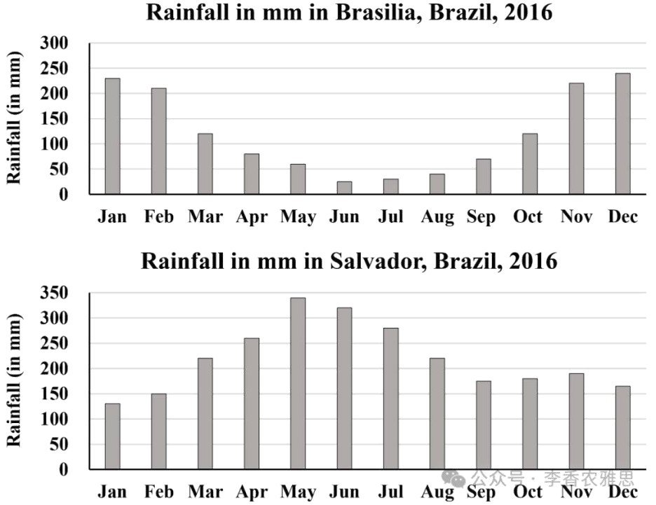

# 2025 年 3 月 8 日雅思写作真题
## Task 1

> **图表类型标注**：柱状图（双城月降雨量）

**The charts below show the average monthly rainfall two cities of Brazil, Brasilia and Salvador, in 2016.**
**Summarise the information by selecting and reporting the main features, and make comparisons where relevant .**



The bar charts illustrate the changes in average monthly rainfall throughout 2016 in Brasilia and Salvador, two cities in Brazil. 

As seen in the first chart, Brasilia experienced a clear seasonal pattern of rainfall decreasing in the first half of the year and reaching its lowest point in mid-year before rising again in the latter half. Specifically, precipitation declined steadily from around 230 mm in January to just 25 mm in June, the driest period of the year. Following that, rainfall gradually rose and peaked at approximately 240 mm in December.

On the other hand, Salvador showed an opposite trend and a more consistent distribution of rainfall, with no months of exceptionally low rainfall. The year began with 125 mm of precipitation in January, which steadily grew to its largest volume at around 340 mm in May. Although rainfall levels then dropped considerably between May and September, they remained consistently above 175 mm. From October to December, the amount of precipitation fluctuated slightly but stayed relatively stable around that level (about 175 mm).

Overall, while Brasilia experienced dramatic fluctuations in rainfall, with a distinct dry season in the middle of the year, Salvador had significantly higher and more evenly distributed precipitation throughout the year.

---

### 精析

#### ① 结构分析（精简）

本题属于 **Bar Chart（柱状图）** 类 Task 1，涉及 2 个柱状图展示巴西两个城市（Brasilia 和 Salvador）在 2016 年各月的平均降雨量变化。

本文采用 **"对比式" 三段式** 结构：

- **Paragraph 1 — Introduction（开头段）**
  - 改写题目要素：`The bar charts illustrate the changes in average monthly rainfall throughout 2016 in Brasilia and Salvador, two cities in Brazil`（替换原题 `The charts below show`）
  - 明确对象：Brasilia 和 Salvador 两个城市 + 时间范围（2016年全年）

- **Paragraph 2 — Body Details（主体段：按城市分组对比）**
  - **Brasilia**：明显的季节性模式
    - 上半年：1月约230mm→6月降至仅25mm（全年最干）
    - 下半年：逐渐回升→12月峰值约240mm
  - **Salvador**：相反趋势且分布更均匀
    - 上半年：1月125mm→5月峰值约340mm
    - 年中：5-9月下降但始终高于175mm
    - 下半年：10-12月波动但稳定在约175mm

- **Paragraph 3 — Overview（总结段）**
  - 核心发现1：Brasilia 降雨波动剧烈，年中明显干旱
  - 核心发现2：Salvador 全年降雨更高且分布更均匀

> **结构亮点**：本文采用"先描述一个城市→再描述另一个城市"的对比式结构，两个城市分别占据一段的主体部分。这种处理方式使两个城市的特征各自完整呈现，再通过"opposite trend"等衔接词建立对比关系，比交替描述两个城市的方式更加清晰。

#### ② 数据组织与对比策略（标注有效写法）

| 写法 | 原文示例 | 技巧说明 |
|------|---------|---------|
| **极值描述** | `reaching its lowest point in mid-year` | 点明峰值/谷值的位置和意义 |
| **趋势对比** | `Salvador showed an opposite trend and a more consistent distribution` | 直接对比两个城市的趋势差异 |
| **范围描述** | `they remained consistently above 175 mm` | 用范围而非具体数字描述稳定状态 |
| **阶段划分** | `declining steadily... Following that... gradually rose` | 按时间阶段组织描述 |

> **数据亮点**：作者在描述 Brasilia 时选择了"230 mm""25 mm""240 mm"三个极值点，精准勾勒出"高→低→高"的V型趋势。对 Salvador 的描述则用"始终高于175mm"和"相对稳定"等概括性表达，避免了罗列每个月的数字，体现了对"均匀分布"这一核心特征的把握。

#### ③ 四项能力维度分析（TA / CC / LR / GRA）

- **TA**：本文采用"先描述一个城市→再描述另一个城市"的对比式结构，两个城市分别占据一段的主体部分。这种处理方式使两个城市的特征各自完整呈现，再通过"opposite trend"等衔接词建立对比关系，比交替描述两个城市的方式更加清晰。 作者在描述 Brasilia 时选择了"230 mm""25 mm""240 mm"三个极值点，精准勾勒出"高→低→高"的V型趋势。对 Salvador 的描述则用"始终高于175mm"和"相对稳定"等概括性表达，避免了罗列每个月的数字，体现了对"均匀分布"这一核心特征的把握。
- **CC**：本文的"On the other hand"不仅标记了段落切换，还暗示了 Salvador 与 Brasilia 的对比关系。"Although rainfall levels then dropped considerably, they remained consistently above 175 mm"用让步结构精准描述了 Salvador "有所下降但仍保持较高水平"的特征，避免了简单化的"上升"或"下降"描述。
- **LR**：见模块⑤词汇表，含 `seasonal pattern`、`reaching its lowest point` 等精准词
- **GRA**：见模块⑤句式亮点

#### ④ 可迁移句型骨架（直接套用）（图表类型：柱状图（双城月降雨量））

**骨架 1 — 开头改写（表格/图通用）**
> The [chart] illustrates changes in ______ in [entities] in [years], along with ______.

**骨架 2 — 极值+对比（Body 通用）**
> ______ had [number], which was considerably higher than the figures for the other [n] [entities].

**骨架 3 — 排名变化/超越（含动态时）**
> ______ saw the second-largest rise and surpassed ______, with its figure growing from ______ to ______.

**骨架 4 — 双维度收尾（Overview 通用）**
> Overall, ______ had by far the largest number..., while ______ recorded the lowest figures on both measures.

#### ⑤ 衔接 / 词汇 / 句式亮点（去水版）

| 衔接类型 | 原文表达 | 功能 |
|---------|---------|------|
| **对比衔接** | `On the other hand...` | 切换描述对象并暗示对比 |
| **时间衔接** | `Following that... From October to December...` | 按时间顺序推进描述 |
| **让步衔接** | `Although rainfall levels then dropped considerably...` | 标注与预期相反的情况 |
| **总结衔接** | `Overall, while...` | 在概述中并置对比双方 |

> **衔接亮点**：本文的"On the other hand"不仅标记了段落切换，还暗示了 Salvador 与 Brasilia 的对比关系。"Although rainfall levels then dropped considerably, they remained consistently above 175 mm"用让步结构精准描述了 Salvador "有所下降但仍保持较高水平"的特征，避免了简单化的"上升"或"下降"描述。

| 词汇/短语 | 中文含义 | 词性/用法 | 替代普通表达 |
|-----------|----------|----------|-------------|
| **seasonal pattern** | 季节性规律 | 名词短语 | regular changes |
| **reaching its lowest point** | 降至最低点 | 动词短语 | being the lowest |
| **consistent distribution** | 均衡的分布 | 名词短语 | even spread |
| **exceptionally low rainfall** | 异常偏低的降雨量 | 名词短语 | very low rain |
| **fluctuated slightly** | 小幅波动 | 动词短语 | went up and down a little |
| **distinct dry season** | 明显的旱季 | 名词短语 | clear dry period |

**1. 趋势概括句**
> *"Brasilia experienced a clear seasonal pattern of rainfall decreasing in the first half of the year and reaching its lowest point in mid-year before rising again in the latter half."*

**技巧**：用"seasonal pattern of..."概括总体特征，随后用"decreasing... reaching... before rising..."三个分词短语按时间顺序描述具体变化。这种"概括+细节"的句式结构使描述既有高度又有细节。

**2. 让步稳定句**
> *"**Although rainfall levels then dropped considerably** between May and September, **they remained consistently above 175 mm**."*

**技巧**：让步从句承认下降趋势，主句强调"仍保持较高水平"的稳定特征。"considerably"和"consistently"两个副词的对比使用，精准传达了"幅度大但不跌破底线"的数据特征。

**3. 对比并置句**
> *"Overall, **while** Brasilia experienced dramatic fluctuations in rainfall, **with a distinct dry season** in the middle of the year, Salvador had significantly higher and more evenly distributed precipitation throughout the year."*

**技巧**：概述段用"while"将两个城市并置对比，"with + 名词短语"补充说明 Brasilia 的特征，主句描述 Salvador 的对应特征。"dramatic fluctuations"与"more evenly distributed"形成鲜明对比，"significantly higher"则点明了总量差异。

**4. 阶段时间句**
> *"Specifically, precipitation declined steadily from around 230 mm in January to just 25 mm in June, the driest period of the year."*

**技巧**：用"declined steadily from... to..."描述变化过程，同位语"the driest period of the year"补充说明6月的特殊地位。"Specifically"从概括转向细节，使段落过渡自然。

---

#### ⑥ 可提升空间 + 仿写任务

**可提升空间（通用要点，按篇酌情采纳）：**
- Overview 建议前置或明确独立成段，让阅卷人先抓全局（TA 更稳）。
- 双维度数据（如比率/占比）尽量也收进 Overview，避免只在正文提一次。
- 跨段对比（如 A 反超 B）可集中到一句呈现，衔接更紧凑。

**本文针对性可改进点（按篇分析，点到即止）：**
- Overview 说 Salvador 全年降水 "significantly higher"，但按正文自己给的数字，1 月（Brasilia 230 mm vs Salvador 125 mm）与 12 月（240 mm vs 约 175 mm）恰恰相反，宜限定为"年中及全年总量更高"。
- 说 Salvador 具有 "a more consistent distribution" 与其 125→340 mm 的近三倍落差略有张力，更准确的说法是"没有出现极端干月"，把 consistent 的适用范围说清楚。
- 全文两城基本各写各的，缺一处同期直接对照（例如 6 月 Brasilia 仅 25 mm，而 Salvador 仍在 175 mm 以上），补上一句能显著增强 comparison。

**仿写任务**：用「极值+对比」骨架写一句：描述『2020 年 X 国指标远高于其他三国』。
## Task 2

> **话题与题型标注**：文化与传统类 · Two-Part Question

**In more and more countries, people choose to give money on special occasions rather than giving gifts chosen personally. Why might this be the case? Is it a positive or a negative development?**

**在越来越多的国家，人们在特殊场合选择赠送钱财，而不是亲自挑选礼物。为什么会出现这种情况？这是一种积极的发展还是消极的发展？**

In many countries, the tradition of giving personally chosen gifts on milestone occasions is gradually being replaced by the practice of offering money. This shift is largely driven by practical considerations and economic circumstances. Although monetary gifts provide greater convenience and flexibility, I believe this trend has a generally negative impact.

在许多国家，特殊场合赠送亲自挑选的礼物的传统正逐渐被赠送钱财的做法所取代。这一变化主要受实际考量和经济状况的影响。尽管现金礼物提供了更大的便利性和灵活性，但我认为这一趋势总体上具有消极影响。

As observed, there are two key reasons why giving money on significant moments is becoming more common. One primary reason is that in today’s fast-paced society, people often struggle to find the time to select thoughtful gifts for important events, so making monetary gifts is more convenient. Specifically, due to shortages of decent job opportunities in undeveloped nations, excessive competition aggravates involution among the younger generation, especially in Northeast Asian countries, causing them to force themselves to work overtime. Under such conditions, they lack the patience to carefully choose appropriate gifts and instead opt for monetary gifts due to their practicality. Economic hardship in some countries also contributes to this shift. The sluggish global economic recovery since COVID-19 has led to widespread unemployment, making financial stability a concern for many families. In this context, receiving cash gifts during periods of unemployment allows recipients to purchase what they truly need or desire and helps them manage expenses.

特殊场合赠送钱财变得越来越普遍的原因主要有两个。首先，在当今快节奏的社会中，人们往往难以抽出时间精心挑选礼物，因此赠送钱财更加方便。具体而言，由于欠发达国家体面的就业机会短缺，过度竞争加剧了年轻一代的“内卷”，尤其是在东北亚国家，许多年轻人不得不加班工作。在这样的情况下，他们缺乏耐心去仔细挑选合适的礼物，而是出于实用性考虑，选择直接赠送钱财。此外，一些国家的经济困境也助长了这一趋势。自新冠疫情以来，全球经济复苏乏力，导致大范围失业，使得许多家庭面临财政稳定方面的担忧。在这样的背景下，在婚礼和生日等场合收到现金礼物，可以让收礼者购买他们真正需要或渴望的物品，从而帮助他们管理开支。

Monetary gifts offer undeniable advantages, particularly in terms of flexibility and financial support, on special occasions. By receiving cash, recipients can avoid impractical or unwanted gifts and use the money for as they need it. This is especially beneficial formajor life events, such as transitional periods or graduations, where financial assistance can help ease expenses. For gift-givers, offering money is a convenient option that eliminates the stress and time required to choose a suitable present. However, monetary gifts often lack the emotional value associated with traditional gift-giving. Money can seem impersonal and transactional, diminishing the significance of the gesture, especially on memorable occasions. In contrast, thoughtfully chosen presents foster deeper emotional connections and convey a sense of care and appreciation. In the long run, an overreliance on cash gifts on important occasions may weaken the tradition of gift-giving as a meaningful expression of affection and appreciation.

现金礼物确实具有不可否认的优势，尤其是在灵活性和经济支持方面。通过收到现金，收礼者可以避免收到不实用或不合心意的礼物，并将资金用于他们真正需要的地方。这对婚礼或毕业等重要人生事件尤为有利，因为经济援助可以帮助缓解开支。对于赠礼者而言，送现金是一种省时省力的选择，避免了挑选合适礼物的压力。然而，尽管上述做法具有实际利益，现金礼物往往缺乏传统赠礼所承载的情感价值。金钱可能显得冷漠且缺乏人情味，使得赠礼这一行为变得更具交易性质，从而削弱其象征意义。相比之下，精心挑选的礼物能促进更深层次的情感联系，并传达关爱和感激之情。从长远来看，在重要场合过度依赖现金礼物可能会削弱赠礼作为一种表达情感和感激之情的传统。

In conclusion, while the shift toward giving money as a gift is driven by time constraints and economic hardships, it causes the loss of the sentimental value traditionally associated with gift-giving. Thus, although monetary gifts provide flexibility and financial support, this trend ultimately undermines the personal and emotional significance of exchanging gifts.

总之，尽管赠送钱财的趋势是由时间压力和经济困难所推动的，但它导致了传统赠礼所承载的情感价值的流失。虽然现金礼物提供了灵活性和经济支持，但这一趋势最终削弱了礼物交换所蕴含的个人和情感意义。

---

### 精析

#### ① 结构分析（精简）

本题属于 **Two-Part Question** 类题型。此类题型的核心策略是：分别回答两个问题（原因+评价），每个问题用一个主体段落回答。

本文采用 **"分别回答" 四段式** 结构：

- **Paragraph 1 — Introduction（开头段）**
  - 改写题目（paraphrase）：`In many countries, the tradition of giving personally chosen gifts on milestone occasions is gradually being replaced by the practice of offering money`（替换原题 `people choose to give money on special occasions rather than giving gifts chosen personally`）
  - 表明立场：`I believe this trend has a generally negative impact`（明确消极评价）
  - 预告框架：先分析原因，再评价影响

- **Paragraph 2 — Body 1（原因段）**
  - 主题句：`there are two key reasons why giving money on significant moments is becoming more common`
  - 论点1：快节奏社会+就业竞争激烈（"内卷"）→ 缺乏时间精心挑选礼物
  - 论点2：疫情后经济复苏乏力→ 失业普遍→ 现金礼物帮助管理开支
  - 效果：从时间压力和经济困难两个维度分析原因

- **Paragraph 3 — Body 2（评价段）**
  - 主题句：`Monetary gifts offer undeniable advantages... However, monetary gifts often lack the emotional value`
  - 论点1（优点）：灵活性+经济支持，对重要人生事件有帮助
  - 论点2（缺点）：缺乏情感价值，显得冷漠和交易化
  - 论点3（长期影响）：削弱赠礼作为表达情感和感激的传统
  - 效果：先承认优点再强调缺点，体现平衡思考

- **Paragraph 4 — Conclusion（结尾段）**
  - 重申立场：赠送钱财导致情感价值流失
  - 总结升华：现金礼物提供灵活性但削弱个人和情感意义

> **结构亮点**：本文在评价段采用了"先利后弊"的结构，使论证更加平衡和可信。作者没有一味否定现金礼物，而是先承认其"undeniable advantages"，再转折指出其情感缺陷。这种"承认价值→指出局限"的写法比单纯批判更有说服力。

#### ② 论证逻辑链拆解（标注有效写法）

**Body 1（原因段）的逻辑链条：**

```
赠送钱财越来越普遍
    ↓ [原因分析]
├── 原因1：时间压力
│   ↓
│   快节奏社会
│   ↓
│   就业竞争激烈（"内卷"）→ 加班文化
│   ↓
│   缺乏耐心挑选礼物 → 选择现金（实用）
│
└── 原因2：经济困难
    ↓
    疫情后经济复苏乏力
    ↓
    大范围失业
    ↓
    财政稳定成担忧
    ↓
    现金礼物帮助购买所需 + 管理开支
```

**Body 2（评价段）的逻辑链条：**

```
现金礼物评价
    ↓ [利弊分析]
├── 优点
│   ↓
│   灵活性 + 经济支持
│   ↓
│   避免不实用礼物 + 用于真正需要的地方
│   ↓
│   对婚礼、毕业等重要事件尤为有利
│
└── 缺点
    ↓
    缺乏情感价值
    ↓
    显得冷漠和交易化
    ↓
    削弱赠礼传统的情感意义
    ↓
    长期：削弱表达情感和感激的传统
```

> **逻辑亮点**：原因段的分析非常具体——作者没有泛泛而谈"人们很忙"，而是深入分析了"内卷"和"加班文化"等社会现象，甚至提到了"东北亚国家"的地域特征。这种具体化的分析使原因论证更加可信。评价段则从"短期实用"和"长期情感"两个时间维度展开，体现了思考的深度。

#### ③ 四项能力维度分析（TA / CC / LR / GRA）

- **TA**：本文在评价段采用了"先利后弊"的结构，使论证更加平衡和可信。作者没有一味否定现金礼物，而是先承认其"undeniable advantages"，再转折指出其情感缺陷。这种"承认价值→指出局限"的写法比单纯批判更有说服力。 原因段的分析非常具体——作者没有泛泛而谈"人们很忙"，而是深入分析了"内卷"和"加班文化"等社会现象，甚至提到了"东北亚国家"的地域特征。这种具体化的分析使原因论证更加可信。评价段则从"短期实用"和"长期情感"两个时间维度展开，体现了思考的深度。
- **CC**：本文在原因段中使用了"Specifically, due to shortages of decent job opportunities... excessive competition aggravates involution... causing them to force themselves to work overtime"的因果链，将"就业难→内卷→加班→没时间选礼物"的逻辑推导得非常严密。这种社会现象层面的分析比简单陈述"人们很忙"更有深度。
- **LR**：见模块⑤词汇表，含 `milestone occasions`、`aggravates involution` 等精准词
- **GRA**：见模块⑤句式亮点

#### ④ 可迁移句型骨架（直接套用）（题型：Two-Part）

**骨架 1 — 先退后进亮立场（Intro）**
> Although ______ deserves a central place because ______, I disagree with the view that ______.

**骨架 2 — 分类论证起手（Body）**
> From the perspective of ______, doing X helps ______ and ______. Meanwhile, X also offers ______ that go beyond ______.

**骨架 3 — 抽象→具体例证（Body）**
> For example, a course on ______ may show how ______ have harmed ______, as illustrated by ______.

#### ⑤ 衔接 / 词汇 / 句式亮点（去水版）

| 衔接类型 | 原文表达 | 功能说明 |
|---------|---------|---------|
| **问题回答** | `As observed, there are two key reasons...` | 明确回答第一个问题 |
| **列举衔接** | `One primary reason is... Economic hardship... also contributes...` | 分层列举原因 |
| **转折评价** | `However... In contrast...` | 在评价段内转换利弊 |
| **因果推导** | `causing them to... making financial stability a concern` | 推导原因的结果 |

> **衔接亮点**：本文在原因段中使用了"Specifically, due to shortages of decent job opportunities... excessive competition aggravates involution... causing them to force themselves to work overtime"的因果链，将"就业难→内卷→加班→没时间选礼物"的逻辑推导得非常严密。这种社会现象层面的分析比简单陈述"人们很忙"更有深度。

| 词汇/短语 | 中文含义 | 词性/用法 | 替代普通表达 |
|-----------|----------|----------|-------------|
| **milestone occasions** | 人生重要时刻 | 名词短语 | special times |
| **aggravates involution** | 加剧内卷 | 动词短语 | makes competition worse |
| **sluggish economic recovery** | 迟缓乏力的经济复苏 | 名词短语 | slow economic recovery |
| **undeniable advantages** | 不可否认的优势 | 名词短语 | clear benefits |
| **impersonal** | 缺乏人情味的；冷冰冰的 | 形容词 | cold |
| **transactional** | 交易性质的；功利的 | 形容词 | like a business deal |

**1. 因果链式长句**
> *"Specifically, due to shortages of decent job opportunities in undeveloped nations, excessive competition aggravates involution among the younger generation, especially in Northeast Asian countries, causing them to force themselves to work overtime."*

**技巧**：用"due to"引导原因，主句陈述核心现象，"especially"插入语精确限定范围，"causing"引导结果。这种"原因→现象→范围→结果"的链条式写法使社会分析非常具体和有说服力。

**2. 让步转折句**
> *"Monetary gifts offer undeniable advantages, particularly in terms of flexibility and financial support, on special occasions. **However**, monetary gifts often lack the emotional value associated with traditional gift-giving."*

**技巧**：第一句全面承认优点，"particularly in terms of"精确限定优势领域；第二句用"However"转折，指出核心缺陷。这种"先全面承认→再精准否定"的结构使反驳更加有力。

**3. 对比论证句**
> *"**In contrast**, thoughtfully chosen presents foster deeper emotional connections and convey a sense of care and appreciation."*

**技巧**：用"In contrast"将传统礼物与现金礼物进行直接对比，"foster deeper emotional connections"和"convey a sense of care"两个动词短语并列，从"连接"和"表达"两个维度论证传统礼物的优势。

**4. 综合总结句**
> *"Thus, although monetary gifts provide flexibility and financial support, this trend ultimately undermines the personal and emotional significance of exchanging gifts."*

**技巧**：结尾句用"Thus"总结，"although"引导让步从句承认现金礼物的实用价值，主句用"ultimately undermines"强调长期负面影响。"personal and emotional significance"与开头的"sentimental value"形成呼应，完成了论证闭环。

---

#### ⑥ 可提升空间 + 仿写任务

**可提升空间（通用要点，按篇酌情采纳）：**
- 结论段避免复读开头，应「推进」而非「重复」立场。
- 让步段衔接词（this perspective 等）回指别太远，可加限定词收紧。
- 同一话题词（如 career / benefit）避免三现，用近义替换。

**本文针对性可改进点（按篇分析，点到即止）：**
- 原因一的展开自相牵扯：主句说的是"今日快节奏社会"，Specifically 之后却收缩到 "undeveloped nations" 与东北亚内卷，指涉对象前后不一致，且题干问的是"越来越多国家"的普遍现象，覆盖面被无谓地缩小了。
- 第 3 段一段之内同时处理"优点—缺点—长期影响"，长达十句，是全文最臃肿的一段；把 However 之后另起一段，评价部分的层次会立刻清楚。
- 两处硬伤：`use the money for as they need it` 多了 for；`beneficial formajor life events` 漏空格。

**仿写任务**：就本题用骨架写一句你的核心论证。
