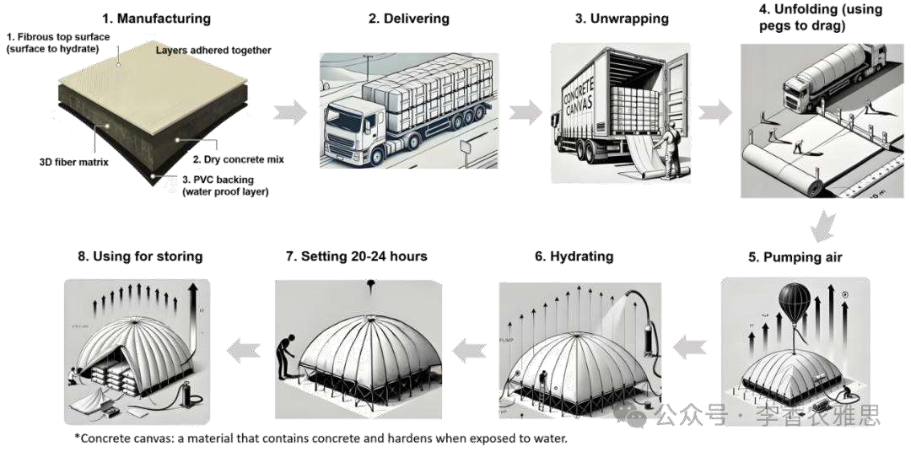

# 2025 年 3 月 15 日雅思写作真题
## Task 1

> **图表类型标注**：流程图（混凝土帆布储库制作）

**The diagram below shows the stages in making a storage area from a material called concrete canvas.**
**Summarise the information by selecting and reporting main features, and make comparisons where relevant.**



The diagram illustrates the process of constructing a storage area using concrete canvas, a material that contains concrete and solidifies upon contact with water. 

Initially, the concrete canvas is produced by adhering three layers: a fibrous top layer for hydration, a dry concrete mix in the middle, and a waterproof PVC backing. Afterwards, the material is packaged and transported by a truck to its designated location, where the canvas is unwrapped and carefully unfolded across a prepared ground surface, which typically covers an area of around 10 square meters, before being secured with pegs. 

Subsequently, air is pumped into the structure while the canvas is slung over a large inflatable ball, inflating it into a dome-like shape, after which water is sprayed over the surface to initiate the hydration process necessary for hardening. The canvas is then left to set for approximately 20 to 24 hours until the material solidifies into a rigid, durable form. Once fully hardened, the solidified dome-like structure, which primarily serves as a storage facility, is ready for use.

Overall, the process consists of eight sequential steps, which include manufacturing the concrete canvas, delivering the pre-produced materials to the destination, unfolding the structure, pumping air into it, and finally hydrating and solidifying it.

---

### 精析

#### ① 结构分析（精简）

本题属于 **Process Diagram（流程图）** 类 Task 1，涉及 1 个流程图展示使用混凝土帆布建造储藏区的 8 个步骤。

本文采用 **"顺序式" 三段式** 结构：

- **Paragraph 1 — Introduction（开头段）**
  - 改写题目要素：`The diagram illustrates the process of constructing a storage area using concrete canvas, a material that contains concrete and solidifies upon contact with water`（替换原题 `The diagram below shows the stages`）
  - 明确对象：储藏区建造过程 + 材料特性（混凝土帆布遇水固化）

- **Paragraph 2 — Body Details（主体段：按阶段分组）**
  - **制造与运输阶段**：
    - 三层结构：纤维顶层（ hydration ）+ 干混凝土混合物（中间）+ 防水 PVC 背衬
    - 包装后用卡车运输到指定地点
  - **现场安装阶段**：
    - 展开帆布，覆盖约10平方米地面，用钉子固定
    - 充气：空气泵入，帆布覆盖在大型充气球上形成圆顶
    - 固化：喷水启动水化过程，静置20-24小时硬化
  - **完工**：形成坚固的圆顶储藏设施

- **Paragraph 3 — Overview（总结段）**
  - 核心发现：整个过程包含八个顺序步骤，从制造到交付、展开、充气，最后水化固化

> **结构亮点**：本文在开头段就介绍了混凝土帆布的核心特性（"solidifies upon contact with water"），为后文的"hydration process"埋下伏笔。主体段按"制造→运输→现场安装→固化"的时间顺序组织，每个步骤用"Initially""Afterwards""Subsequently""Then""Once"等时间标记词清晰串联，使流程描述如行云流水。

#### ② 数据组织与对比策略（标注有效写法）

| 写法 | 原文示例 | 技巧说明 |
|------|---------|---------|
| **材料分层描述** | `a fibrous top layer for hydration, a dry concrete mix in the middle, and a waterproof PVC backing` | 用并列结构清晰描述三层材料 |
| **尺寸数据** | `which typically covers an area of around 10 square meters` | 用具体数字增强描述的精确性 |
| **时间数据** | `left to set for approximately 20 to 24 hours` | 用时间范围描述固化过程 |
| **步骤总结** | `eight sequential steps, which include... and finally...` | 用序数词和"finally"标记流程终点 |

> **数据亮点**：本文对数据的处理非常精准——"around 10 square meters"给出了覆盖面积，"20 to 24 hours"给出了固化时间，"eight sequential steps"给出了总步骤数。这些数字不多但每个都有意义，既满足了流程图对具体信息的需求，又避免了信息过载。

#### ③ 四项能力维度分析（TA / CC / LR / GRA）

- **TA**：本文在开头段就介绍了混凝土帆布的核心特性（"solidifies upon contact with water"），为后文的"hydration process"埋下伏笔。主体段按"制造→运输→现场安装→固化"的时间顺序组织，每个步骤用"Initially""Afterwards""Subsequently""Then""Once"等时间标记词清晰串联，使流程描述如行云流水。 本文对数据的处理非常精准——"around 10 square meters"给出了覆盖面积，"20 to 24 hours"给出了固化时间，"eight sequential steps"给出了总步骤数。这些数字不多但每个都有意义，既满足了流程图对具体信息的需求，又避免了信息过载。
- **CC**：本文的时间衔接词使用非常丰富且准确——"Initially"（最初）"Afterwards"（之后）"Subsequently"（随后）"Then"（然后）"Once"（一旦）"Finally"（最后），形成了一条完整的时间链。特别是"Once fully hardened"用"一旦...就..."的结构，既表示时间条件又暗示结果，是流程图描述的优质表达。
- **LR**：见模块⑤词汇表，含 `solidifies`、`adhering` 等精准词
- **GRA**：见模块⑤句式亮点

#### ④ 可迁移句型骨架（直接套用）（图表类型：流程图（混凝土帆布储库制作））

**骨架 1 — 开头改写（流程图）**
> The diagram outlines the process of ______, from ______ to ______.

**骨架 2 — 阶段串联**
> ______ is first [done], after which it is [done], before finally being [done].

**骨架 3 — 被动/目的**
> ______ is [verb]-ed so that ______ can be [verb]-ed in the next stage.

#### ⑤ 衔接 / 词汇 / 句式亮点（去水版）

| 衔接类型 | 原文表达 | 功能 |
|---------|---------|------|
| **时间顺序** | `Initially... Afterwards... Subsequently... Then... Once...` | 按步骤顺序推进描述 |
| **因果衔接** | `upon contact with water... to initiate the hydration process` | 说明材料特性和固化机制 |
| **目的衔接** | `for hydration... necessary for hardening` | 说明各步骤的目的 |
| **总结衔接** | `Overall... which include... and finally...` | 总结所有步骤 |

> **衔接亮点**：本文的时间衔接词使用非常丰富且准确——"Initially"（最初）"Afterwards"（之后）"Subsequently"（随后）"Then"（然后）"Once"（一旦）"Finally"（最后），形成了一条完整的时间链。特别是"Once fully hardened"用"一旦...就..."的结构，既表示时间条件又暗示结果，是流程图描述的优质表达。

| 词汇/短语 | 中文含义 | 词性/用法 | 替代普通表达 |
|-----------|----------|----------|-------------|
| **solidifies** | 凝固；变硬 | 动词 | becomes hard |
| **adhering** | 粘合；使贴合 | 动词 | sticking together |
| **fibrous top layer** | 纤维材质的表层 | 名词短语 | top layer made of fibers |
| **waterproof PVC backing** | 防水 PVC 底衬 | 名词短语 | waterproof back layer |
| **unwrapped and carefully unfolded** | 拆封并小心摊开 | 动词短语 | opened up |
| **dome-like shape** | 穹顶状外形 | 名词短语 | round shape like a dome |

**1. 材料特性定义句**
> *"The diagram illustrates the process of constructing a storage area using concrete canvas, **a material that contains concrete and solidifies upon contact with water**."*

**技巧**：用同位语"a material that..."在开头段就定义了混凝土帆布的核心特性，为后文的"hydration process"提供了背景知识。这种"引入+定义"的句式使读者在了解流程前先理解材料特性，是流程图写作的有效策略。

**2. 并列分层句**
> *"Initially, the concrete canvas is produced by adhering three layers: **a fibrous top layer for hydration, a dry concrete mix in the middle, and a waterproof PVC backing**."*

**技巧**：用冒号引出三个并列成分，每个成分都有明确的修饰语（"for hydration""in the middle""waterproof"），使三层结构一目了然。这种"总述+分述"的句式是描述复杂结构的经典写法。

**3. 时间链式句**
> *"Subsequently, air is pumped into the structure while the canvas is slung over a large inflatable ball, inflating it into a dome-like shape, **after which water is sprayed** over the surface to initiate the hydration process necessary for hardening."*

**技巧**：用"while"连接两个同时进行的动作（充气+覆盖），"inflating..."说明结果，"after which"引导下一步骤。这种"同时动作→结果→下一步"的链条式写法使流程描述紧凑而清晰。

**4. 条件完成句**
> *"**Once fully hardened**, the solidified dome-like structure, which primarily serves as a storage facility, is ready for use."*

**技巧**："Once + 过去分词"表示条件（一旦完全硬化），主句说明结果（准备就绪）。"which primarily serves as"用非限制性定语从句补充说明结构的用途，使结尾既简洁又完整。

---

#### ⑥ 可提升空间 + 仿写任务

**可提升空间（通用要点，按篇酌情采纳）：**
- Overview 建议前置或明确独立成段，让阅卷人先抓全局（TA 更稳）。
- 双维度数据（如比率/占比）尽量也收进 Overview，避免只在正文提一次。
- 跨段对比（如 A 反超 B）可集中到一句呈现，衔接更紧凑。

**本文针对性可改进点（按篇分析，点到即止）：**
- Overview 基本是把正文步骤按序重列一遍，缺少真正的全局判断（例如"整个流程只需卡车运输与水、空气两种现场投入，无需重型设备"），概括价值偏低。
- Overview 声称 "eight sequential steps"，但正文并未把八步显式切分，读者要自行拼数；要么在正文标出步数，要么去掉这个数字。
- "air is pumped into the structure while the canvas is slung over a large inflatable ball" 用 while 把两个动作说成同时发生，实际应是先把帆布罩在气球上再充气，先后顺序被模糊了；另第 2 段末句一句连写运输、展开、面积、固定四步，过长。

**仿写任务**：用「极值+对比」骨架写一句：描述『2020 年 X 国指标远高于其他三国』。
## Task 2

> **话题与题型标注**：工作类 · Advantages/Disadvantages

**Many young people today choose their future career based on the salary they will earn. Do you think the advantages outweigh the disadvantages?**

**许多年轻人选择未来职业时，主要依据他们将获得的薪资。你认为这种做法的优势是否大于劣势？**

In today’s competitive job market, many young individuals prioritize salary when selecting their careers. In my opinion, despite some advantages of choosing a career solely based on salary, the disadvantages, such as job dissatisfaction and a lack of professional fulfillment, outweigh the benefits.

在当今竞争激烈的就业市场上，许多年轻人优先考虑薪资来选择职业。在我看来，尽管仅仅以薪资作为标准来选择职业具有一定的优势，但其带来的劣势（例如工作不满意和缺乏职业成就感）远远超过其好处。

Admittedly, prioritizing salary allows young people to achieve financial security for their families, especially during economic downturns, and attain a higher social status. This is because higher salaries ensure financial independence from an early stage and provide better housing, high-quality education for children, reliable healthcare for aging parents, and leisure activities, all of which are considered essential for a comfortable and enjoyable lifestyle. In contrast, without predictable considerable income, individuals face uncertainty that may undermine their ability to plan for the future. Moreover, in Northern Asian countries, a high salary is often associated with elevated social status. Many societies in this region emphasize career prestige and remuneration packages, with professions like managers and engineers being highly respected. Individuals in these roles not only earn substantial incomes but also gain social recognition a factor that can enhance their marriage prospects, professional networks, and even their family's reputation.

不可否认的是，优先考虑薪资可以使年轻人及其家庭实现经济安全，尤其是在经济低迷时期，同时还能提升社会地位。这是因为高薪能够在早期阶段确保财务独立，并提供更好的住房、优质的子女教育、可靠的父母医疗保障以及丰富的休闲活动，而这些都被认为是舒适和愉快生活的必要条件。相反，如果没有可预测的收入增长，个人将面临不确定性，从而削弱他们的未来规划能力。此外，在北亚国家，高薪往往与较高的社会地位密切相关。这些社会高度重视职业的社会声望，例如经理和工程师等职业备受推崇。担任这些职务的人不仅能获得丰厚的薪资，还能赢得社会认可，这可能有助于提升婚姻前景、拓展职业人脉，甚至提高整个家庭的声誉。

However, selecting a career exclusively based on financial rewards can lead to long-term dissatisfaction and diminish professional fulfillment. The demanding nature of many high-paying jobs often requires long working hours and intense pressure, gradually eroding work-life balance. As a result, workers in such jobs may experience chronic stress and burnout, both of which cause physical and mental exhaustion. This overwhelming strain can further reduce job satisfaction, making daily tasks feel burdensome rather than meaningful. Even worse, when individuals enter a profession without genuine interest, their intrinsic motivation weakens over time. Without a sense of purpose or passion, engagement levels drop, ensuing in declining job performance. Poor performance not only limits career advancement but also increases the risk of job dissatisfaction and frequent career shifts. Over time, this cycle of stress, disengagement, and instability can make even a high-paying job feel unfulfilling, ultimately proving that financial incentives alone cannot guarantee a successful or satisfying career.

然而，仅以经济回报作为职业选择标准可能会导致长期的不满足感，并削弱职业成就感。许多高薪职业往往工作要求极高，需要长时间的工作和极大的压力，这逐渐破坏了工作与生活的平衡。因此，从事这些工作的员工可能会经历长期的压力和倦怠，进而导致身心疲惫。这种巨大的压力还会降低工作满意度，使日常任务变得沉重而缺乏意义。更糟糕的是，当个人进入一个自己并不真正感兴趣的行业时，他们的内在动力会随着时间的推移而减弱。缺乏目标感或激情会导致参与度下降，并最终影响工作表现。糟糕的工作表现不仅会限制职业发展，还会增加工作不满意和频繁换工作的风险。长此以往，这种压力、疏离感和不稳定的循环可能会使高薪工作变得毫无意义，最终证明单靠经济激励无法保证一份成功或令人满意的职业。

In conclusion, while prioritizing salary in career choices provides financial security and social status, the drawbacks often outweigh the benefits. High-paying jobs may offer stability and prestige, but they frequently come at the cost of intense pressure and a lack of fulfillment. Hence, achieving a balance between financial rewards and personal satisfaction is crucial for a sustainable and rewarding career.

总之，虽然在职业选择中优先考虑薪资能够带来经济安全和社会地位，但其弊端往往超过优势。高薪职业虽然提供稳定性和声望，但往往伴随着巨大压力和缺乏满足感。因此，在职业选择中，平衡经济回报与个人满足感对于实现可持续和有意义的职业至关重要。

---

### 精析

#### ① 结构分析（精简）

本题属于 **Advantages/Disadvantages** 类题型。此类题型的核心策略是：分别论述优点和缺点，然后给出自己的立场。

本文采用 **"利弊-立场" 四段式** 结构：

- **Paragraph 1 — Introduction（开头段）**
  - 改写题目（paraphrase）：`In today's competitive job market, many young individuals prioritize salary when selecting their careers`（替换原题 `Many young people today choose their future career based on the salary`）
  - 表明立场：`the disadvantages, such as job dissatisfaction and a lack of professional fulfillment, outweigh the benefits`（劣势大于优势）
  - 预告框架：先论述薪资优先的优势，再论证其劣势

- **Paragraph 2 — Body 1（优点段）**
  - 主题句：`Admittedly, prioritizing salary allows young people to achieve financial security for their families`
  - 论点1：高薪确保财务独立，提供住房、教育、医疗和休闲
  - 论点2：高薪与较高社会地位相关（以北亚国家为例）
  - 论点3：高薪职业带来社会认可，提升婚姻前景和家庭声誉
  - 效果：从经济安全和社会地位两个维度论证优点

- **Paragraph 3 — Body 2（缺点段）**
  - 主题句：`However, selecting a career exclusively based on financial rewards can lead to long-term dissatisfaction and diminish professional fulfillment`
  - 论点1：高薪工作要求高→长时间工作+高压→工作与生活平衡被破坏→慢性压力和倦怠
  - 论点2：缺乏真正兴趣→内在动力减弱→参与度下降→工作表现下滑→职业发展受限
  - 效果：从工作压力和内在动力两个维度论证缺点

- **Paragraph 4 — Conclusion（结尾段）**
  - 重申立场：高薪工作的弊端超过优势
  - 总结升华：平衡经济回报与个人满足感至关重要

> **结构亮点**：本文在缺点段采用了"链式因果"的论证结构——从"高薪→高压→倦怠→满意度下降"到"缺乏兴趣→动力减弱→表现下滑→职业不稳定"，两条因果链环环相扣，使劣势论证极具说服力。特别是"Even worse"的使用，将论证从外部压力推向内部动力的深层问题。

#### ② 论证逻辑链拆解（标注有效写法）

**Body 1（优点段）的逻辑链条：**

```
优先考虑薪资
    ↓ [优势]
→ 经济安全 + 社会地位
    ↓ [分层论证]
├── 经济层面
│   ↓
│   财务独立 + 更好住房、教育、医疗、休闲
│   ↓
│   舒适生活方式的必要条件
│
└── 社会层面
    ↓
    高薪 = 较高社会地位（北亚国家例子）
    ↓
    社会认可 → 提升婚姻前景 + 职业人脉 + 家庭声誉
```

**Body 2（缺点段）的逻辑链条：**

```
仅以薪资选择职业
    ↓ [劣势]
→ 长期不满 + 成就感缺失
    ↓ [分层论证]
├── 分支1：外部压力
│   ↓
│   高薪工作要求高
│   ↓
│   长时间工作 + 高压
│   ↓
│   工作与生活平衡被破坏
│   ↓
│   慢性压力 + 倦怠 → 身心疲惫
│   ↓
│   工作满意度下降
│
└── 分支2：内部动力
    ↓
    缺乏真正兴趣
    ↓
    内在动力减弱
    ↓
    参与度下降 → 工作表现下滑
    ↓
    职业发展受限 + 频繁换工作
    ↓
    压力、疏离、不稳定的循环
```

> **逻辑亮点**：缺点段的两条因果链设计得非常精妙——第一条"外部压力链"从工作条件推导到身心健康，第二条"内部动力链"从兴趣缺失推导到职业不稳定。两条链最终都指向"高薪工作变得毫无意义"的结论，形成了双重打击的论证效果。

#### ③ 四项能力维度分析（TA / CC / LR / GRA）

- **TA**：本文在缺点段采用了"链式因果"的论证结构——从"高薪→高压→倦怠→满意度下降"到"缺乏兴趣→动力减弱→表现下滑→职业不稳定"，两条因果链环环相扣，使劣势论证极具说服力。特别是"Even worse"的使用，将论证从外部压力推向内部动力的深层问题。 缺点段的两条因果链设计得非常精妙——第一条"外部压力链"从工作条件推导到身心健康，第二条"内部动力链"从兴趣缺失推导到职业不稳定。两条链最终都指向"高薪工作变得毫无意义"的结论，形成了双重打击的论证效果。
- **CC**：本文在缺点段中使用了"As a result, workers in such jobs may experience chronic stress and burnout, both of which cause physical and mental exhaustion. This overwhelming strain can further reduce job satisfaction..."的因果链，将"高压→倦怠→疲惫→满意度下降"的逻辑推导得非常严密。"both of which"引导的非限制性定语从句将"chronic stress and burnout"与"physical and mental exhaustion"精确关联。
- **LR**：见模块⑤词汇表，含 `financial security`、`professional fulfillment` 等精准词
- **GRA**：见模块⑤句式亮点

#### ④ 可迁移句型骨架（直接套用）（题型：Advantages/Disadvantages）

**骨架 1 — 优势起手**
> The main advantage of ______ is that it enables ______.

**骨架 2 — 劣势对照**
> However, a notable disadvantage is ______, which may ______.

**骨架 3 — 平衡立场**
> On balance, the benefits outweigh the drawbacks provided that ______.

#### ⑤ 衔接 / 词汇 / 句式亮点（去水版）

| 衔接类型 | 原文表达 | 功能说明 |
|---------|---------|---------|
| **让步衔接** | `Admittedly...` | 先承认优点 |
| **转折反驳** | `However... Even worse...` | 转向缺点并层层升级 |
| **因果推导** | `This is because... As a result... This overwhelming strain can further...` | 逐层推导因果链条 |
| **递进扩展** | `Moreover... In contrast...` | 在同一论点内扩展论证 |

> **衔接亮点**：本文在缺点段中使用了"As a result, workers in such jobs may experience chronic stress and burnout, both of which cause physical and mental exhaustion. This overwhelming strain can further reduce job satisfaction..."的因果链，将"高压→倦怠→疲惫→满意度下降"的逻辑推导得非常严密。"both of which"引导的非限制性定语从句将"chronic stress and burnout"与"physical and mental exhaustion"精确关联。

| 词汇/短语 | 中文含义 | 词性/用法 | 替代普通表达 |
|-----------|----------|----------|-------------|
| **financial security** | 经济保障；财务安全 | 名词短语 | having enough money |
| **professional fulfillment** | 职业成就感 | 名词短语 | feeling good about work |
| **transferable skills** | 可迁移技能 | 名词短语 | skills that can be used in different jobs |
| **chronic stress** | 长期慢性压力 | 名词短语 | long-term stress |
| **burnout** | 职业倦怠 | 名词 | extreme tiredness from work |
| **intrinsic motivation** | 内在驱动力 | 名词短语 | inner drive |

**1. 因果链式长句**
> *"The demanding nature of many high-paying jobs often requires long working hours and intense pressure, gradually eroding work-life balance. **As a result**, workers in such jobs may experience chronic stress and burnout, **both of which cause** physical and mental exhaustion."*

**技巧**：第一句陈述原因（工作要求高），现在分词短语"gradually eroding..."推导直接后果；第二句用"As a result"承接，"both of which"引导定语从句将"chronic stress and burnout"与"physical and mental exhaustion"关联。这种"原因→直接后果→进一步后果"的链条式写法使论证层层递进。

**2. 条件+后果复合句**
> *"**When children are allowed to make important choices on their own**, such as how to spend their time, what to eat, or when to study, they often prioritize short-term satisfaction over long-term benefits."*

**技巧**："When"引导时间条件从句，"such as"列举具体选择，主句推导行为后果。这种"条件→行为→后果"的三段式结构是分析人类行为的经典句式。

**3. 递进后果句**
> *"**Even worse**, when individuals enter a profession without genuine interest, their intrinsic motivation weakens over time. **Without a sense of purpose or passion**, engagement levels drop, ensuing in declining job performance."*

**技巧**："Even worse"将论证推向更深层的后果，"Without..."引导的介词短语作为条件状语，主句推导后果。"ensuing in"（导致）比"leading to"更加学术化，体现了词汇的高级性。

**4. 综合总结句**
> *"Hence, achieving a balance between financial rewards and personal satisfaction is crucial for a sustainable and rewarding career."*

**技巧**：结尾句用"Hence"总结全文，"achieving a balance between... and..."提出解决方案，"sustainable and rewarding"两个形容词并列修饰"career"，既强调了职业的持久性又强调了满足感。这种"问题→解决方案"的结尾方式比单纯重申立场更有建设性。

---

#### ⑥ 可提升空间 + 仿写任务

**可提升空间（通用要点，按篇酌情采纳）：**
- 结论段避免复读开头，应「推进」而非「重复」立场。
- 让步段衔接词（this perspective 等）回指别太远，可加限定词收紧。
- 同一话题词（如 career / benefit）避免三现，用近义替换。

**本文针对性可改进点（按篇分析，点到即止）：**
- 优点段的 "In contrast, without predictable considerable income..." 逻辑标记用错：这不是对比，而是对前句的反面假设，应改为 Conversely 之外的 Without such income, however 一类表述；且 predictable considerable 两个形容词直接叠加，读来别扭。
- 缺点段的 "ensuing in declining job performance" 属搭配误用（ensue 是不及物动词），应为 resulting in；同段 "gain social recognition a factor that can enhance..." 前缺逗号或破折号。
- 缺点段一段十余句、两条因果链一贯到底，是全文最长的一段，与优点段的篇幅明显失衡；在 "Even worse" 处断开会更易读，也让两侧论证更对称。

**仿写任务**：就『远程办公』各写一句优势与劣势。
