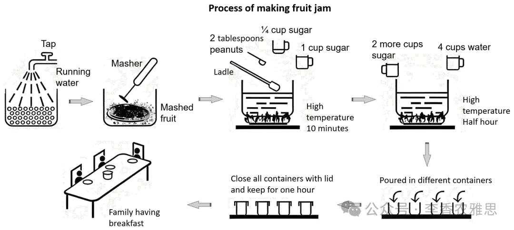

# 2025 年 4 月 5 日雅思写作真题
## Task 1

> **图表类型标注**：流程图（果酱制作）

**The diagram shows how to make jam from the fruit.Summarise the information by selecting and reporting main features, and make comparisons where relevant.**



The diagram illustrates the step-by-step process of how fruit jam is produced. 

In the first stage, a batch of 4 kilograms of fruit is washed under running tap water. Once cleaned, the fruit is pureed thoroughly with a masher. The mashed fruit is then transferred into a cooking pot, where it is combined with 1/4 cup of sugar, two tablespoons of peanuts, and a cup of water, and afterwards the mixture is heated at a high temperature for 10 minutes. 

In the following stage, two additional cups of sugar and four cups of water are added to the pot, after which the mixture is boiled again over high heat for half an hour to allow the ingredients to blend and thicken into jam. 

In the last stage, the finished jam is poured into separate containers, and then these containers are sealed with lids and left to rest for one hour. When it is sufficiently cooled, the jam is ready for consumption.

Overall, the procedure of manufacturing jam involves three main stages, which consist of washing and mashing fruit, heating a mixture of the mashed fruit, sugar, and water at different stages, and storing the finished jam.

---

### 精析

#### ① 结构分析（精简）

本题属于 **Process Diagram（流程图）** 类 Task 1，涉及 1 个流程图展示制作果酱的三个主要阶段。

本文采用 **"顺序式" 三段式** 结构：

- **Paragraph 1 — Introduction（开头段）**
  - 改写题目要素：`The diagram illustrates the step-by-step process of how fruit jam is produced`（替换原题 `The diagram shows how to make jam`）
  - 明确对象：果酱制作过程

- **Paragraph 2 — Body Details（主体段：按阶段分组）**
  - **第一阶段（准备）**：
    - 4公斤水果用自来水清洗
    - 用捣碎器彻底 puree
    - 转入烹饪锅，加入1/4杯糖、两汤匙花生、一杯水
    - 高温加热10分钟
  - **第二阶段（熬制）**：
    - 加入两杯糖和四杯水
    - 再次高温煮沸半小时，使原料混合并浓缩成酱
  - **第三阶段（储存）**：
    - 成品果酱倒入独立容器
    - 密封盖子，静置一小时
    - 充分冷却后可供食用

- **Paragraph 3 — Overview（总结段）**
  - 核心发现：果酱制作包含三个主要阶段——清洗捣碎水果、分阶段加热混合物、储存成品

> **结构亮点**：本文按"In the first stage""In the following stage""In the last stage"清晰划分三个阶段，每个阶段内部用"Once... then... afterwards..."等时间衔接词串联步骤。对配料的精确描述（"1/4 cup of sugar""two tablespoons of peanuts""four cups of water"）体现了对流程图细节的准确把握。

#### ② 数据组织与对比策略（标注有效写法）

| 写法 | 原文示例 | 技巧说明 |
|------|---------|---------|
| **配料量化** | `a batch of 4 kilograms of fruit... 1/4 cup of sugar, two tablespoons of peanuts, and a cup of water` | 精确描述原料用量 |
| **时间数据** | `heated at a high temperature for 10 minutes... boiled again over high heat for half an hour... left to rest for one hour` | 用时间标注各步骤时长 |
| **阶段总结** | `three main stages, which consist of...` | 用序数词组织流程 |
| **条件说明** | `When it is sufficiently cooled, the jam is ready for consumption` | 用条件句说明完成标准 |

> **数据亮点**：本文对数据的处理非常精准——"4 kilograms""1/4 cup""two tablespoons""a cup""two additional cups""four cups"等配料数据完整呈现，"10 minutes""half an hour""one hour"等时间数据清晰标注。这些具体数字使流程描述具有可操作性，是流程图写作的重要特征。

#### ③ 四项能力维度分析（TA / CC / LR / GRA）

- **TA**：本文按"In the first stage""In the following stage""In the last stage"清晰划分三个阶段，每个阶段内部用"Once... then... afterwards..."等时间衔接词串联步骤。对配料的精确描述（"1/4 cup of sugar""two tablespoons of peanuts""four cups of water"）体现了对流程图细节的准确把握。 本文对数据的处理非常精准——"4 kilograms""1/4 cup""two tablespoons""a cup""two additional cups""four cups"等配料数据完整呈现，"10 minutes""half an hour""one hour"等时间数据清晰标注。这些具体数字使流程描述具有可操作性，是流程图写作的重要特征。
- **CC**：本文的时间衔接词使用非常丰富——阶段层面用"In the first/following/last stage"，步骤层面用"Once... then... afterwards... after which... and then... When..."，形成了一条从宏观到微观的时间链。特别是"after which"引导的非限制性定语从句，将两个步骤紧密连接，避免了简单句的堆砌。
- **LR**：见模块⑤词汇表，含 `step-by-step process`、`pureed thoroughly` 等精准词
- **GRA**：见模块⑤句式亮点

#### ④ 可迁移句型骨架（直接套用）（图表类型：流程图（果酱制作））

**骨架 1 — 开头改写（流程图）**
> The diagram outlines the process of ______, from ______ to ______.

**骨架 2 — 阶段串联**
> ______ is first [done], after which it is [done], before finally being [done].

**骨架 3 — 被动/目的**
> ______ is [verb]-ed so that ______ can be [verb]-ed in the next stage.

#### ⑤ 衔接 / 词汇 / 句式亮点（去水版）

| 衔接类型 | 原文表达 | 功能 |
|---------|---------|------|
| **时间顺序** | `In the first stage... In the following stage... In the last stage...` | 按阶段顺序推进描述 |
| **步骤衔接** | `Once cleaned... then... afterwards... after which... and then...` | 在同一步骤内串联动作 |
| **条件衔接** | `When it is sufficiently cooled...` | 说明完成的条件 |
| **总结衔接** | `Overall... which consist of...` | 总结所有阶段 |

> **衔接亮点**：本文的时间衔接词使用非常丰富——阶段层面用"In the first/following/last stage"，步骤层面用"Once... then... afterwards... after which... and then... When..."，形成了一条从宏观到微观的时间链。特别是"after which"引导的非限制性定语从句，将两个步骤紧密连接，避免了简单句的堆砌。

| 词汇/短语 | 中文含义 | 词性/用法 | 替代普通表达 |
|-----------|----------|----------|-------------|
| **step-by-step process** | 分步进行的流程 | 名词短语 | process with steps |
| **pureed thoroughly** | 被彻底打成泥状 | 动词短语 | mashed well |
| **transferred into** | 转移到……中 | 动词短语 | put into |
| **boiled again over high heat** | 用大火再次煮沸 | 动词短语 | boiled again |
| **blend and thicken** | 融合并变稠 | 动词短语 | mix and become thick |
| **sealed with lids** | 用盖子密封 | 动词短语 | closed with lids |

**1. 时间条件句**
> *"**Once cleaned**, the fruit is pureed thoroughly with a masher."*

**技巧**："Once + 过去分词"表示时间条件（一旦清洗完毕），主句说明下一步动作。这种省略主语的简洁句式是流程图描述的经典表达，避免了重复"After the fruit is cleaned"。

**2. 步骤链式句**
> *"The mashed fruit is then transferred into a cooking pot, where it is combined with 1/4 cup of sugar, two tablespoons of peanuts, and a cup of water, and afterwards the mixture is heated at a high temperature for 10 minutes."*

**技巧**：用"where"引导的定语从句描述烹饪锅中的操作，"and afterwards"连接下一步骤。这种"动作→地点细节→下一步"的链条式写法使流程描述紧凑而清晰。

**3. 目的结果句**
> *"two additional cups of sugar and four cups of water are added to the pot, after which the mixture is boiled again over high heat for half an hour **to allow the ingredients to blend and thicken into jam**."*

**技巧**："after which"连接两个步骤，不定式"to allow..."说明煮沸的目的。这种"步骤+目的"的句式使流程描述不仅说明"做什么"还说明"为什么做"。

**4. 条件完成句**
> *"**When it is sufficiently cooled**, the jam is ready for consumption."*

**技巧**："When"引导时间条件从句，主句说明结果。"sufficiently cooled"比"cooled down"更加精准，"ready for consumption"比"can be eaten"更加正式。这种句式是流程图结尾的经典表达。

---

#### ⑥ 可提升空间 + 仿写任务

**可提升空间（通用要点，按篇酌情采纳）：**
- Overview 建议前置或明确独立成段，让阅卷人先抓全局（TA 更稳）。
- 双维度数据（如比率/占比）尽量也收进 Overview，避免只在正文提一次。
- 跨段对比（如 A 反超 B）可集中到一句呈现，衔接更紧凑。

**本文针对性可改进点（按篇分析，点到即止）：**
- 正文把"清洗→捣碎→加料→加热 10 分钟"全部并入 `the first stage`，而结尾 Overview 却把"heating a mixture"单列为一个阶段，段落切分与总结口径不一致，建议二者统一。
- 第一阶段写 `heated at a high temperature`，第二阶段却写 `boiled again over high heat`，`again` 暗示上一步也是 boiling，动词前后不吻合，可改为 `boiled for a further half an hour`。
- 开头段只有一句、未点明"共三个阶段"，流程图题若在开头或紧随其后先交代阶段总数，阅卷人抓全局会更快（现在要读到文末才知道）。

**仿写任务**：用「极值+对比」骨架写一句：描述『2020 年 X 国指标远高于其他三国』。
## Task 2

> **话题与题型标注**：教育类 · Discuss Both Views

**Some people think that mathematics is important for school children, while many others think that other subjects are more important. Discuss both these views and give your own opinion.**

**一些人认为数学对在校儿童非常重要，而许多其他人则认为其他学科更为重要。本文将探讨这两种观点，并给出笔者的看法。**

Some argue that mathematics is a core subject that underpins many aspects of life and education, while others contend that other disciplines deserve more emphasis. In my opinion, while mathematics is undoubtedly important, it should not take precedence over other subjects, as each one plays a unique role in fostering the development of well-rounded individuals.

一些人认为，数学是一门核心学科，是生活和教育许多方面的基础；而另一些人则认为，其他学科更值得重视。在我看来，虽然数学无疑非常重要，但它不应凌驾于其他学科之上，因为每一门学科在培养全面发展的人才方面都扮演着独特的角色。

On the one hand, mathematics is often regarded as essential for cognitive development and as the foundation for children learning practical subjects. Studying mathematics helps students cultivate a wide range of abilities, such as logical thinking and problem-solving skills, which are invaluable for future success in both academia and the job market. Therefore, those with a strong grounding in mathematical theory can tackle practical problems more efficiently, and their ability to do so may be more valuable than mastering a specific technique or skill, which could potentially be replaced by artificial intelligence in the coming decades. Aside from that, the skills developed through studying mathematics at an early age are closely tied to professional growth, as they provide a necessary foundation for learning applied subjects. For example, fields like accounting and economics rely heavily on mathematical operations to solve real-world problems, making mathematics indispensable for students pursuing these disciplines.

一方面，数学通常被认为对认知发展至关重要，也是儿童学习实用学科的基础。学习数学有助于学生培养多种能力，例如逻辑思维和解决问题的能力，这些能力对未来在学术界和就业市场中取得成功都是非常宝贵的。因此，那些拥有扎实数学理论基础的人通常能更高效地解决实际问题，而这种能力的价值可能超过掌握某一具体技能或技术，后者在未来几十年可能会被人工智能所取代。除此之外，在年幼时学习数学所培养的能力与职业发展密切相关，因为它们为学习应用学科提供了必要的基础。例如，会计和经济学等领域在解决现实问题时严重依赖数学运算，这使得数学对于那些希望从事这些学科的学生来说是不可或缺的。

On the other hand, those who argue that other subjects are more important than mathematics believe that a well-rounded education is crucial forthe holistic development of students. That is, subjects like literature and history foster creativity and critical thinking in ways that mathematics cannot. Specifically, literature enhances empathy and helps students understand human experiences, while history encourages the analysis of past events and their relevance to the present. Both empathy and analytical skills are essential for developing individuals who can navigate complex challenges. Another argument is that subjects such as languages and social sciences play a key role in cultivating social and emotional intelligence. In today’s interconnected world, the ability to communicate effectively, understand diverse cultures, and collaborate with others is just as important as technical expertise. These qualities make candidates with such skills more employable in a competitive society that values humanistic care.

另一方面，认为其他学科比数学更重要的人则认为，全面的教育对于学生的整体发展至关重要。也就是说，文学和历史等学科在培养创造力和批判性思维方面的作用是数学所不能替代的。具体而言，文学能够增强共情能力，帮助学生理解人类经验；而历史则鼓励学生分析过去的事件及其与现实的关联。共情能力和分析能力对于培养能应对复杂挑战的人才来说都是必不可少的。另一个观点是，语言和社会科学等学科在培养社会情商和情绪智力方面起着关键作用。在当今这个相互联系的世界里，有效沟通、理解多元文化以及与他人协作的能力与技术专长同样重要。这些素质使具备相关能力的人在一个重视人文关怀的竞争社会中更具就业竞争力。

In conclusion, while mathematics is undeniably essential for developing cognitive and practical skills, it should not overshadow other subjects that contribute to a well-rounded education. A balanced curriculum that values the arts, languages, and social sciences is crucial for fostering individuals capable of addressing both intellectual and societal challenges.

总之，虽然数学在发展认知能力和实际技能方面无可否认地至关重要，但它不应掩盖其他有助于全面教育的学科。一套平衡的课程体系，重视艺术、语言和社会科学，对于培养能够应对智力与社会双重挑战的人才是至关重要的。

---

### 精析

#### ① 结构分析（精简）

本题属于 **Discuss Both Views** 类题型。此类题型的核心策略是：分别讨论两种观点，然后给出自己的立场。

本文采用 **"平衡-立场" 四段式** 结构：

- **Paragraph 1 — Introduction（开头段）**
  - 改写题目（paraphrase）：`Some argue that mathematics is a core subject that underpins many aspects of life and education, while others contend that other disciplines deserve more emphasis`（替换原题 `Some people think... while many others think`）
  - 表明立场：`while mathematics is undoubtedly important, it should not take precedence over other subjects`（数学不应凌驾于其他学科之上）
  - 预告框架：先论述数学的重要性，再论证其他学科的价值，最后表明平衡立场

- **Paragraph 2 — Body 1（数学重要性段）**
  - 主题句：`mathematics is often regarded as essential for cognitive development and as the foundation for children learning practical subjects`
  - 论点1：数学培养逻辑思维和解决问题能力，对未来学术和就业成功至关重要
  - 论点2：数学为应用学科（会计、经济学）提供必要基础
  - 效果：从认知发展和职业基础两个维度论证数学的重要性

- **Paragraph 3 — Body 2（其他学科价值段）**
  - 主题句：`a well-rounded education is crucial for the holistic development of students`
  - 论点1：文学和历史培养创造力和批判性思维，增强共情能力
  - 论点2：语言和社会科学培养社交和情绪智力，在互联世界中同样重要
  - 效果：从人文素养和社交能力两个维度论证其他学科的价值

- **Paragraph 4 — Conclusion（结尾段）**
  - 重申立场：数学不应掩盖其他学科
  - 总结升华：平衡的课程体系对培养全面发展的人才至关重要

> **结构亮点**：本文在讨论两种观点时保持了出色的平衡性——数学重要性段和其他学科价值段的篇幅大致相当，且每个段落都有两个层次分明的论点。更难得的是，作者在数学段中使用了"Aside from that""For example"等衔接，使论证从一般到具体、从主要到补充，层次分明。

#### ② 论证逻辑链拆解（标注有效写法）

**Body 1（数学重要性段）的逻辑链条：**

```
数学的重要性
    ↓ [分层论证]
├── 认知层面
│   ↓
│   培养逻辑思维和解决问题能力
│   ↓
│   对未来学术和就业成功至关重要
│   ↓
│   比具体技能更有价值（不易被AI取代）
│
└── 应用层面
    ↓
    为应用学科提供基础
    ↓
    会计、经济学等依赖数学运算
    ↓
    数学对这些学科的学生不可或缺
```

**Body 2（其他学科价值段）的逻辑链条：**

```
其他学科的价值
    ↓ [分层论证]
├── 人文素养
│   ↓
│   文学和历史培养创造力和批判性思维
│   ↓
│   文学增强共情能力
│   ↓
│   历史鼓励分析过去事件与现实的关联
│
└── 社交能力
    ↓
    语言和社会科学培养社交和情绪智力
    ↓
    有效沟通 + 理解多元文化 + 协作能力
    ↓
    在重视人文关怀的竞争社会中更具就业竞争力
```

> **逻辑亮点**：本文的两个主体段采用了平行的"总-分"结构，使文章具有对称美感。数学段从"认知→应用"两个层面展开，其他学科段从"人文→社交"两个层面展开，形成了"智力-社会"的对应关系。这种结构使读者能够清晰对比两种观点的论证维度。

#### ③ 四项能力维度分析（TA / CC / LR / GRA）

- **TA**：本文在讨论两种观点时保持了出色的平衡性——数学重要性段和其他学科价值段的篇幅大致相当，且每个段落都有两个层次分明的论点。更难得的是，作者在数学段中使用了"Aside from that""For example"等衔接，使论证从一般到具体、从主要到补充，层次分明。 本文的两个主体段采用了平行的"总-分"结构，使文章具有对称美感。数学段从"认知→应用"两个层面展开，其他学科段从"人文→社交"两个层面展开，形成了"智力-社会"的对应关系。这种结构使读者能够清晰对比两种观点的论证维度。
- **CC**：本文在数学段中使用了"Therefore, those with a strong grounding in mathematical theory can tackle practical problems more efficiently, and their ability to do so may be more valuable than mastering a specific technique or skill, which could potentially be replaced by artificial intelligence in the coming decades"的因果链，将"数学能力"与"AI 不可替代性"关联，使论证具有前瞻性。
- **LR**：见模块⑤词汇表，含 `underpins`、`cognitive development` 等精准词
- **GRA**：见模块⑤句式亮点

#### ④ 可迁移句型骨架（直接套用）（题型：Discuss）

**骨架 1 — 先退后进亮立场（Intro）**
> Although ______ deserves a central place because ______, I disagree with the view that ______.

**骨架 2 — 分类论证起手（Body）**
> From the perspective of ______, doing X helps ______ and ______. Meanwhile, X also offers ______ that go beyond ______.

**骨架 3 — 抽象→具体例证（Body）**
> For example, a course on ______ may show how ______ have harmed ______, as illustrated by ______.

#### ⑤ 衔接 / 词汇 / 句式亮点（去水版）

| 衔接类型 | 原文表达 | 功能说明 |
|---------|---------|---------|
| **观点切换** | `On the one hand... On the other hand...` | 清晰区分两种观点 |
| **因果推导** | `This is because... Therefore... Thus...` | 解释原因并推导结果 |
| **递进扩展** | `Aside from that... Moreover... Another argument is...` | 在同一论点内扩展论证 |
| **例证衔接** | `For example...` | 用具体例子支撑论点 |

> **衔接亮点**：本文在数学段中使用了"Therefore, those with a strong grounding in mathematical theory can tackle practical problems more efficiently, and their ability to do so may be more valuable than mastering a specific technique or skill, which could potentially be replaced by artificial intelligence in the coming decades"的因果链，将"数学能力"与"AI 不可替代性"关联，使论证具有前瞻性。

| 词汇/短语 | 中文含义 | 词性/用法 | 替代普通表达 |
|-----------|----------|----------|-------------|
| **underpins** | 支撑；构成……的基础 | 动词 | supports |
| **cognitive development** | 认知发展 | 名词短语 | mental development |
| **holistic development** | 整体（全人）发展 | 名词短语 | all-round development |
| **well-rounded education** | 全面均衡的教育 | 名词短语 | complete education |
| **empathy** | 共情；同理心 | 名词 | understanding others' feelings |
| **interconnected world** | 相互联结的世界 | 名词短语 | world where everyone is connected |

**1. 因果对比句**
> *"Therefore, those with a strong grounding in mathematical theory can tackle practical problems more efficiently, and their ability to do so may be more valuable than mastering a specific technique or skill, **which could potentially be replaced by artificial intelligence in the coming decades**."*

**技巧**："Therefore"承接前文，主句陈述数学能力的价值，"which"引导的非限制性定语从句将"specific technique or skill"与"AI 替代"关联。这种"能力价值→对比→未来威胁"的结构使论证既有现实意义又有前瞻性。

**2. 对比分析句**
> *"That is, subjects like literature and history foster creativity and critical thinking in ways that mathematics cannot."*

**技巧**："That is"解释前文，主句陈述文学和历史的价值，"in ways that mathematics cannot"用定语从句直接对比数学的局限性。这种"肯定A+否定B"的句式使对比更加鲜明。

**3. 递进扩展句**
> *"In today's interconnected world, the ability to communicate effectively, understand diverse cultures, and collaborate with others is **just as important as** technical expertise."*

**技巧**："In today's interconnected world"设定时代背景，"the ability to..."列举三种能力，"just as important as"将人文能力与"technical expertise"并置对比。这种"时代背景→能力列举→价值对比"的结构使论证既有时代感又有说服力。

**4. 综合总结句**
> *"A balanced curriculum that values the arts, languages, and social sciences is crucial for fostering individuals capable of addressing both intellectual and societal challenges."*

**技巧**：结尾句用"A balanced curriculum"提出解决方案，"that values..."定语从句说明平衡课程的具体内容，"capable of addressing both... and..."用"both... and..."结构从"intellectual"和"societal"两个维度说明培养目标。这种"方案→内容→目标"的结构使结尾既有建议又有愿景。

---

#### ⑥ 可提升空间 + 仿写任务

**可提升空间（通用要点，按篇酌情采纳）：**
- 结论段避免复读开头，应「推进」而非「重复」立场。
- 让步段衔接词（this perspective 等）回指别太远，可加限定词收紧。
- 同一话题词（如 career / benefit）避免三现，用近义替换。

**本文针对性可改进点（按篇分析，点到即止）：**
- Body 2 出现 `crucial forthe holistic development` 的粘连拼写（应为 `for the`），属硬伤，需订正。
- 两个主体段的论据密度不对称：Body 1 有 `accounting and economics` 这样的具体落点，Body 2 关于文学、历史、语言的论述全是概括句，缺一个可感的例子（如一堂历史课如何训练论证能力）。
- `well-rounded` 在开头段、Body 2 与结论段三次出现，可换用 `all-round`、`holistic`、`balanced` 之一以增加词汇变化。

**仿写任务**：就本题用骨架写一句你的核心论证。
