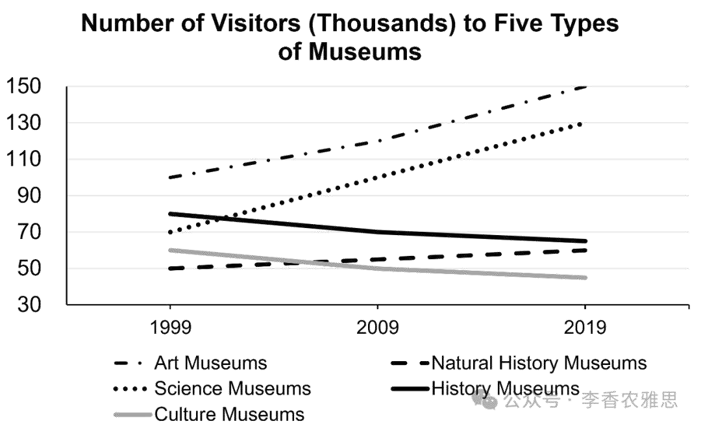

# 2025 年 5 月 10 日雅思写作真题
## Task 1

> **图表类型标注**：折线图（五类博物馆访客量）

**The graph below shows the number of visitors to five different types of museums in the UK from 1999 to 2019.**
**Summarise the information by selecting and reporting the main features, and make comparisons where relevant.**



The line chart illustrates how many museumgoers visited art museums, natural history museums, science museums, history museums, and cultural museums from 1999 to 2019. 

As seen, the most pronounced increases occurred in the number of visitors to the art and science museums. The art museums consistently drew the highest number of visitors, which started at 100,000 in 1999 and climbed steadily to approximately 150,000 by 2019. Likewise, attendance at the science museums nearly doubled over the period, rising from around 70,000 to 130,000. Meanwhile, although natural history museums recorded the fewest visitors at the beginning, their visitorship grew gradually and approached that of history museums by 2019 (approximately 60,000 visitors). 

In contrast, the history and cultural museums experienced declining popularity. The number of visitors to the history museums decreased steadily from roughly 80,000 in 1999 to just under 60,000 twenty years later. The cultural museums followed a similar downward trajectory, with attendance falling from about 60,000 to 40,000, making it the least visited among all five categories.

Overall, while the art and science museums saw significant growth in visitor numbers over the two decades, the history and cultural museums became less popular. Moreover, the art museums remained the most visited institution throughout the period, whereas the cultural museums attracted the fewest visitors in 2019.

---

### 精析

#### ① 结构分析（精简）

本题属于 **Line Graph（折线图）** 类 Task 1，涉及 1 个折线图展示1999-2019年间英国五类博物馆的访客数量变化。

本文采用 **"总-分-总" 三段式** 结构：

- **Paragraph 1 — Introduction（开头段）**
  - 改写题目要素：`The line chart illustrates how many museumgoers visited art museums, natural history museums, science museums, history museums, and cultural museums from 1999 to 2019`（替换原题 `The graph below shows`）
  - 明确对象：五类博物馆（art, natural history, science, history, cultural）+ 时间范围（1999-2019）

- **Paragraph 2 — Body Details（主体段：按趋势分组）**
  - **上升趋势组**：Art museums, Science museums, Natural history museums
    - Art museums：始终最高，从100,000→约150,000（稳步增长）
    - Science museums：从约70,000→130,000（近翻倍）
    - Natural history museums：从最少→约60,000（逐渐增长，接近history museums）
  - **下降趋势组**：History museums, Cultural museums
    - History museums：从约80,000→略低于60,000（稳步下降）
    - Cultural museums：从约60,000→40,000（下降轨迹相似，2019年最少）

- **Paragraph 3 — Overview（总结段）**
  - 核心发现1：Art 和 Science museums 显著增长，History 和 Cultural museums 变得不受欢迎
  - 核心发现2：Art museums 始终最受欢迎，Cultural museums 2019年最少

> **结构亮点**：本文采用"按趋势方向分组"的策略，将五类博物馆分为"上升"和"下降"两组。这种分组方式使对比非常清晰。在描述Natural history museums时，作者特别指出"their visitorship grew gradually and approached that of history museums"，体现了对数据间关系的敏锐观察。"Likewise""Meanwhile""In contrast"等衔接词使段落内部过渡自然。

#### ② 数据组织与对比策略（标注有效写法）

| 写法 | 原文示例 | 技巧说明 |
|------|---------|---------|
| **趋势+排名** | `The art museums consistently drew the highest number of visitors, which started at 100,000 in 1999 and climbed steadily to approximately 150,000 by 2019` | 同时陈述排名和变化 |
| **倍数表达** | `attendance at the science museums nearly doubled over the period, rising from around 70,000 to 130,000` | 用倍数强化变化幅度 |
| **接近描述** | `their visitorship grew gradually and approached that of history museums by 2019` | 描述数据间的相对关系 |
| **下降轨迹** | `followed a similar downward trajectory, with attendance falling from about 60,000 to 40,000` | 用"trajectory"描述趋势路径 |

> **数据亮点**：作者在描述Science museums时使用了"nearly doubled"的倍数表达，比"increased by about 60,000"更加直观。对Cultural museums的"followed a similar downward trajectory"则精准描述了其与History museums趋势相似的关系。"making it the least visited among all five categories"将终点数据与排名结合，增加了信息密度。

#### ③ 四项能力维度分析（TA / CC / LR / GRA）

- **TA**：本文采用"按趋势方向分组"的策略，将五类博物馆分为"上升"和"下降"两组。这种分组方式使对比非常清晰。在描述Natural history museums时，作者特别指出"their visitorship grew gradually and approached that of history museums"，体现了对数据间关系的敏锐观察。"Likewise""Meanwhile""In contrast"等衔接词使段落内部过渡自然。 作者在描述Science museums时使用了"nearly doubled"的倍数表达，比"increased by about 60,000"更加直观。对Cultural museums的"followed a similar downward trajectory"则精准描述了其与History museums趋势相似的关系。"making it the least visited among all five categories"将终点数据与排名结合，增加了信息密度。
- **CC**：本文的"Likewise"用于引出与Art museums趋势相似的Science museums，"Meanwhile"用于描述同一组内的Natural history museums，"In contrast"则标记了趋势方向的转变。这些衔接词的精准使用使段落结构清晰、层次分明。
- **LR**：见模块⑤词汇表，含 `museumgoers`、`consistently drew` 等精准词
- **GRA**：见模块⑤句式亮点

#### ④ 可迁移句型骨架（直接套用）（图表类型：折线图（五类博物馆访客量））

**骨架 1 — 开头改写（表格/图通用）**
> The [chart] illustrates changes in ______ in [entities] in [years], along with ______.

**骨架 2 — 极值+对比（Body 通用）**
> ______ had [number], which was considerably higher than the figures for the other [n] [entities].

**骨架 3 — 排名变化/超越（含动态时）**
> ______ saw the second-largest rise and surpassed ______, with its figure growing from ______ to ______.

**骨架 4 — 双维度收尾（Overview 通用）**
> Overall, ______ had by far the largest number..., while ______ recorded the lowest figures on both measures.

#### ⑤ 衔接 / 词汇 / 句式亮点（去水版）

| 衔接类型 | 原文表达 | 功能 |
|---------|---------|------|
| **分组衔接** | `As seen... In contrast...` | 按趋势方向分组推进 |
| **相似衔接** | `Likewise... Similarly...` | 标注趋势相似的对象 |
| **对比衔接** | `Meanwhile... In contrast...` | 突出不同博物馆间的差异 |
| **总结衔接** | `Overall... Moreover... whereas...` | 在概述中并置多重对比 |

> **衔接亮点**：本文的"Likewise"用于引出与Art museums趋势相似的Science museums，"Meanwhile"用于描述同一组内的Natural history museums，"In contrast"则标记了趋势方向的转变。这些衔接词的精准使用使段落结构清晰、层次分明。

| 词汇/短语 | 中文含义 | 词性/用法 | 替代普通表达 |
|-----------|----------|----------|-------------|
| **museumgoers** | 常逛博物馆的人；博物馆参观者 | 名词 | museum visitors |
| **consistently drew** | 始终吸引到 | 动词短语 | always attracted |
| **nearly doubled** | 几乎翻了一番 | 动词短语 | increased almost two times |
| **approached that of** | 接近……的水平 | 动词短语 | became close to |
| **downward trajectory** | 下行轨迹 | 名词短语 | downward trend |
| **the least visited** | 参观人数最少的 | 形容词短语 | had the fewest visitors |

**1. 趋势+排名复合句**
> *"The art museums **consistently drew the highest number of visitors**, which started at 100,000 in 1999 and climbed steadily to approximately 150,000 by 2019."*

**技巧**：主句陈述排名地位（始终最高），定语从句"which started at... and climbed steadily to..."补充具体变化。"consistently"一词强调了领先地位的持续性，"climbed steadily"则描述了变化的平稳性。

**2. 倍数表达句**
> *"**Likewise**, attendance at the science museums **nearly doubled** over the period, rising from around 70,000 to 130,000."*

**技巧**："Likewise"标记与Art museums的相似趋势，"nearly doubled"用倍数概括变化幅度，现在分词短语"rising from..."提供具体数据。这种"概括→数据"的句式使描述简洁而有力。

**3. 接近描述句**
> *"**Meanwhile**, although natural history museums recorded the fewest visitors at the beginning, their visitorship grew gradually and **approached that of history museums** by 2019 (approximately 60,000 visitors)."*

**技巧**："Meanwhile"标记并列关系，让步从句承认起点最低，主句描述增长并强调"approached that of history museums"的相对关系。括号中的数据提供了精确信息。

**4. 综合概述句**
> *"Overall, while the art and science museums saw significant growth in visitor numbers over the two decades, the history and cultural museums became less popular. **Moreover**, the art museums remained the most visited institution throughout the period, **whereas** the cultural museums attracted the fewest visitors in 2019."*

**技巧**：概述段用"while"将上升和下降两组并置对比，"Moreover"补充排名信息，"whereas"将最受欢迎和最不受欢迎的对象对比。这种"趋势对比→排名对比"的结构使概述信息丰富而层次分明。

---

#### ⑥ 可提升空间 + 仿写任务

**可提升空间（通用要点，按篇酌情采纳）：**
- Overview 建议前置或明确独立成段，让阅卷人先抓全局（TA 更稳）。
- 双维度数据（如比率/占比）尽量也收进 Overview，避免只在正文提一次。
- 跨段对比（如 A 反超 B）可集中到一句呈现，衔接更紧凑。

**本文针对性可改进点（按篇分析，点到即止）：**
- 第二段主题句只说 `the most pronounced increases occurred in ... the art and science museums`，段内却又写了 natural history museums，而后者并不属于"增幅最显著"，主题句的覆盖面与段落内容不符，可在句末补一句 `while natural history museums also edged up`。
- `the art museums remained the most visited institution` 主语为复数、表语却用单数 `institution`，应改为 `institutions` 或 `the most visited type of museum`。
- natural history 只给了 2019 年的约值（60,000），没给 1999 年起点，读者无从判断 `grew gradually` 的实际幅度，补一个起点数字信息才完整。

**仿写任务**：用「极值+对比」骨架写一句：描述『2020 年 X 国指标远高于其他三国』。
## Task 2

> **话题与题型标注**：健康类 · Agree/Disagree

**Some people think everyone should be a vegetarian because we do not need to eat meat to have a healthy diet. To what extent do you agree or disagree?**

**有些人认为，每个人都应该成为素食者，因为我们不需要吃肉也能拥有健康的饮食。对此你在多大程度上同意或不同意？**

Some argue that becoming a vegetarian is essential for good health because meat is considered unhealthy. Although a balanced vegetarian diet can be healthy and beneficial, I disagree with the idea that everyone should adopt a vegetarian lifestyle or that completely avoiding meat is necessary to maintain physical well-being.

一些人认为，成为素食者对健康至关重要，因为肉类被认为是不健康的。尽管均衡的素食饮食可以是健康且有益的，但我不同意每个人都应采纳素食主义生活方式，或者说完全避免肉类是维持身体健康的必要条件。

Admittedly, a well-planned vegetarian diet can fulfill nutritional needs to some extent, while also addressing pressing health and environmental concerns. Fruits, vegetables, or whole grains, are rich in essential nutrients and dietary fiber but low in saturated fats and cholesterol. By limiting or eliminating high-fat animal products, individuals can reduce their risk of conditions like hypertension, high cholesterol, and obesity. Thus, a shift to a plant-based diet supports better weight control and lowers the likelihood of chronic diseases, as well as reduces the risk of conditions like hypertension, obesity, and certain cancers. Beyond personal health, embracing a vegetarian lifestyle helps mitigate the environmental impact of food production. Compared to meat-heavy diets, plant-based eating results in fewer greenhouse gas emissions, reduced water consumption, and less damage to ecosystems. Therefore, adopting vegetarianism can be seen not only as a proactive health decision but also as a responsible contribution to environmental sustainability.

诚然，精心规划的素食饮食一定程度上不仅能满足营养需求，还能应对紧迫的健康和环境问题。水果、蔬菜和全谷物富含必需营养素和膳食纤维，同时饱和脂肪和胆固醇含量较低。通过限制或去除高脂肪动物制品，个人可以降低患高血压、高胆固醇和肥胖等疾病的风险。因此，转向植物性饮食有助于更好地控制体重，降低患慢性病的可能性，如高血压、肥胖和某些类型的癌症。除了个人健康之外，采纳素食主义生活方式还有助于减轻食物生产对环境的影响。相比以肉类为主的饮食，植物性饮食会导致更少的温室气体排放、更低的用水量以及对生态系统的破坏也更小。因此，采纳素食主义不仅可以视为一种积极的健康决策，也是一种对环境可持续发展的负责任贡献。

Nevertheless, it is inaccurate to claim that everyone should be a vegetarian or that meat consumption is inherently unnecessary. Although excessive consumption of red or processed meat can be harmful, moderate intake of lean meats contributes valuable nutrients, such as high-quality protein and iron, that are often hard to obtain from vegetarian diets. This is especially important for nutritionally vulnerable groups like children, pregnant women, and athletes. In addition to its dietary contributions, meat holds significant cultural and social importance in many societies, often forming the basis of traditional meals and communal practices. Enforcing a one-size-fits-all dietary rule to promote vegetarianism risks alienating communities and oversimplifies the complexities of dietary habits. Ultimately, the foundation of a healthy diet lies not in strict exclusion but in balance, variety, and informed choices. Individuals who include moderate amounts of meat alongside diverse plant-based foods can maintain health just as effectively as those who follow vegetarian diets.

然而，声称每个人都应成为素食者，或认为肉类摄入本身是不必要的，是不准确的。尽管过量摄入红肉或加工肉类确实可能有害健康，但适量摄入瘦肉能提供有价值的营养，如高质量蛋白质和铁，而这些营养素在素食饮食中往往难以摄取。对于营养脆弱群体，如儿童、孕妇和运动员，这尤为重要。除了营养价值之外，肉类在许多社会中还具有重要的文化和社会意义，常常构成传统饮食和群体性习俗的基础。推行一刀切的饮食规则来推广素食主义可能会疏远某些群体，并且过于简化了饮食习惯的复杂性。归根结底，健康饮食的基础并不在于严格排除某类食物，而在于平衡、多样性以及明智的选择。那些在饮食中适量摄入肉类并搭配多样化植物性食物的人，同样可以像素食者一样有效地维持健康。

In conclusion, even though vegetarianism offers clear health and environmental advantages, it should not be viewed as universally essential, nor should everyone be expected to adopt it. A balanced diet that includes moderate meat consumption can be equally beneficial when tailored to individual needs, cultural contexts, and informed personal choices.

总之，尽管素食主义确实带来显著的健康与环境优势，但它不应被视为普遍必要的，也不应期望每个人都去采纳。只要根据个体需求、文化背景和明智的个人选择进行调整，包含适量肉类的均衡饮食同样可以带来良好的健康效果。

---

### 精析

#### ① 结构分析（精简）

本题属于 **Agree/Disagree** 类题型。此类题型的核心策略是：先承认对方观点的部分合理性，再通过多维度反驳论证自己的立场，最后总结。

本文采用 **"让步-反驳-综合" 四段式** 结构：

- **Paragraph 1 — Introduction（开头段）**
  - 改写题目（paraphrase）：`Some argue that becoming a vegetarian is essential for good health because meat is considered unhealthy`（替换原题 `everyone should be a vegetarian because we do not need to eat meat to have a healthy diet`）
  - 表明立场：`I disagree with the idea that everyone should adopt a vegetarian lifestyle or that completely avoiding meat is necessary to maintain physical well-being`（明确不同意）
  - 预告框架：先承认素食的健康和环境优势，再论证肉类摄入的必要性

- **Paragraph 2 — Body 1（让步段）**
  - 主题句：`Admittedly, a well-planned vegetarian diet can fulfill nutritional needs to some extent, while also addressing pressing health and environmental concerns`
  - 论点1：水果、蔬菜、全谷物富含营养和纤维，低饱和脂肪和胆固醇→降低高血压、高胆固醇、肥胖风险
  - 论点2：植物性饮食减少温室气体排放、降低用水量、减少生态破坏
  - 效果：从健康和环境两个维度承认素食的价值

- **Paragraph 3 — Body 2（反驳段）**
  - 主题句：`Nevertheless, it is inaccurate to claim that everyone should be a vegetarian or that meat consumption is inherently unnecessary`
  - 论点1：适量瘦肉提供高质量蛋白质和铁，对营养脆弱群体（儿童、孕妇、运动员）尤为重要
  - 论点2：肉类在许多社会中具有文化和社会意义，构成传统饮食和群体性习俗的基础
  - 论点3：一刀切规则过于简化饮食习惯的复杂性
  - 效果：从营养需求、文化因素和饮食复杂性三个维度反驳

- **Paragraph 4 — Conclusion（结尾段）**
  - 重申立场：素食不应被视为普遍必要
  - 总结升华：均衡饮食包括适量肉类，根据个体需求和文化背景调整

> **结构亮点**：本文的反驳段采用了"营养→文化→复杂性"的三层论证，从生理需求到社会文化再到方法论，层层递进。特别是"one-size-fits-all dietary rule"的批判，精准指出了原观点的方法论缺陷——将复杂问题过度简化。

#### ② 论证逻辑链拆解（标注有效写法）

**Body 1（让步段）的逻辑链条：**

```
素食饮食
    ↓ [优势]
→ 满足营养需求 + 应对健康和环境问题
    ↓ [分层论证]
├── 健康层面
│   ↓
│   水果、蔬菜、全谷物富含营养和纤维
│   ↓
│   低饱和脂肪和胆固醇
│   ↓
│   降低高血压、高胆固醇、肥胖风险
│   ↓
│   支持体重控制 + 降低慢性病可能性
│
└── 环境层面
    ↓
    植物性饮食减少温室气体排放
    ↓
    降低用水量 + 减少生态破坏
    ↓
    对环境可持续发展的负责任贡献
```

**Body 2（反驳段）的逻辑链条：**

```
素食并非对所有人都必要
    ↓ [反驳论证]
├── 营养需求
│   ↓
│   适量瘦肉提供高质量蛋白质和铁
│   ↓
│   素食饮食中难以获取
│   ↓
│   对营养脆弱群体尤为重要（儿童、孕妇、运动员）
│
├── 文化因素
│   ↓
│   肉类在许多社会中具有文化和社会意义
│   ↓
│   构成传统饮食和群体性习俗的基础
│   ↓
│   一刀切规则可能疏远某些群体
│
└── 饮食复杂性
    ↓
    健康饮食的基础在于平衡、多样性和明智选择
    ↓
    适量肉类搭配多样化植物性食物
    ↓
    可以像素食者一样有效维持健康
```

> **逻辑亮点**：反驳段的三层论证设计得非常精妙——"营养需求"从生理角度攻击"素食足够"的论点，"文化因素"从社会角度攻击"素食适合所有人"的论点，"饮食复杂性"从方法论角度攻击"一刀切"的逻辑。三层论证相互独立又共同指向"原观点过于简化"的结论。

#### ③ 四项能力维度分析（TA / CC / LR / GRA）

- **TA**：本文的反驳段采用了"营养→文化→复杂性"的三层论证，从生理需求到社会文化再到方法论，层层递进。特别是"one-size-fits-all dietary rule"的批判，精准指出了原观点的方法论缺陷——将复杂问题过度简化。 反驳段的三层论证设计得非常精妙——"营养需求"从生理角度攻击"素食足够"的论点，"文化因素"从社会角度攻击"素食适合所有人"的论点，"饮食复杂性"从方法论角度攻击"一刀切"的逻辑。三层论证相互独立又共同指向"原观点过于简化"的结论。
- **CC**：本文在让步段中使用了"By limiting or eliminating high-fat animal products, individuals can reduce their risk of conditions like hypertension, high cholesterol, and obesity. Thus, a shift to a plant-based diet supports better weight control and lowers the likelihood of chronic diseases"的因果链，将"减少动物制品"与"降低疾病风险"的逻辑推导得非常严密。
- **LR**：见模块⑤词汇表，含 `vegetarianism`、`fulfill nutritional needs` 等精准词
- **GRA**：见模块⑤句式亮点

#### ④ 可迁移句型骨架（直接套用）（题型：Agree/Disagree）

**骨架 1 — 先退后进亮立场（Intro）**
> Although ______ deserves a central place because ______, I disagree with the view that ______.

**骨架 2 — 分类论证起手（Body）**
> From the perspective of ______, doing X helps ______ and ______. Meanwhile, X also offers ______ that go beyond ______.

**骨架 3 — 抽象→具体例证（Body）**
> For example, a course on ______ may show how ______ have harmed ______, as illustrated by ______.

#### ⑤ 衔接 / 词汇 / 句式亮点（去水版）

| 衔接类型 | 原文表达 | 功能说明 |
|---------|---------|---------|
| **让步衔接** | `Admittedly...` | 先承认素食的优势 |
| **转折反驳** | `Nevertheless...` | 转向反驳论证 |
| **因果推导** | `By limiting or eliminating... individuals can reduce their risk of...` | 推导素食的健康效果 |
| **递进扩展** | `Beyond personal health... Therefore... Ultimately...` | 从健康扩展到环境，再到总结 |

> **衔接亮点**：本文在让步段中使用了"By limiting or eliminating high-fat animal products, individuals can reduce their risk of conditions like hypertension, high cholesterol, and obesity. Thus, a shift to a plant-based diet supports better weight control and lowers the likelihood of chronic diseases"的因果链，将"减少动物制品"与"降低疾病风险"的逻辑推导得非常严密。

| 词汇/短语 | 中文含义 | 词性/用法 | 替代普通表达 |
|-----------|----------|----------|-------------|
| **vegetarianism** | 素食主义 | 名词 | not eating meat |
| **fulfill nutritional needs** | 满足营养需求 | 动词短语 | meet nutritional needs |
| **pressing health concerns** | 亟待解决的健康问题 | 名词短语 | important health problems |
| **dietary fiber** | 膳食纤维 | 名词短语 | fiber in food |
| **saturated fats** | 饱和脂肪 | 名词短语 | bad fats |
| **one-size-fits-all** | 一刀切的；不分对象一概适用的 | 形容词 | suitable for everyone |

**1. 因果链式长句**
> *"By limiting or eliminating high-fat animal products, individuals can reduce their risk of conditions like hypertension, high cholesterol, and obesity. **Thus**, a shift to a plant-based diet supports better weight control and lowers the likelihood of chronic diseases, as well as reduces the risk of conditions like hypertension, obesity, and certain cancers."*

**技巧**：第一句用"By + 动名词"说明方式，主句推导健康效果；第二句用"Thus"总结，"as well as"连接并列效果。这种"方式→效果→总结"的结构使健康论证非常扎实。

**2. 对比论证句**
> *"**Compared to meat-heavy diets**, plant-based eating results in fewer greenhouse gas emissions, reduced water consumption, and less damage to ecosystems."*

**技巧**："Compared to"引导对比对象，主句用三个并列的名词短语（fewer emissions, reduced consumption, less damage）说明植物性饮食的环境优势。这种"对比→多重优势"的结构使环境论证简洁有力。

**3. 条件+重要性句**
> *"Although excessive consumption of red or processed meat can be harmful, **moderate intake of lean meats contributes valuable nutrients**, such as high-quality protein and iron, **that are often hard to obtain from vegetarian diets**."*

**技巧**：让步从句承认过量肉类的危害，主句强调适量瘦肉的价值，"that"引导的定语从句说明这些营养素的稀缺性。"such as"列举具体营养素，使论证更加具体。

**4. 综合总结句**
> *"A balanced diet that includes moderate meat consumption can be equally beneficial **when tailored to individual needs, cultural contexts, and informed personal choices**."*

**技巧**：结尾句用"when + 过去分词"引导条件状语，"tailored to"精准表达"根据...量身定制"的含义。"individual needs, cultural contexts, and informed personal choices"三个名词短语并列，从个体、文化和选择三个维度说明均衡饮食的条件。

---

#### ⑥ 可提升空间 + 仿写任务

**可提升空间（通用要点，按篇酌情采纳）：**
- 结论段避免复读开头，应「推进」而非「重复」立场。
- 让步段衔接词（this perspective 等）回指别太远，可加限定词收紧。
- 同一话题词（如 career / benefit）避免三现，用近义替换。

**本文针对性可改进点（按篇分析，点到即止）：**
- 让步段两句之内把 `conditions like hypertension, high cholesterol, and obesity` 与 `the risk of conditions like hypertension, obesity, and certain cancers` 说了两遍，后半句 `as well as reduces...` 属明显重复，删去或只保留 `certain cancers` 即可。
- `Fruits, vegetables, or whole grains, are rich in essential nutrients...` 主语与谓语之间多一个逗号，且此处是并列列举，应用 `and` 而非 `or`。
- 两个主体段的例证都停留在类别层面（`children, pregnant women, and athletes` / `many societies`），没有一处可落地的具体材料；补一例（如某国膳食指南或某地饮食传统）能明显提高说服力。

**仿写任务**：用「先退后进」骨架重写：*Some think space exploration is a waste of money.*
