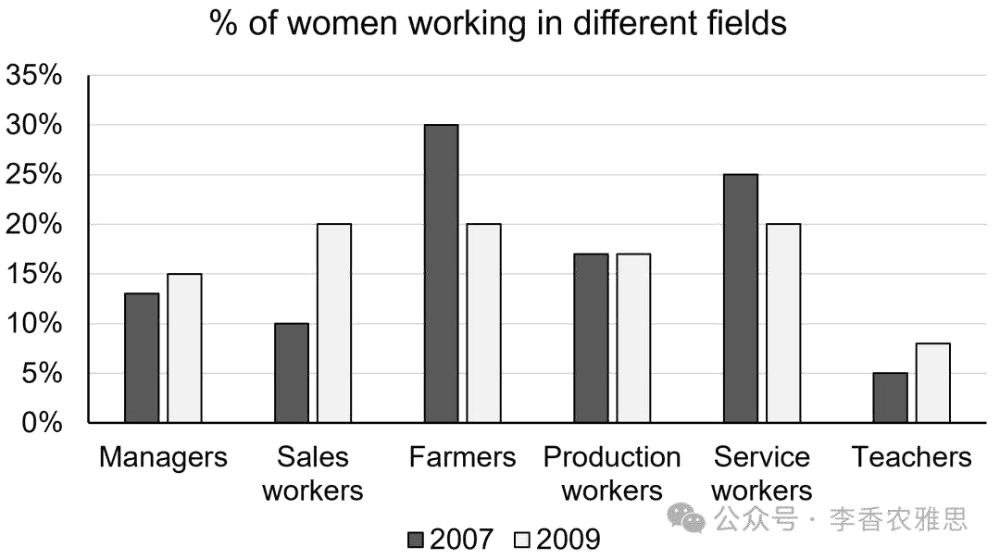

# 2025 年 6 月 21 日雅思写作真题
## Task 1

> **图表类型标注**：柱状图（双年女性就业领域占比）

**The chart below shows the percentage of women working in different fields in 2007 and 2009.**
**Summarise the information by selecting and reporting the main features, and make comparisons where relevant.**



The bar chart illustrates the proportion of women employed as managers, sales workers, farmers, production workers, service workers, and teachers in 2007 and 2009.

As seen, the agricultural and service sectors attracted a decreasing percentage of females over the period. In 2007, farming was the most common field for female workers, employing 30% of women. Although that figure fell markedly to 20% by 2009, it remained the top sector in terms of female employment. Similarly, the proportion of women working in services declined from 25% to 20% over the same period. By contrast, the percentage of women in the manufacturing industry remained constant at around 17%.

The percentages of female workers in sales, teaching, and managerial positions, on the other hand, increased considerably. Specifically, that of women in sales doubled from 10% in 2007 to 20% in 2009, witnessing the highest growth rate and making sales one of the fields that hired a large rate of women in 2009. Following sales, teaching had the second most notable upturn in its figure for employed females, despite having the smallest share in both years (5% and 8%), while managerial positions saw only a small rise, with the rate increasing from 13% to 15%.

Overall, the most noticeable change over the period was the downturn in the proportion of women working as farmers and service workers, whereas the percentages of women in sales, managerial, and teaching roles rose.

---

### 精析

#### ① 结构分析（精简）

本题属于 **Bar Chart（柱状图）** 类 Task 1，涉及 1 个柱状图展示2007和2009年女性在不同职业领域的就业比例变化。

本文采用 **"总-分-总" 三段式** 结构：

- **Paragraph 1 — Introduction（开头段）**
  - 改写题目要素：`The bar chart illustrates the proportion of women employed as managers, sales workers, farmers, production workers, service workers, and teachers in 2007 and 2009`（替换原题 `The chart below shows`）
  - 明确对象：六个职业领域（managers, sales, farmers, production, service, teachers）+ 时间（2007和2009年）

- **Paragraph 2 — Body Details（主体段：按趋势分组）**
  - **下降趋势组**：Agriculture, Service
    - Farming：2007年30%（最高）→2009年20%（仍最高但显著下降）
    - Service：25%→20%（同期下降）
  - **持平**：Production：约17%（两年均保持不变）
  - **上升趋势组**：Sales, Teaching, Managerial
    - Sales：10%→20%（翻倍，增长率最高）
    - Teaching：5%→8%（增长第二显著，但两年均最低）
    - Managerial：13%→15%（小幅上升）

- **Paragraph 3 — Overview（总结段）**
  - 核心发现1：农民和服务业女性比例下降最显著
  - 核心发现2：销售、管理和教学岗位女性比例上升

> **结构亮点**：本文采用"按趋势方向分组"的策略，将六个职业分为"下降""持平""上升"三组。这种分组方式使对比非常清晰。在描述Sales时，作者特别指出"doubled from 10% in 2007 to 20% in 2009, witnessing the highest growth rate"，体现了对数据特征的精准把握。对Teaching的描述用"despite having the smallest share in both years"标注了与"增长第二显著"的矛盾特征。

#### ② 数据组织与对比策略（标注有效写法）

| 写法 | 原文示例 | 技巧说明 |
|------|---------|---------|
| **起点+终点+趋势** | `fell markedly to 20% by 2009, it remained the top sector` | 用让步结构同时描述变化和排名 |
| **倍数表达** | `doubled from 10% in 2007 to 20% in 2009` | 用倍数强化变化幅度 |
| **增长率标注** | `witnessing the highest growth rate` | 点明变化的特殊地位 |
| **矛盾特征** | `despite having the smallest share in both years (5% and 8%)` | 标注与趋势相反的特征 |

> **数据亮点**：作者在描述Farming时，用"fell markedly"描述下降幅度，同时用"it remained the top sector"强调其仍保持最高排名。对Sales的"doubled"和"witnessing the highest growth rate"则精准抓住了最具冲击力的数据特征。对Teaching的"despite having the smallest share"则体现了对数据矛盾的敏锐观察。

#### ③ 四项能力维度分析（TA / CC / LR / GRA）

- **TA**：本文采用"按趋势方向分组"的策略，将六个职业分为"下降""持平""上升"三组。这种分组方式使对比非常清晰。在描述Sales时，作者特别指出"doubled from 10% in 2007 to 20% in 2009, witnessing the highest growth rate"，体现了对数据特征的精准把握。对Teaching的描述用"despite having the smallest share in both years"标注了与"增长第二显著"的矛盾特征。 作者在描述Farming时，用"fell markedly"描述下降幅度，同时用"it remained the top sector"强调其仍保持最高排名。对Sales的"doubled"和"witnessing the highest growth rate"则精准抓住了最具冲击力的数据特征。对Teaching的"despite having the smallest share"则体现了对数据矛盾的敏锐观察。
- **CC**：本文的"Although that figure fell markedly to 20% by 2009, it remained the top sector in terms of female employment"是一个复杂的让步句——先承认大幅下降，再强调仍保持最高排名。这种"下降但仍最高"的对比使数据描述更加立体。
- **LR**：见模块⑤词汇表，含 `employed as`、`fell markedly` 等精准词
- **GRA**：见模块⑤句式亮点

#### ④ 可迁移句型骨架（直接套用）（图表类型：柱状图（双年女性就业领域占比））

**骨架 1 — 开头改写（表格/图通用）**
> The [chart] illustrates changes in ______ in [entities] in [years], along with ______.

**骨架 2 — 极值+对比（Body 通用）**
> ______ had [number], which was considerably higher than the figures for the other [n] [entities].

**骨架 3 — 排名变化/超越（含动态时）**
> ______ saw the second-largest rise and surpassed ______, with its figure growing from ______ to ______.

**骨架 4 — 双维度收尾（Overview 通用）**
> Overall, ______ had by far the largest number..., while ______ recorded the lowest figures on both measures.

#### ⑤ 衔接 / 词汇 / 句式亮点（去水版）

| 衔接类型 | 原文表达 | 功能 |
|---------|---------|------|
| **分组衔接** | `As seen... By contrast... The percentages... on the other hand...` | 按趋势分组推进描述 |
| **让步衔接** | `Although that figure fell markedly... it remained the top sector` | 标注与趋势相反的排名 |
| **相似衔接** | `Similarly...` | 标注趋势相似的对象 |
| **总结衔接** | `Overall... whereas...` | 在概述中并置对比 |

> **衔接亮点**：本文的"Although that figure fell markedly to 20% by 2009, it remained the top sector in terms of female employment"是一个复杂的让步句——先承认大幅下降，再强调仍保持最高排名。这种"下降但仍最高"的对比使数据描述更加立体。

| 词汇/短语 | 中文含义 | 词性/用法 | 替代普通表达 |
|-----------|----------|----------|-------------|
| **employed as** | 受雇担任……；从事……职业 | 动词短语（从事...职业） | working as |
| **fell markedly** | 明显下降 | 动词短语（显著下降） | went down a lot |
| **remained the top sector** | 仍居行业首位 | 动词短语（保持最高领域） | stayed the highest |
| **doubled** | 翻了一番 | 动词（翻倍） | increased two times |
| **witnessing the highest growth rate** | 呈现出最高的增长率 | 动词短语（见证最高增长率） | had the biggest increase |
| **the most noticeable change** | 最引人注目的变化 | 名词短语（最显著变化） | the biggest change |

**1. 让步+排名句**
> *"In 2007, farming was the most common field for female workers, employing 30% of women. **Although that figure fell markedly to 20% by 2009**, **it remained the top sector** in terms of female employment."*

**技巧**：第一句陈述起点排名和比例，第二句用"Although"引导让步从句承认大幅下降，主句强调仍保持最高排名。这种"下降但仍最高"的对比使数据描述更加立体。

**2. 倍数+增长率句**
> *"Specifically, that of women in sales **doubled from 10% in 2007 to 20% in 2009**, **witnessing the highest growth rate** and making sales one of the fields that hired a large rate of women in 2009."*

**技巧**：主句用"doubled"概括变化幅度，"witnessing the highest growth rate"标注特殊地位，"making sales..."用现在分词短语说明结果。这种"变化→地位→结果"的三层结构使信息传递高效而完整。

**3. 矛盾特征句**
> *"Following sales, teaching had the second most notable upturn in its figure for employed females, **despite having the smallest share in both years** (5% and 8%), while managerial positions saw only a small rise, with the rate increasing from 13% to 15%."*

**技巧**：主句陈述增长排名，"despite + 动名词短语"标注与增长趋势相反的低基数特征，"while"对比Managerial的小幅上升。"with + 名词 + 现在分词"补充说明Managerial的具体变化。

**4. 综合概述句**
> *"Overall, the most noticeable change over the period was the downturn in the proportion of women working as farmers and service workers, **whereas** the percentages of women in sales, managerial, and teaching roles rose."*

**技巧**：概述段用"whereas"将下降和上升两组并置对比。"the most noticeable change"精准概括了核心发现，"downturn"和"rose"的对比使概述简洁有力。

---

#### ⑥ 可提升空间 + 仿写任务

**可提升空间（通用要点，按篇酌情采纳）：**
- Overview 建议前置或明确独立成段，让阅卷人先抓全局（TA 更稳）。
- 双维度数据（如比率/占比）尽量也收进 Overview，避免只在正文提一次。
- 跨段对比（如 A 反超 B）可集中到一句呈现，衔接更紧凑。

**本文针对性可改进点（按篇分析，点到即止）：**
- 第二段主题句只说 `the agricultural and service sectors attracted a decreasing percentage of females`，段末却用 `By contrast` 塞进"持平"的 manufacturing，主题句与段落内容不匹配；宜把 production 挪出，或在主题句里一并交代。
- `making sales one of the fields that hired a large rate of women in 2009` 搭配有误：`rate` 不能被 hire、也不宜用 large 修饰，应改为 `a large proportion of women` 或 `one of the largest employers of women`。
- Overview 只归纳了"下降组"与"上升组"，漏掉 production 全程稳定在约 17% 这一同样重要的整体特征，末尾补一句 `while manufacturing remained flat` 即可覆盖全部六个行业。

**仿写任务**：用「极值+对比」骨架写一句：描述『2020 年 X 国指标远高于其他三国』。
## Task 2

> **话题与题型标注**：文化与传统类 · Discuss Both Views

**Some people think the newly built houses should be the same as the old houses in local areas. Others argue that local authorities should allow people to build houses in their own style. Discuss both views and give your opinion.**

**一些人认为新建的房子应该与本地老房子一样；然而，其他人认为当地应该允许人们按照自己的风格盖房子。讨论双方观点，并给出自己的观点。**

Some argue that maintaining uniformity with traditional architectural styles preserves local character, whereas others believe that people should have the freedom to design their homes according to personal preferences. In my opinion, while it is important to respect and preserve architectural heritage, it is equally essential to allow modern designs in areas that meet modernization requirements.

有人认为新建房屋应与当地的老房子保持一致，而另一些人则认为地方当局应该允许人们按自己的风格建房。我认为，虽然尊重和保护建筑遗产很重要，但同样有必要在满足现代化需求的地区允许现代设计。

On the one hand, proponents of preserving traditional styles contend that architectural consistency helps protect cultural identity. In many regions, historic buildings represent the unique heritage and aesthetic values of a community, while ancient-style towns serve as popular tourist attractions and play crucial roles in a city's development. A notable example is Suzhou, where the local government has implemented strict regulations to ensure that new buildings in the old city center harmonize with traditional architectural features, such as white walls, black tiles, and classic courtyard designs. The uniformity in architecture not only helps retain the city's distinctive charm and historical atmosphere but also boosts tourism and strengthens residents' sense of belonging, creating a pleasing environment for both inhabitants and visitors. In contrast, allowing modern designs that clash with these traditional styles could lead to visual disharmony and the gradual erosion of local identity.

一方面，传统风格的支持者认为，建筑风格的一致性有助于保护文化认同。在许多地区，历史建筑代表了社区独特的遗产和审美价值，而仿古城镇也往往成为受欢迎的旅游景点，在城市发展中发挥着重要作用。一个典型的例子是苏州，当地政府出台了严格的规定，确保老城区的新建筑与传统建筑风格协调一致，例如白墙、黑瓦和经典的院落设计。统一的建筑风格不仅有助于保留城市独特的魅力和历史氛围，还能促进旅游业发展，增强居民的归属感，为居民和游客创造一个宜人的环境。相比之下，允许与传统风格相冲突的现代设计，可能导致视觉上的不和谐，并逐渐侵蚀地方特色。

On the other hand, those who advocate for greater flexibility argue that individuals should have the right to accommodate modern needs and express their creativity in constantly evolving cities. Architectural preferences often reflect contemporary lifestyles and environmental considerations; however, old-style buildings are often incompatible with modern requirements. For instance, homeowners today might prefer energy-efficient designs with solar panels to construct an energy-saving house or an extended balcony to grow plants that both decorate the home and help residents relax. In addition, following the style of surrounding buildings could limit innovation and make housing less functional or livable, as traditional designs often fail to meet the practical demands of modern life. For example, old buildings typically do not include designated parking zones, and requiring new houses to replicate such outdated layouts could cause inconvenience for residents who rely on private vehicles, while also increasing construction costs for the sake of compliance with aesthetic requirements at the expense of functionality.

另一方面，主张更大灵活性的人认为，在不断发展的城市中，个人应有权满足现代需求并表达自己的创造力。建筑偏好往往反映当代生活方式和环保理念；然而，老式建筑往往无法满足现代的需求。例如，如今的房主可能更喜欢采用带有太阳能板的节能设计，以建造节能环保的住宅，或扩建阳台来种植绿色植物，这既能美化家园，又有助于放松心情。此外，要求新建房屋遵循周围建筑的风格可能会限制创新，使住房功能性和宜居性下降，因为传统设计往往无法满足现代生活的实际需求。例如，老建筑通常没有专门的停车区域，而要求新房复制这种过时的布局会给依赖私家车的居民带来不便，同时还会因追求外观一致而增加建设成本，牺牲房屋的实用性。

In conclusion, although maintaining architectural uniformity can protect cultural heritage, permitting individual styles offers practical and creative benefits. In my view, a balanced approach would involve designating certain zones for conservation while encouraging innovative and sustainable construction elsewhere to ensure that local identity is safeguarded without stifling creativity or progress.

总之，尽管保持建筑风格统一有助于保护文化遗产，但允许个性化风格则能带来实用性和创造性上的好处。在我看来，一个平衡的做法应当是在划定特定保护区的同时，在其他地方鼓励创新和可持续的建筑，这样既能保护地方特色，又不会扼杀创造力和进步。

---

### 精析

#### ① 结构分析（精简）

本题属于 **Discuss Both Views** 类题型。此类题型的核心策略是：分别讨论两种观点，然后给出自己的立场。

本文采用 **"平衡-立场" 四段式** 结构：

- **Paragraph 1 — Introduction（开头段）**
  - 改写题目（paraphrase）：`Some argue that maintaining uniformity with traditional architectural styles preserves local character, whereas others believe that people should have the freedom to design their homes according to personal preferences`（替换原题 `Some people think... Others argue`）
  - 表明立场：`while it is important to respect and preserve architectural heritage, it is equally essential to allow modern designs in areas that meet modernization requirements`（保护遗产与允许现代设计并重）
  - 预告框架：先论述保护传统风格的观点，再论证允许个性化风格的观点，最后给出平衡立场

- **Paragraph 2 — Body 1（保护传统风格段）**
  - 主题句：`proponents of preserving traditional styles contend that architectural consistency helps protect cultural identity`
  - 论点1：历史建筑代表社区独特遗产和审美价值，古城镇是热门旅游景点
  - 论点2：以苏州为例，政府严格规定新城区建筑与传统风格协调（白墙、黑瓦、经典院落）
  - 论点3：统一建筑保留城市魅力和历史氛围，促进旅游业，增强居民归属感
  - 效果：从文化认同、经济效益和社区归属感三个维度论证保护传统风格

- **Paragraph 3 — Body 2（允许个性化风格段）**
  - 主题句：`those who advocate for greater flexibility argue that individuals should have the right to accommodate modern needs and express their creativity`
  - 论点1：建筑偏好反映当代生活方式和环保理念，老式建筑无法满足现代需求
  - 论点2：以节能设计（太阳能板）和阳台种植为例，说明现代设计的实用性
  - 论点3：遵循周围建筑风格限制创新，传统设计无法满足现代生活实际需求（如停车区域）
  - 效果：从现代需求、实用性和功能性三个维度论证允许个性化风格

- **Paragraph 4 — Conclusion（结尾段）**
  - 重申立场：保持统一保护文化遗产，允许个性化风格带来实用和创造性好处
  - 总结升华：平衡做法——划定保护区，在其他地方鼓励创新和可持续建筑

> **结构亮点**：本文在保护传统风格段中使用了苏州的具体例子，使论证非常具体和有说服力。在允许个性化风格段中，作者从"节能设计""阳台种植""停车区域"等具体例子展开，使抽象的观点变得触手可及。特别是"old buildings typically do not include designated parking zones"这一现实问题的提出，使论证具有很强的现实针对性。

#### ② 论证逻辑链拆解（标注有效写法）

**Body 1（保护传统风格段）的逻辑链条：**

```
保护传统建筑风格
    ↓ [论证]
→ 保护文化认同
    ↓ [分层论证]
├── 文化价值
│   ↓
│   历史建筑代表社区独特遗产和审美价值
│   ↓
│   古城镇是热门旅游景点
│
├── 具体例子
│   ↓
│   苏州例子
│   ↓
│   政府严格规定新城区建筑与传统风格协调
│   ↓
│   白墙、黑瓦、经典院落
│
└── 综合效益
    ↓
    保留城市魅力和历史氛围
    ↓
    促进旅游业 + 增强居民归属感
    ↓
    为居民和游客创造宜人环境
```

**Body 2（允许个性化风格段）的逻辑链条：**

```
允许个性化建筑风格
    ↓ [论证]
→ 满足现代需求和表达创造力
    ↓ [分层论证]
├── 现代需求
│   ↓
│   建筑偏好反映当代生活方式和环保理念
│   ↓
│   老式建筑无法满足现代需求
│   ↓
│   节能设计（太阳能板）例子
│   ↓
│   阳台种植例子
│
├── 创新限制
│   ↓
│   遵循周围建筑风格限制创新
│   ↓
│   使住房功能性和宜居性下降
│
└── 功能需求
    ↓
    传统设计无法满足现代生活实际需求
    ↓
    老建筑通常没有专门停车区域
    ↓
    要求新房复制过时布局带来不便
    ↓
    增加建设成本，牺牲功能性
```

> **逻辑亮点**：本文的两个主体段采用了平行的"总-分"结构，使文章具有对称美感。保护段从"文化价值→具体例子→综合效益"展开，允许个性化段从"现代需求→创新限制→功能需求"展开。两个段落都使用了具体例子（苏州、太阳能板、停车区域），使论证既有理论又有现实依据。

#### ③ 四项能力维度分析（TA / CC / LR / GRA）

- **TA**：本文在保护传统风格段中使用了苏州的具体例子，使论证非常具体和有说服力。在允许个性化风格段中，作者从"节能设计""阳台种植""停车区域"等具体例子展开，使抽象的观点变得触手可及。特别是"old buildings typically do not include designated parking zones"这一现实问题的提出，使论证具有很强的现实针对性。 本文的两个主体段采用了平行的"总-分"结构，使文章具有对称美感。保护段从"文化价值→具体例子→综合效益"展开，允许个性化段从"现代需求→创新限制→功能需求"展开。两个段落都使用了具体例子（苏州、太阳能板、停车区域），使论证既有理论又有现实依据。
- **CC**：本文在保护段中使用了"A notable example is Suzhou, where the local government has implemented strict regulations to ensure that new buildings in the old city center harmonize with traditional architectural features, such as white walls, black tiles, and classic courtyard designs"的具体例子，使文化认同的抽象概念变得具体可感。"such as"列举的具体元素（白墙、黑瓦、经典院落）使苏州的例子更加生动。
- **LR**：见模块⑤词汇表，含 `architectural uniformity`、`preserves local character` 等精准词
- **GRA**：见模块⑤句式亮点

#### ④ 可迁移句型骨架（直接套用）（题型：Discuss）

**骨架 1 — 先退后进亮立场（Intro）**
> Although ______ deserves a central place because ______, I disagree with the view that ______.

**骨架 2 — 分类论证起手（Body）**
> From the perspective of ______, doing X helps ______ and ______. Meanwhile, X also offers ______ that go beyond ______.

**骨架 3 — 抽象→具体例证（Body）**
> For example, a course on ______ may show how ______ have harmed ______, as illustrated by ______.

#### ⑤ 衔接 / 词汇 / 句式亮点（去水版）

| 衔接类型 | 原文表达 | 功能说明 |
|---------|---------|---------|
| **观点切换** | `On the one hand... On the other hand...` | 清晰区分两种观点 |
| **例证衔接** | `A notable example is... For instance... For example...` | 用具体例子支撑论点 |
| **对比衔接** | `In contrast...` | 将两种观点进行直接对比 |
| **因果推导** | `so residents... struggle to meet even their basic living needs` | 推导报道悲剧事件的效果 |

> **衔接亮点**：本文在保护段中使用了"A notable example is Suzhou, where the local government has implemented strict regulations to ensure that new buildings in the old city center harmonize with traditional architectural features, such as white walls, black tiles, and classic courtyard designs"的具体例子，使文化认同的抽象概念变得具体可感。"such as"列举的具体元素（白墙、黑瓦、经典院落）使苏州的例子更加生动。

| 词汇/短语 | 中文含义 | 词性/用法 | 替代普通表达 |
|-----------|----------|----------|-------------|
| **architectural uniformity** | 建筑风格的统一性 | 名词短语（建筑风格统一） | same building style |
| **preserves local character** | 保留地方特色风貌 | 动词短语（保护地方特色） | keeps local features |
| **aesthetic values** | 审美价值 | 名词短语（审美价值） | beauty values |
| **harmonize with** | 与……相协调 | 动词短语（与...协调） | match with |
| **designated parking zones** | 专门划定的停车区域 | 名词短语（指定停车区域） | parking areas |
| **stifling creativity** | 扼杀创造力 | 动词短语（扼杀创造力） | stopping creativity |

**1. 具体例子句**
> *"**A notable example is Suzhou**, where the local government has implemented strict regulations to ensure that new buildings in the old city center **harmonize with traditional architectural features**, such as white walls, black tiles, and classic courtyard designs."*

**技巧**："A notable example is"引出具体例子，"where"引导的定语从句描述苏州的具体做法，"such as"列举传统建筑特征。这种"例子→做法→特征"的结构使论证非常具体。

**2. 因果效益句**
> *"The uniformity in architecture not only helps retain the city's distinctive charm and historical atmosphere **but also boosts tourism** and strengthens residents' sense of belonging, **creating a pleasing environment for both inhabitants and visitors**."*

**技巧**："not only... but also..."结构连接两个并列效益，现在分词短语"creating..."推导最终效果。"both inhabitants and visitors"用"both... and..."结构强调受益群体的广泛性。

**3. 条件+后果句**
> *"**In contrast**, allowing modern designs that clash with these traditional styles **could lead to visual disharmony** and the gradual erosion of local identity."*

**技巧**："In contrast"标记与前文的对比，主句用"could lead to"推导后果，"and"连接两个并列后果（视觉不和谐+地方特色侵蚀）。

**4. 综合总结句**
> *"In my view, a balanced approach would involve designating certain zones for conservation **while encouraging innovative and sustainable construction elsewhere** to ensure that local identity is safeguarded without stifling creativity or progress."*

**技巧**：结尾句提出"balanced approach"，"would involve"说明具体做法，"while"连接两个并列措施（划定保护区+鼓励创新建筑），"to ensure that"说明最终目标。"without stifling creativity or progress"用介词短语说明避免的负面效果，使建议更加周全。

---

#### ⑥ 可提升空间 + 仿写任务

**可提升空间（通用要点，按篇酌情采纳）：**
- 结论段避免复读开头，应「推进」而非「重复」立场。
- 让步段衔接词（this perspective 等）回指别太远，可加限定词收紧。
- 同一话题词（如 career / benefit）避免三现，用近义替换。

**本文针对性可改进点（按篇分析，点到即止）：**
- 全文只有两个"复述双方观点"的主体段，作者自己的平衡方案（划定保护区 + 其他区域鼓励创新）首次出现在结论段，属于"新信息进结论"。建议提前到 Body 2 之后单列一段，或至少在 Body 2 末尾铺垫一句。
- Body 2 的支撑例（太阳能板、阳台绿植、停车位）都停留在个人便利层面，与 Body 1 的"文化认同 + 苏州旅游经济"不在同一量级，双方论证力度不对等；可补一个城市尺度的例证（如老城更新中的能效或无障碍标准）。
- 第二段把 `historic buildings`（真古建遗产）与 `ancient-style towns`（新建仿古街区）并列在同一句里，两者性质不同，混用会削弱"保护文化认同"这一论点的精确性。

**仿写任务**：就本题用骨架写一句你的核心论证。
