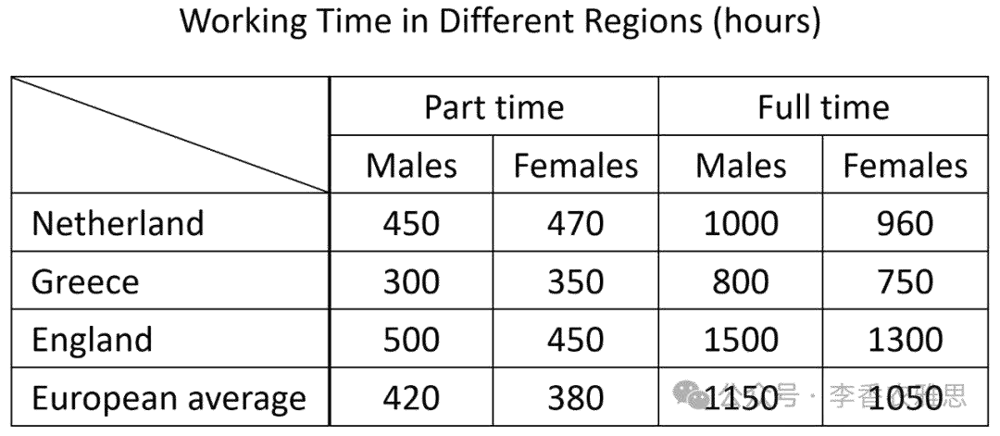

# 2025 年 6 月 28 日雅思写作真题
## Task 1

> **图表类型标注**：表格（各地区男女工作时长）

**The table below shows the working time of males and females in different regions in 2002.**
**Summarise the information by selecting and reporting the main features and make comparisons where relevant.**



The table compares average working hours of male and female employees in part-time and full-time positions in the Netherlands, Greece, and England in 2002, alongside the overall European average. 

As seen, part-time male workers in England worked the most hours, averaging 500 hours annually, followed by those in the Netherlands (450 hours) and Greece (300 hours). It is worth noting that female part-time workers in the Netherlands worked slightly more time (470 hours) than their male counterparts, which was the only case where women outworked men. In contrast, Greek part-time workers accounted for the shortest hours, with men working 300 hours and women 350 hours per year. 

Regarding full-time employment, male workers in England again topped the table, clocking in 1,500 hours per year, significantly higher than the European average of 1,150 hours. Female full-time employees in England also worked substantially more hours (1,300 hours) than the average (1,050 hours). Meanwhile, the Netherlands recorded relatively moderate full-time working hours for both genders (around 980 hours each), while Greece had the shortest working hours: 800 hours for men and 750 hours for women.

Overall, men generally worked more hours than women in full-time positions, and England consistently recorded the longest working hours for both types of employment. Greece, on the other hand, had the lowest figures for both genders and job types.

---

### 精析

#### ① 结构分析（精简）

本题属于 **Table** 类 Task 1，涉及 3 个国家（荷兰、希腊、英格兰）的 2 种就业类型（全职/兼职）在 2 个性别维度上的工作时长数据。

本文采用 **"总-分-总"** 三段式结构：

- **Paragraph 1 — Introduction（开头段）**
  - 改写题目要素：`compares average working hours of male and female employees in part-time and full-time positions`（替换原题 `working time of males and females`）
  - 明确对象：the Netherlands, Greece, and England + 时间 2002 + 欧洲平均值

- **Paragraph 2 — Body Details（主体段：按就业类型分组）**
  - **兼职工作者（Part-time）**：英格兰男性最高（500小时），荷兰女性是唯一超过男性的案例（470 vs 450小时），希腊最低
  - **全职工作者（Full-time）**：英格兰再次最高（男性1500/女性1300小时），荷兰适中（约980小时），希腊最低（男性800/女性750小时）

- **Paragraph 3 — Overview（总结段）**
  - 核心发现1：全职岗位男性普遍工作时长多于女性
  - 核心发现2：英格兰两种就业类型均为最长，希腊均为最低

> **结构亮点**：作者采用"按就业类型分组"策略，将兼职和全职分别讨论，每组内部再按国家排名展开。这种"分类+排序"的双层结构使复杂表格数据条理清晰，避免了按国家逐条罗列的混乱感。

#### ② 数据组织与对比策略（标注有效写法）

| 写法 | 原文示例 | 技巧说明 |
|------|---------|---------|
| **起点+终点+极值** | `part-time male workers in England worked the most hours, averaging 500 hours annually, followed by those in the Netherlands (450 hours) and Greece (300 hours)` | 直接给出最高值并依次降序排列，信息密度高 |
| **同步对比** | `female part-time workers in the Netherlands worked slightly more time (470 hours) than their male counterparts` | 同一国家内跨性别对比，突出唯一例外 |
| **与基准对比** | `significantly higher than the European average of 1,150 hours` | 将具体数据与欧洲均值对比，赋予数据意义 |
| **例外标注** | `which was the only case where women outworked men` | 主动标注数据中的异常情况，体现分析深度 |

> **数据亮点**：作者没有罗列所有12个数据点，而是精选极值（最高/最低）、异常值（荷兰女性超男性）和基准对比（vs欧洲均值），实现了"少而精"的数据呈现。

#### ③ 四项能力维度分析（TA / CC / LR / GRA）

- **TA**：作者采用"按就业类型分组"策略，将兼职和全职分别讨论，每组内部再按国家排名展开。这种"分类+排序"的双层结构使复杂表格数据条理清晰，避免了按国家逐条罗列的混乱感。 作者没有罗列所有12个数据点，而是精选极值（最高/最低）、异常值（荷兰女性超男性）和基准对比（vs欧洲均值），实现了"少而精"的数据呈现。
- **CC**：衔接词使用层次分明——段内用"followed by"进行排序衔接，段间用"Regarding"切换主题，总结用"on the other hand"形成首尾呼应，使全文逻辑链条紧凑。
- **LR**：见模块⑤词汇表，含 `averaging`、`counterparts` 等精准词
- **GRA**：见模块⑤句式亮点

#### ④ 可迁移句型骨架（直接套用）（图表类型：表格（各地区男女工作时长））

**骨架 1 — 开头改写（表格/图通用）**
> The [chart] illustrates changes in ______ in [entities] in [years], along with ______.

**骨架 2 — 极值+对比（Body 通用）**
> ______ had [number], which was considerably higher than the figures for the other [n] [entities].

**骨架 3 — 排名变化/超越（含动态时）**
> ______ saw the second-largest rise and surpassed ______, with its figure growing from ______ to ______.

**骨架 4 — 双维度收尾（Overview 通用）**
> Overall, ______ had by far the largest number..., while ______ recorded the lowest figures on both measures.

#### ⑤ 衔接 / 词汇 / 句式亮点（去水版）

| 衔接类型 | 原文表达 | 功能 |
|---------|---------|------|
| **主题切换** | `Regarding full-time employment` | 从兼职转向全职，标志分组切换 |
| **对比转折** | `In contrast, Greek part-time workers accounted for the shortest hours` | 引出一组中的相反极端 |
| **补充递进** | `Meanwhile, the Netherlands recorded relatively moderate full-time working hours` | 在讨论完极值后补充中间数据 |
| **总结转折** | `Greece, on the other hand, had the lowest figures` | 总结段中再次对比两个极端 |

> **衔接亮点**：衔接词使用层次分明——段内用"followed by"进行排序衔接，段间用"Regarding"切换主题，总结用"on the other hand"形成首尾呼应，使全文逻辑链条紧凑。

| 词汇/短语 | 中文含义 | 词性/用法 | 替代普通表达 |
|-----------|----------|----------|-------------|
| **averaging** | 平均为…… | 现在分词作伴随状语 | working about |
| **counterparts** | 对应的另一方；同类群体 | 名词，对应群体 | the men/the women |
| **clocking in** | （工时）累计达到 | 短语动词，记录（时间） | working/reaching |
| **substantially** | 大幅地；显著地 | 副词，大幅地 | much more |
| **topped the table** | 位居榜首 | 短语，位居榜首 | was the highest |
| **accounted for** | 占（此处指工作时长） | 短语，占据（此处指工作时长） | had |

**1. 伴随状语+排序结构**
> *"part-time male workers in England worked the most hours, **averaging** 500 hours annually, **followed by** those in the Netherlands (450 hours) and Greece (300 hours)"*

**技巧**：用现在分词averaging补充说明数据，再用followed by引出后续排名，一句完成"极值+排序+数据"三重功能，避免了多个简单句的堆砌。

**2. 强调句型标注例外**
> *"It is worth noting that female part-time workers in the Netherlands worked slightly more time (470 hours) than their male counterparts, **which was the only case where** women outworked men"*

**技巧**：先用"It is worth noting that"引导读者关注，再用定语从句"which was the only case where"强调这是唯一例外。这种"引导+强调"的句式使数据分析更具洞察力。

**3. 再次登顶+基准对比**
> *"male workers in England **again topped the table**, **clocking in** 1,500 hours per year, **significantly higher than** the European average of 1,150 hours"*

**技巧**：again topped the table呼应前文，形成结构上的回环；clocking in作伴随状语；significantly higher than引入外部基准。三个层次叠加，一句完成多重比较。

**4. 总结段对比结构**
> *"England consistently recorded the longest working hours... Greece, **on the other hand**, had the lowest figures"*

**技巧**：用"on the other hand"在总结段制造对比张力，consistently强调英格兰的稳定性，both genders and job types概括全面。总结句简洁有力，覆盖全文核心发现。

---

#### ⑥ 可提升空间 + 仿写任务

**可提升空间（通用要点，按篇酌情采纳）：**
- Overview 建议前置或明确独立成段，让阅卷人先抓全局（TA 更稳）。
- 双维度数据（如比率/占比）尽量也收进 Overview，避免只在正文提一次。
- 跨段对比（如 A 反超 B）可集中到一句呈现，衔接更紧凑。

**本文针对性可改进点（按篇分析，点到即止）：**
- `Greek part-time workers accounted for the shortest hours` 搭配不当：`account for` 意为"占（比例）/解释"，不能接时长，应改为 `recorded the fewest hours` 或 `logged the shortest hours`。
- 兼职段漏掉了英格兰女性的数据：全段只给出荷兰女性 470、希腊女性 350，读者无法判断英格兰内部的性别差距，而这正是"英格兰两类就业全线最长"这一结论的关键支撑。
- 希腊男性 300 小时被写了两遍（先在 `followed by ... Greece (300 hours)`，后又在 `with men working 300 hours`），后半句可精简为只保留女性 350 小时。

**仿写任务**：用「极值+对比」骨架写一句：描述『2020 年 X 国指标远高于其他三国』。
## Task 2

> **话题与题型标注**：全球化类 · Two-Part Question

**An increasing number of developing countries are expanding their tourism industry. What are the reasons for this trend? Do you think it is a positive or negative development?**

**越来越多的发展中国家正在扩大其旅游业。造成这一趋势的原因是什么？你认为这是一种积极还是消极的发展？**

In recent years, more developing nations have turned to tourism as a major pillar of their economic development. Several reasons contribute to growing reliance on tourism, and while the expansion of the tourism industry carries certain risks, I believe it is a positive development in general.

近年来，越来越多的发展中国家将旅游业作为经济发展的重要支柱。多个因素促成了对旅游业日益增长的依赖。尽管旅游业的扩张带来了一定的风险，我认为总体上这是一种积极的发展。

As observed, the rise of tourism can be attributed to the desire for job creation and economic diversification. Firstly, the tourism sector is labor-intensive, offering abundant employment opportunities across various skill levels. As tourism grows, the demand for better infrastructure, such as hotels and transportation facilities, leads to governmental and private investment in specific regions. This, in turn, accelerates the development of the tourism industry and creates jobs in hospitality and transportation, which alleviates unemployment. Secondly, the growth of tourism stems from the need to diversify economies that are traditionally dependent on a narrow range of industries. That is, the tourism industry offers an accessible and often low-barrier means of generating income, particularly in countries rich in natural beauty or cultural heritage. For instance, developing Asian nations including the Maldives and Thailand have leveraged their coastal attractions and cultural landmarks to draw millions of visitors annually, thereby reducing their dependency on volatile agricultural and fishery markets.

旅游业兴起的原因主要包括创造就业和实现经济多元化的需求。首先，旅游业是一个劳动密集型行业，能够为不同技能层次的人提供大量就业机会。随着旅游业的发展，对酒店、交通等基础设施的需求也不断增加，进而促使政府和私人资本对特定地区进行投资。这一过程不仅加快了旅游业的发展，也在酒店、交通等领域创造了大量岗位，从而缓解了失业问题。其次，旅游业的发展源于那些长期依赖单一产业的国家对经济多样化的迫切需求。旅游产业通常具有门槛低、进入易等特点，尤其适合自然景观丰富或文化遗产丰富的国家。例如，泰国和马尔代夫等亚洲发展中国家就充分利用了其海岸风光和文化地标，每年吸引数以百万计的游客，从而降低了对不稳定的农业和渔业市场的依赖。

Despite potential environmental disadvantages of tourism expansion, I believe the economic benefits and social development brought about by tourism are more significant due to the above-mentioned reasons. Admittedly, the biodiversity of existing ecosystems is severely threatened by human activities, particularly those arising from irresponsible tourism practices. Specifically, the careless disposal of waste by tourists pollutes wildlife habitats and endangers countless wildlife species. This not only results in the immediate loss of flora and fauna but also disrupts the delicate balance of ecosystems. Nevertheless, with proper regulation, eco-tourism initiatives, and sustainable planning, such risks can be minimized, while substantial benefits for economic and social progress can be reaped. With increased fiscal revenue, the government can fund environmental protection, while overall human welfare is greatly improved through the creation of numerous employment opportunities for people with diverse competencies, which contributes to both poverty reduction and income inequality alleviation.

尽管旅游扩张带来了潜在的环境问题，我依然认为其带来的经济和社会效益更为显著，理由如上所述。诚然，人类活动对生态系统的生物多样性构成了严重威胁，尤其是那些不负责任的旅游行为。比如，游客随意丢弃垃圾会污染野生动物栖息地，危及大量动植物物种的生存。这不仅导致植物和动物的直接损失，还会破坏生态系统的微妙平衡。然而，通过有效的监管、生态旅游项目和可持续规划，可以将这些风险降到最低，同时实现经济和社会发展的显著成果。财政收入的增加使政府有能力投入环境保护，而就业机会的增加又显著提升了人们的生活福祉，有助于减少贫困、缩小收入差距。

In conclusion, the surge in visitor-oriented industries in less industrialized nations stems from efforts to tackle workforce challenges and broaden income sources. Although there are ecological drawbacks, proper tourism management can bring lasting benefits by improving individuals’ employability and driving national economic growth in emerging sectors.

总之，欠发达国家旅游相关产业的迅速增长，源于其缓解就业压力和拓展收入来源的努力。尽管生态方面确实存在一些问题，但合理的旅游管理能够通过提升个人就业能力、推动新兴产业中的国家经济增长，从而带来持久的积极效应。

---

### 精析

#### ① 结构分析（精简）

本题属于 **Two-Part Question** 类题型。此类题型的核心策略是：分别回答两个问题（原因分析 + 立场判断），两段主体各聚焦一个问题。

本文采用 **"分别回答"** 四段式结构：

- **Paragraph 1 — Introduction（开头段）**
  - 改写题目（paraphrase）：`more developing nations have turned to tourism as a major pillar of their economic development`（替换原题 `An increasing number of developing countries are expanding their tourism industry`）
  - 表明立场：`I believe it is a positive development in general`（总体积极，但承认风险）
  - 预告框架：先分析原因，再论证为何是积极发展

- **Paragraph 2 — Body 1（原因分析）**
  - 主题句：`the rise of tourism can be attributed to the desire for job creation and economic diversification`
  - 论点1：旅游业劳动密集型 → 创造就业 → 缓解失业
  - 论点2：经济多元化需求 → 门槛低、易进入 → 降低对单一产业依赖
  - 举例：马尔代夫、泰国利用海岸风光和文化地标吸引游客

- **Paragraph 3 — Body 2（立场论证：为何积极）**
  - 主题句：`the economic benefits and social development brought about by tourism are more significant`
  - 论点1：先让步承认环境问题（生物多样性受威胁、垃圾污染）
  - 论点2：通过监管和可持续规划可最小化风险
  - 论点3：财政收入增加 → 资助环保；就业增加 → 减贫和缩小收入差距

- **Paragraph 4 — Conclusion（结尾段）**
  - 重申立场：`proper tourism management can bring lasting benefits`
  - 总结升华：提升就业能力 + 推动国家经济增长

> **结构亮点**：作者采用"先因后果"的结构，Body 1聚焦原因（创造就业+经济多元化），Body 2聚焦立场（先让步后反驳）。这种"问题分解+分层回应"的策略完美契合Two-Part Question的答题要求，每个主体段都有明确的主题句和支撑细节。

#### ② 论证逻辑链拆解（标注有效写法）

**Body 1（原因分析）的逻辑链条：**

```
发展中国家面临就业压力和产业单一
    ↓ [机制/原因]
→ 旅游业劳动密集型 + 门槛低
    ↓ [具体表现]
├── [分支1] 创造大量就业
│   ↓
│   缓解失业，带动基础设施投资
│
└── [分支2] 经济多元化
    ↓
    减少对农业/渔业等不稳定市场的依赖
    ↓
    马尔代夫、泰国案例验证
```

**Body 2（立场论证）的逻辑链条：**

```
旅游业有环境风险
    ↓ [机制/原因]
├── [分支1] 承认问题存在
│   ↓
│   垃圾污染、生物多样性受威胁
│
└── [分支2] 反驳：风险可控
    ↓
    监管 + 生态旅游 + 可持续规划
    ↓
    [结果] 财政收入增加 → 资助环保
    [结果] 就业增加 → 减贫 + 缩小收入差距
```

> **逻辑亮点**：Body 2采用"先退后进"策略——先充分承认环境问题的严重性（even disrupts the delicate balance of ecosystems），再用"Nevertheless"转折，提出风险可控的解决方案。这种论证方式既显示了思维的全面性，又强化了最终立场的说服力。

#### ③ 四项能力维度分析（TA / CC / LR / GRA）

- **TA**：作者采用"先因后果"的结构，Body 1聚焦原因（创造就业+经济多元化），Body 2聚焦立场（先让步后反驳）。这种"问题分解+分层回应"的策略完美契合Two-Part Question的答题要求，每个主体段都有明确的主题句和支撑细节。 Body 2采用"先退后进"策略——先充分承认环境问题的严重性（even disrupts the delicate balance of ecosystems），再用"Nevertheless"转折，提出风险可控的解决方案。这种论证方式既显示了思维的全面性，又强化了最终立场的说服力。
- **CC**：衔接手段丰富且功能明确——段内用"Firstly/Secondly"并列展开，段间用"Despite... I believe..."实现转折，让步段用"Admittedly... Nevertheless..."形成论证张力。多种衔接手段的灵活搭配使文章逻辑推进自然流畅。
- **LR**：见模块⑤词汇表，含 `a major pillar of`、`attributed to` 等精准词
- **GRA**：见模块⑤句式亮点

#### ④ 可迁移句型骨架（直接套用）（题型：Two-Part）

**骨架 1 — 先退后进亮立场（Intro）**
> Although ______ deserves a central place because ______, I disagree with the view that ______.

**骨架 2 — 分类论证起手（Body）**
> From the perspective of ______, doing X helps ______ and ______. Meanwhile, X also offers ______ that go beyond ______.

**骨架 3 — 抽象→具体例证（Body）**
> For example, a course on ______ may show how ______ have harmed ______, as illustrated by ______.

#### ⑤ 衔接 / 词汇 / 句式亮点（去水版）

| 衔接类型 | 原文表达 | 功能说明 |
|---------|---------|---------|
| **因果衔接** | `the rise of tourism can be attributed to` | 引出原因分析 |
| **列举递进** | `Firstly... Secondly...` | 并列展开两个原因 |
| **例证衔接** | `For instance, developing Asian nations including...` | 用具体案例支撑论点 |
| **让步转折** | `Admittedly... Nevertheless...` | 先承认对方观点，再反驳 |
| **总结衔接** | `In conclusion...` | 收束全文，重申立场 |

> **衔接亮点**：衔接手段丰富且功能明确——段内用"Firstly/Secondly"并列展开，段间用"Despite... I believe..."实现转折，让步段用"Admittedly... Nevertheless..."形成论证张力。多种衔接手段的灵活搭配使文章逻辑推进自然流畅。

| 词汇/短语 | 中文含义 | 词性/用法 | 替代普通表达 |
|-----------|----------|----------|-------------|
| **a major pillar of** | ……的重要支柱 | 名词短语，重要支柱 | an important part of |
| **attributed to** | 归因于 | 短语动词，归因于 | because of |
| **labor-intensive** | 劳动密集型的 | 形容词，劳动密集型的 | needing many workers |
| **alleviates unemployment** | 缓解失业问题 | 动词短语，缓解失业 | reduces unemployment |
| **volatile** | 波动大的；不稳定的 | 形容词，不稳定的 | unstable |
| **leveraged** | 善加利用（自身优势） | 动词，充分利用 | used |
| **fiscal revenue** | 财政收入 | 名词短语，财政收入 | government income |
| **income inequality alleviation** | 收入不平等的缓解 | 名词短语，缩小收入差距 | reducing income gaps |

**1. 多重修饰的名词短语结构**
> *"the **careless disposal of waste by tourists** pollutes wildlife habitats and endangers countless wildlife species"*

**技巧**：用"careless disposal of waste by tourists"这一多层名词短语作主语，将行为主体（tourists）、行为（disposal）、性质（careless）和对象（waste）压缩在一个紧凑结构中，信息密度极高，比"Tourists carelessly dispose of waste, which pollutes..."更学术化。

**2. 结果连锁句式**
> *"As tourism grows, the demand for better infrastructure... leads to governmental and private investment... This, in turn, accelerates... and creates jobs... which alleviates unemployment"*

**技巧**：用"As... leads to... This, in turn... which..."构建因果链，将旅游业增长→基础设施需求→投资→加速发展→创造就业→缓解失业的完整逻辑层层推进。这种链式因果句式是Task 2优质论证的核心技巧。

**3. 让步-转折复合句**
> *"**Admittedly**, the biodiversity of existing ecosystems is severely threatened by human activities... **Nevertheless**, with proper regulation, eco-tourism initiatives, and sustainable planning, such risks can be minimized"*

**技巧**：先用Admittedly承认对方立场（环境问题严重），再用Nevertheless转折提出反驳（风险可控）。这种"先退后进"的句式结构既显示了批判性思维，又增强了自身立场的说服力，是议论文的经典论证句式。

**4. 伴随状语+双重结果**
> *"With increased fiscal revenue, the government can fund environmental protection, while overall human welfare is greatly improved through the creation of numerous employment opportunities... which contributes to both poverty reduction and income inequality alleviation"*

**技巧**：用"With..."引导条件，"while"并列两个积极结果，再用"which"定语从句进一步说明双重效益（减贫+缩小收入差距）。一句涵盖条件、结果和深层影响，论证层次极为丰富。

#### ⑥ 可提升空间 + 仿写任务

**可提升空间（通用要点，按篇酌情采纳）：**
- 结论段避免复读开头，应「推进」而非「重复」立场。
- 让步段衔接词（this perspective 等）回指别太远，可加限定词收紧。
- 同一话题词（如 career / benefit）避免三现，用近义替换。

**本文针对性可改进点（按篇分析，点到即止）：**
- 第三段用 `due to the above-mentioned reasons` 把上一段的"发展原因"直接当作"因此是积极发展"的理由，混淆了本题的两问：解释"为什么发展旅游业"并不等于论证"这样发展是好的"，此处需要独立的价值判断依据。
- 让步只谈环境风险，未回应本文自己埋下的张力：第二段主张旅游业带来"经济多元化"，但过度依赖旅游本身就是一种新的单一依赖（疫情期间马尔代夫、泰国即受重创），补上这一层会让立场更经得起推敲。
- 结论提出 `improving individuals' employability`（提升就业能力），但正文只论证了"创造岗位"，从未涉及技能培训或能力提升，属于结论段冒出未经支撑的新论断。

**仿写任务**：就本题用骨架写一句你的核心论证。
