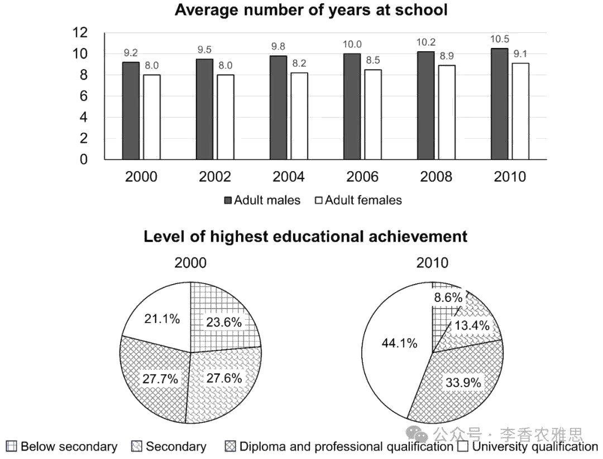

# 2025 年 7 月 5 日雅思写作真题
## Task 1

> **图表类型标注**：组合图（柱状图 + 饼图（受教育年限 + 最高学历））

**The bar chart below gives information about the average number of years at school of adult males and females in Singapore, and the pie charts show the level of the highest educational achievement.**
**Summarise the information by selecting and reporting the main features, and make comparisons where relevant.**



The bar chart illustrates changes in the average years of schooling of adult males and females in Singapore from 2000 to 2010, while the pie charts compare the distribution of the highest educational qualifications attained. 

As shown, over the decade, both men and women in Singapore experienced increases in average years of schooling, although the gender gap widened slightly from 1.2 to 1.4 years, with males consistently receiving more education. Specifically, the average schooling for males rose from 9.2 years in 2000 to 10.5 years in 2010, rising by about 0.2 to 0.3 years annually. In contrast, females had a slightly shorter duration of schooling at 8 years, which remained unchanged until 2002 but eventually climbed to 9.1 years in 2010. 

Regarding educational attainment, the proportion of adults with advanced qualifications rose markedly: the share of university degree holders more than doubled, from 21.1% to 44.1%, making them the largest group by 2010. Meanwhile, initially, 27.7% of adults (the highest percentage at the time) held diplomas or professional qualifications, and that figure rose modestly to 33.9%. Conversely, the percentage of adults with only secondary education was halved from 27.6% to 13.4%, while those with below-secondary education dropped to about one-third of their 2000 level and became the smallest segment.

Overall, Singaporean males had more years of schooling than females, and there was a dramatic upturn in the proportion of individuals achieving university qualifications, accompanied by a sharp decline in those with only below-secondary education.

---

### 精析

#### ① 结构分析（精简）

本题属于 **Mixed Chart（Bar Chart + Pie Chart）** 类 Task 1，涉及新加坡成年人受教育年限的性别差异（柱状图）以及最高学历分布的变化（饼图）。

本文采用 **"分述-综合"** 三段式结构：

- **Paragraph 1 — Introduction（开头段）**
  - 改写题目要素：`The bar chart illustrates changes in the average years of schooling... while the pie charts compare the distribution of the highest educational qualifications attained`（替换原题 `gives information about... and show the level of`）
  - 明确对象：adult males and females in Singapore + 时间 2000-2010

- **Paragraph 2 — Body Details（主体段：分述两图）**
  - **柱状图（受教育年限）**：男女均上升，但性别差距从1.2年微增至1.4年；男性从9.2年增至10.5年；女性从8年（停滞至2002年）增至9.1年
  - **饼图（学历分布）**：大学学位持有者翻倍（21.1%→44.1%，成为最大群体）；文凭/专业资格适度增长（27.7%→33.9%）；中学及以下教育比例大幅下降

- **Paragraph 3 — Overview（总结段）**
  - 核心发现1：男性受教育年限始终多于女性
  - 核心发现2：大学学历比例剧增，低学历比例锐减

> **结构亮点**：作者采用"一图一段"的分述策略，先处理柱状图的趋势变化，再转向饼图的比例变迁。这种"分而述之"的方式避免了混合图表常见的信息混杂问题，使读者能清晰跟随作者的思路逐一消化两组数据。

#### ② 数据组织与对比策略（标注有效写法）

| 写法 | 原文示例 | 技巧说明 |
|------|---------|---------|
| **趋势+差距同步描述** | `both men and women... experienced increases... although the gender gap widened slightly from 1.2 to 1.4 years` | 同时呈现整体趋势和局部差异，信息效率高 |
| **倍数关系** | `the share of university degree holders more than doubled, from 21.1% to 44.1%` | 用"more than doubled"突出剧变，比单纯说"increased"更有冲击力 |
| **排名变化** | `making them the largest group by 2010` | 不仅说比例增加，还强调排名跃升（从非最大到最大） |
| **分数/比例表达** | `dropped to about one-third of their 2000 level` | 用分数替代百分比，丰富数据表达手段 |
| **减半表达** | `was halved from 27.6% to 13.4%` | 用被动语态"was halved"简洁表达减半 |

> **数据亮点**：作者在饼图描述中运用了丰富的数学表达——"more than doubled"（翻倍）、"was halved"（减半）、"one-third of"（三分之一），避免了重复使用"increased/decreased"的单调感，展现了高超的数据描述能力。

#### ③ 四项能力维度分析（TA / CC / LR / GRA）

- **TA**：作者采用"一图一段"的分述策略，先处理柱状图的趋势变化，再转向饼图的比例变迁。这种"分而述之"的方式避免了混合图表常见的信息混杂问题，使读者能清晰跟随作者的思路逐一消化两组数据。 作者在饼图描述中运用了丰富的数学表达——"more than doubled"（翻倍）、"was halved"（减半）、"one-third of"（三分之一），避免了重复使用"increased/decreased"的单调感，展现了高超的数据描述能力。
- **CC**：衔接词精准对应数据关系——"In contrast"用于性别对比，"Conversely"用于趋势反转，"Meanwhile"用于并列信息。每个衔接词的选择都与其所连接的数据逻辑高度匹配。
- **LR**：见模块⑤词汇表，含 `illustrates changes in`、`widened slightly` 等精准词
- **GRA**：见模块⑤句式亮点

#### ④ 可迁移句型骨架（直接套用）（图表类型：组合图（柱状图 + 饼图（受教育年限 + 最高学历）））

**骨架 1 — 开头改写（表格/图通用）**
> The [chart] illustrates changes in ______ in [entities] in [years], along with ______.

**骨架 2 — 极值+对比（Body 通用）**
> ______ had [number], which was considerably higher than the figures for the other [n] [entities].

**骨架 3 — 排名变化/超越（含动态时）**
> ______ saw the second-largest rise and surpassed ______, with its figure growing from ______ to ______.

**骨架 4 — 双维度收尾（Overview 通用）**
> Overall, ______ had by far the largest number..., while ______ recorded the lowest figures on both measures.

#### ⑤ 衔接 / 词汇 / 句式亮点（去水版）

| 衔接类型 | 原文表达 | 功能 |
|---------|---------|------|
| **主题切换** | `Regarding educational attainment` | 从柱状图转向饼图，标志数据来源切换 |
| **对比转折** | `In contrast, females had a slightly shorter duration` | 引出性别对比中的另一方 |
| **反向对比** | `Conversely, the percentage of adults with only secondary education was halved` | 引出一组中相反的趋势 |
| **伴随关系** | `accompanied by a sharp decline in those with only below-secondary education` | 用"accompanied by"连接两个同步变化 |

> **衔接亮点**：衔接词精准对应数据关系——"In contrast"用于性别对比，"Conversely"用于趋势反转，"Meanwhile"用于并列信息。每个衔接词的选择都与其所连接的数据逻辑高度匹配。

| 词汇/短语 | 中文含义 | 词性/用法 | 替代普通表达 |
|-----------|----------|----------|-------------|
| **illustrates changes in** | 展示……方面的变化 | 动词短语，展示...的变化 | shows |
| **widened slightly** | 略微拉大（差距） | 动词短语，略微扩大 | became bigger |
| **climbed to** | 攀升至 | 动词，攀升至 | went up to |
| **rose markedly** | 明显上升 | 动词短语，显著上升 | increased a lot |
| **more than doubled** | 增长了一倍以上 | 动词短语，翻倍以上 | increased by over 100% |
| **was halved** | 减少了一半 | 被动语态，减半 | decreased by 50% |
| **dramatic upturn** | 急剧的上扬 | 名词短语，剧增 | big increase |
| **accompanied by** | 伴随着…… | 短语，伴随 | with |

**1. 让步状语从句+伴随信息**
> *"both men and women in Singapore experienced increases in average years of schooling, **although the gender gap widened slightly from 1.2 to 1.4 years**, with males consistently receiving more education"*

**技巧**：用although引导让步从句，在承认整体上升趋势的同时指出性别差距扩大的细节；再用with独立主格补充说明男性的持续优势。一句涵盖三层信息（整体趋势、局部差异、持续状态），句式紧凑而信息丰富。

**2. 数据变化+结果状语**
> *"the share of university degree holders **more than doubled**, from 21.1% to 44.1%, **making them the largest group by 2010**"*

**技巧**：用现在分词making引出数据变化的结果（成为最大群体），将"变化+结果"压缩在一个句子中。这种"数据+影响"的句式比单纯罗列数字更具分析深度。

**3. 对比并列结构**
> *"the percentage of adults with only secondary education **was halved** from 27.6% to 13.4%, **while** those with below-secondary education **dropped to about one-third of** their 2000 level"*

**技巧**：用while连接两个同步下降的数据组，was halved和dropped to about one-third of形成表达上的对仗，避免了重复"decreased"的单调。两个不同的下降表达方式展现了词汇多样性。

**4. 总结段综合对比**
> *"there was a **dramatic upturn** in the proportion of individuals achieving university qualifications, **accompanied by** a sharp decline in those with only below-secondary education"*

**技巧**：用"there was"存在句引出核心趋势，再用"accompanied by"连接相反趋势，形成"上升+下降"的对比框架。dramatic upturn与sharp decline在语义和结构上形成工整对仗，总结句既全面又有力。

---

#### ⑥ 可提升空间 + 仿写任务

**可提升空间（通用要点，按篇酌情采纳）：**
- Overview 建议前置或明确独立成段，让阅卷人先抓全局（TA 更稳）。
- 双维度数据（如比率/占比）尽量也收进 Overview，避免只在正文提一次。
- 跨段对比（如 A 反超 B）可集中到一句呈现，衔接更紧凑。

**本文针对性可改进点（按篇分析，点到即止）：**
- `rising by about 0.2 to 0.3 years annually` 与本文自己给的数据对不上：9.2→10.5 十年共增 1.3 年，年均约 0.13 年。建议删掉这个年均值，或改为 `by roughly 0.13 years a year`。
- `females had a slightly shorter duration of schooling at 8 years` 中的 `slightly` 与同句"gap widened from 1.2 to 1.4 years"自相矛盾——1.2 年并非"轻微"差距，改为 `noticeably shorter` 前后才一致。
- `Meanwhile, initially, 27.7% of adults...` 连用两个副词起句，读感生硬；可重写为 `Diplomas or professional qualifications, the largest category in 2000 at 27.7%, rose modestly to 33.9%.`

**仿写任务**：用「极值+对比」骨架写一句：描述『2020 年 X 国指标远高于其他三国』。
## Task 2

> **话题与题型标注**：科技类 · Discuss Both Views

**Some people think that technology is generally beneficial, while others think it has more disadvantages. Discuss both views and give your own opinion.**

**一些人认为科技总体上是有益的，而另一些人则认为它弊大于利。讨论双方观点，并给出你的观点。**

Technology has become an integral part of human life, and some argue that technological advancements are largely advantageous, while others believe they bring more harm than good. In my opinion, technology presents both positive impacts when applied responsibly and certain challenges if misused. With proper oversight and thoughtful implementation, the benefits of technology can be maximized while mitigating its disadvantages.

科技已成为人类生活中不可或缺的一部分，一些人主张技术进步带来了诸多优势，而另一些人则认为其弊端更多。在我看来，科技在被合理应用时确实带来积极影响，但若被滥用，也会引发一些问题。只要加以适当监管和深思熟虑地实施，其益处是可以最大化的，同时也能减轻其负面影响。

It is generally believed that technological achievements improve the quality of life and enhance efficiency. This is because advanced technologies have facilitated closer and more intimate connections among people, while also making emotional support more readily accessible. As young people increasingly study abroad to pursue advanced degrees or live independently, information and communication technology reinforces human connections by making long-distance communication easier, especially during moments of loneliness, thereby improving people's quality of life by strengthening family bonds. In addition to more connected family relationships, scientific and technological breakthroughs in frontier areas have facilitated productivity improvements and enabled people to handle tedious tasks and multitask simultaneously. For example, software programs powered by artificial intelligence, such as ChatGPT, can find and evaluate information for complex tasks in seconds. These innovations enable people to be more efficient and productive in facing the growing pressures in work and in life.

普遍认为，科技成就提升了人们的生活质量，并提高了工作效率。这是因为先进技术不仅促进了人们之间更亲密的联系，还让情感支持变得更为便捷。随着越来越多年轻人出国留学、攻读高等学位或开始独立生活，信息与通信技术使得远程交流变得更为容易，尤其是在感到孤独的时刻，从而通过加强家庭纽带来提升人们的生活质量。除了更加紧密的家庭关系，在科学与技术前沿的突破也推动了生产力的提升，使人们能够处理繁琐任务并同时应对多项事务。例如，像 ChatGPT 这样的人工智能驱动的软件程序，可以在数秒内查找和评估用于复杂任务的信息。这些创新帮助人们在日益增长的工作和生活压力下更加高效和富有成效。

On the other hand, critics highlight the negative consequences of overreliance on technology. One major concern is the erosion of interpersonal relationships due to excessive screen time and virtual interactions. With the widespread use of smartphones and video calls, people engage less in direct, personal conversations. Unlike in-person communication, digital interactions lack nonverbal cues such as facial expressions and body language. Over time, this can lead to a lack of genuine emotional connection and social isolation, despite the promise of global connectivity. Even worse, the rise of automation has triggered widespread job displacement, particularly in manufacturing and low-skilled sectors. Meanwhile, due to shortages of decent job opportunities in underdeveloped nations, excessive competition for career advancement aggravates involution among the younger generation, especially in Northeast Asian countries, causing them to work overtime, which sacrifices their relaxation time and long-term well-being.

另一方面，批评者指出对科技的过度依赖会带来负面后果。其中一个主要问题是人际关系的削弱，这主要源于人们花过多时间使用电子屏幕以及沉迷于虚拟互动。随着智能手机和视频通话的普及，人们越来越少参与面对面的私人交流。与面对面沟通不同，数字互动缺乏面部表情、肢体语言等非语言线索。长期以来，这可能导致缺乏真正的情感联系，进而造成社交孤立，尽管全球互联的便利性似乎触手可及。更严重的是，自动化的兴起引发了大规模的就业流失，尤其是在制造业和低技能行业。与此同时，在欠发达国家，由于体面就业机会的短缺，过度的职业晋升竞争加剧了年轻一代的“内卷”现象，尤其是在东北亚国家。他们被迫加班，牺牲了休息时间，进而影响了长期身心健康。

In conclusion, technology not only undeniably enhances daily life through convenient communication and boosted productivity but also poses challenges such as social isolation and job displacement. Striking a balance between innovation and responsible use is essential to ensure that technological progress serves the well-being of individuals and society.

总之，科技无疑通过便捷的沟通方式和提升的生产力改善了人们的日常生活，但同时也带来了诸如社交孤立和失业等问题。因此，在推动技术进步的同时实现创新与负责任使用之间的平衡，是确保科技服务于个人与社会福祉的关键。

---

### 精析

#### ① 结构分析（精简）

本题属于 **Discuss Both Views** 类题型。此类题型的核心策略是：双方观点各一段分析，最后给出自己的综合立场。

本文采用 **"平衡-立场"** 四段式结构：

- **Paragraph 1 — Introduction（开头段）**
  - 改写题目（paraphrase）：`Technology has become an integral part of human life, and some argue that technological advancements are largely advantageous, while others believe they bring more harm than good`（替换原题 `Some people think that technology is generally beneficial, while others think it has more disadvantages`）
  - 表明立场：`technology presents both positive impacts when applied responsibly and certain challenges if misused`（平衡立场，强调合理使用）
  - 预告框架：先讨论科技益处，再讨论弊端，最后提出平衡使用的观点

- **Paragraph 2 — Body 1（科技有益论）**
  - 主题句：`technological achievements improve the quality of life and enhance efficiency`
  - 论点1：ICT技术促进远程交流 → 加强家庭纽带 → 提升生活质量
  - 论点2：前沿科技突破提升生产力 → 处理繁琐任务 → 多任务并行
  - 举例：ChatGPT等AI软件快速处理复杂任务

- **Paragraph 3 — Body 2（科技有害论）**
  - 主题句：`critics highlight the negative consequences of overreliance on technology`
  - 论点1：过度屏幕时间 → 缺乏非语言线索 → 情感疏离和社交孤立
  - 论点2：自动化引发失业 → 欠发达国家竞争加剧 → 加班文化损害身心健康

- **Paragraph 4 — Conclusion（结尾段）**
  - 重申立场：`technology not only undeniably enhances daily life... but also poses challenges`
  - 总结升华：Striking a balance between innovation and responsible use

> **结构亮点**：作者采用经典的"双方各一段+平衡结论"结构。Body 1从"生活质量"和"效率"两个维度论证益处，Body 2从"人际关系"和"就业"两个维度论证弊端。双方论证对称均衡，为结尾的平衡立场提供了充分铺垫。

#### ② 论证逻辑链拆解（标注有效写法）

**Body 1（科技有益论）的逻辑链条：**

```
科技成就
    ↓ [机制/原因]
├── [分支1] 改善生活质量
│   ↓
│   ICT促进远程交流（尤其留学生/独居者）
│   ↓
│   缓解孤独 → 加强家庭纽带
│
└── [分支2] 提升效率
    ↓
    前沿科技突破 → 生产力提升
    ↓
    处理繁琐任务 + 多任务并行
    ↓
    ChatGPT案例验证
```

**Body 2（科技有害论）的逻辑链条：**

```
过度依赖科技
    ↓ [机制/原因]
├── [分支1] 人际关系侵蚀
│   ↓
│   过度屏幕时间 + 虚拟互动
│   ↓
│   缺乏非语言线索（表情/肢体语言）
│   ↓
│   情感疏离 + 社交孤立
│
└── [分支2] 就业冲击
    ↓
    自动化引发失业（制造业/低技能行业）
    ↓
    欠发达国家就业短缺 → 竞争加剧
    ↓
    内卷/加班 → 牺牲休息和长期健康
```

> **逻辑亮点**：双方论证均采用"链式因果"结构——每个论点都包含"现象→机制→结果"的完整推导。Body 1用ChatGPT作具体例证，Body 2用"Northeast Asian countries"作地域例证，使抽象论述具象化，增强了说服力。

#### ③ 四项能力维度分析（TA / CC / LR / GRA）

- **TA**：作者采用经典的"双方各一段+平衡结论"结构。Body 1从"生活质量"和"效率"两个维度论证益处，Body 2从"人际关系"和"就业"两个维度论证弊端。双方论证对称均衡，为结尾的平衡立场提供了充分铺垫。 双方论证均采用"链式因果"结构——每个论点都包含"现象→机制→结果"的完整推导。Body 1用ChatGPT作具体例证，Body 2用"Northeast Asian countries"作地域例证，使抽象论述具象化，增强了说服力。
- **CC**：衔接手段功能分明——"It is generally believed that"和"On the other hand"清晰划分双方立场，"In addition to"和"Even worse"分别在各自立场内部推进论证深度。这种"外部切换+内部深化"的衔接策略使文章结构清晰、层次分明。
- **LR**：见模块⑤词汇表，含 `an integral part of`、`largely advantageous` 等精准词
- **GRA**：见模块⑤句式亮点

#### ④ 可迁移句型骨架（直接套用）（题型：Discuss）

**骨架 1 — 先退后进亮立场（Intro）**
> Although ______ deserves a central place because ______, I disagree with the view that ______.

**骨架 2 — 分类论证起手（Body）**
> From the perspective of ______, doing X helps ______ and ______. Meanwhile, X also offers ______ that go beyond ______.

**骨架 3 — 抽象→具体例证（Body）**
> For example, a course on ______ may show how ______ have harmed ______, as illustrated by ______.

#### ⑤ 衔接 / 词汇 / 句式亮点（去水版）

| 衔接类型 | 原文表达 | 功能说明 |
|---------|---------|---------|
| **观点引入** | `It is generally believed that...` | 引出正方观点，语气客观 |
| **因果衔接** | `This is because...` | 解释前文观点的原因 |
| **递进补充** | `In addition to...` | 在同一方观点内添加新论点 |
| **转折对比** | `On the other hand...` | 从正方转向反方 |
| **程度递进** | `Even worse...` | 在反方论证中升级问题的严重性 |
| **总结衔接** | `In conclusion...` | 收束全文，提出平衡观点 |

> **衔接亮点**：衔接手段功能分明——"It is generally believed that"和"On the other hand"清晰划分双方立场，"In addition to"和"Even worse"分别在各自立场内部推进论证深度。这种"外部切换+内部深化"的衔接策略使文章结构清晰、层次分明。

| 词汇/短语 | 中文含义 | 词性/用法 | 替代普通表达 |
|-----------|----------|----------|-------------|
| **an integral part of** | ……不可或缺的组成部分 | 名词短语，不可或缺的一部分 | an important part of |
| **largely advantageous** | 总体上是有利的 | 形容词短语，大体上有利的 | mostly good |
| **facilitated** | 促成；使……更便利 | 动词，促进 | helped |
| **readily accessible** | 唾手可得的；易于获取的 | 形容词短语，易于获取的 | easy to get |
| **reinforces human connections** | 强化人与人之间的联系 | 动词短语，加强人际联系 | makes people closer |
| **tedious tasks** | 枯燥繁琐的事务 | 名词短语，繁琐任务 | boring tasks |
| **overreliance** | 过度依赖 | 名词，过度依赖 | using too much |
| **erosion** | 侵蚀；逐渐削弱 | 名词，侵蚀 | weakening |
| **job displacement** | 岗位被取代；就业流失 | 名词短语，就业流失 | job loss |
| **aggravates involution** | 加剧内卷式竞争 | 动词短语，加剧内卷 | makes competition worse |

**1. 因果链式长句**
> *"information and communication technology **reinforces human connections** by making long-distance communication easier, especially during moments of loneliness, **thereby** improving people's quality of life by strengthening family bonds"*

**技巧**：用"by making... thereby improving... by strengthening..."构建三层因果链——技术→便利交流→提升生活质量→加强家庭纽带。thereby作为关键衔接词，将前因后果紧密串联，句式流畅且逻辑严密。

**2. 对比状语从句**
> *"**Unlike** in-person communication, digital interactions **lack** nonverbal cues such as facial expressions and body language"*

**技巧**：用Unlike引导对比状语，将面对面交流与数字互动并置，突出后者的缺陷。这种"A unlike B"的对比句式简洁有力，比"Digital interactions are different from in-person communication because..."更直接、更学术。

**3. 让步状语+主句**
> *"**despite the promise of global connectivity**, this can lead to a lack of genuine emotional connection and social isolation"*

**技巧**：用despite引导让步状语，先承认科技承诺的全球互联优势，再转折指出实际结果（情感疏离）。这种"承诺vs现实"的反差强化了批判力度，是议论文中常用的修辞策略。

**4. 多重结果连锁句**
> *"excessive competition for career advancement aggravates involution among the younger generation, especially in Northeast Asian countries, **causing** them to work overtime, **which sacrifices** their relaxation time and long-term well-being"*

**技巧**：用causing引出直接结果，再用which定语从句引出深层影响，形成"竞争加剧→内卷→加班→牺牲健康"的因果链。especially in Northeast Asian countries作为插入语，为抽象论述提供了具体地域锚点。

#### ⑥ 可提升空间 + 仿写任务

**可提升空间（通用要点，按篇酌情采纳）：**
- 结论段避免复读开头，应「推进」而非「重复」立场。
- 让步段衔接词（this perspective 等）回指别太远，可加限定词收紧。
- 同一话题词（如 career / benefit）避免三现，用近义替换。

**本文针对性可改进点（按篇分析，点到即止）：**
- `aggravates involution` 是中式英语：`involution` 在英语里意为"退化、卷曲"，并无"内卷"义（且它还被⑤词汇表列为亮点，需留意）；建议改为 `intensifies zero-sum competition` 或 `fuels rat-race competition`。
- 第三段第二个论点从"自动化导致失业"跳到"欠发达国家竞争激烈、被迫加班"，后者主要源于就业市场与文化因素，归到"科技的弊端"名下因果链偏离，削弱了该段的针对性。
- 立场偏中庸：`beneficial when applied responsibly, harmful if misused` 几乎适用于任何事物，全文也没有表态哪一方更有分量。Discuss both views 仍需一个可辨识的倾向，建议在结论前明确"总体利大于弊，前提是……"。

**仿写任务**：就本题用骨架写一句你的核心论证。
