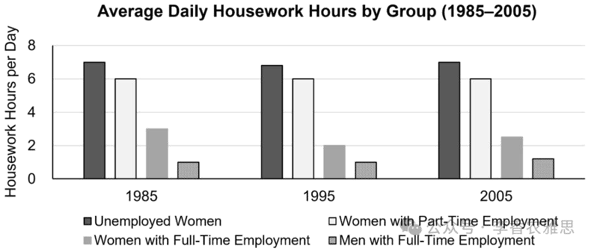

# 2025 年 7 月 19 日雅思写作真题
## Task 1

> **图表类型标注**：柱状图（四群体每日家务时长）

**The chart below shows the average daily hours spent on housework by four different groups of people in 1985, 1995, and 2005.**
**Summarise the information by selecting and reporting the main features, and make comparisons where relevant.**



The bar chart shows changes in the average daily housework hours of unemployed women, part-time employed women, full-time employed women, and full-time employed men from 1985 to 2005. 

As shown, unemployed women and full-time employed women exhibited similar trends in housework, with both groups seeing a slight decline in the time they spent on chores during the first decade, followed by a modest rebound. Specifically, in 1985, unemployed women recorded the highest figure, spending 7 hours per day on housework, whereas full-time employed women averaged roughly 3 hours daily. By 1995, their respective hours had dropped slightly to around 6.8 and 2 hours. Over the next ten years, non-working women’s housework hours returned to their original level (7 hours), while those of full-time employed women edged up to approximately 2.5 hours.

In contrast, full-time working men and part-time employed women showed either stability or minor increases in the number of hours they put in for housekeeping. That is, a consistent one-hour average was maintained by men until 1995 before witnessing a slight rise to 1.2 hours in 2005, remaining the lowest, while women with part-time jobs consistently performed about six hours of housework per day (the second-highest) throughout the entire period.

Overall, unemployed women remained the group dedicating the most time to housework, whereas full-time employed men consistently contributed the least, despite a slight increase in their involvement in 2005.

---

### 精析

#### ① 结构分析（精简）

本题属于 **Bar Chart** 类 Task 1，涉及 4 个群体（无业女性、兼职女性、全职女性、全职男性）在 3 个时间点（1985、1995、2005）的家务时长数据。

本文采用 **"总-分-总"** 三段式结构：

- **Paragraph 1 — Introduction（开头段）**
  - 改写题目要素：`shows changes in the average daily housework hours of unemployed women, part-time employed women, full-time employed women, and full-time employed men`（替换原题 `shows the average daily hours spent on housework by four different groups`）
  - 明确对象：四个群体 + 时间 1985-2005

- **Paragraph 2 — Body Details（主体段：按趋势分组）**
  - **下降趋势组（Decline + Rebound）**：无业女性和全职女性呈现相似模式——前十年轻微下降，随后 modest rebound
    - 无业女性：1985年最高（7小时）→ 1995年略降至约6.8小时 → 2005年恢复至7小时
    - 全职女性：1985年约3小时 → 1995年降至2小时 → 2005年微升至约2.5小时
  - **稳定/上升组（Stability/Minor Increase）**：全职男性和兼职女性
    - 全职男性：维持1小时 → 2005年微升至1.2小时（始终最低）
    - 兼职女性：始终约6小时（第二高）

- **Paragraph 3 — Overview（总结段）**
  - 核心发现1：无业女性始终是家务时间最多的群体
  - 核心发现2：全职男性始终贡献最少，尽管2005年略有增加

> **结构亮点**：作者采用"按趋势相似性分组"策略，将四组数据分为"下降后反弹"和"稳定/微升"两组。这种分组方式避免了按群体逐一描述的冗长，使对比更加鲜明，是处理多组数据图表的高效策略。

#### ② 数据组织与对比策略（标注有效写法）

| 写法 | 原文示例 | 技巧说明 |
|------|---------|---------|
| **趋势概括+细节支撑** | `unemployed women and full-time employed women exhibited similar trends... with both groups seeing a slight decline... followed by a modest rebound` | 先概括趋势模式，再用具体数据支撑，层次分明 |
| **同步对比** | `unemployed women recorded the highest figure... whereas full-time employed women averaged roughly 3 hours daily` | 用whereas并置最高和最低，形成鲜明对比 |
| **时间推移描述** | `By 1995... Over the next ten years...` | 按时间顺序推进，清晰呈现变化过程 |
| **极值标注** | `remaining the lowest` / `the second-highest` | 在描述中随时标注排名，帮助读者定位 |
| **精确数据+模糊数据搭配** | `spending 7 hours per day` vs `averaged roughly 3 hours` | 精确数据与模糊表达（roughly, around, approximately）交替使用，避免单调 |

> **数据亮点**：作者对数据的处理极具层次感——先以"similar trends"概括两组共性，再以"In contrast"引出另一组差异，最后通过"highest/lowest/second-highest"等排名词帮助读者快速建立数据地图。

#### ③ 四项能力维度分析（TA / CC / LR / GRA）

- **TA**：作者采用"按趋势相似性分组"策略，将四组数据分为"下降后反弹"和"稳定/微升"两组。这种分组方式避免了按群体逐一描述的冗长，使对比更加鲜明，是处理多组数据图表的高效策略。 作者对数据的处理极具层次感——先以"similar trends"概括两组共性，再以"In contrast"引出另一组差异，最后通过"highest/lowest/second-highest"等排名词帮助读者快速建立数据地图。
- **CC**：衔接手段简洁高效——"That is"用于对抽象描述的具体化，"before witnessing"将时间和变化融合在一个表达中，"despite"在总结段制造让步张力。每个衔接词都精准服务于数据叙述的逻辑需要。
- **LR**：见模块⑤词汇表，含 `exhibited similar trends`、`modest rebound` 等精准词
- **GRA**：见模块⑤句式亮点

#### ④ 可迁移句型骨架（直接套用）（图表类型：柱状图（四群体每日家务时长））

**骨架 1 — 开头改写（表格/图通用）**
> The [chart] illustrates changes in ______ in [entities] in [years], along with ______.

**骨架 2 — 极值+对比（Body 通用）**
> ______ had [number], which was considerably higher than the figures for the other [n] [entities].

**骨架 3 — 排名变化/超越（含动态时）**
> ______ saw the second-largest rise and surpassed ______, with its figure growing from ______ to ______.

**骨架 4 — 双维度收尾（Overview 通用）**
> Overall, ______ had by far the largest number..., while ______ recorded the lowest figures on both measures.

#### ⑤ 衔接 / 词汇 / 句式亮点（去水版）

| 衔接类型 | 原文表达 | 功能 |
|---------|---------|------|
| **概括-具体衔接** | `As shown... Specifically...` | 从总体趋势过渡到具体数据 |
| **对比转折** | `In contrast...` | 引出趋势相反的另一组 |
| **解释说明** | `That is...` | 对前文的进一步解释 |
| **时间推进** | `until 1995 before witnessing...` | 描述时间序列中的转折点 |
| **让步对比** | `despite a slight increase...` | 承认变化但强调总体趋势不变 |

> **衔接亮点**：衔接手段简洁高效——"That is"用于对抽象描述的具体化，"before witnessing"将时间和变化融合在一个表达中，"despite"在总结段制造让步张力。每个衔接词都精准服务于数据叙述的逻辑需要。

| 词汇/短语 | 中文含义 | 词性/用法 | 替代普通表达 |
|-----------|----------|----------|-------------|
| **exhibited similar trends** | 呈现出相似的走势 | 动词短语，呈现相似趋势 | had similar changes |
| **modest rebound** | 小幅回升 | 名词短语，适度反弹 | small increase again |
| **recorded the highest figure** | 录得最高数值 | 动词短语，记录最高数值 | had the highest number |
| **respective hours** | 各自的时长 | 名词短语，各自的小时数 | their hours |
| **edged up** | 小幅走高 | 动词短语，微升 | went up slightly |
| **witnessing a slight rise** | 出现小幅上升 | 动词短语，见证轻微上升 | increasing slightly |
| **dedicating the most time to** | 在……上投入最多时间 | 动词短语，投入最多时间 | spending the most time on |
| **contributed the least** | 付出（投入）最少 | 动词短语，贡献最少 | did the least |

**1. 伴随状语+趋势描述**
> *"unemployed women and full-time employed women exhibited similar trends in housework, **with both groups seeing** a slight decline in the time they spent on chores during the first decade, **followed by** a modest rebound"*

**技巧**：用"with + 名词 + seeing"独立主格结构描述伴随趋势，再用"followed by"引出后续变化。一句涵盖"趋势判断+阶段1+阶段2"，信息密度极高。

**2. 数据并置对比**
> *"unemployed women recorded the highest figure, **spending 7 hours per day** on housework, **whereas** full-time employed women **averaged roughly 3 hours daily**"*

**技巧**：用现在分词spending补充说明最高值的具体数据，再用whereas引出对比组的数据。"spending... whereas... averaged..."结构使对比紧凑而清晰。

**3. 被动+时间序列**
> *"a consistent one-hour average **was maintained by** men until 1995 **before witnessing** a slight rise to 1.2 hours in 2005, **remaining** the lowest"*

**技巧**：用被动语态"was maintained"强调状态的持续性，"before witnessing"将时间转折与变化描述融为一体，"remaining"作结果状语标注排名。一句完成"状态→转折→结果"的完整叙述。

**4. 总结段让步结构**
> *"full-time employed men consistently contributed the least, **despite a slight increase in their involvement in 2005**"*

**技巧**：用despite引导让步状语，承认2005年有轻微增长，但强调"consistently contributed the least"的总体趋势不变。这种"让步+坚持"的句式使总结更加严谨，避免了绝对化的表述。

---

#### ⑥ 可提升空间 + 仿写任务

**可提升空间（通用要点，按篇酌情采纳）：**
- Overview 建议前置或明确独立成段，让阅卷人先抓全局（TA 更稳）。
- 双维度数据（如比率/占比）尽量也收进 Overview，避免只在正文提一次。
- 跨段对比（如 A 反超 B）可集中到一句呈现，衔接更紧凑。

**本文针对性可改进点（按篇分析，点到即止）：**
- Overview 只点了最高（无业女性）与最低（全职男性）两端，漏掉本图最有价值的整体特征：同为全职就业，女性的家务时长（约 2.5 小时）仍是男性（1.2 小时）的两倍左右。补上这一句能明显提升 TA。
- `a consistent one-hour average was maintained by men... before witnessing a slight rise` 中 `witnessing` 的逻辑主语成了 `average`（数值在"见证"上升），搭配不当；改为主动语态 `men maintained a consistent one-hour average until 1995 before edging up to 1.2 hours` 更顺。
- 把无业女性（7→6.8，几近持平）与全职女性（3→2，降约三分之一）一并称作 `similar trends... a slight decline`，两者降幅量级相差悬殊，`slight` 只适用于前者，建议分开表述。

**仿写任务**：用「极值+对比」骨架写一句：描述『2020 年 X 国指标远高于其他三国』。
## Task 2

> **话题与题型标注**：环境类 · Agree/Disagree

**Some people think that improving people's standard of living is more important than protecting wild animal and birds. To what extent do you agree or disagree?**

**有人认为提升人民生活水平比保护野生动物和鸟类更为重要。你在多大程度上同意或反对这一观点？**

Some people believe that enhancing human living standards should take precedence over the protection of wild animals and birds. While improving the quality of human life is a fundamental social goal, I disagree with the view that wildlife conservation is less important than human welfare.

有人认为，提高人类生活水平应当优先于保护野生动物和鸟类。尽管改善人类生活质量是一项基本的社会目标，但我不同意野生动物保护不如人类福祉重要的观点。

Admittedly, improving people's standard of living is a fundamental aspect of social development. Across the globe, many individuals remain illiterate, a condition that imposes considerable hardships on their daily lives. Without basic literacy skills, they face severe limitations in securing suitable employment within their communities and are often compelled to migrate to other cities. In doing so, they experience the pain of separation from their families as they search for livelihood opportunities. Even after relocation, they seldom obtain stable or respectable positions and are frequently relegated to manual labor, such as construction or packaging work. Prolonged engagement in physically demanding jobs, especially in unfamiliar environments without emotional support from family members, may further jeopardize their physical and mental health. From this perspective, particularly when focusing on the needs of disadvantaged populations, directing limited resources toward improving human welfare and fulfilling humanitarian needs seems more urgent than investing in wildlife conservation, the benefits of which may not bring immediate societal returns.

诚然，提高人民生活水平是社会发展的基本方面。在全球范围内，许多人仍处于文盲状态，这给他们的日常生活带来了巨大困难。缺乏基本的读写能力使他们在社区内难以找到合适的工作，往往被迫迁移到其他城市。在此过程中，他们不得不与家人分离，忍受骨肉分离的痛苦，只为寻找谋生机会。即便迁居他乡，他们也鲜少能获得稳定或体面的职位，大多只能从事建筑、包装等体力劳动。长期在陌生环境中从事高强度体力工作，同时又缺乏家人的情感支持，可能会进一步损害他们的身心健康。从这个角度来看，尤其是针对弱势群体的需求时，将有限的资源用于改善人类福祉、满足人道需求，似乎比投资野生动物保护更为紧迫，因为后者可能无法带来立竿见影的社会回报。

Nevertheless, protecting wild animals and birds is not merely an ethical obligation but also a practical necessity for the well-being of the entire ecosystem, meaning that sacrificing wildlife protection for human purposes is unacceptable. Wildlife resources, especially rare species, play vital roles in the intricate web of life. Their protection is closely linked to long-term human welfare and should not be overlooked in the pursuit of short-term economic gains for humans. If certain species disappear due to human activities, the resulting disruption of ecological balance could directly threaten human survival. For example, the relentless expansion of ecotourism has placed biodiversity under increasing pressure, as human interference leads to the disappearance of countless wildlife species and the pollution of their habitats by the careless littering of tourists: a combination that is sure to trigger environmental disasters. Therefore, sufficient funding and efforts must be devoted to safeguarding wildlife populations for the overall health of the planet.

然而，保护野生动物和鸟类不仅是一项道德义务，更是维系整个生态系统健康的实际需要，因此为了人类目的而牺牲野生动物保护是不可接受的。野生动物资源，尤其是珍稀物种，在错综复杂的生命网络中扮演着至关重要的角色。它们的保护与人类的长期福祉息息相关，不应因追求短期经济利益而被忽视。如果某些物种因人类活动而消失，由此导致的生态平衡破坏可能直接威胁人类的生存。例如，生态旅游的无序扩张使生物多样性面临越来越大的压力——人类的干扰导致无数野生物种消失，游客随意丢弃的垃圾污染它们的栖息地，这些因素叠加必将引发环境灾难。因此，必须投入足够的资金和努力来保护野生动物种群，以维护地球的整体健康。

In conclusion, although advancing human's quality of life is undeniably important, it should not justify compromising wildlife protection. Safeguarding biodiversity is essential for sustaining ecosystems, on which human survival ultimately depends. Hence, a balanced approach that prioritizes both human welfare and environmental conservation is crucial for a sustainable and secure future.

总之，尽管提高人类生活质量无疑十分重要，但这不应成为损害野生动物保护的理由。保护生物多样性对于维持生态系统至关重要，而人类的生存最终依赖于此。因此，采取平衡的发展策略，兼顾人类福祉与环境保护，才能实现可持续且安全的未来。

---

### 精析

#### ① 结构分析（精简）

本题属于 **Agree/Disagree** 类题型。此类题型的核心策略是：先让步承认对方合理之处，再反驳并阐述自己立场。

本文采用 **"让步-反驳-综合"** 四段式结构：

- **Paragraph 1 — Introduction（开头段）**
  - 改写题目（paraphrase）：`enhancing human living standards should take precedence over the protection of wild animals and birds`（替换原题 `improving people's standard of living is more important than protecting wild animal and birds`）
  - 表明立场：`I disagree with the view that wildlife conservation is less important than human welfare`（明确反对"人类优先"论）
  - 预告框架：先承认改善生活的重要性，再论证野生动物保护同等重要

- **Paragraph 2 — Body 1（让步段）**
  - 主题句：`improving people's standard of living is a fundamental aspect of social development`
  - 论点1：全球仍有大量文盲 → 缺乏读写能力 → 难以就业 → 被迫迁移 → 骨肉分离
  - 论点2：迁移后只能从事体力劳动 → 损害身心健康
  - 结论：对弱势群体而言，改善人类福祉似乎更紧迫

- **Paragraph 3 — Body 2（反驳段）**
  - 主题句：`protecting wild animals and birds is not merely an ethical obligation but also a practical necessity`
  - 论点1：野生动物在生命网络中扮演关键角色 → 与长期人类福祉紧密相连
  - 论点2：物种消失 → 生态平衡破坏 → 直接威胁人类生存
  - 举例：生态旅游无序扩张 → 生物多样性受压 → 环境灾难

- **Paragraph 4 — Conclusion（结尾段）**
  - 重申立场：`it should not justify compromising wildlife protection`
  - 总结升华：平衡策略——兼顾人类福祉与环境保护

> **结构亮点**：作者采用"先退后进"的经典论证结构。Body 1充分展开让步论证，用文盲→失业→迁移→体力劳动的完整因果链展现"人类优先"论的合理性；Body 2再用"not merely... but also..."升级反驳，从道德义务上升到实际必要性。这种"充分让步+有力反驳"的结构使立场更具说服力。

#### ② 论证逻辑链拆解（标注有效写法）

**Body 1（让步段）的逻辑链条：**

```
全球存在大量文盲
    ↓ [机制/原因]
→ 缺乏读写能力
    ↓ [具体表现]
├── [分支1] 就业困难
│   ↓
│   被迫迁移到城市
│   ↓
│   骨肉分离的痛苦
│
└── [分支2] 迁移后困境
    ↓
    只能从事体力劳动（建筑、包装）
    ↓
    缺乏情感支持 + 高强度工作
    ↓
    身心健康受损
```

**Body 2（反驳段）的逻辑链条：**

```
野生动物保护不仅是道德义务，更是实际需要
    ↓ [机制/原因]
├── [分支1] 生态角色
│   ↓
│   珍稀物种在生命网络中至关重要
│   ↓
│   与长期人类福祉紧密相连
│
└── [分支2] 生存威胁
    ↓
    物种消失 → 生态平衡破坏
    ↓
    直接威胁人类生存
    ↓
    生态旅游案例验证
```

> **逻辑亮点**：让步段的逻辑链极为完整——从"文盲"这一具体问题出发，逐层推导至"身心健康受损"，每一步都有明确的因果机制。这种"微观→宏观"的推导方式使让步论证极具说服力，为后续的反驳奠定了坚实基础。

#### ③ 四项能力维度分析（TA / CC / LR / GRA）

- **TA**：作者采用"先退后进"的经典论证结构。Body 1充分展开让步论证，用文盲→失业→迁移→体力劳动的完整因果链展现"人类优先"论的合理性；Body 2再用"not merely... but also..."升级反驳，从道德义务上升到实际必要性。这种"充分让步+有力反驳"的结构使立场更具说服力。 让步段的逻辑链极为完整——从"文盲"这一具体问题出发，逐层推导至"身心健康受损"，每一步都有明确的因果机制。这种"微观→宏观"的推导方式使让步论证极具说服力，为后续的反驳奠定了坚实基础。
- **CC**：衔接手段丰富且层次分明——"Admittedly→Even after→Nevertheless→Therefore"构成了完整的"让步-深化-反驳-结论"逻辑链。"not merely... but also..."的升级结构使反驳段的气势层层递进。
- **LR**：见模块⑤词汇表，含 `take precedence over`、`fundamental aspect` 等精准词
- **GRA**：见模块⑤句式亮点

#### ④ 可迁移句型骨架（直接套用）（题型：Agree/Disagree）

**骨架 1 — 先退后进亮立场（Intro）**
> Although ______ deserves a central place because ______, I disagree with the view that ______.

**骨架 2 — 分类论证起手（Body）**
> From the perspective of ______, doing X helps ______ and ______. Meanwhile, X also offers ______ that go beyond ______.

**骨架 3 — 抽象→具体例证（Body）**
> For example, a course on ______ may show how ______ have harmed ______, as illustrated by ______.

#### ⑤ 衔接 / 词汇 / 句式亮点（去水版）

| 衔接类型 | 原文表达 | 功能说明 |
|---------|---------|---------|
| **让步引入** | `Admittedly...` | 承认对方观点的合理性 |
| **因果推进** | `Without... they face... and are often compelled to...` | 用条件+结果推进论证 |
| **递进升级** | `Even after...` | 在让步论证中进一步加深困境 |
| **转折反驳** | `Nevertheless...` | 从让步转向反驳 |
| **强调升级** | `not merely... but also...` | 将论点从道德层面提升到实际层面 |
| **举例衔接** | `For example...` | 用具体案例支撑抽象论点 |
| **总结衔接** | `Therefore...` | 从论证推导到结论 |

> **衔接亮点**：衔接手段丰富且层次分明——"Admittedly→Even after→Nevertheless→Therefore"构成了完整的"让步-深化-反驳-结论"逻辑链。"not merely... but also..."的升级结构使反驳段的气势层层递进。

| 词汇/短语 | 中文含义 | 词性/用法 | 替代普通表达 |
|-----------|----------|----------|-------------|
| **take precedence over** | 优先于；比……更重要 | 动词短语，优先于 | is more important than |
| **fundamental aspect** | 根本性的方面 | 名词短语，基本方面 | basic part |
| **imposes considerable hardships** | 带来相当大的困苦 | 动词短语，造成巨大困难 | makes life hard |
| **compelled to** | 被迫（做某事） | 动词短语，被迫 | forced to |
| **relegated to** | 被打发去做；沦为 | 动词短语，降级为/沦为 | made to do |
| **jeopardize** | 危及；损害 | 动词，损害 | harm |
| **not merely... but also...** | 不仅……而且…… | 关联词，不仅...而且... | not only... but also... |
| **intricate web of life** | 错综复杂的生命之网 | 名词短语，错综复杂的生命网络 | complex life system |
| **relentless expansion** | 无节制的扩张 | 名词短语，无情扩张 | fast growth |
| **safeguarding** | 守护；保障 | 动词，保护 | protecting |

**1. 多重条件因果链**
> *"**Without** basic literacy skills, they face severe limitations in securing suitable employment within their communities and **are often compelled to** migrate to other cities"*

**技巧**：用"Without..."引导条件，再用"face... and are often compelled to..."并列两个结果。这种"条件→结果1+结果2"的句式将文盲的连锁影响压缩在一句中，论证效率高。

**2. 分词短语+情感描述**
> *"**In doing so**, they experience the pain of separation from their families **as they search for** livelihood opportunities"*

**技巧**：用"In doing so"回指前文的迁移行为，再用"as they search for"引导时间状语从句，描述迁移过程中的情感痛苦。这种"行为→情感→目的"的句式使论述兼具逻辑性和感染力。

**3. 升级式强调句**
> *"protecting wild animals and birds is **not merely an ethical obligation but also a practical necessity** for the well-being of the entire ecosystem, **meaning that** sacrificing wildlife protection for human purposes is unacceptable"*

**技巧**：用"not merely... but also..."将论点从道德层面升级到实际层面，再用"meaning that"引导同位语从句，推导出"牺牲野生动物保护不可接受"的结论。一句完成"升级+推导"的双重功能。

**4. 条件-结果推演**
> *"**If** certain species disappear due to human activities, **the resulting disruption of** ecological balance **could directly threaten** human survival"*

**技巧**：用If引导条件句，再用"the resulting disruption of"将条件结果名词化，最后用"could directly threaten"指出最终威胁。这种"条件→机制→后果"的推演句式是议论文中论证严重性的经典手法。

#### ⑥ 可提升空间 + 仿写任务

**可提升空间（通用要点，按篇酌情采纳）：**
- 结论段避免复读开头，应「推进」而非「重复」立场。
- 让步段衔接词（this perspective 等）回指别太远，可加限定词收紧。
- 同一话题词（如 career / benefit）避免三现，用近义替换。

**本文针对性可改进点（按篇分析，点到即止）：**
- 让步段（约 160 词）比反驳段还长，且整段都在讲"文盲→迁移→体力劳动"，直到最后一句才勉强挂回野生动物。对于明确 disagree 的立场，这个篇幅比例会让重心显得偏移，建议压到 3-4 句，把余量留给反驳段。
- 反驳段唯一的例证是"生态旅游游客乱扔垃圾"，但生态旅游并不是"提升生活水平"的代表性形式，例子与本题真正的对立面（发展 vs 保护）衔接不紧；换成"耕地扩张、基建占用栖息地"更切题。
- 结论从 intro 的明确 `I disagree` 滑向 `a balanced approach that prioritizes both`，立场有漂移；另外 `advancing human's quality of life` 所有格有误，应作 `human quality of life` 或 `humans' quality of life`。

**仿写任务**：用「先退后进」骨架重写：*Some think space exploration is a waste of money.*
