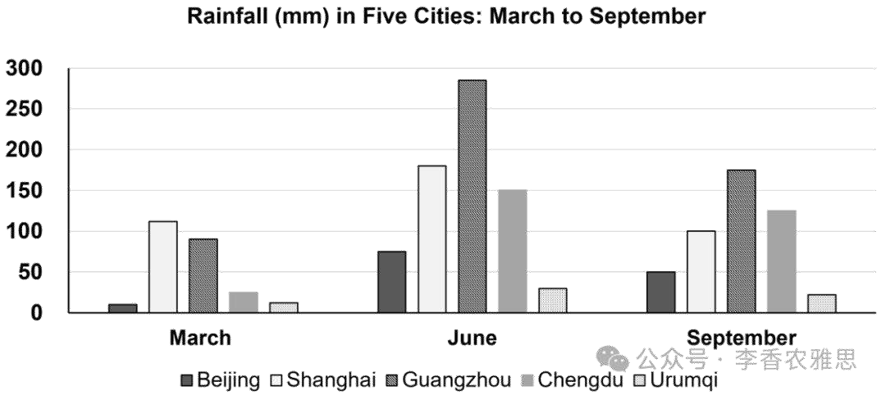

# 2025 年 8 月 2 日雅思写作真题
## Task 1

> **图表类型标注**：柱状图（五城市月降雨量）

**The bar chart below shows the monthly rainfall in five cities in 2020.**
**Summarise the information by selecting and reporting the main features, and make comparisons where relevant.**



The bar chart illustrates changes in the amount of rainfall recorded in Beijing, Shanghai, Guangzhou, Chengdu, and Urumqi in March, June, and September of 2020. 

As shown, rainfall in all five cities increased from March to June, followed by a decrease in September. Specifically, Guangzhou had the most pronounced change, with rainfall surging from roughly 80 mm in March to nearly 280 mm June, by far the highest figure among the five cities, before falling back to around 170 mm in September. Despite the decline, Guangzhou still recorded the most rainfall in September. Meanwhile, the corresponding data in Chengdu rose from 30 mm to 150 mm then fell to 130 mm, while that in Shanghai went up from 100 mm to 170 mm then dropped to 90 mm. 

The rainfall of Beijing in March was the lowest (8 mm), had a tenfold jump to 75 mm in June and a slight drop to 50 mm in September. In contrast, Urumqi experienced minimal variation in its rainfall, which was consistently low: 10 mm in March, 35 mm in June, and 30 mm in September, with both June and September figures being the lowest among all cities during those months.

Overall, although all cities saw a significant rise in rainfall from March to June and a decline thereafter, Urumqi remained relatively unaffected by seasonal changes.

---

### 精析

#### ① 结构分析（精简）

本题属于 **Bar Chart** 类 Task 1，涉及 5 个城市（北京、上海、广州、成都、乌鲁木齐）在 2020 年 3 月、6 月、9 月的降雨量数据。

本文采用 **"总-分-总"** 三段式结构：

- **Paragraph 1 — Introduction（开头段）**
  - 改写题目要素：`illustrates changes in the amount of rainfall recorded in Beijing, Shanghai, Guangzhou, Chengdu, and Urumqi`（替换原题 `shows the monthly rainfall in five cities`）
  - 明确对象：五个城市 + 时间 March, June, September 2020

- **Paragraph 2 — Body Details（主体段：按变化幅度分组）**
  - **大幅变化组（Pronounced Change）**：广州变化最剧烈（80→280→170 mm），成都（30→150→130 mm）和上海（100→170→90 mm）也有显著变化
  - **小幅变化组（Minimal Variation）**：北京 3 月最低（8 mm）→ 6 月十倍增长至 75 mm → 9 月微降至 50 mm；乌鲁木齐始终最低（10→35→30 mm），几乎不受季节影响

- **Paragraph 3 — Overview（总结段）**
  - 核心发现1：所有城市 3 月至 6 月降雨量显著上升，之后下降
  - 核心发现2：乌鲁木齐几乎不受季节变化影响

> **结构亮点**：作者采用"按变化幅度分组"策略，将广州、成都、上海归为"大幅变化"组，北京和乌鲁木齐归为"特殊模式"组（北京起点极低但有十倍增长，乌鲁木齐始终稳定）。这种分组方式突出了数据的层次性，避免了按城市逐一罗列的冗长。

#### ② 数据组织与对比策略（标注有效写法）

| 写法 | 原文示例 | 技巧说明 |
|------|---------|---------|
| **整体趋势概括** | `rainfall in all five cities increased from March to June, followed by a decrease in September` | 先给全景趋势，再展开细节 |
| **极值+倍数描述** | `Guangzhou had the most pronounced change... by far the highest figure among the five cities` | 突出极值并标注排名 |
| **倍数关系** | `had a tenfold jump to 75 mm` | 用 tenfold jump 简洁表达十倍增长 |
| **让步强调** | `Despite the decline, Guangzhou still recorded the most rainfall in September` | 承认下降但强调仍居首位 |
| **对比总结** | `Urumqi remained relatively unaffected by seasonal changes` | 用 unaffected 突出与其他城市的差异 |

> **数据亮点**：作者对数据的处理极具层次感——先以"all five cities increased"给出整体框架，再以"most pronounced change"聚焦极值，最后用"minimal variation"引出例外。"tenfold jump"和"by far the highest"等表达使数据描述生动有力。

#### ③ 四项能力维度分析（TA / CC / LR / GRA）

- **TA**：作者采用"按变化幅度分组"策略，将广州、成都、上海归为"大幅变化"组，北京和乌鲁木齐归为"特殊模式"组（北京起点极低但有十倍增长，乌鲁木齐始终稳定）。这种分组方式突出了数据的层次性，避免了按城市逐一罗列的冗长。 作者对数据的处理极具层次感——先以"all five cities increased"给出整体框架，再以"most pronounced change"聚焦极值，最后用"minimal variation"引出例外。"tenfold jump"和"by far the highest"等表达使数据描述生动有力。
- **CC**：衔接手段简洁高效——"Specifically"将叙述从概括推向细节，"In contrast"引出乌鲁木齐的特殊模式，"Despite"在描述中制造让步张力。总结段的"although... remained..."结构使全文首尾呼应。
- **LR**：见模块⑤词汇表，含 `illustrates changes in`、`most pronounced change` 等精准词
- **GRA**：见模块⑤句式亮点

#### ④ 可迁移句型骨架（直接套用）（图表类型：柱状图（五城市月降雨量））

**骨架 1 — 开头改写（表格/图通用）**
> The [chart] illustrates changes in ______ in [entities] in [years], along with ______.

**骨架 2 — 极值+对比（Body 通用）**
> ______ had [number], which was considerably higher than the figures for the other [n] [entities].

**骨架 3 — 排名变化/超越（含动态时）**
> ______ saw the second-largest rise and surpassed ______, with its figure growing from ______ to ______.

**骨架 4 — 双维度收尾（Overview 通用）**
> Overall, ______ had by far the largest number..., while ______ recorded the lowest figures on both measures.

#### ⑤ 衔接 / 词汇 / 句式亮点（去水版）

| 衔接类型 | 原文表达 | 功能 |
|---------|---------|------|
| **概括-具体衔接** | `As shown... Specifically...` | 从总体趋势过渡到具体城市 |
| **对比转折** | `In contrast...` | 引出变化模式相反的城市 |
| **让步衔接** | `Despite the decline...` | 承认变化但强调总体地位不变 |
| **并列补充** | `Meanwhile... while...` | 并列描述多个城市的数据 |
| **总结让步** | `although all cities saw... Urumqi remained...` | 总结段中承认总体趋势但突出例外 |

> **衔接亮点**：衔接手段简洁高效——"Specifically"将叙述从概括推向细节，"In contrast"引出乌鲁木齐的特殊模式，"Despite"在描述中制造让步张力。总结段的"although... remained..."结构使全文首尾呼应。

| 词汇/短语 | 中文含义 | 词性/用法 | 替代普通表达 |
|-----------|----------|----------|-------------|
| **illustrates changes in** | 展示……方面的变化 | 动词短语，展示...的变化 | shows |
| **most pronounced change** | 最为显著的变化 | 名词短语，最显著的变化 | biggest change |
| **surging** | 猛增；飙升 | 动词，激增 | increasing sharply |
| **by far the highest** | 遥遥领先地最高 | 短语，远超最高 | the highest |
| **falling back to** | 回落至 | 动词短语，回落至 | returning to |
| **tenfold jump** | 十倍的跃升 | 名词短语，十倍增长 | increased ten times |
| **minimal variation** | 微乎其微的变化 | 名词短语，微小变化 | little change |
| **consistently low** | 始终处于低位 | 形容词短语，持续偏低 | always low |
| **relatively unaffected** | 相对未受影响 | 形容词短语，相对不受影响 | not much affected |
| **seasonal changes** | 季节性变化 | 名词短语，季节变化 | changes in seasons |

**1. 伴随状语+极值描述**
> *"Guangzhou had the most pronounced change, **with rainfall surging from** roughly 80 mm in March **to** nearly 280 mm June, **by far the highest figure among the five cities**, **before falling back to** around 170 mm in September"*

**技巧**：用 "with + 名词 + surging" 独立主格描述伴随变化，"by far the highest figure" 作为插入语标注排名，"before falling back to" 描述后续回落。一句完成 "极值→排名→回落" 的完整叙述。

**2. 让步状语+强调**
> *"**Despite the decline**, Guangzhou **still recorded the most rainfall** in September"*

**技巧**：用 "Despite" 引导让步状语，承认 6 月至 9 月的下降趋势，再用 "still" 强调广州尽管下降但仍居首位的地位。这种 "让步+坚持" 的句式使数据分析更加 nuanced。

**3. 并列数据描述**
> *"the corresponding data in Chengdu **rose from** 30 mm **to** 150 mm **then fell to** 130 mm, **while that in** Shanghai **went up from** 100 mm **to** 170 mm **then dropped to** 90 mm"*

**技巧**：用 "while that in" 并置两个城市的数据，"rose... then fell..." 和 "went up... then dropped..." 使用不同动词表达相同趋势，避免了重复。"corresponding data" 回指前文的 rainfall，保持了叙述的连贯性。

**4. 总结段让步结构**
> *"**although** all cities **saw** a significant rise in rainfall from March to June and a decline thereafter, Urumqi **remained relatively unaffected** by seasonal changes"*

**技巧**：用 "although" 引导让步从句，承认总体趋势，再用 "remained relatively unaffected" 突出乌鲁木齐的例外地位。这种 "总体→例外" 的总结方式使 Overview 既全面又有重点。

---

#### ⑥ 可提升空间 + 仿写任务

**可提升空间（通用要点，按篇酌情采纳）：**
- Overview 建议前置或明确独立成段，让阅卷人先抓全局（TA 更稳）。
- 双维度数据（如比率/占比）尽量也收进 Overview，避免只在正文提一次。
- 跨段对比（如 A 反超 B）可集中到一句呈现，衔接更紧凑。

**本文针对性可改进点（按篇分析，点到即止）：**
- Overview 内部自相矛盾：前半句说 `all cities saw a significant rise`，后半句又说 `Urumqi remained relatively unaffected`。乌鲁木齐 10→35 mm 的绝对增幅很小，应改为 `all cities except Urumqi saw a significant rise`。
- `nearly 280 mm June` 漏了介词（应为 `in June`）；第三段 `The rainfall of Beijing in March was the lowest (8 mm), had a tenfold jump to 75 mm in June and a slight drop to 50 mm` 中 `was` 与 `had` 强行并列，句子结构失衡，建议拆成两句。
- 第三段直接开讲北京和乌鲁木齐，却没有主题句交代分组依据（"变化幅度小的一组"），与第二段 `Specifically` 的展开方式不对称，读者不易看出这两个城市为何另起一段。

**仿写任务**：用「极值+对比」骨架写一句：描述『2020 年 X 国指标远高于其他三国』。
## Task 2

> **话题与题型标注**：教育类 · Agree/Disagree

**Governments should spend money on promoting sports and the arts in schools, rather than sponsoring professional sports and art events in communities. To what extent do you agree or disagree?**

**政府应将资金用于在学校中推广体育和艺术，而不是赞助社区中的职业体育和艺术活动。你在多大程度上同意或不同意这一观点？**

Some argue that the government should invest in promoting sports and the arts among students, rather than allocate limited public funds to professional matches or neighborhood art exhibitions. While supporting professional and social events may offer certain benefits, I agree that financing school-based sports and arts should be the priority.

有人认为，政府应将资金用于在学生中推广体育和艺术，而不是将有限的公共资金用于职业比赛或社区艺术展览。尽管支持职业和社会性活动可能带来一定好处，但我认为，应优先资助以学校为基础的体育和艺术项目。

Admittedly, many public sector organizations regard funding professional-level sports and the community arts as vital components of state expenditure. Sports, in particular, serve as powerful tools for community building and economic stimulation, so they justify public investment. Local sporting events, even at the amateur level, offer more than entertainment; they enhance community life anddrive economic activity. For instance, the Jiangsu Football Super League, initially supported by government funding, later attracted substantial commercial sponsorship and drew numerous fans, boosting local economies during a downturn. Meanwhile, although the arts may lack immediate economic impact, they remain a compelling medium for expressing ideas, emotions, and values. In today's society, artistic pursuits continue to flourish, because of their enrichment of cultural life. Public funding for the arts, therefore, should be viewed as a strategic investment that not only fosters creativity but also preserves cultural heritage in order to ensure that a nation's unique identity and traditions are passed on to future generations.

诚然，许多公共部门机构认为资助职业级体育和社区艺术是国家政策中至关重要的一部分。体育，尤其是，被视为推动社区建设和刺激经济的有力工具，因此值得政府投资。本地体育赛事，即使是业余级别的，也不仅仅是娱乐活动，它们有助于改善社区生活并带动经济发展。例如，江苏足球超级联赛在政府初期资助下举办，后来吸引了大量商业赞助，吸引了众多球迷，在经济低迷时期提振了当地经济。尽管艺术可能不会立即带来经济效益，但它依然是一种强有力的媒介，用于表达思想、情感和价值观。在当今社会，艺术活动依旧蓬勃发展，丰富着人们的文化生活。因此，公共艺术资金应被视为一种战略性投资，它不仅激发创造力，还能保护文化遗产，确保一个国家独特的身份与传统得以代代相传。

Nevertheless, while supporting professional sports events and community-level art activities may bring economic and symbolic value, the government’s primary responsibility is to guarantee the development of children and adolescents through school-based programs. Allocating resources to schools provides students with early exposure to physical activity and artistic expression, which help them build discipline, creativity, and teamwork—skills essential for both academic and social success. For example, regular participation in sports can promote cooperation and confidence, while art classes enhance emotional intelligence and critical thinking. These formative experiences often shape lifelong interests and career paths, making investment in schools far more impactful than short-lived community events, which, although culturally valuable, typically serve a limited audience and often generate revenue through ticket sales and sponsorships. Unfortunately, many schools, particularly in underprivileged areas, lack basic facilities or qualified instructors. Redirecting funds toward education can bridge this gap and secure equal opportunities for all students to develop and thrive.

然而，尽管支持职业体育赛事和社区级艺术活动可能具有经济和象征意义，政府的首要职责应是通过校本项目促进儿童和青少年的发展。向学校配置资源，可以让学生及早接触体育活动和艺术表达，帮助他们培养纪律性、创造力和团队合作能力——这些都是学业和社交成功的关键技能。例如，经常参与体育活动可以帮助应对日益严重的儿童肥胖问题，而艺术课程则有助于提升情商和批判性思维。这些早期的经历往往会影响一生的兴趣和职业发展方向，使对学校的投资比那些短暂的社区活动更具深远影响。尽管这些活动在文化上具有一定价值，但通常仅服务于有限的受众，而且经常依赖门票销售和赞助商盈利。不幸的是，许多学校，特别是在贫困地区，缺乏基本设施或合格的教师。将资金转向教育可以弥补这一差距，确保所有学生都有平等的发展机会。

In conclusion, although financially supporting professional sports and arts can promote community cohesion and cultural enrichment, giving more emphasis on school-based programs offers greater long-term benefits: fostering essential life skills, nurturing young talents, and ensuring equal access to opportunities that shape both individual futures and societal progress.

总之，尽管投资职业体育和艺术能够促进社区凝聚力和文化繁荣，但优先发展校本项目在长期内带来更大的益处：培养关键生活技能，激发年轻人才，并确保每个学生都能平等地获得塑造未来的机会，从而推动社会整体的进步。

---

### 精析

#### ① 结构分析（精简）

本题属于 **Agree/Disagree** 类题型。此类题型的核心策略是：先让步承认对方合理之处，再阐述自己立场并论证。

本文采用 **"让步-反驳-综合"** 四段式结构：

- **Paragraph 1 — Introduction（开头段）**
  - 改写题目（paraphrase）：`the government should invest in promoting sports and the arts among students, rather than allocate limited public funds to professional matches or neighborhood art exhibitions`（替换原题 `Governments should spend money on promoting sports and the arts in schools, rather than sponsoring professional sports and art events in communities`）
  - 表明立场：`I agree that financing school-based sports and arts should be the priority`（同意优先资助学校项目）
  - 预告框架：先承认社区活动的价值，再论证学校项目更应优先

- **Paragraph 2 — Body 1（让步段）**
  - 主题句：`many public sector organizations regard funding professional-level sports and the community arts as vital components of state expenditure`
  - 论点1：体育是社区建设和经济刺激的有力工具 → 江苏足球超级联赛案例（政府资助→商业赞助→提振经济）
  - 论点2：艺术是表达思想、情感和价值观的媒介 → 丰富文化生活 → 保护文化遗产

- **Paragraph 3 — Body 2（反驳段）**
  - 主题句：`the government's primary responsibility is to guarantee the development of children and adolescents through school-based programs`
  - 论点1：学校项目提供早期接触 → 培养纪律性、创造力和团队合作 → 影响终身兴趣和职业路径
  - 论点2：社区活动服务有限受众且能自我盈利 → 学校（尤其贫困地区）缺乏设施和师资 → 资金应转向教育以弥补差距

- **Paragraph 4 — Conclusion（结尾段）**
  - 重申立场：`giving more emphasis on school-based programs offers greater long-term benefits`
  - 总结升华：培养生活技能 + 激发年轻人才 + 确保平等机会

> **结构亮点**：作者采用"充分让步+有力反驳"的结构。Body 1 不仅承认社区体育和艺术的价值，还用江苏足球超级联赛的具体案例和经济论证使让步极具说服力；Body 2 再用"primary responsibility"将讨论从"价值比较"提升到"责任优先级"的层面，使反驳更具力度。

#### ② 论证逻辑链拆解（标注有效写法）

**Body 1（让步段）的逻辑链条：**

```
资助职业体育和社区艺术是国家支出的重要部分
    ↓ [机制/原因]
├── [分支1] 体育价值
│   ↓
│   社区建设 + 经济刺激
│   ↓
│   江苏足球超级联赛案例
│   ↓
│   政府资助 → 商业赞助 → 提振地方经济
│
└── [分支2] 艺术价值
    ↓
    表达思想、情感、价值观的媒介
    ↓
    丰富文化生活
    ↓
    保护文化遗产 → 传承国家独特身份
```

**Body 2（反驳段）的逻辑链条：**

```
政府首要责任是保障儿童和青少年发展
    ↓ [机制/原因]
├── [分支1] 学校项目的长远影响
│   ↓
│   早期接触体育和艺术
│   ↓
│   培养纪律性、创造力、团队合作
│   ↓
│   塑造终身兴趣和职业路径
│
└── [分支2] 资源分配的现实考量
    ↓
    社区活动服务有限受众 + 能自我盈利
    ↓
    许多学校（尤其贫困地区）缺乏设施和师资
    ↓
    资金转向教育 → 弥补差距 → 确保平等机会
```

> **逻辑亮点**：反驳段的论证极具策略性——作者没有否定社区活动的价值，而是指出它们"typically serve a limited audience and often generate revenue"（服务有限且能盈利），同时强调学校"lack basic facilities or qualified instructors"（缺乏基本资源）。这种"对方能自给自足 + 我方资源匮乏"的对比使资金转向学校的论证极具说服力。

#### ③ 四项能力维度分析（TA / CC / LR / GRA）

- **TA**：作者采用"充分让步+有力反驳"的结构。Body 1 不仅承认社区体育和艺术的价值，还用江苏足球超级联赛的具体案例和经济论证使让步极具说服力；Body 2 再用"primary responsibility"将讨论从"价值比较"提升到"责任优先级"的层面，使反驳更具力度。 反驳段的论证极具策略性——作者没有否定社区活动的价值，而是指出它们"typically serve a limited audience and often generate revenue"（服务有限且能盈利），同时强调学校"lack basic facilities or qualified instructors"（缺乏基本资源）。这种"对方能自给自足 + 我方资源匮乏"的对比使资金转向学校的论证极具说服力。
- **CC**：衔接手段丰富且功能明确——"Admittedly→For instance→Meanwhile"在让步段内部推进，"Nevertheless→Unfortunately→Therefore"在反驳段内部构建逻辑链。"In particular"的使用使体育论证获得额外强调，"Therefore"将资源分配的现实考量推导至结论。
- **LR**：见模块⑤词汇表，含 `allocate limited public funds`、`vital components of state expenditure` 等精准词
- **GRA**：见模块⑤句式亮点

#### ④ 可迁移句型骨架（直接套用）（题型：Agree/Disagree）

**骨架 1 — 先退后进亮立场（Intro）**
> Although ______ deserves a central place because ______, I disagree with the view that ______.

**骨架 2 — 分类论证起手（Body）**
> From the perspective of ______, doing X helps ______ and ______. Meanwhile, X also offers ______ that go beyond ______.

**骨架 3 — 抽象→具体例证（Body）**
> For example, a course on ______ may show how ______ have harmed ______, as illustrated by ______.

#### ⑤ 衔接 / 词汇 / 句式亮点（去水版）

| 衔接类型 | 原文表达 | 功能说明 |
|---------|---------|---------|
| **让步引入** | `Admittedly...` | 承认对方观点的合理性 |
| **强调递进** | `Sports, in particular...` | 在让步段中聚焦重点领域 |
| **例证衔接** | `For instance...` | 用具体案例支撑论点 |
| **转折对比** | `Meanwhile, although...` | 在同一立场内转向另一个论点 |
| **因果衔接** | `because of their enrichment of cultural life` | 解释艺术蓬勃发展的原因 |
| **转折反驳** | `Nevertheless...` | 从让步转向反驳 |
| **总结衔接** | `In conclusion...` | 收束全文，重申立场 |

> **衔接亮点**：衔接手段丰富且功能明确——"Admittedly→For instance→Meanwhile"在让步段内部推进，"Nevertheless→Unfortunately→Therefore"在反驳段内部构建逻辑链。"In particular"的使用使体育论证获得额外强调，"Therefore"将资源分配的现实考量推导至结论。

| 词汇/短语 | 中文含义 | 词性/用法 | 替代普通表达 |
|-----------|----------|----------|-------------|
| **allocate limited public funds** | 调配有限的公共资金 | 动词短语，分配有限的公共资金 | spend money |
| **vital components of state expenditure** | 国家财政支出的关键组成部分 | 名词短语，国家支出的重要组成部分 | important parts of government spending |
| **community building** | 社区营造；社区凝聚 | 名词短语，社区建设 | building communities |
| **economic stimulation** | 对经济的拉动 | 名词短语，经济刺激 | boosting economy |
| **compelling medium** | 极具感染力的媒介 | 名词短语，强有力的媒介 | strong way |
| **strategic investment** | 具有战略意义的投资 | 名词短语，战略性投资 | important investment |
| **formative experiences** | 塑造性格的成长期经历 | 名词短语， formative 经历 | early experiences |
| **underprivileged areas** | 弱势／贫困地区 | 名词短语，贫困地区 | poor areas |
| **bridge this gap** | 弥合这一差距 | 动词短语，弥补这一差距 | fix this problem |
| **long-term benefits** | 长远的收益 | 名词短语，长期益处 | benefits in the long run |

**1. 多重修饰+案例支撑**
> *"the Jiangsu Football Super League, **initially supported by government funding**, later attracted substantial commercial sponsorship and drew numerous fans, **boosting local economies during a downturn**"*

**技巧**：用过去分词短语"initially supported by government funding"作插入语说明资金来源，再用现在分词"boosting..."作结果状语说明经济影响。一句完成"背景→发展→结果"的完整叙述。

**2. 目的状语+并列结果**
> *"Public funding for the arts, therefore, should be viewed as a strategic investment **that not only fosters creativity but also preserves cultural heritage in order to ensure that** a nation's unique identity and traditions are passed on to future generations"*

**技巧**：用"not only... but also..."并列两个积极效果，再用"in order to ensure that"引导目的状语从句，将投资的意义从当下效果延伸至未来传承。句式层次丰富，论证深远。

**3. 对比论证句**
> *"making investment in schools far more impactful than short-lived community events, **which**, although culturally valuable, **typically serve a limited audience and often generate revenue through ticket sales and sponsorships**"*

**技巧**：用"making..."作结果状语引出比较，再用"which"引导非限制性定语从句补充说明社区活动的局限性。"although culturally valuable"作为插入语承认对方价值，但"typically serve a limited audience"指出其局限性。这种"承认+限制"的句式使反驳更加 nuanced 和有力。

**4. 条件-解决方案句**
> *"**Redirecting funds toward education** can bridge this gap and secure equal opportunities for all students to develop and thrive"*

**技巧**：用动名词短语"Redirecting funds toward education"作主语，将动作本身作为解决方案的主体，再用"bridge this gap"和"secure equal opportunities"并列两个积极结果。句式简洁有力，政策建议明确。

#### ⑥ 可提升空间 + 仿写任务

**可提升空间（通用要点，按篇酌情采纳）：**
- 结论段避免复读开头，应「推进」而非「重复」立场。
- 让步段衔接词（this perspective 等）回指别太远，可加限定词收紧。
- 同一话题词（如 career / benefit）避免三现，用近义替换。

**本文针对性可改进点（按篇分析，点到即止）：**
- 第二段 `they enhance community life anddrive economic activity` 中 `and` 与 `drive` 粘连，漏了空格。
- 第三段英文写的是 `regular participation in sports can promote cooperation and confidence`，对应中译却是"帮助应对日益严重的儿童肥胖问题"，中英两版论点不一致，需统一（儿童肥胖其实是更具体、更有力的论据）。
- `In today's society, artistic pursuits continue to flourish, because of their enrichment of cultural life.` 属于循环论证（艺术因丰富文化而繁荣），且脱离了本段"值不值得公共投资"的主线，可删除或换成具体证据（如参观人次、文创产值）。

**仿写任务**：用「先退后进」骨架重写：*Some think space exploration is a waste of money.*
