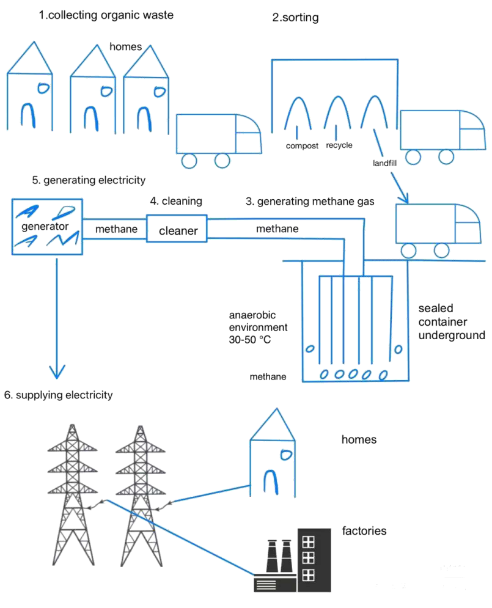

# 2025 年 8 月 9 日雅思写作真题
## Task 1

> **图表类型标注**：流程图（家庭垃圾产能）

**The diagram below shows how energy is produced from household waste.**
**Summarise the information by selecting and reporting the main features, and make comparisons where relevant.**



The diagram illustrates the process by which household organic waste is converted into electricity. Overall, the process involves six main stages, beginning with the collection and sorting of organic waste, followed by methane generation and cleaning, and ending with electricity production and supply to homes and factories. 

In the first stage, organic waste is collected from households and transported by truck to a sorting facility. Here, the waste is separated into compostable and recyclable materials, while the remaining non-recyclable portion is directed to a landfill site. This landfill acts as the starting point for methane generation. 

In the third stage, the sorted organic matter is placed in a sealed underground container, where it is maintained in an anaerobic environment at a temperature of 30 to 50℃. This controlled condition promotes the breakdown of organic producing methane gas. The methane is then piped to a cleaning matter, unit, where impurities are removed. 

Once cleaned, the methane is directed to a generator, which converts it into electricity. Finally, in the sixth stage, the generated electricity is transmitted through power lines and supplied to both homes and factories, completing there cycling-to-energy process.

---

### 精析

#### ① 结构分析（精简）

本题属于 **Process Diagram** 类 Task 1，涉及家庭有机废弃物转化为电能的六个阶段流程。

本文采用 **"顺序式"** 多段式结构：

- **Paragraph 1 — Introduction（开头段）**
  - 改写题目要素：`the process by which household organic waste is converted into electricity`（替换原题 `how energy is produced from household waste`）
  - 明确对象：household organic waste → electricity
  - 流程总览：`six main stages, beginning with... followed by... and ending with...`

- **Paragraph 2 — Stage 1-2（收集与分类）**
  - Stage 1：有机废弃物从家庭收集 → 卡车运输至分类设施
  - Stage 2：废弃物被分离为可堆肥和可回收材料 → 不可回收部分被送往填埋场（填埋场作为甲烷生成的起点）

- **Paragraph 3 — Stage 3-4（甲烷生成与净化）**
  - Stage 3：分类后的有机物放入密封地下容器 → 无氧环境 + 30-50°C → 促进有机物分解产生甲烷
  - Stage 4：甲烷通过管道输送至净化装置 → 去除杂质

- **Paragraph 4 — Stage 5-6（发电与输送）**
  - Stage 5：净化后的甲烷被导向发电机 → 转化为电能
  - Stage 6：电能通过输电线传输 → 供应给家庭和工厂

- **Paragraph 5 — Overview（总结段，隐含于开头段末尾）**
  - 核心发现：流程涵盖收集分类、甲烷生成净化、发电供应三大环节

> **结构亮点**：作者采用"总-分"结构，开头段即给出流程总览（beginning with... followed by... ending with...），随后按阶段顺序分段叙述。每段聚焦1-2个阶段，用明确的阶段标记（In the first stage, In the third stage, Once cleaned, Finally）引导读者，使复杂的流程图条理清晰。

#### ② 数据组织与对比策略（标注有效写法）

| 写法 | 原文示例 | 技巧说明 |
|------|---------|---------|
| **流程总览** | `the process involves six main stages, beginning with... followed by... and ending with...` | 开头即给出流程框架，帮助读者建立整体认知 |
| **阶段标记** | `In the first stage... In the third stage... Finally, in the sixth stage` | 用明确的阶段标记引导读者跟随流程 |
| **被动语态** | `organic waste is collected... transported... separated... directed` | 流程图常用被动语态，强调动作而非执行者 |
| **条件描述** | `maintained in an anaerobic environment at a temperature of 30 to 50℃` | 精确描述关键条件，体现对流程关键参数的理解 |
| **目的说明** | `This controlled condition promotes the breakdown of organic matter producing methane gas` | 解释条件的目的，展现分析深度 |

> **数据亮点**：作者对流程的描述不仅包含"做什么"，还包含"怎么做"和"为什么"——如"anaerobic environment at a temperature of 30 to 50℃"精确描述关键条件，"This controlled condition promotes..."解释条件目的。这种"操作+条件+目的"的三层描述使流程叙述专业而深入。

#### ③ 四项能力维度分析（TA / CC / LR / GRA）

- **TA**：作者采用"总-分"结构，开头段即给出流程总览（beginning with... followed by... ending with...），随后按阶段顺序分段叙述。每段聚焦1-2个阶段，用明确的阶段标记（In the first stage, In the third stage, Once cleaned, Finally）引导读者，使复杂的流程图条理清晰。 作者对流程的描述不仅包含"做什么"，还包含"怎么做"和"为什么"——如"anaerobic environment at a temperature of 30 to 50℃"精确描述关键条件，"This controlled condition promotes..."解释条件目的。这种"操作+条件+目的"的三层描述使流程叙述专业而深入。
- **CC**：衔接手段精准对应流程图需求——阶段标记（In the first stage, Finally）清晰划分步骤，"Once cleaned"用省略结构实现步骤间无缝衔接，"completing..."用现在分词收束全文。每个衔接词都服务于流程叙述的连贯性。
- **LR**：见模块⑤词汇表，含 `converted into`、`organic waste` 等精准词
- **GRA**：见模块⑤句式亮点

#### ④ 可迁移句型骨架（直接套用）（图表类型：流程图（家庭垃圾产能））

**骨架 1 — 开头改写（流程图）**
> The diagram outlines the process of ______, from ______ to ______.

**骨架 2 — 阶段串联**
> ______ is first [done], after which it is [done], before finally being [done].

**骨架 3 — 被动/目的**
> ______ is [verb]-ed so that ______ can be [verb]-ed in the next stage.

#### ⑤ 衔接 / 词汇 / 句式亮点（去水版）

| 衔接类型 | 原文表达 | 功能 |
|---------|---------|------|
| **阶段推进** | `In the first stage... In the third stage... Once cleaned... Finally` | 按时间/流程顺序推进 |
| **地点说明** | `Here... This landfill...` | 用指代词回指前文地点 |
| **因果衔接** | `This controlled condition promotes...` | 解释前一步骤的目的或结果 |
| **目的说明** | `completing the recycling-to-energy process` | 用现在分词说明最终结果 |
| **顺序衔接** | `beginning with... followed by... and ending with...` | 开头段总览流程顺序 |

> **衔接亮点**：衔接手段精准对应流程图需求——阶段标记（In the first stage, Finally）清晰划分步骤，"Once cleaned"用省略结构实现步骤间无缝衔接，"completing..."用现在分词收束全文。每个衔接词都服务于流程叙述的连贯性。

| 词汇/短语 | 中文含义 | 词性/用法 | 替代普通表达 |
|-----------|----------|----------|-------------|
| **converted into** | 被转化为 | 动词短语 | changed into |
| **organic waste** | 有机废弃物 | 名词短语 | household waste |
| **sorting facility** | 分类设施 | 名词短语 | sorting place |
| **compostable** | 可堆肥的 | 形容词 | can be composted |
| **non-recyclable** | 不可回收的 | 形容词 | cannot be recycled |
| **landfill site** | 垃圾填埋场 | 名词短语 | dumping ground |
| **sealed underground container** | 密封地下容器 | 名词短语 | closed underground container |
| **anaerobic environment** | 无氧（厌氧）环境 | 名词短语 | environment without oxygen |
| **promotes the breakdown** | 促进分解 | 动词短语 | helps break down |
| **impurities are removed** | 杂质被去除 | 被动语态 | impurities are taken out |

**1. 流程总览句**
> *"the process involves six main stages, **beginning with** the collection and sorting of organic waste, **followed by** methane generation and cleaning, **and ending with** electricity production and supply to homes and factories"*

**技巧**：用"beginning with... followed by... and ending with..."三个分词短语并列，在一句中完成流程总览。这种"总括+分述"的句式使开头段即给读者清晰的流程地图。

**2. 条件-结果句式**
> *"the sorted organic matter is placed in a sealed underground container, **where** it is maintained in an anaerobic environment at a temperature of 30 to 50℃. **This controlled condition promotes** the breakdown of organic matter producing methane gas"*

**技巧**：用where引导定语从句描述容器内的条件，再用"This controlled condition promotes..."解释条件的目的。"条件→目的"的句式展现了超越单纯描述的深度分析。

**3. 被动语态连锁**
> *"the generated electricity **is transmitted** through power lines **and supplied to** both homes and factories, **completing** the recycling-to-energy process"*

**技巧**：连续使用被动语态"is transmitted... and supplied to..."描述流程的最后步骤，再用现在分词"completing..."说明最终结果。被动语态强调动作本身，符合流程图的客观叙述需求。

**4. 分词短语+目的说明**
> *"Once cleaned, the methane **is directed to** a generator, **which converts it into** electricity"*

**技巧**：用"Once cleaned"省略结构（= Once it is cleaned）实现步骤间的高效衔接，再用which引导定语从句说明发电机的功能。句式紧凑，一步接一步，符合流程叙述的节奏。

---

#### ⑥ 可提升空间 + 仿写任务

**可提升空间（通用要点，按篇酌情采纳）：**
- Overview 建议前置或明确独立成段，让阅卷人先抓全局（TA 更稳）。
- 双维度数据（如比率/占比）尽量也收进 Overview，避免只在正文提一次。
- 跨段对比（如 A 反超 B）可集中到一句呈现，衔接更紧凑。

**本文针对性可改进点（按篇分析，点到即止）：**
- 第三段存在明显的打字/语序错误：`the breakdown of organic producing methane gas`（漏 matter）与 `piped to a cleaning matter, unit`（词序错位），这类失误会直接拉低 GRA 的准确性印象，考场需留 1 分钟通读检查。
- 第二段说 `This landfill acts as the starting point for methane generation`，但第三段甲烷实际产生于 `a sealed underground container`，两处地点指代不一致，读者会困惑；建议统一为同一环节或明确二者关系。
- 结尾 `completing there cycling-to-energy process` 应为 `the recycling-to-energy process`，同时 Overview 只嵌在开头段末尾，可考虑独立成句/成段，使全局信息更醒目。

**仿写任务**：用「极值+对比」骨架写一句：描述『2020 年 X 国指标远高于其他三国』。
## Task 2

> **话题与题型标注**：工作类 · Advantages/Disadvantages

**Nowadays, an increasing number of older people are working in companies. Does this trend bring more advantages or disadvantages?**

**如今，越来越多的老年人在公司工作。这一趋势是利大于弊吗？**

In recent years, many companies have witnessed a growing presence of older employees. While having more aged people working in the job market could cause some disadvantages, I believe the advantages of retaining experienced workers far outweigh the drawbacks for the workplace.

近年来，许多公司都注意到年长员工的数量在不断增加。虽然更多老年人在就业市场工作可能带来一些不利影响，但我认为留住经验丰富的员工对职场的好处远远超过其缺点。

Admittedly, employing more older staff may come with challenges in improving productivity or may limit opportunities for younger employees. This is because some senior workers face age-related problems, such as difficulties adapting to rapidly changing technologies or physical limitations in certain roles. Forcing or encouraging them to work beyond their capabilities to maintain a fast work pace alongside younger counterparts could lead to a decline in their overall well-being and even slow team productivity. Worse still, in the increasingly competitive job market, many young people cannot secure decent jobs, even if they earn degrees from renowned universities. An oversupply of graduates makes it difficult for many to find suitable occupations. If an increased number of older workers compete with young people for limited career opportunities, the problem of meaningless competition could be intensified, especially in Northeast Asian countries, where many immerse themselves in overwork, often with little meaningful progress, while overall social well-being is sacrificed.

诚然，雇佣更多年长员工在提高生产力方面可能面临挑战，或者可能限制年轻员工的发展机会。这是因为一些资深员工会遇到与年龄相关的问题，例如难以适应快速变化的技术，或在某些岗位上存在身体上的限制。强迫或鼓励他们超出能力范围工作，以跟上年轻同事的工作节奏，可能导致他们整体福祉下降，甚至拖慢团队的生产效率。更糟糕的是，在日益竞争激烈的就业市场中，许多年轻人即使毕业于知名大学，也难以获得体面的工作。毕业生供过于求，使许多人难以找到合适的职业。如果更多年长员工与年轻人争夺有限的职业机会，这种无意义的竞争问题可能会加剧，尤其是在东北亚国家，许多人沉浸于过度劳累，往往收效甚微，同时整体社会福祉受到牺牲。

Nevertheless, the merits of continuing to work in old age are far greater than the above-mentioned disadvantages, which can be appropriately addressed to some extent. One key benefit is that staying employed enables older adults to maintain their financial independence and remain physically active. By working, they can continue to support themselves without relying on government assistance or their families, while work provides mental stimulation, problem-solving opportunities, and social interaction, all of which can help delay the onset of age-related conditions and give aged employees a sense of purpose that enhances their mental health and overall life satisfaction. Another significant merit is that mature employees contribute valuable experience and knowledge to the workforce. Not only commercial institutions but also government sectors face complicated social problems that younger workers may not yet be able to resolve. By continuing to work, the experienced workforce can mentor younger generations, ensure continuity in various professions, and prevent skill shortages in critical sectors.

然而，继续工作带来的好处远远超过上述缺点，且这些缺点在一定程度上可以得到妥善解决。一个关键的好处是，保持就业使老年人能够维持经济独立并保持身体活跃。通过工作，他们可以继续自给自足，而无需依赖政府援助或家庭支持；工作还能提供心理刺激、解决问题的机会以及社交互动，这些都有助于延缓与年龄相关疾病的发生，并赋予年长员工一种目标感，提升他们的心理健康和整体生活满意度。另一个重要的优点是，成熟的员工为劳动力提供了宝贵的经验和知识。无论是商业机构还是政府部门，都面临着年轻员工尚未能够解决的复杂社会问题。通过继续工作，有经验的员工可以指导年轻一代，确保各行各业的传承，并防止关键领域出现技能短缺。

In conclusion, although employing the older generation presents challenges in adapting to new technologies and job competition, the benefits (including financial independence, mental well-being, and valuable experience) far outweigh the drawbacks. Their continued participation enriches the workforce, supports younger employees, and strengthens both the economy and society.

总之，虽然雇佣老年员工在适应新技术和职位竞争方面存在挑战，但其带来的好处（包括经济独立、心理健康和宝贵经验）远远超过缺点。他们的持续参与丰富了劳动力队伍，支持了年轻员工，并增强了经济和社会的整体实力。

---

### 精析

#### ① 结构分析（精简）

本题属于 **Positive/Negative** 类题型。此类题型的核心策略是：分别讨论利弊，最后给出综合判断。

本文采用 **"利弊-立场"** 四段式结构：

- **Paragraph 1 — Introduction（开头段）**
  - 改写题目（paraphrase）：`many companies have witnessed a growing presence of older employees`（替换原题 `an increasing number of older people are working in companies`）
  - 表明立场：`the advantages of retaining experienced workers far outweigh the drawbacks`（利大于弊）
  - 预告框架：先讨论弊端，再论证优点更多

- **Paragraph 2 — Body 1（弊端段）**
  - 主题句：`employing more older staff may come with challenges in improving productivity or may limit opportunities for younger employees`
  - 论点1：年长员工面临与年龄相关的问题 → 难以适应快速变化的技术/身体限制 → 超出能力工作可能损害福祉并拖慢团队效率
  - 论点2：就业市场竞争激烈 → 毕业生供过于求 → 年长员工与年轻人竞争 → 加剧无意义竞争（尤其东北亚）

- **Paragraph 3 — Body 2（优点段）**
  - 主题句：`the merits of continuing to work in old age are far greater than the above-mentioned disadvantages`
  - 论点1：保持就业使老年人维持经济独立和身体活跃 → 工作提供心理刺激、解决问题机会和社交互动 → 延缓年龄相关疾病 → 赋予目标感
  - 论点2：成熟员工贡献宝贵经验和知识 → 指导年轻一代 → 确保各行业传承 → 防止关键领域技能短缺

- **Paragraph 4 — Conclusion（结尾段）**
  - 重申立场：`the benefits... far outweigh the drawbacks`
  - 总结升华：丰富劳动力 + 支持年轻员工 + 增强经济和社会实力

> **结构亮点**：作者采用"先抑后扬"结构。Body 1 充分展开弊端（生产力挑战+年轻人机会受限），Body 2 再用"far greater than"有力反驳，从"个人福祉"和"组织价值"两个维度论证优点。弊端段的充分展开使优点段的反驳更具说服力。

#### ② 论证逻辑链拆解（标注有效写法）

**Body 1（弊端段）的逻辑链条：**

```
雇佣更多年长员工
    ↓ [机制/原因]
├── [分支1] 生产力挑战
│   ↓
│   年龄相关问题 → 难以适应技术/身体限制
│   ↓
│   超出能力工作 → 福祉下降 + 团队效率降低
│
└── [分支2] 年轻人机会受限 [Worse still]
    ↓
    就业市场竞争激烈 → 毕业生供过于求
    ↓
    年长员工与年轻人竞争有限机会
    ↓
    加剧无意义竞争（尤其东北亚）→ 牺牲社会福祉
```

**Body 2（优点段）的逻辑链条：**

```
继续工作的优点
    ↓ [机制/原因]
├── [分支1] 个人层面
│   ↓
│   经济独立 + 身体活跃
│   ↓
│   心理刺激 + 社交互动
│   ↓
│   延缓年龄相关疾病 + 赋予目标感
│
└── [分支2] 组织/社会层面
    ↓
    宝贵经验和知识
    ↓
    指导年轻一代 + 确保行业传承
    ↓
    防止关键领域技能短缺
```

> **逻辑亮点**：优点段的论证层次分明——从"个人层面"（经济独立、心理健康）到"组织层面"（经验传承、指导年轻人），覆盖了微观到宏观的多个维度。"Not only commercial institutions but also government sectors"的并列结构使论证适用范围更广。

#### ③ 四项能力维度分析（TA / CC / LR / GRA）

- **TA**：作者采用"先抑后扬"结构。Body 1 充分展开弊端（生产力挑战+年轻人机会受限），Body 2 再用"far greater than"有力反驳，从"个人福祉"和"组织价值"两个维度论证优点。弊端段的充分展开使优点段的反驳更具说服力。 优点段的论证层次分明——从"个人层面"（经济独立、心理健康）到"组织层面"（经验传承、指导年轻人），覆盖了微观到宏观的多个维度。"Not only commercial institutions but also government sectors"的并列结构使论证适用范围更广。
- **CC**：衔接手段功能分明——"Admittedly→Worse still"在弊端段内部升级，"Nevertheless→One key benefit→Another significant merit"在优点段内部推进。"Worse still"的使用将论证从"个人生产力"推进到"社会竞争"，批判力度层层递进。
- **LR**：见模块⑤词汇表，含 `growing presence`、`retaining experienced workers` 等精准词
- **GRA**：见模块⑤句式亮点

#### ④ 可迁移句型骨架（直接套用）（题型：Advantages/Disadvantages）

**骨架 1 — 优势起手**
> The main advantage of ______ is that it enables ______.

**骨架 2 — 劣势对照**
> However, a notable disadvantage is ______, which may ______.

**骨架 3 — 平衡立场**
> On balance, the benefits outweigh the drawbacks provided that ______.

#### ⑤ 衔接 / 词汇 / 句式亮点（去水版）

| 衔接类型 | 原文表达 | 功能说明 |
|---------|---------|---------|
| **让步引入** | `Admittedly...` | 承认弊端存在 |
| **因果衔接** | `This is because...` | 解释弊端的原因 |
| **程度升级** | `Worse still...` | 在弊端论证中升级严重性 |
| **条件推演** | `If... could be intensified...` | 用条件句推演最坏后果 |
| **转折反驳** | `Nevertheless...` | 从弊端转向优点 |
| **列举递进** | `One key benefit is... Another significant merit is...` | 并列展开两个优点 |
| **总结衔接** | `In conclusion...` | 收束全文，重申立场 |

> **衔接亮点**：衔接手段功能分明——"Admittedly→Worse still"在弊端段内部升级，"Nevertheless→One key benefit→Another significant merit"在优点段内部推进。"Worse still"的使用将论证从"个人生产力"推进到"社会竞争"，批判力度层层递进。

| 词汇/短语 | 中文含义 | 词性/用法 | 替代普通表达 |
|-----------|----------|----------|-------------|
| **growing presence** | 日益增多的身影／存在感 | 名词短语 | more and more |
| **retaining experienced workers** | 留住经验丰富的员工 | 动词短语 | keeping old workers |
| **age-related problems** | 与年龄相关的问题 | 名词短语 | problems caused by age |
| **overall well-being** | 整体身心健康／福祉 | 名词短语 | overall health |
| **oversupply of graduates** | 毕业生供过于求 | 名词短语 | too many graduates |
| **meaningless competition** | 无意义的内耗式竞争 | 名词短语 | bad competition |
| **financial independence** | 经济独立 | 名词短语 | not needing money from others |
| **mental stimulation** | 脑力刺激 | 名词短语 | mental exercise |
| **delay the onset** | 延缓（疾病）发作 | 动词短语 | delay the start |
| **mentor younger generations** | 指导／带教年轻一代 | 动词短语 | teach young people |

**1. 因果链式长句**
> *"By working, they can continue to support themselves without relying on government assistance or their families, **while** work provides mental stimulation, problem-solving opportunities, and social interaction, **all of which** can help delay the onset of age-related conditions and give aged employees a sense of purpose **that enhances** their mental health and overall life satisfaction"*

**技巧**：用"while"并列两个积极结果（经济独立+心理刺激），再用"all of which"引导定语从句概括前文所有益处，最后用"that enhances..."进一步说明目标感的深层影响。一句涵盖多重因果层次，论证极为丰富。

**2. 条件-后果推演**
> *"**If** an increased number of older workers compete with young people for limited career opportunities, the problem of meaningless competition **could be intensified**, especially in Northeast Asian countries, **where** many immerse themselves in overwork, often with little meaningful progress, **while** overall social well-being is sacrificed"*

**技巧**：用If引导条件句，再用"could be intensified"指出后果，"especially in..."提供地域聚焦，"where"引导定语从句描述当地情况，"while"并置另一个被牺牲的结果。句式层次极为丰富。

**3. 强调句型**
> *"**Not only** commercial institutions **but also** government sectors face complicated social problems that younger workers may not yet be able to resolve"*

**技巧**：用"Not only... but also..."并列两个领域，强调年长员工的价值跨越公私部门。这种强调句式使论证的适用范围更广，说服力更强。

**4. 总结段综合句**
> *"Their continued participation **enriches** the workforce, **supports** younger employees, and **strengthens** both the economy and society"*

**技巧**：用三个并列动词（enriches, supports, strengthens）概括年长员工的多重价值，从"劳动力"到"年轻员工"再到"经济和社会"，层层递进。句式简洁有力，总结全面。

#### ⑥ 可提升空间 + 仿写任务

**可提升空间（通用要点，按篇酌情采纳）：**
- 结论段避免复读开头，应「推进」而非「重复」立场。
- 让步段衔接词（this perspective 等）回指别太远，可加限定词收紧。
- 同一话题词（如 career / benefit）避免三现，用近义替换。

**本文针对性可改进点（按篇分析，点到即止）：**
- 弊端段（Body 1）体量偏大，且后半段从"公司用人"跑到"东北亚过劳与社会福祉"，离题干的 companies 语境较远；建议压缩地域展开，把落点拉回职场本身。
- "远超"这一判断在全文出现三次（`far outweigh` → `far greater than` → `far outweigh`），措辞重复；结论处可换成 `decisively tip the balance in favour of...` 之类表达。
- 优点段论断（延缓衰老相关疾病、防止关键领域技能短缺）全为泛论，没有任何具体行业或场景做支撑；补一个"如医疗/制造业老技师带教"的微例证，说服力会明显提升。

**仿写任务**：就『远程办公』各写一句优势与劣势。
