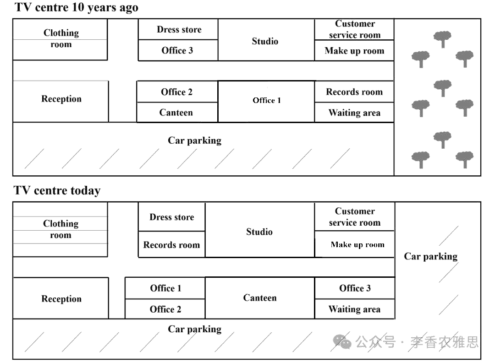

# 2025 年 9 月 27 日雅思写作真题
## Task 1

> **图表类型标注**：地图（电视中心对比图）

**The two maps below show TV centre ten years ago and now.**
**Summarise the information by selecting and reporting the main features, and make comparisons where relevant.**



The maps illustrate the layout of a TV centre ten years ago and the changes that have been made since then. 

A decade ago, the centre featured a variety of facilities arranged along a corridor running from west to east, with a garden to the east and a car park along the southern boundary. In the northwestern corner were two clothing rooms, to the east of which were a dress store and Office 3. A studio was situated next to them, while a customer service room and a make-up room occupied the easternmost corner. Directly opposite the northern facilities were a reception area, Office 2, a canteen, Office 1, a recording room, and a waiting area. 

At present, although the overall structure remains the same, the size and function of several rooms have been altered, and the garden on the eastern side has been replaced by an expanded parking lot connected to the original car park: the northern rooms have been enlarged, with the number of clothing rooms doubled and Office 3 relocated to the former recording room. In the south, most rooms remain unchanged, except that Office 1 has been converted into a canteen.

Overall, while the main structure of the TV centre has remained intact, several internal spaces have been reorganised, and the eastern garden has been replaced with a larger parking area.

---

### 精析

#### ① 结构分析（精简）

本题属于 **Map** 类 Task 1，涉及某电视中心十年前与当前的布局对比。

本文采用 **"对比式"** 三段式结构：

- **Paragraph 1 — Introduction（开头段）**
  - 改写题目要素：`the layout of a TV centre ten years ago and the changes that have been made since then`（替换原题 `show TV centre ten years ago and now`）
  - 明确对象：a TV centre + 时间 ten years ago and now

- **Paragraph 2 — Body Details（主体段：按时间/状态分组）**
  - **十年前布局**：走廊从西向东贯穿；东侧花园，南侧停车场；西北角两个更衣室，东侧是服装储藏室和 Office 3；旁边是演播室；最东侧是客服室和化妆室；北侧对面是接待区、Office 2、食堂、Office 1、录音室和等候区
  - **当前布局**：整体结构保留；北侧房间扩大，更衣室数量翻倍，Office 3 迁至原录音室；南侧大部分房间不变，Office 1 改为食堂；东侧花园被扩建的停车场取代，与原停车场相连

- **Paragraph 3 — Overview（总结段）**
  - 核心发现1：电视中心主体结构保持完整
  - 核心发现2：若干内部空间重新组织，东侧花园被更大的停车区取代

> **结构亮点**：作者采用"现状→未来"的对比叙述策略，先完整描述十年前布局建立空间认知，再逐条说明变化。"although the overall structure remains the same"的让步结构清晰标注了不变元素，使变化部分更加突出。

#### ② 数据组织与对比策略（标注有效写法）

| 写法 | 原文示例 | 技巧说明 |
|------|---------|---------|
| **空间定位** | `arranged along a corridor running from west to east, with a garden to the east and a car park along the southern boundary` | 用方位词精确描述整体布局 |
| **不变元素标注** | `although the overall structure remains the same` | 先标注不变元素，再展开变化 |
| **变化描述** | `have been altered... has been replaced by... have been enlarged... has been doubled... has been relocated... has been converted into` | 用不同动词描述不同类型的变化 |
| **功能转换** | `Office 1 has been converted into a canteen` | 用 convert into 描述功能转换 |
| **数量变化** | `the number of clothing rooms doubled` | 用 doubled 描述数量翻倍 |

> **数据亮点**：作者对变化的描述极为细致——不仅说明"什么变了"，还说明"怎么变"（altered/replaced/enlarged/doubled/relocated/converted）。对保留元素的明确标注（remains the same, remain unchanged）使对比更加清晰。

#### ③ 四项能力维度分析（TA / CC / LR / GRA）

- **TA**：作者采用"现状→未来"的对比叙述策略，先完整描述十年前布局建立空间认知，再逐条说明变化。"although the overall structure remains the same"的让步结构清晰标注了不变元素，使变化部分更加突出。 作者对变化的描述极为细致——不仅说明"什么变了"，还说明"怎么变"（altered/replaced/enlarged/doubled/relocated/converted）。对保留元素的明确标注（remains the same, remain unchanged）使对比更加清晰。
- **CC**：空间衔接词使用精准——"In the northwestern corner"、"to the east of which"、"next to them"、"Directly opposite"等方位词使空间描述条理清晰。"to the east of which"作为定语从句嵌入空间描述，句式紧凑。
- **LR**：见模块⑤词汇表，含 `featured`、`arranged along` 等精准词
- **GRA**：见模块⑤句式亮点

#### ④ 可迁移句型骨架（直接套用）（图表类型：地图（电视中心对比图））

**骨架 1 — 开头改写（地图）**
> The maps illustrate changes in ______ between [year1] and [year2].

**骨架 2 — 方位/变化**
> ______ was relocated/added/removed, while ______ remained largely unchanged.

**骨架 3 — 对比收尾**
> Overall, the most noticeable change was the transformation of ______ into ______.

#### ⑤ 衔接 / 词汇 / 句式亮点（去水版）

| 衔接类型 | 原文表达 | 功能 |
|---------|---------|------|
| **空间衔接** | `In the northwestern corner... to the east of which... next to them... occupied the easternmost corner... Directly opposite...` | 按空间顺序推进描述 |
| **时间/状态切换** | `At present...` | 从十年前布局转向当前方案 |
| **让步衔接** | `although the overall structure remains the same` | 承认整体保留但强调局部变化 |
| **递进补充** | `In the south... except that...` | 补充南侧的变化细节 |
| **总结衔接** | `Overall...` | 收束全文，给出综合判断 |

> **衔接亮点**：空间衔接词使用精准——"In the northwestern corner"、"to the east of which"、"next to them"、"Directly opposite"等方位词使空间描述条理清晰。"to the east of which"作为定语从句嵌入空间描述，句式紧凑。

| 词汇/短语 | 中文含义 | 词性/用法 | 替代普通表达 |
|-----------|----------|----------|-------------|
| **featured** | 设有、以……为特色 | 动词 | had |
| **arranged along** | 沿……一线排布 | 动词短语 | placed along |
| **occupied** | 占据（某位置） | 动词 | was in |
| **easternmost** | 最东端的 | 形容词 | the farthest east |
| **Directly opposite** | 正对面 | 短语 | across from |
| **remains the same** | 维持原样 | 动词短语 | stays the same |
| **altered** | 被改动 | 动词 | changed |
| **relocated to** | 迁移到 | 动词短语 | moved to |
| **converted into** | 改建为 | 动词短语 | changed into |
| **remained intact** | 原封未动、保持完好 | 动词短语 | stayed complete |

**1. 倒装+空间描述**
> *"**In the northwestern corner were** two clothing rooms, **to the east of which were** a dress store and Office 3"*

**技巧**：用倒装结构"In the northwestern corner were..."强调位置，再用"to the east of which were..."定语从句描述相邻设施。倒装句式使空间描述更加生动。

**2. 让步+变化列举**
> *"**At present, although** the overall structure **remains the same**, the size and function of several rooms **have been altered**, and the garden on the eastern side **has been replaced by** an expanded parking lot **connected to** the original car park"*

**技巧**：用"although"引导让步从句，承认整体结构保留，再转折引出具体变化。"connected to"过去分词短语补充说明停车场的连接关系。

**3. 分词短语+变化描述**
> *"the northern rooms **have been enlarged**, **with** the number of clothing rooms **doubled** and Office 3 **relocated to** the former recording room"*

**技巧**：用"with + 名词 + doubled/relocated"独立主格结构描述伴随变化，将两个变化项目压缩在一个结构中。"former recording room"用 former 指代原功能，简洁明了。

**4. 总结段对比结构**
> *"**while** the main structure of the TV centre **has remained intact**, several internal spaces **have been reorganised**, and the eastern garden **has been replaced with** a larger parking area"*

**技巧**：用"while"引导让步从句，承认主体结构保留，再并列两个变化（内部重组+花园变停车场）。总结句对比鲜明，覆盖了改造的核心特征。

---

#### ⑥ 可提升空间 + 仿写任务

**可提升空间（通用要点，按篇酌情采纳）：**
- Overview 建议前置或明确独立成段，让阅卷人先抓全局（TA 更稳）。
- 双维度数据（如比率/占比）尽量也收进 Overview，避免只在正文提一次。
- 跨段对比（如 A 反超 B）可集中到一句呈现，衔接更紧凑。

**本文针对性可改进点（按篇分析，点到即止）：**
- "当前"段的冒号用错：`...connected to the original car park: the northern rooms have been enlarged...` 冒号前后是两件互不相干的变化，应断为两句。
- 信息矛盾未交代：十年前南侧已有一个 canteen，现在又说 `Office 1 has been converted into a canteen`，原来那个食堂的去向没有说明，读者会对不上号。
- 十年前段落里南侧六个房间只是并排罗列（reception area, Office 2, a canteen, Office 1, a recording room, a waiting area），没有给出自西向东的顺序词，空间定位偏弱；补一句 `from west to east` 即可显著提升清晰度。

**仿写任务**：用「极值+对比」骨架写一句：描述『2020 年 X 国指标远高于其他三国』。
## Task 2

> **话题与题型标注**：社会与政府类 · Discuss Both Views

**Some people think governments should spend money exploring other planets, while others think it is a waste of money. Discuss both views and give your opinion.**

**有些人认为政府应该花钱去探索其他星球，而另一些人则认为这是一种浪费。讨论这两种观点并给出你的观点。**

Some argue that governments should allocate resources to investigating other planets, but others contend that the exploration of outer space is a waste of money that could be better used for pressing issues on Earth. I believe that appropriate funding for exploring the universe is necessary, and governments should strike a balance between outer-planet investigation and other priorities.

有人主张政府应当投入资源研究其他行星，但也有人认为，外太空探索是一种浪费，这些资金本可以更好地用于解决地球上的紧迫问题。我认为，适度的宇宙探索经费是必要的，政府应当在行星研究和其他优先事务之间取得平衡。

On the one hand, investing sufficient money in space exploration ensures sustainable development for humankind. From a civilization-continuation perspective, with the rapid depletion of natural resources and the threats posed by climate change, identifying habitable planets could serve as an insurance policy for the future of civilization. Research into other planets may provide solutions for the long-term survival of human beings, much like the scenario depicted in the 2019 science fiction film The Wandering Earth. From a science-advancing perspective, technological innovations generated through space programs often expand the boundaries of human knowledge and find practical applications in daily life. For instance, Einstein's theory of relativity was verified through space-related research, and artificial satellites based on this theory have revolutionized communication, weather forecasting, and navigation.

一方面，在太空探索上投入足够的资金能够确保人类的可持续发展。从文明延续的角度来看，随着自然资源的快速枯竭和气候变化带来的威胁，寻找可居住的行星可能成为保障人类文明未来的一种保险。对其他星球的研究或许能为人类的长期生存提供解决方案，就像2019 年科幻电影《流浪地球》中描绘的情景一样。从科学进步的角度来看，航天项目所带来的技术创新往往能够拓展人类知识的边界，并在日常生活中得到实际应用。例如，爱因斯坦的相对论正是通过与空间相关的研究得到验证，而基于这一理论的人造卫星已经彻底改变了通信、天气预报和导航。

On the other hand, critics claim that exploring other planets is extremely costly and diverts funds away from more urgent needs on Earth. Millions of people around the world are still struggling with humanitarian crises, such as hunger and inadequate healthcare. In this context, allocating billions of dollars to space projects appears unjustifiable when basic human needs remain unmet. In addition to social crises, the probability of discovering habitable planets in the near future is extremely low, and even if such planets exist, transporting people there would require unimaginable resources. Thus, the money would be more wisely spent on improving the quality of life for current generations rather than chasing uncertain dreams in outer space.

另一方面，批评者认为探索其他星球的成本极其高昂，并会分散地球上更紧迫事务的资金。全世界仍有数百万人正在与人道主义危机作斗争，例如饥饿和医疗不足。在这种情况下，当基本人类需求尚未得到满足时，投入数十亿美元到航天项目中显得不合情理。除了社会危机之外，在近期发现可居住行星的可能性极低，即使这些行星存在，将人类运送过去也需要难以想象的资源。因此，这些资金更明智的用途是改善当代人的生活质量，而不是追逐外太空中不确定的梦想。

In my opinion, completely abandoning space exploration would be short-sighted, while immediate concerns should undoubtedly take precedence. A moderate and carefully managed investment in space programs can expand human knowledge and promote technological advancement without undermining the resources needed to address urgent challenges on Earth.

在我看来，完全放弃太空探索是短视的，而现实中的紧迫问题无疑应当优先处理。对太空项目进行适度且审慎的投资，既能拓展人类的知识并促进技术进步，又不会削弱应对地球紧急挑战所需的资源。

In conclusion, although spending money on space exploration is often criticized as a waste, it also holds long-term value for human survival and technological progress. Governments should therefore pursue it cautiously, ensuring that the exploration of other planets complements rather than competes with solving problems at home.

总之，尽管花钱进行太空探索常常被批评为浪费，但它同样对人类的长期生存和科技进步具有价值。因此，政府应当谨慎推进，确保对其他星球的探索是对解决地球问题的补充，而不是竞争。

---

### 精析

#### ① 结构分析（精简）

本题属于 **Discuss Both Views** 类题型。此类题型的核心策略是：双方观点各一段分析，最后给出自己的综合立场。

本文采用 **"平衡-立场"** 四段式结构：

- **Paragraph 1 — Introduction（开头段）**
  - 改写题目（paraphrase）：`Some argue that governments should allocate resources to investigating other planets, but others contend that the exploration of outer space is a waste of money`（替换原题 `Some people think governments should spend money exploring other planets, while others think it is a waste of money`）
  - 表明立场：`I believe that appropriate funding for exploring the universe is necessary, and governments should strike a balance between outer-planet investigation and other priorities`（适度投资必要，需平衡）
  - 预告框架：先讨论太空探索的价值，再讨论浪费论，最后给出平衡立场

- **Paragraph 2 — Body 1（太空探索有益论）**
  - 主题句：`investing sufficient money in space exploration ensures sustainable development for humankind`
  - 论点1（文明延续角度）：自然资源快速枯竭 + 气候变化威胁 → 寻找可居住行星 → 文明未来的保险
  - 论点2（科学进步角度）：航天项目技术创新 → 拓展知识边界 → 日常生活实际应用
  - 举例：爱因斯坦相对论通过空间研究验证 → 人造卫星革命性改变通信、天气预报和导航

- **Paragraph 3 — Body 2（太空探索浪费论）**
  - 主题句：`critics claim that exploring other planets is extremely costly and diverts funds away from more urgent needs on Earth`
  - 论点1：数百万人仍面临人道主义危机（饥饿、医疗不足）→ 投入数十亿美元到航天项目不合情理
  - 论点2：近期发现可居住行星的可能性极低 → 即使存在，运送人类需要难以想象的资源 → 资金更明智用于改善当代人生活质量

- **Paragraph 4 — Conclusion（结尾段）**
  - 重申立场：`Governments should therefore pursue it cautiously, ensuring that the exploration of other planets complements rather than competes with solving problems at home`
  - 总结升华：探索是对解决地球问题的补充，而非竞争

> **结构亮点**：作者采用经典的"双方各一段+平衡结论"结构。Body 1 从"文明延续"和"科学进步"两个维度论证太空探索的价值，Body 2 从"人道主义危机"和"可行性低"两个维度论证浪费论。双方论证对称均衡，为结尾的平衡立场提供了充分铺垫。

#### ② 论证逻辑链拆解（标注有效写法）

**Body 1（太空探索有益论）的逻辑链条：**

```
投资太空探索确保人类可持续发展
    ↓ [机制/原因]
├── [分支1] 文明延续
│   ↓
│   自然资源枯竭 + 气候变化威胁
│   ↓
│   寻找可居住行星 → 文明未来的保险
│   ↓
│   《流浪地球》案例验证
│
└── [分支2] 科学进步
    ↓
    航天项目技术创新
    ↓
    拓展知识边界 + 日常生活应用
    ↓
    爱因斯坦相对论验证 → 人造卫星革命
```

**Body 2（太空探索浪费论）的逻辑链条：**

```
探索其他星球成本极高且分散资金
    ↓ [机制/原因]
├── [分支1] 人道主义危机
│   ↓
│   数百万人面临饥饿和医疗不足
│   ↓
│   投入数十亿美元到航天项目不合情理
│
└── [分支2] 可行性低
    ↓
    近期发现可居住行星可能性极低
    ↓
    即使存在，运送人类需难以想象资源
    ↓
    资金更明智用于改善当代人生活质量
```

> **逻辑亮点**：双方论证均采用"链式因果"结构——每个论点都包含"现象→机制→结果"的完整推导。Body 1 用《流浪地球》和爱因斯坦相对论作具体例证，Body 2 用"数百万人"和"数十亿美元"等量化表达增强说服力。

#### ③ 四项能力维度分析（TA / CC / LR / GRA）

- **TA**：作者采用经典的"双方各一段+平衡结论"结构。Body 1 从"文明延续"和"科学进步"两个维度论证太空探索的价值，Body 2 从"人道主义危机"和"可行性低"两个维度论证浪费论。双方论证对称均衡，为结尾的平衡立场提供了充分铺垫。 双方论证均采用"链式因果"结构——每个论点都包含"现象→机制→结果"的完整推导。Body 1 用《流浪地球》和爱因斯坦相对论作具体例证，Body 2 用"数百万人"和"数十亿美元"等量化表达增强说服力。
- **CC**：衔接手段功能分明——"On the one hand→From... perspective→For instance"在正方段内部推进，"On the other hand→In addition to→Thus"在反方段内部构建逻辑链。"much like the scenario depicted in..."的类比衔接使抽象论述具象化。
- **LR**：见模块⑤词汇表，含 `allocate resources`、`contend` 等精准词
- **GRA**：见模块⑤句式亮点

#### ④ 可迁移句型骨架（直接套用）（题型：Discuss）

**骨架 1 — 先退后进亮立场（Intro）**
> Although ______ deserves a central place because ______, I disagree with the view that ______.

**骨架 2 — 分类论证起手（Body）**
> From the perspective of ______, doing X helps ______ and ______. Meanwhile, X also offers ______ that go beyond ______.

**骨架 3 — 抽象→具体例证（Body）**
> For example, a course on ______ may show how ______ have harmed ______, as illustrated by ______.

#### ⑤ 衔接 / 词汇 / 句式亮点（去水版）

| 衔接类型 | 原文表达 | 功能说明 |
|---------|---------|---------|
| **观点引入** | `On the one hand... On the other hand...` | 清晰划分双方立场 |
| **角度切换** | `From a civilization-continuation perspective... From a science-advancing perspective...` | 在同一立场内切换论证角度 |
| **例证衔接** | `For instance...` | 用具体案例支撑论点 |
| **对比转折** | `much like...` | 用类比强化论证 |
| **递进补充** | `In addition to...` | 在同一立场内添加新论点 |
| **因果衔接** | `Thus...` | 从论证推导到结论 |
| **总结衔接** | `In conclusion...` | 收束全文，重申立场 |

> **衔接亮点**：衔接手段功能分明——"On the one hand→From... perspective→For instance"在正方段内部推进，"On the other hand→In addition to→Thus"在反方段内部构建逻辑链。"much like the scenario depicted in..."的类比衔接使抽象论述具象化。

| 词汇/短语 | 中文含义 | 词性/用法 | 替代普通表达 |
|-----------|----------|----------|-------------|
| **allocate resources** | 调配资源 | 动词短语 | spend money |
| **contend** | 主张、坚称 | 动词 | argue |
| **sustainable development** | 可持续发展 | 名词短语 | long-term development |
| **insurance policy** | 保险（此处喻指"兜底保障"） | 名词短语 | protection |
| **expand the boundaries** | 拓展（认知）边界 | 动词短语 | increase knowledge |
| **diverts funds away from** | 把资金从……挪走 | 动词短语 | takes money away from |
| **humanitarian crises** | 人道主义危机 | 名词短语 | serious problems |
| **unjustifiable** | 说不过去的、无正当理由的 | 形容词 | not reasonable |
| **short-sighted** | 目光短浅的 | 形容词 | not thinking about the future |
| **complements rather than competes with** | 是……的补充而非与之争夺 | 短语 | helps rather than fights |

**1. 多重修饰+目的说明**
> *"identifying habitable planets **could serve as an insurance policy for the future of civilization**"*

**技巧**：用"serve as an insurance policy"比喻寻找可居住行星的价值，将抽象概念具象化。"for the future of civilization"说明保险的对象，使论证更具远见。

**2. 类比衔接**
> *"Research into other planets may provide solutions for the long-term survival of human beings, **much like the scenario depicted in** the 2019 science fiction film The Wandering Earth"*

**技巧**：用"much like"引入类比，将科学研究与科幻电影并置，使抽象论述具象化。这种"学术+流行文化"的结合增强了论证的亲和力。

**3. 条件-后果推演**
> *"**even if** such planets exist, transporting people there **would require** unimaginable resources"*

**技巧**：用"even if"引导让步条件，承认可居住行星可能存在，再用"would require"指出实际困难。这种"退一步进两步"的论证策略使反驳更加有力。

**4. 平衡立场句**
> *"**A moderate and carefully managed investment** in space programs **can expand** human knowledge and promote technological advancement **without undermining** the resources needed to address urgent challenges on Earth"*

**技巧**：用"A moderate and carefully managed investment"限定投资性质，"can expand... and promote..."说明积极效果，"without undermining..."指出不损害地球事务。这种"积极效果+不损害"的句式精准表达了平衡立场。

#### ⑥ 可提升空间 + 仿写任务

**可提升空间（通用要点，按篇酌情采纳）：**
- 结论段避免复读开头，应「推进」而非「重复」立场。
- 让步段衔接词（this perspective 等）回指别太远，可加限定词收紧。
- 同一话题词（如 career / benefit）避免三现，用近义替换。

**本文针对性可改进点（按篇分析，点到即止）：**
- `In my opinion` 段与结论段内容高度重叠（都是"适度投入＋不挤占地球事务"），等于把同一立场说了两遍；可把前者并入结论，或让它承担"为什么平衡是可行的"这一新任务。
- 用《流浪地球》这部科幻电影佐证"研究能为长期生存提供方案"，属于虚构作品，证据力度弱；换成国际空间站或系外行星探测的真实项目更稳妥。
- `Einstein's theory of relativity was verified through space-related research` 表述不严谨：相对论最早由 1919 年日食观测验证，属天文观测而非航天工程，用它论证"航天项目催生技术创新"因果偏移；GPS 依赖相对论修正才是更贴切的例子。
- 反方段两条论点都没有具体例证，与正方段"两个例子"的密度不对称；补一个如"某国航天预算与其公共卫生缺口对比"的具体参照会更均衡。

**仿写任务**：就本题用骨架写一句你的核心论证。
