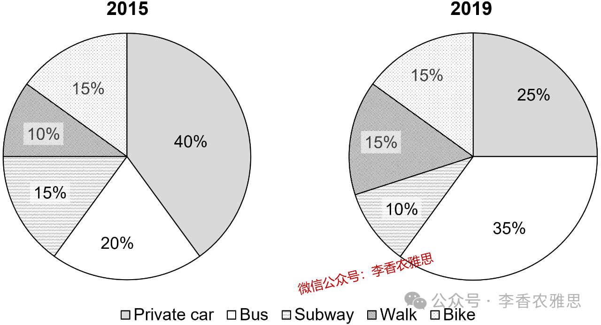

# 2025 年 12 月 6 日雅思写作真题
## Task 1

> **图表类型标注**：饼图（双饼图对比（上学方式））

**The charts below show the percentage of university students choosing different ways to university in the UK in 2015 and 2019.**
**Summarise the information by selecting and reporting main features, and make comparison where relevant.**



The two pie charts illustrate changes in the percentage of UK university students travelling to their campus by private car, bus, subway, walking, and bike in 2015 and 2019. 

As shown, the percentages of students who travelled to school by private car and subway both showed downward trends over the given period. In 2015, those taking private cars accounted for the largest share at 40%, but that figure fell substantially to 25% in 2019, when private cars became the second most common mode of transport. Subway use also declined, decreasing modestly from 15% to 10% and representing the smallest proportion among all categories in 2019.

In contrast, bus travel, walking, and cycling all became more common or maintained a stable share. Bus usage rose sharply from 20% (only half the proportion of private-car users) in 2015 to 35%, making it the most widely used mode of transport in 2019. Similarly, the proportion of those who walked to campus increased, with a 5% rise noted in it, and became equal to that of those who rode a bike (15%), whose share remained unchanged during the five-year period.

Overall, travel by private car and subway declined, whereas the proportions of students walking and taking the bus saw upturns.

---

### 精析

#### ① 结构分析（精简）

本题属于 **Pie Charts（双饼图对比）** 类 Task 1，涉及英国大学生在 2015 年和 2019 年选择不同交通方式（私家车、公交、地铁、步行、自行车）前往大学的比例变化。

本文采用 **"总-分-总"** 三段式结构：

- **Paragraph 1 — Introduction（开头段）**
  - 改写题目要素：`illustrate changes in the percentage of UK university students travelling to their campus by private car, bus, subway, walking, and bike`（替换原题 `show the percentage of university students choosing different ways to university`）
  - 明确对象：UK university students + 时间 2015 and 2019 + 五种交通方式

- **Paragraph 2 — Body Details（主体段：按趋势分组）**
  - **下降组（Decline）**：私家车从 40%（2015 年最大份额）大幅下降至 25%（2019 年第二常见）；地铁从 15% 适度降至 10%（2019 年最小比例）
  - **上升/稳定组（Rise/Stable）**：公交从 20%（仅为私家车用户的一半）急剧升至 35%（2019 年最广泛使用）；步行增加 5% 至 15%；自行车保持 15% 不变

- **Paragraph 3 — Overview（总结段）**
  - 核心发现：私家车和地铁出行下降，而步行和公交比例上升

> **结构亮点**：作者采用"按趋势分组"策略，将五种交通方式分为"下降"和"上升/稳定"两组。这种分组方式避免了按方式逐一描述的冗长，使对比更加鲜明。"In contrast"和"Similarly"的使用使组间和组内对比清晰明了。

#### ② 数据组织与对比策略（标注有效写法）

| 写法 | 原文示例 | 技巧说明 |
|------|---------|---------|
| **趋势概括** | `both showed downward trends over the given period` | 先定性概括，再展开细节 |
| **起点+变化+排名** | `accounted for the largest share at 40%, but that figure fell substantially to 25% in 2019, when private cars became the second most common mode` | 完整描述起点、变化、终点和排名变化 |
| **倍数关系** | `only half the proportion of private-car users` | 用倍数关系突出差距 |
| **排名变化** | `making it the most widely used mode of transport in 2019` | 不仅说增加，还强调排名跃升 |
| **同步对比** | `became equal to that of those who rode a bike (15%), whose share remained unchanged` | 并置两个数据组的变化 |

> **数据亮点**：作者对数据的处理极具层次感——先以"downward trends"和"more common or maintained a stable share"分组，再以"only half the proportion"和"making it the most widely used"标注排名变化。"substantially"和"modestly"的对比使下降幅度描述更加 nuanced。

#### ③ 四项能力维度分析（TA / CC / LR / GRA）

- **TA**：作者采用"按趋势分组"策略，将五种交通方式分为"下降"和"上升/稳定"两组。这种分组方式避免了按方式逐一描述的冗长，使对比更加鲜明。"In contrast"和"Similarly"的使用使组间和组内对比清晰明了。 作者对数据的处理极具层次感——先以"downward trends"和"more common or maintained a stable share"分组，再以"only half the proportion"和"making it the most widely used"标注排名变化。"substantially"和"modestly"的对比使下降幅度描述更加 nuanced。
- **CC**：衔接手段简洁高效——"As shown"将叙述从概括推向细节，"In contrast"标志分组切换，"Similarly"连接相似模式。每个衔接词都与其所连接的数据逻辑高度匹配。
- **LR**：见模块⑤词汇表，含 `illustrate changes in`、`downward trends` 等精准词
- **GRA**：见模块⑤句式亮点

#### ④ 可迁移句型骨架（直接套用）（图表类型：饼图（双饼图对比（上学方式）））

**骨架 1 — 开头改写（表格/图通用）**
> The [chart] illustrates changes in ______ in [entities] in [years], along with ______.

**骨架 2 — 极值+对比（Body 通用）**
> ______ had [number], which was considerably higher than the figures for the other [n] [entities].

**骨架 3 — 排名变化/超越（含动态时）**
> ______ saw the second-largest rise and surpassed ______, with its figure growing from ______ to ______.

**骨架 4 — 双维度收尾（Overview 通用）**
> Overall, ______ had by far the largest number..., while ______ recorded the lowest figures on both measures.

#### ⑤ 衔接 / 词汇 / 句式亮点（去水版）

| 衔接类型 | 原文表达 | 功能 |
|---------|---------|------|
| **概括-具体衔接** | `As shown...` | 从总体观察过渡到具体数据 |
| **对比转折** | `In contrast...` | 引出趋势相反的交通方式 |
| **相似趋势** | `Similarly...` | 连接与前文相似的模式 |
| **让步衔接** | `although...` | 在让步中承认变化有限 |
| **总结衔接** | `Overall...` | 收束全文，给出综合判断 |

> **衔接亮点**：衔接手段简洁高效——"As shown"将叙述从概括推向细节，"In contrast"标志分组切换，"Similarly"连接相似模式。每个衔接词都与其所连接的数据逻辑高度匹配。

| 词汇/短语 | 中文含义 | 词性/用法 | 替代普通表达 |
|-----------|----------|----------|-------------|
| **illustrate changes in** | 呈现…方面的变化 | 动词短语，展示...的变化 | show |
| **downward trends** | 下行走势 | 名词短语，下降趋势 | decreases |
| **accounted for the largest share** | 占据最大份额 | 动词短语，占最大份额 | was the biggest |
| **fell substantially** | 大幅回落 | 动词短语，大幅下降 | dropped a lot |
| **decreasing modestly** | 小幅下降 | 动词短语，适度下降 | went down a little |
| **representing the smallest proportion** | 构成占比最小的一类 | 动词短语，占最小比例 | was the smallest |
| **rose sharply** | 大幅攀升 | 动词短语，急剧上升 | went up quickly |
| **making it the most widely used** | 使其成为使用最普遍的一种 | 动词短语，使其成为最广泛使用的 | becoming the most common |
| **remained unchanged** | 维持原有水平不变 | 动词短语，保持不变 | stayed the same |
| **saw upturns** | 出现回升 | 动词短语，出现上升 | increased |

**1. 趋势+排名变化**
> *"those taking private cars **accounted for the largest share at** 40%, **but that figure fell substantially to** 25% in 2019, **when** private cars **became the second most common mode of transport**"*

**技巧**：用"accounted for the largest share at"描述起点和排名，"but that figure fell substantially to"描述变化和终点，"when"引导定语从句说明排名变化。一句完成"数据+变化+排名"的三重信息。

**2. 倍数+对比**
> *"Bus usage **rose sharply from** 20% (**only half the proportion of** private-car users) in 2015 **to** 35%, **making it the most widely used mode of transport in 2019**"*

**技巧**：用"rose sharply from... to..."描述变化，括号内"only half the proportion of"用倍数关系突出 2015 年的差距，"making it..."现在分词短语说明 2019 年的排名跃升。一句完成"变化+对比+结果"的三重功能。

**3. 同步对比**
> *"the proportion of those who walked to campus **increased**, **with** a 5% rise **noted in it**, and **became equal to** that of those who rode a bike (15%), **whose share remained unchanged** during the five-year period"*

**技巧**：用"with + 名词 + noted"独立主格结构补充变化细节，"became equal to"描述排名变化，"whose share remained unchanged"非限制性定语从句补充自行车的稳定状态。一句完成多组数据的复杂对比。

**4. 总结段对比结构**
> *"travel by private car and subway **declined**, **whereas** the proportions of students walking and taking the bus **saw upturns**"*

**技巧**：用"whereas"连接两个相反趋势，"declined"和"saw upturns"使用不同动词表达相反变化。总结句简洁有力，对比鲜明。

---

#### ⑥ 可提升空间 + 仿写任务

**可提升空间（通用要点，按篇酌情采纳）：**
- Overview 建议前置或明确独立成段，让阅卷人先抓全局（TA 更稳）。
- 双维度数据（如比率/占比）尽量也收进 Overview，避免只在正文提一次。
- 跨段对比（如 A 反超 B）可集中到一句呈现，衔接更紧凑。

**本文针对性可改进点（按篇分析，点到即止）：**
- `with a 5% rise noted in it` 读来别扭，而且回避了具体数值——步行是 10% 升到 15%，直接写 "from 10% to 15%" 既省字又把数据落实。
- Overview 漏了两点主要特征：本图最醒目的变化是公交反超私家车、跃居第一，而自行车是唯一全程持平的方式（15%）。两者补进去，总结才算覆盖全局。
- 用词与题目对象略有偏差：题目问的是 university students 通勤 campus，文中却出现 `travelled to school`；同时 `became more common or maintained a stable share` 这种"或"式概括偏松散，可拆成"两升一平"更利落。

**仿写任务**：用「极值+对比」骨架写一句：描述『2020 年 X 国指标远高于其他三国』。
## Task 2

> **话题与题型标注**：媒体与广告类 · Positive/Negative

**Companies introduce new products regularly and encourage consumers to replace their old products with these new models. Do you think it is a positive or negative development?**

**公司频繁发布新产品并鼓励消费者购买新型号取代老型号。你认为这是一个积极还是消极的发展？**

Companies frequently release new products and encourage consumers to replace older versions. Although a rapid replacement cycle brings merits to the public and supports corporate growth, I believe it is largely a negative trend because it intensifies environmental pressure and promotes unsustainable consumption habits.

公司经常推出新产品并鼓励消费者更换旧型号。尽管快速的更替周期为公众带来好处并助力企业发展，但我认为这一趋势总体上是负面的，因为它加剧了环境压力并助长了不可持续的消费习惯。

Admittedly, the continuous introduction of new models benefits individuals and supports companies' long-term development. From an individual perspective, competition among firms to produce improved versions creates more research positions with better pay, while consumers gain access to devices that are more efficient and reliable. For example, regular upgrades in mobile technology have produced better battery life, faster processors, and stronger data security. More importantly, maintaining a fast pace of product upgrades generates jobs not only in manufacturing but also in marketing, logistics, and retail, all of which provide meaningful employment opportunities for ordinary people. From a company's perspective, especially for industrial giants, identifying fields that require rapid product iteration helps them succeed in fiercely competitive markets. For example, to secure a foothold in the electric vehicle market, Zeekr, a brand owned by Geely, released three generations of the Zeekr 001 in 2024. Although this strategy faced widespread criticism, the brand has since gained a larger market share.

诚然，不断推出新型号有利于个人，也支持企业的长期发展。从个人角度看，企业竞争生产改良版本会创造更多薪酬更高的研究岗位，同时消费者也能获得更高效、更可靠的设备。例如，移动技术的持续升级带来了更长的电池续航、更快的处理器和更安全的数据保护。更重要的是，为了保持产品升级的快节奏，制造业、市场营销、物流及零售等行业都会产生大量就业机会，这些机会为普通人提供了实质性的就业来源。从企业角度看，尤其是大型工业企业，能准确识别需要快速迭代的领域，有助于其在激烈的市场竞争中取得成功。例如，为了在电动车市场站稳脚跟，吉利旗下的极氪在2024 年推出了三代Zeekr 001。尽管该策略饱受批评，但该品牌随后获得了更大的市场份额。

Nevertheless, the environmental harm caused by rapid product turnover and the serious consequences of consumerism are far more significant. An accelerated upgrade cycle amplifies environmental degradation through resource-intensive manufacturing and disposable consumption. As a result of unsustainable buying habits, millions of electronic devices, household appliances, and fashion items end up in landfills each year, which not only depletes natural resources but also damages ecosystems. Equally alarming are the psychological and social effects of consumerism. Through targeted advertising, firms cultivate the belief that older products are inferior, encouraging people, especially young consumers, to equate self-worth with owning the newest model. Consequently, many fall into patterns of excessive spending, accumulate unnecessary debt, and prioritize material acquisition over long-term financial stability. Over time, such behavior fosters a culture in which self-worth is measured by consumption rather than personal achievement, deepening social inequality and life dissatisfaction as those with limited means struggle to keep pace with ever-changing products.

然而，快速产品更替造成的环境破坏以及消费主义的严重后果更为显著。加快的升级周期通过资源密集型制造和一次性消费加剧了环境恶化。由于不具可持续性的消费习惯，每年有数以百万计的电子设备、家电和时尚品被丢弃于垃圾填埋场，这不仅耗尽自然资源，还破坏生态系统。同样令人担忧的是消费主义带来的心理和社会影响。通过定向广告，企业塑造出旧产品“低人一等”的观念，促使人们，尤其是年轻消费者，把自我价值与拥有最新产品联系在一起。因此，许多人陷入过度消费，积累不必要的债务，并把物质获取置于长期财务稳定之上。随着时间推移，这种行为会催生一种文化，即自我价值由消费而非个人成就决定，从而加剧社会不平等和生活不满，因为经济有限的人难以跟上不断变化的产品。

In conclusion, while rapid product replacement yields technological breakthroughs, job creation, and business opportunities, it also accelerates environmental degradation and fuels harmful consumerism. Given its far-reaching ecological, psychological, and social consequences, this trend is ultimately negative.

总之，尽管快速的产品更替带来了技术突破、就业增长和经济机遇，但它同时加速环境恶化并助长有害的消费主义。鉴于其深远的生态、心理及社会影响，这一趋势最终是负面的。

---

### 精析

#### ① 结构分析（精简）

本题属于 **Positive/Negative** 类题型。此类题型的核心策略是：分别讨论利弊，最后给出综合判断。

本文采用 **"利弊-立场"** 四段式结构：

- **Paragraph 1 — Introduction（开头段）**
  - 改写题目（paraphrase）：`Companies frequently release new products and encourage consumers to replace older versions`（替换原题 `Companies introduce new products regularly and encourage consumers to replace their old products`）
  - 表明立场：`Although a rapid replacement cycle brings merits to the public and supports corporate growth, I believe it is largely a negative trend`（承认好处，但总体负面）
  - 预告框架：先讨论好处，再论证弊端更严重

- **Paragraph 2 — Body 1（优点段）**
  - 主题句：`the continuous introduction of new models benefits individuals and supports companies' long-term development`
  - 论点1（个人角度）：企业竞争生产改良版本 → 创造更多薪酬更高的研究岗位 → 消费者获得更高效可靠的设备
  - 举例：移动技术持续升级 → 更长电池续航、更快处理器、更强数据安全
  - 论点2（就业角度）：快速产品升级节奏 → 制造业、市场营销、物流、零售等行业产生大量就业
  - 论点3（企业角度）：准确识别需要快速迭代的领域 → 在激烈市场竞争中取得成功
  - 举例：极氪 2024 年推出三代 Zeekr 001 → 获得更大市场份额

- **Paragraph 3 — Body 2（缺点段）**
  - 主题句：`the environmental harm caused by rapid product turnover and the serious consequences of consumerism are far more significant`
  - 论点1（环境角度）：加速升级周期 → 资源密集型制造和一次性消费 → 环境恶化
  - 因果链：不可持续购买习惯 → 数百万电子设备、家电、时尚品进入垃圾填埋场 → 耗尽自然资源 + 破坏生态系统
  - 论点2（心理社会角度）：定向广告塑造旧产品"低人一等"观念 → 年轻消费者将自我价值与拥有最新产品联系 → 过度消费、积累债务、物质获取优先于财务稳定
  - 深层后果：自我价值由消费而非个人成就决定 → 加剧社会不平等和生活不满

- **Paragraph 4 — Conclusion（结尾段）**
  - 重申立场：`this trend is ultimately negative`
  - 总结升华：加速环境恶化 + 助长有害消费主义

> **结构亮点**：作者采用经典的"先扬后抑"结构。Body 1 从"个人"、"就业"和"企业"三个维度充分展开优点，Body 2 再用"far more significant"有力反驳，从"环境"和"心理社会"两个维度论证弊端。优点段的充分展开使缺点段的反驳更具说服力。

#### ② 论证逻辑链拆解（标注有效写法）

**Body 1（优点段）的逻辑链条：**

```
持续推出新型号有利于个人和企业
    ↓ [机制/原因]
├── [分支1] 个人受益
│   ↓
│   企业竞争生产改良版本
│   ↓
│   创造更多高薪研究岗位
│   ↓
│   消费者获得更高效可靠设备
│   ↓
│   移动技术升级案例验证
│
├── [分支2] 就业创造
│   ↓
│   快速产品升级节奏
│   ↓
│   制造业、营销、物流、零售产生就业
│   ↓
│   为普通人提供实质性就业来源
│
└── [分支3] 企业成功
    ↓
    准确识别快速迭代领域
    ↓
    在激烈市场竞争中取得成功
    ↓
    极氪 2024 年案例验证
```

**Body 2（缺点段）的逻辑链条：**

```
快速产品更替的环境破坏和消费主义后果更为严重
    ↓ [机制/原因]
├── [分支1] 环境破坏
│   ↓
│   加速升级周期 → 资源密集型制造 + 一次性消费
│   ↓
│   不可持续购买习惯
│   ↓
│   数百万产品进入垃圾填埋场
│   ↓
│   耗尽自然资源 + 破坏生态系统
│
└── [分支2] 心理社会影响 [Equally alarming]
    ↓
    定向广告塑造旧产品"低人一等"观念
    ↓
    年轻消费者将自我价值与最新产品联系
    ↓
    过度消费 + 积累债务 + 物质优先于财务稳定
    ↓
    自我价值由消费而非成就决定
    ↓
    加剧社会不平等和生活不满
```

> **逻辑亮点**：缺点段的论证层次分明——从"环境"到"心理社会"层层递进，"Equally alarming"的使用将心理社会影响提升到与环境破坏同等重要的地位。"As a result of→which not only... but also..."的因果链使环境破坏的推导极为清晰。

#### ③ 四项能力维度分析（TA / CC / LR / GRA）

- **TA**：作者采用经典的"先扬后抑"结构。Body 1 从"个人"、"就业"和"企业"三个维度充分展开优点，Body 2 再用"far more significant"有力反驳，从"环境"和"心理社会"两个维度论证弊端。优点段的充分展开使缺点段的反驳更具说服力。 缺点段的论证层次分明——从"环境"到"心理社会"层层递进，"Equally alarming"的使用将心理社会影响提升到与环境破坏同等重要的地位。"As a result of→which not only... but also..."的因果链使环境破坏的推导极为清晰。
- **CC**：衔接手段功能分明——"From an individual perspective→More importantly→From a company's perspective"在优点段内部推进，"Nevertheless→As a result of→Equally alarming→Consequently→Over time"在缺点段内部构建完整因果链。"Equally alarming are..."的倒装句式使心理社会影响获得额外强调。
- **LR**：见模块⑤词汇表，含 `rapid replacement cycle`、`corporate growth` 等精准词
- **GRA**：见模块⑤句式亮点

#### ④ 可迁移句型骨架（直接套用）（题型：Positive/Negative）

**骨架 1 — 积极影响**
> One positive effect of ______ is ______, which contributes to ______.

**骨架 2 — 消极影响**
> On the negative side, ______ could lead to ______.

**骨架 3 — 总体判断**
> Weighing both, the development is more ______ than ______.

#### ⑤ 衔接 / 词汇 / 句式亮点（去水版）

| 衔接类型 | 原文表达 | 功能说明 |
|---------|---------|---------|
| **让步引入** | `Admittedly...` | 承认优点存在 |
| **角度切换** | `From an individual perspective... More importantly... From a company's perspective...` | 在优点段内部分层展开 |
| **例证衔接** | `For example...` | 用具体案例支撑论点 |
| **转折反驳** | `Nevertheless...` | 从优点转向缺点 |
| **递进升级** | `Equally alarming are...` | 在缺点段中升级严重性 |
| **因果衔接** | `As a result of... which not only... but also...` | 构建完整因果链 |
| **总结衔接** | `In conclusion...` | 收束全文，重申立场 |

> **衔接亮点**：衔接手段功能分明——"From an individual perspective→More importantly→From a company's perspective"在优点段内部推进，"Nevertheless→As a result of→Equally alarming→Consequently→Over time"在缺点段内部构建完整因果链。"Equally alarming are..."的倒装句式使心理社会影响获得额外强调。

| 词汇/短语 | 中文含义 | 词性/用法 | 替代普通表达 |
|-----------|----------|----------|-------------|
| **rapid replacement cycle** | 快速的产品更替周期 | 名词短语，快速更替周期 | quickly changing products |
| **corporate growth** | 企业成长壮大 | 名词短语，企业发展 | company growth |
| **long-term development** | 长远发展 | 名词短语，长期发展 | future growth |
| **resource-intensive manufacturing** | 高资源消耗的制造方式 | 名词短语，资源密集型制造 | manufacturing that uses a lot of resources |
| **disposable consumption** | 用完即弃的消费模式 | 名词短语，一次性消费 | throw-away culture |
| **depletes natural resources** | 耗竭自然资源 | 动词短语，耗尽自然资源 | uses up natural resources |
| **targeted advertising** | 精准投放的广告 | 名词短语，定向广告 | specific ads |
| **equate self-worth with** | 把自我价值等同于… | 动词短语，将自我价值等同于 | think self-value is the same as |
| **excessive spending** | 过度支出 | 名词短语，过度消费 | spending too much |
| **material acquisition** | 对物质的占有与获取 | 名词短语，物质获取 | buying things |
| **life dissatisfaction** | 对生活的不满 | 名词短语，生活不满 | unhappiness with life |

**1. 多重结果+例证**
> *"regular upgrades in mobile technology **have produced** better battery life, faster processors, and stronger data security"*

**技巧**：用"have produced"引出三个并列结果（电池续航、处理器、数据安全），"regular upgrades"作主语使句式简洁。"better, faster, stronger"三个比较级形成排比，增强了表达力度。

**2. 因果链式长句**
> *"**As a result of** unsustainable buying habits, millions of electronic devices, household appliances, and fashion items **end up in** landfills each year, **which not only depletes** natural resources **but also damages** ecosystems"*

**技巧**：用"As a result of"引导原因，"end up in"描述结果，"which not only... but also..."定语从句并列两个后果。"millions of"和"each year"强化了问题的规模感。

**3. 倒装强调句**
> *"**Equally alarming are** the psychological and social effects of consumerism"*

**技巧**：用"Equally alarming are..."倒装结构将心理社会影响提升到与环境破坏同等重要的地位。这种倒装句式使论证获得额外的修辞力度。

**4. 多重因果推导**
> *"Through targeted advertising, firms **cultivate the belief that** older products are inferior, **encouraging** people, especially young consumers, **to equate self-worth with** owning the newest model. **Consequently**, many **fall into** patterns of excessive spending, **accumulate** unnecessary debt, and **prioritize** material acquisition over long-term financial stability"*

**技巧**：用"cultivate the belief that..."说明企业策略，"encouraging..."现在分词短语说明直接结果，"Consequently"引出深层后果，"fall into... accumulate... prioritize..."三个并列动词短语描述消费者的行为模式。因果链完整而清晰。

**5. 深层后果推导**
> *"**Over time**, such behavior **fosters a culture in which** self-worth is measured by consumption rather than personal achievement, **deepening** social inequality and life dissatisfaction **as** those with limited means struggle to keep pace with ever-changing products"*

**技巧**：用"Over time"标志时间推移，"fosters a culture in which..."说明文化形成，"deepening..."现在分词短语说明进一步后果，"as"引导原因状语从句解释为何加剧不平等。句式层次极为丰富。

#### ⑥ 可提升空间 + 仿写任务

**可提升空间（通用要点，按篇酌情采纳）：**
- 结论段避免复读开头，应「推进」而非「重复」立场。
- 让步段衔接词（this perspective 等）回指别太远，可加限定词收紧。
- 同一话题词（如 career / benefit）避免三现，用近义替换。

**本文针对性可改进点（按篇分析，点到即止）：**
- 极氪的例子其实"反向站队"：一年内连出三代 001、老车主不满、`faced widespread criticism`，正是频繁换代伤害消费者的典型，把它放在优点段反而给自己的负面立场拆台。更稳的处理是把它移到 Body 2，或在优点段改用一个真正靠迭代赢得口碑的案例。
- `As a result of unsustainable buying habits...` 存在因果倒置：不可持续的消费习惯本身正是企业催促换新的产物，用它当原因等于绕了个圈。改成 "As firms shorten product lifespans, ..." 因果方向才顺。
- 让步段（Body 1）三个分支加两个例子，篇幅几乎与反驳段相当，而 `creates more research positions with better pay` 一句纯属断言、没有任何支撑。既然全文判定为 negative，让步段可压缩到两条并保留最有力的一条例证，把空间让给环境与消费主义的论证。

**仿写任务**：就『社交媒体普及』各写一句积极与消极影响。
