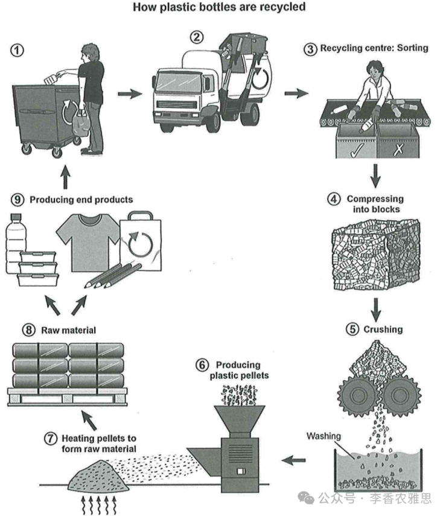

# 2025 年 12 月 20 日雅思写作真题
## Task 1

> **图表类型标注**：流程图（塑料瓶回收）

**The diagram below shows the process for recycling plastic bottles.**
**Summarise the information by selecting and reporting the main features, and make comparisons where relevant.**



The flowchart illustrates the stages involved in recycling plastic bottles. 

In the initial stage, used plastic bottles are disposed of in designated recycling bins and are subsequently collected and transported by a truck to a recycling facility, where they are sorted by workers to remove any non-recyclable materials. Once sorted, the recyclable bottles are compressed into compact blocks, after which they are crushed into small fragments that are then thoroughly washed in preparation for further processing.

In the next stage, the resulting clean plastic fragments are fed into specialized machinery to be converted into plastic pellets. These pellets are then heated and molded to produce raw plastic material in the form of large blocks. 

In the final stage, the raw material is used to manufacture a variety of end products, including clothing, plastic bottles, pencils, and reusable bags, which are subsequently distributed for sale. After these products have been used, they can be recycled again by the same process.

Overall, plastic bottle recycling process consists of nine steps, which involve the collection and sorting of discarded plastic bottles, the crushing and washing of materials prior to plastic pellet production, and the manufacture of recyclable products.

---

### 精析

#### ① 结构分析（精简）

本题属于 **Process Diagram** 类 Task 1，涉及塑料瓶回收的 9 个步骤。

本文采用 **"顺序式"** 三段式结构：

- **Paragraph 1 — Introduction（开头段）**
  - 改写题目要素：`the stages involved in recycling plastic bottles`（替换原题 `the process for recycling plastic bottles`）
  - 明确对象：plastic bottles recycling process

- **Paragraph 2 — Body Details（主体段：按阶段分组）**
  - **Initial stage**：丢弃→收集运输→分类→压缩→粉碎→清洗
  - **Next stage**：碎片→颗粒→加热塑形→原材料大块
  - **Final stage**：制造终端产品→分销销售→再次回收

- **Paragraph 3 — Overview（总结段）**
  - 总结 9 个步骤的三个阶段：收集分类、粉碎清洗、制造产品

> **结构亮点**：本文严格按照流程图的时间顺序展开，用"In the initial stage""In the next stage""In the final stage"清晰划分三个阶段，使复杂的九步流程层次分明。每个阶段内部用被动语态和衔接词串联，逻辑链条完整。

#### ② 数据组织与对比策略（标注有效写法）

| 写法 | 原文示例 | 技巧说明 |
|------|---------|---------|
| **阶段划分** | `In the initial stage... In the next stage... In the final stage` | 将 9 个步骤分为三个阶段，避免流水账 |
| **被动语态链** | `are disposed of... are subsequently collected and transported... are sorted... are compressed...` | 流程图标准写法，强调动作而非执行者 |
| **结果导向** | `the resulting clean plastic fragments` | 用 resulting 承接上一步结果，体现流程连续性 |
| **循环闭合** | `After these products have been used, they can be recycled again by the same process` | 点明回收流程的循环性质 |

> **数据亮点**：本文没有机械罗列每一步，而是将 9 个步骤有机整合为三个阶段，并在结尾点出循环回收的特性，体现了对流程图本质的深刻理解。

#### ③ 四项能力维度分析（TA / CC / LR / GRA）

- **TA**：本文严格按照流程图的时间顺序展开，用"In the initial stage""In the next stage""In the final stage"清晰划分三个阶段，使复杂的九步流程层次分明。每个阶段内部用被动语态和衔接词串联，逻辑链条完整。 本文没有机械罗列每一步，而是将 9 个步骤有机整合为三个阶段，并在结尾点出循环回收的特性，体现了对流程图本质的深刻理解。
- **CC**：本文衔接手段极为丰富，使用了阶段标记、条件连接、结果连接、目的说明等多种方式，使流程描述环环相扣，读者可以轻松跟随步骤推进。
- **LR**：见模块⑤词汇表，含 `designated recycling bins`、`subsequently collected` 等精准词
- **GRA**：见模块⑤句式亮点

#### ④ 可迁移句型骨架（直接套用）（图表类型：流程图（塑料瓶回收））

**骨架 1 — 开头改写（流程图）**
> The diagram outlines the process of ______, from ______ to ______.

**骨架 2 — 阶段串联**
> ______ is first [done], after which it is [done], before finally being [done].

**骨架 3 — 被动/目的**
> ______ is [verb]-ed so that ______ can be [verb]-ed in the next stage.

#### ⑤ 衔接 / 词汇 / 句式亮点（去水版）

| 衔接类型 | 原文表达 | 功能 |
|---------|---------|------|
| **阶段衔接** | `In the initial stage... In the next stage... In the final stage` | 按时间顺序推进，建立清晰框架 |
| **因果衔接** | `Once sorted, the recyclable bottles are compressed...` | 用 Once 表示条件达成后的下一步 |
| **结果衔接** | `after which they are crushed into small fragments` | 用 after which 连接前后步骤 |
| **目的衔接** | `in preparation for further processing` | 说明当前步骤的目的 |
| **总结衔接** | `Overall, plastic bottle recycling process consists of nine steps...` | 用 consists of 总结全过程 |

> **衔接亮点**：本文衔接手段极为丰富，使用了阶段标记、条件连接、结果连接、目的说明等多种方式，使流程描述环环相扣，读者可以轻松跟随步骤推进。

| 词汇/短语 | 中文含义 | 词性/用法 | 替代普通表达 |
|-----------|----------|----------|-------------|
| **designated recycling bins** | 指定的回收箱 | 名词短语 | special bins |
| **subsequently collected** | 随后被收集 | 副词+动词 | then collected |
| **compressed into compact blocks** | 被压缩成密实的方块 | 动词短语 | pressed into blocks |
| **thoroughly washed** | 被彻底清洗 | 副词+动词 | cleaned well |
| **fed into specialized machinery** | 被送入专用机械设备 | 动词短语 | put into machines |
| **converted into plastic pellets** | 被转化为塑料颗粒 | 动词短语 | made into pellets |
| **manufacture a variety of end products** | 生产出多种终端产品 | 动词短语 | make products |
| **discarded plastic bottles** | 废弃的塑料瓶 | 名词短语 | used bottles |

**1. 长被动语态串联句**
> *"In the initial stage, used plastic bottles are disposed of in designated recycling bins and are subsequently collected and transported by a truck to a recycling facility, where they are sorted by workers to remove any non-recyclable materials."*

**技巧**：一句之内用三个被动语态（are disposed of, are collected and transported, are sorted）串联起回收的前三个步骤，信息密度极高且符合流程图客观描述的要求。

**2. 条件状语+主句结构**
> *"**Once sorted**, the recyclable bottles are compressed into compact blocks, **after which** they are crushed into small fragments that are then thoroughly washed in preparation for further processing."*

**技巧**：用 Once sorted 省略主语的条件状语开头，再用 after which 引导非限制性定语从句连接下一步，最后用 that 引导定语从句补充说明，句式层层嵌套却井然有序。

**3. 目的状语收尾句**
> *"...are fed into specialized machinery to be converted into plastic pellets."*

**技巧**：用 to be converted into 不定式表目的，简洁说明上一步动作的目标，使流程描述目的明确。

**4. 总结归纳句**
> *"Overall, plastic bottle recycling process consists of nine steps, which involve the collection and sorting of discarded plastic bottles, the crushing and washing of materials prior to plastic pellet production, and the manufacture of recyclable products."*

**技巧**：用 consists of 总领，再用 which involve 引导定语从句，将 9 个步骤归纳为三个核心阶段，最后用 prior to 精确标明时间先后，总结精准到位。

---

#### ⑥ 可提升空间 + 仿写任务

**可提升空间（通用要点，按篇酌情采纳）：**
- Overview 建议前置或明确独立成段，让阅卷人先抓全局（TA 更稳）。
- 双维度数据（如比率/占比）尽量也收进 Overview，避免只在正文提一次。
- 跨段对比（如 A 反超 B）可集中到一句呈现，衔接更紧凑。

**本文针对性可改进点（按篇分析，点到即止）：**
- Overview 漏掉了本图最核心的整体特征——这是一个**闭环**：成品用完后重新回到回收箱。正文最后一句已经写到了，Overview 却只罗列三个阶段，等于把最有价值的概括让给了正文。
- `Overall, plastic bottle recycling process consists of nine steps` 缺定冠词，应为 `the plastic bottle recycling process`；另 `transported by a truck` 表泛指时写 `by truck` 更地道。
- 段落配重不均：第二段一口气承担了投放、收运、分拣、压块、破碎、清洗六个环节，后两段各只有两三步。把"清洗"挪到第三段开头，前后长度会均衡得多。

**仿写任务**：用「极值+对比」骨架写一句：描述『2020 年 X 国指标远高于其他三国』。
## Task 2

> **话题与题型标注**：健康类 · Discuss Both Views

**In order to be successful in sport, some people think it is essential to have a good coach. Others believe that natural ability is more important. Discuss both views and give your own opinion.**

**为了在体育方面取得成功，一些人认为有一位好教练很比较；另外一些人认为天赋更重要。讨论这两个观点并给出自己的观点。**

Some argue that an outstanding coach is essential for transforming potential into achievement, while others regard natural talent as the foundation of sporting success. I believe coaching and innate ability should work together to achieve success in competitions, with both gifted talent and professional coaching being decisive factors in the long term.

一些人认为，优秀的教练对于将潜力转化为成就至关重要，而另一些人则认为天赋是体育成功的基础。我认为，要在竞技体育中取得成功，训练指导与先天能力应当相互配合，长期来看，卓越的天赋与专业的教练同样具有决定性作用。

Some claim that a skilled coach plays a decisive role by shaping athletes with raw potential into consistent performers and maximizing their long-term performance. Coaches help athletes set realistic goals, adapt training methods, and overcome performance plateaus. Through effective coaching, not only can athletes' technical proficiency be improved, but their tactical awareness, discipline, and psychological resilience can also be developed, all of which are essential for success in competitive sport. However, many talented individuals fail to reach elite levels due to poor guidance or a lack of structured training designed by qualified coaches. Even worse, some athletes suffer training-related injuries during regular training and experience psychological stress during international competitions, whereas less gifted athletes often outperform expectations under expert coaching.

一些人认为，优秀的教练在将具备原始潜力的运动员塑造成稳定发挥的选手方面起着关键的作用，并能最大限度地提升其长期表现。教练能够帮助运动员设定现实目标、调整训练方法并突破成绩瓶颈。通过有效的指导，不仅可以提高运动员的技术水平，还能培养其战术意识、自律性以及心理韧性，而这些都是在竞技体育中取得成功所必需的。然而，许多天赋出众的运动员由于缺乏科学指导或系统化训练，未能跻身顶级水平。更为严重的是，一些运动员在日常训练中遭受训练相关的伤病，并在国际赛事中承受巨大的心理压力，而相较之下，一些天赋并不突出的运动员却在专业教练的指导下超出预期地取得成功。

On the other hand, those who regard natural ability as a more influential factor in sporting success argue that innate physical and mental traits largely determine an athlete's potential ceiling. From a practical perspective, achieving championships in highly competitive sports requires certain genetic attributes, such as explosive speed, endurance, hand–eye coordination, and fast reaction times, all of which cannot be fully developed through training alone. In elite competitions, where performance margins are narrow, without a certain level of natural aptitude, it is difficult to reach the top, regardless of how hard one trains. Although average athletes may develop sufficient skills to win at lower levels, top-level athletes with exceptional talent often integrate personal experience and intuition into their performance, breaking records through innovative approaches that attract widespread admiration and imitation.

另一方面，强调先天能力更重要的人认为，运动员的身体和心理天赋在很大程度上决定了其发展上限。从现实角度来看，在高度竞争的体育项目中夺得冠军往往需要特定的遗传优势，例如爆发力、耐力、手眼协调能力以及快速反应能力，而这些并不能完全通过后天训练获得。在顶级赛事中，由于成绩差距极其微小，如果缺乏一定程度的先天优势，无论多么努力训练，也很难登上巅峰。尽管普通运动员可能在较低层级取得胜利，但真正的顶尖运动员往往凭借卓越的天赋，将个人经验和直觉融入比赛表现之中，通过创新方式打破纪录，赢得广泛的赞赏与模仿。

In my view, natural ability and appropriate coaching are both of great importance. Talent may open the door for a sports participant, but state-of-the-art coaching determines how far an athlete can progress, as professional guidance ultimately distinguishes champions from other gifted competitors.

在我看来，先天能力与恰当的训练指导同等重要。天赋或许能为运动员打开大门，但先进而专业的指导决定了其能够走多远，因为正是高质量的教练支持最终将冠军与其他天赋出众的选手区分开来。

In conclusion, natural talent provides the essential physical and mental foundation for sporting excellence, while professional coaching refines and sustains performance. When innate ability is guided by high-quality coaching, athletes can maximize their potential and achieve long-term success at the highest competitive levels.

总而言之，先天才能为体育卓越提供了必要的身心基础，而专业教练则对运动表现进行完善与维持。当先天能力在高质量指导下得以发挥时，运动员才能最大化其潜力，并在最高水平的竞技舞台上取得长期成功。

---

### 精析

#### ① 结构分析（精简）

本题属于 **Discuss Both Views** 类题型。此类题型的核心策略是：分别论述双方观点，最后给出自己的立场。

本文采用 **"平衡-立场"** 四段式结构：

- **Paragraph 1 — Introduction（开头段）**
  - 改写题目（paraphrase）：`Some argue that an outstanding coach is essential for transforming potential into achievement, while others regard natural talent as the foundation of sporting success`（替换原题 `some people think it is essential to have a good coach. Others believe that natural ability is more important`）
  - 表明立场：`coaching and innate ability should work together`（双方同等重要）
  - 预告框架：先论述教练的重要性，再论述天赋的重要性，最后给出综合观点

- **Paragraph 2 — Body 1（教练方观点）**
  - 主题句：`a skilled coach plays a decisive role by shaping athletes with raw potential into consistent performers`
  - 论点1：教练帮助设定目标、调整训练、突破瓶颈
  - 论点2：有效指导提升技术、战术意识、纪律性和心理韧性
  - 论点3：缺乏指导导致天赋选手无法达到精英水平

- **Paragraph 3 — Body 2（天赋方观点）**
  - 主题句：`innate physical and mental traits largely determine an athlete's potential ceiling`
  - 论点1：竞技体育需要遗传属性（爆发力、耐力等）
  - 论点2：精英赛事中天赋决定上限
  - 论点3：顶尖运动员将经验和直觉融入表现

- **Paragraph 4 — Conclusion（结尾段）**
  - 重申立场：`natural talent provides the essential... foundation, while professional coaching refines and sustains performance`
  - 总结升华：天赋与指导结合才能最大化潜力

> **结构亮点**：本文采用经典的"双方各一段+自己立场"结构，每段内部都遵循"主题句→分论点→具体说明/对比"的递进逻辑。特别值得注意的是，作者在论述教练重要性时，不仅正面论证，还用"However"转折指出缺乏教练指导的负面后果，增强了说服力。

#### ② 论证逻辑链拆解（标注有效写法）

**Body 1（教练方）的逻辑链条：**

```
优秀教练
    ↓ [核心作用]
→ 将原始潜力塑造成稳定表现
    ↓ [具体机制]
├── 帮助设定现实目标
├── 调整训练方法
└── 突破成绩瓶颈
    ↓ [能力提升]
→ 不仅提高技术 proficiency
    ↓
    还培养战术意识、纪律性、心理韧性
    ↓ [反面论证]
    然而，许多天赋选手因缺乏指导未能达到精英水平
    ↓ [对比]
    天赋不突出者却在专业教练指导下超出预期
```

**Body 2（天赋方）的逻辑链条：**

```
先天能力
    ↓ [核心论点]
→ 决定运动员潜力上限
    ↓ [具体表现]
├── 遗传属性：爆发力、耐力、手眼协调、快速反应
│   ↓
│   无法完全通过训练获得
│
└── 精英赛事中成绩差距微小
    ↓
    缺乏天赋难以登顶
    ↓ [顶尖选手特征]
    将个人经验和直觉融入表现
    ↓
    通过创新方式打破纪录
```

> **逻辑亮点**：本文论证采用了"正面论证+反面论证+对比论证"的组合策略。在教练段中，用"However"引出反面案例（天赋选手因缺乏指导而失败），再用"whereas"对比（天赋不突出者在教练指导下成功），形成强烈反差，极具说服力。

#### ③ 四项能力维度分析（TA / CC / LR / GRA）

- **TA**：本文采用经典的"双方各一段+自己立场"结构，每段内部都遵循"主题句→分论点→具体说明/对比"的递进逻辑。特别值得注意的是，作者在论述教练重要性时，不仅正面论证，还用"However"转折指出缺乏教练指导的负面后果，增强了说服力。 本文论证采用了"正面论证+反面论证+对比论证"的组合策略。在教练段中，用"However"引出反面案例（天赋选手因缺乏指导而失败），再用"whereas"对比（天赋不突出者在教练指导下成功），形成强烈反差，极具说服力。
- **CC**：本文衔接手段多样，尤其在教练段中使用了"However""Even worse""whereas"等表示转折和对比的衔接词，使论证从正面到反面、从优势到劣势层层推进，逻辑张力十足。
- **LR**：见模块⑤词汇表，含 `transforming potential into achievement`、`plays a decisive role` 等精准词
- **GRA**：见模块⑤句式亮点

#### ④ 可迁移句型骨架（直接套用）（题型：Discuss）

**骨架 1 — 先退后进亮立场（Intro）**
> Although ______ deserves a central place because ______, I disagree with the view that ______.

**骨架 2 — 分类论证起手（Body）**
> From the perspective of ______, doing X helps ______ and ______. Meanwhile, X also offers ______ that go beyond ______.

**骨架 3 — 抽象→具体例证（Body）**
> For example, a course on ______ may show how ______ have harmed ______, as illustrated by ______.

#### ⑤ 衔接 / 词汇 / 句式亮点（去水版）

| 衔接类型 | 原文表达 | 功能说明 |
|---------|---------|---------|
| **立场预告** | `I believe coaching and innate ability should work together` | 开头段明确预告双方结合立场 |
| **观点切换** | `On the other hand, those who regard natural ability...` | 从教练方切换到天赋方 |
| **转折衔接** | `However, many talented individuals fail...` | 在教练段内部引入反面论证 |
| **对比衔接** | `whereas less gifted athletes often outperform expectations` | 用 whereas 形成鲜明对比 |
| **让步衔接** | `Although average athletes may develop sufficient skills...` | 先让步再强调天赋的重要性 |
| **总结衔接** | `In conclusion... When innate ability is guided by...` | 收束全文并升华主题 |

> **衔接亮点**：本文衔接手段多样，尤其在教练段中使用了"However""Even worse""whereas"等表示转折和对比的衔接词，使论证从正面到反面、从优势到劣势层层推进，逻辑张力十足。

| 词汇/短语 | 中文含义 | 词性/用法 | 替代普通表达 |
|-----------|----------|----------|-------------|
| **transforming potential into achievement** | 把潜力转化为实绩 | 动词短语 | making potential into success |
| **plays a decisive role** | 起决定性作用 | 动词短语 | is very important |
| **raw potential** | 未经雕琢的原始潜力 | 名词短语 | natural ability |
| **performance plateaus** | 成绩停滞的瓶颈期 | 名词短语 | performance stops improving |
| **technical proficiency** | 技术娴熟程度 | 名词短语 | technical skills |
| **psychological resilience** | 心理韧性、抗压能力 | 名词短语 | mental strength |
| **innate physical and mental traits** | 先天的身体与心理特质 | 名词短语 | natural abilities |
| **potential ceiling** | 潜力的天花板、上限 | 名词短语 | maximum potential |
| **state-of-the-art coaching** | 顶尖水准的执教 | 名词短语 | good coaching |

**1. 倒装强调句**
> *"Through effective coaching, **not only can** athletes' technical proficiency **be improved**, but their tactical awareness, discipline, and psychological resilience **can also be developed**, all of which are essential for success in competitive sport."*

**技巧**：用 not only... but... also 倒装结构强调教练的多重作用，再用 all of which 引导非限制性定语从句总结，句式复杂而富有节奏感。

**2. 让步转折复合句**
> *"**Although** average athletes may develop sufficient skills to win at lower levels, top-level athletes with exceptional talent often integrate personal experience and intuition into their performance..."*

**技巧**：用 Although 引导让步从句，先承认普通运动员的可能性，再转折强调顶尖运动员的独特优势，使论证更加全面和审慎。

**3. 条件结果推演句**
> *"In elite competitions, where performance margins are narrow, without a certain level of natural aptitude, it is difficult to reach the top, regardless of how hard one trains."*

**技巧**：用 where 引导非限制性定语从句补充背景，再用 without... it is difficult to... 的句型强调必要条件，最后用 regardless of 排除干扰因素，层层推进论证。

**4. 对比总结句**
> *"Talent may open the door for a sports participant, but state-of-the-art coaching determines how far an athlete can progress, as professional guidance ultimately distinguishes champions from other gifted competitors."*

**技巧**：用"开门"与"走多远"的比喻形成对比，再用 as 引导原因从句解释核心观点，将抽象道理具象化，极具说服力。

#### ⑥ 可提升空间 + 仿写任务

**可提升空间（通用要点，按篇酌情采纳）：**
- 结论段避免复读开头，应「推进」而非「重复」立场。
- 让步段衔接词（this perspective 等）回指别太远，可加限定词收紧。
- 同一话题词（如 career / benefit）避免三现，用近义替换。

**本文针对性可改进点（按篇分析，点到即止）：**
- 全文自始至终没有一个具体例子——没有运动员、没有队伍、没有项目，双方论证都停在"教练能…""天赋决定…"的概括层。哪怕只补一个（如某短跑选手换教练后成绩突破），说服力就完全不同。
- 立场三度移位：开头说两者"should work together"、同等决定；第四段却断言 `coaching determines how far an athlete can progress`，明显偏向教练；结论又退回并列。建议全篇统一为"天赋定下限、教练定上限"这一条清晰主线。
- `Even worse, some athletes suffer training-related injuries... and experience psychological stress during international competitions` 与本段"缺乏优质执教"的主线断了链——受伤和赛场压力是否因缺教练而起，句中没有交代。补一个 "without professional supervision" 之类的限定，因果才闭合。另注意 Body 1 以 `Some claim that` 起头，与 Body 2 的 `On the other hand` 不对仗。

**仿写任务**：就本题用骨架写一句你的核心论证。
