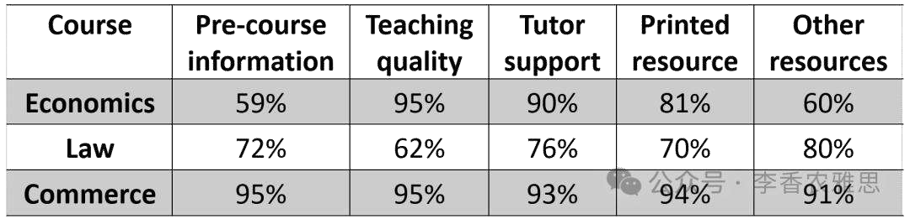

# 2025 年 12 月 27 日雅思写作真题
## Task 1

> **图表类型标注**：表格（大学课程评价）

**The table below shows the information about the percentage of the first-year university students’ rating at “very good” about five aspects of their courses. Summarise the information by selecting and reporting the main features, and make comparisons where relevant.**



The table illustrates the percentages of first-year university students who rate pre-course information, teaching quality, tutor support, printed resources, and other resources as “very good” in three disciplines: economics, law, and commerce. 

As shown, commerce achieves the highest satisfaction levels in every category, with figures ranging from 91% to 95%. Notably, both pre-course information and teaching quality are rated highly at 95%, followed by printed resources, with 94% of freshmen students rating them as “very good”. Although other resources are rated at a slightly lower level of 91%, the figure is still much higher than those recorded for the other two subjects.

In contrast, economics receives a more uneven rating. Although an overwhelming 95% of students praise its teaching quality and 90% rate tutor support very positively, satisfaction with pre-course information and other resources is the lowest recorded, at 59% and 60%, respectively. 

Regarding law, it occupies a middle position overall. While most students give favourable ratings to other resources (80%), teaching quality is rated relatively poorly, with the data on it registering at 62%, which is noticeably below the figures for the other two courses.

Overall, commerce receives consistently high evaluations in all five categories, clearly outperforming the other two courses; meanwhile, economics shows a mixed profile, with very strong ratings for teaching-related aspects but weaker scores for information and additional resources.

---

### 精析

#### ① 结构分析（精简）

本题属于 **Table** 类 Task 1，涉及 3 个学科（economics, law, commerce）在 5 个课程维度上的满意度百分比数据。

本文采用 **"总-分-总"** 三段式结构：

- **Paragraph 1 — Introduction（开头段）**
  - 改写题目要素：`the percentages of first-year university students who rate... as "very good"`（替换原题 `the percentage of the first-year university students' rating at "very good"`）
  - 明确对象：pre-course information, teaching quality, tutor support, printed resources, other resources + 三个学科

- **Paragraph 2 — Body Details（主体段：按学科分组）**
  - **Commerce（最高组）**：所有类别满意度最高（91%-95%），pre-course information 和 teaching quality 达 95%
  - **Economics（波动组）**：teaching quality 95%、tutor support 90%，但 pre-course information 59%、other resources 60%
  - **Law（中间组）**：other resources 80%，但 teaching quality 仅 62%

- **Paragraph 3 — Overview（总结段）**
  - Commerce 全面领先
  - Economics 表现参差，教学相关强但信息和资源弱

> **结构亮点**：本文按"最高-波动-中间"的大小分组策略极为高效，将三个学科按整体表现排序，避免了按学科逐一罗列的机械写法。Commerce 先写因其全面领先最具概括性，Economics 再写因其波动最大最具分析价值，Law 最后写因其居中可作为参照。

#### ② 数据组织与对比策略（标注有效写法）

| 写法 | 原文示例 | 技巧说明 |
|------|---------|---------|
| **范围概括** | `with figures ranging from 91% to 95%` | 用范围代替逐一列举，简洁高效 |
| **排名顺序** | `followed by printed resources, with 94%` | 用 followed by 表明数据排名 |
| **极值对比** | `satisfaction... is the lowest recorded, at 59% and 60%, respectively` | 强调最低值并精确标注 |
| **跨学科对比** | `which is noticeably below the figures for the other two courses` | 将单个数据与其他学科对比 |
| **综合对比** | `clearly outperforming the other two courses` | 用 outperform 概括整体优势 |

> **数据亮点**：作者精准选择了每个学科的关键数据点（最高值、最低值、异常值）进行描述，而非罗列所有 15 个数据。例如 Commerce 只提 95% 和 91%，Economics 突出 95% 与 59% 的反差，数据选择策略极具针对性。

#### ③ 四项能力维度分析（TA / CC / LR / GRA）

- **TA**：本文按"最高-波动-中间"的大小分组策略极为高效，将三个学科按整体表现排序，避免了按学科逐一罗列的机械写法。Commerce 先写因其全面领先最具概括性，Economics 再写因其波动最大最具分析价值，Law 最后写因其居中可作为参照。 作者精准选择了每个学科的关键数据点（最高值、最低值、异常值）进行描述，而非罗列所有 15 个数据。例如 Commerce 只提 95% 和 91%，Economics 突出 95% 与 59% 的反差，数据选择策略极具针对性。
- **CC**：本文衔接词使用精准且多样，从"As shown"总体引入，到"In contrast"转换学科，再到"Regarding"补充说明，层次分明。尤其"Although"让步衔接的使用，使 Commerce 段的描述更加客观全面。
- **LR**：见模块⑤词汇表，含 `achieves the highest satisfaction levels`、`ranging from... to` 等精准词
- **GRA**：见模块⑤句式亮点

#### ④ 可迁移句型骨架（直接套用）（图表类型：表格（大学课程评价））

**骨架 1 — 开头改写（表格/图通用）**
> The [chart] illustrates changes in ______ in [entities] in [years], along with ______.

**骨架 2 — 极值+对比（Body 通用）**
> ______ had [number], which was considerably higher than the figures for the other [n] [entities].

**骨架 3 — 排名变化/超越（含动态时）**
> ______ saw the second-largest rise and surpassed ______, with its figure growing from ______ to ______.

**骨架 4 — 双维度收尾（Overview 通用）**
> Overall, ______ had by far the largest number..., while ______ recorded the lowest figures on both measures.

#### ⑤ 衔接 / 词汇 / 句式亮点（去水版）

| 衔接类型 | 原文表达 | 功能 |
|---------|---------|------|
| **总体衔接** | `As shown, commerce achieves the highest satisfaction levels in every category` | 先给出总体判断，再展开细节 |
| **递进衔接** | `Notably, both pre-course information and teaching quality are rated highly at 95%, followed by...` | 用 Notably 引出重点，followed by 延续排名 |
| **让步衔接** | `Although other resources are rated at a slightly lower level of 91%...` | 先让步再转折，突出 Commerce 的全面优势 |
| **对比衔接** | `In contrast, economics receives a more uneven rating` | 转向下一个学科，形成对比 |
| **补充衔接** | `Regarding law, it occupies a middle position overall` | 用 Regarding 引出最后一个学科 |

> **衔接亮点**：本文衔接词使用精准且多样，从"As shown"总体引入，到"In contrast"转换学科，再到"Regarding"补充说明，层次分明。尤其"Although"让步衔接的使用，使 Commerce 段的描述更加客观全面。

| 词汇/短语 | 中文含义 | 词性/用法 | 替代普通表达 |
|-----------|----------|----------|-------------|
| **achieves the highest satisfaction levels** | 取得最高的满意度水平 | 动词短语 | has the highest scores |
| **ranging from... to** | 取值区间从…到… | 介词短语 | from... to |
| **rated highly at** | 获得高达…的评价 | 动词短语 | got high scores of |
| **followed by** | 紧随其后的是 | 动词短语 | then |
| **an overwhelming 95%** | 高达 95% 的压倒性比例 | 程度修饰 | a very high 95% |
| **the lowest recorded** | 所录得的最低值 | 形容词短语 | the lowest |
| **occupies a middle position** | 处于居中位置 | 动词短语 | is in the middle |
| **noticeably below** | 明显低于 | 程度修饰 | much lower than |
| **clearly outperforming** | 明显优于、全面胜过 | 动词短语 | much better than |
| **a mixed profile** | 好坏参半的整体表现 | 名词短语 | mixed results |

**1. 伴随状语+定语从句复合句**
> *"Notably, both pre-course information and teaching quality are rated highly at 95%, **followed by** printed resources, **with** 94% of freshmen students rating them as 'very good'."*

**技巧**：用 followed by 连接排名，再用 with 独立主格结构补充具体数据，一句之内完成排名和数据的完整描述。

**2. 让步转折复合句**
> *"**Although** other resources are rated at a slightly lower level of 91%, the figure is still much higher than those recorded for the other two subjects."*

**技巧**：用 Although 引导让步从句，先承认 Commerce 的最低值，再用 still much higher than 转折强调其相对优势，使描述更加客观。

**3. 多数据并列句**
> *"**Although** an overwhelming 95% of students praise its teaching quality and 90% rate tutor support very positively, satisfaction with pre-course information and other resources is the lowest recorded, at 59% and 60%, respectively."*

**技巧**：用 Although 引导让步从句包含两个高数据（95%、90%），主句再用 the lowest recorded 点出两个低数据（59%、60%），形成强烈反差，最后以 respectively 精确对应，信息密度极高。

**4. 分词短语总结句**
> *"Overall, commerce receives consistently high evaluations in all five categories, **clearly outperforming** the other two courses; meanwhile, economics shows a mixed profile, **with** very strong ratings for teaching-related aspects but weaker scores for information and additional resources."*

**技巧**：用 clearly outperforming 现在分词短语作伴随状语概括 Commerce 的优势，再用 with 复合结构描述 Economics 的参差表现，最后用 meanwhile 连接两个学科的对比，总结全面而精炼。

---

#### ⑥ 可提升空间 + 仿写任务

**可提升空间（通用要点，按篇酌情采纳）：**
- Overview 建议前置或明确独立成段，让阅卷人先抓全局（TA 更稳）。
- 双维度数据（如比率/占比）尽量也收进 Overview，避免只在正文提一次。
- 跨段对比（如 A 反超 B）可集中到一句呈现，衔接更紧凑。

**本文针对性可改进点（按篇分析，点到即止）：**
- 开篇断言与后文自相矛盾：第二段说 commerce `achieves the highest satisfaction levels in every category`，第三段却写 economics 的 teaching quality 也是 95%。教学质量一项是并列第一，需改为 "the highest or joint-highest"。
- 数据覆盖不均：law 只报了 other resources（80%）和 teaching quality（62%）两项，另外三项一字未提，Overview 也整段跳过了 law。补一句 law 的整体区间，三个学科才算写平。
- 细节两处可打磨：`freshmen students` 语义重复，freshmen 本身即指新生；`91%... much higher than those recorded for the other two subjects` 对法学的 80% 而言，much 略夸张，用 higher than 或 clearly above 更贴合数据。

**仿写任务**：用「极值+对比」骨架写一句：描述『2020 年 X 国指标远高于其他三国』。
## Task 2

> **话题与题型标注**：犯罪与法律类 · Agree/Disagree

**Some people think that the best way to improve road safety is to increase the minimum legal age for driving a car or motorbike. To what extent do you agree or disagree?**

**有些人认为，提高驾驶汽车或摩托车的最低法定年龄是改善道路安全的最佳方式。你在多大程度上同意或不同意这一观点？**

Some people believe that raising the minimum legal age for driving vehicles is a decisive solution to improving road safety. I disagree that increasing the minimum age requirement for obtaining a driving license is the most effective approach to ensuring safer roads.

一些人认为，提高驾驶车辆的最低法定年龄是改善道路安全的一种决定性解决方案。我不同意将获取驾驶执照的最低年龄上调是确保道路更加安全的最有效途径。

Traffic accidents are generally caused by complex road conditions and illegal driving behaviors, such as drunk driving, fatigue driving, and reckless manoeuvres. These behaviors can be exhibited by drivers of any age and are not exclusive to young people. Although a considerable number of accidents involve novice drivers who lack sufficient experience to identify hazards and drive defensively in heavy traffic, prohibiting them from driving a car or motorbike until they reach a more mature age is unlikely to reduce accident rates. Rather, such restrictions may delay the accumulation of essential driving experience and hinder young drivers' ability to respond appropriately to potentially dangerous situations, both of which are necessary for safe driving. Under these circumstances, comprehensive regulatory measures, rather than a simple increase in the prescribed minimum driving age, would be more effective in enhancing road safety.

交通事故通常由复杂的道路状况和违法驾驶行为引发，例如酒后驾驶、疲劳驾驶以及鲁莽操作。这些行为可能出现在任何年龄段的驾驶者身上，并非年轻人所独有。尽管相当数量的交通事故涉及缺乏足够经验、难以及时识别风险并在繁忙交通中进行防御性驾驶的新手司机，但在其达到所谓“更成熟”的年龄之前禁止其驾驶汽车或摩托车，并不太可能降低事故发生率。相反，这类限制措施可能会延缓必要驾驶经验的积累，并削弱年轻驾驶者在潜在危险交通情境中作出恰当反应的能力，而这两点恰恰都是安全驾驶所必需的。在这种情况下，与其简单地提高法定最低驾驶年龄，不如采取更为全面的监管措施来提升道路安全，其效果将更加显著。

To improve road safety in a meaningful way, extensive practical training combined with stricter driving license examinations should be regarded as essential prerequisites for developing driving competence. Many accidents occur primarily due to poor concentration and insufficient awareness of the surrounding road environment. Allowing young people to drive legally and gain real-world experience can gradually reduce the risk of accidents associated with inexperience. Beyond individual skill development, automobile manufacturers also have a responsibility to improve road safety by advancing reliable driver-assistance technologies. For instance, Huawei's Autonomous Driving Solution 4.0 aims to make driving safer and less stressful by compensating for drivers' limited experience and lapses in concentration, thereby providing substantial safety margins. Such technological innovations suggest that autonomous driving, even without continuous human intervention, represents a promising approach to reducing traffic accidents.

要切实改善道路安全，应将系统而充分的实践训练与更加严格的驾驶执照考试视为培养驾驶能力的基本前提。许多交通事故的发生主要源于驾驶时注意力不集中以及对周围道路环境认知不足。允许年轻人合法上路驾驶并积累真实的道路经验，有助于逐步降低因经验不足而引发事故的风险。除个人技能培养之外，汽车制造商也有责任通过推进可靠的驾驶辅助技术来提升道路安全。例如，华为推出的自动驾驶解决方案4.0 旨在通过弥补驾驶者经验不足和注意力分散的问题，使驾驶过程更加安全、更加轻松，从而提供更大的安全余量。这类技术创新表明，即便在不需要持续人工干预的情况下，自动驾驶仍有望成为减少交通事故的一种前景可观的途径。

In conclusion, traffic accidents stem from diverse factors affecting drivers of all ages, rather than age alone. Delaying driving eligibility may hinder experience accumulation, whereas stricter training systems and advanced driver-assistance technologies offer more practical and sustainable solutions for enhancing road safety.

总而言之，交通事故源于多种影响不同年龄驾驶者的因素，而非仅仅由年龄决定。推迟驾驶资格的获取可能会阻碍驾驶经验的积累，而更为严格的培训体系与先进的驾驶辅助技术，才是提升道路安全更加切实且可持续的解决方案。

---

### 精析

#### ① 结构分析（精简）

本题属于 **Agree/Disagree** 类题型。此类题型的核心策略是：明确表明立场，然后展开论证。

本文采用 **"让步-反驳-建议"** 四段式结构：

- **Paragraph 1 — Introduction（开头段）**
  - 改写题目（paraphrase）：`raising the minimum legal age for driving vehicles is a decisive solution to improving road safety`（替换原题 `the best way to improve road safety is to increase the minimum legal age for driving`）
  - 表明立场：`I disagree that increasing the minimum age requirement... is the most effective approach`（明确反对）
  - 预告框架：先反驳年龄论，再提出更有效的措施

- **Paragraph 2 — Body 1（反驳段）**
  - 主题句：`Traffic accidents are generally caused by complex road conditions and illegal driving behaviors`
  - 论点1：危险驾驶行为（酒驾、疲劳驾驶）不限于年轻人
  - 论点2：限制年龄可能延缓经验积累
  - 论点3：全面监管措施比单纯提高年龄更有效

- **Paragraph 3 — Body 2（建议段）**
  - 主题句：`extensive practical training combined with stricter driving license examinations should be regarded as essential prerequisites`
  - 论点1：实践训练和严格考试培养驾驶能力
  - 论点2：允许年轻人积累经验可降低事故风险
  - 论点3：驾驶辅助技术（如华为自动驾驶）可弥补经验不足

- **Paragraph 4 — Conclusion（结尾段）**
  - 重申立场：`traffic accidents stem from diverse factors... rather than age alone`
  - 总结升华：培训体系和技术才是更实际的解决方案

> **结构亮点**：本文采用"先破后立"的策略，先系统反驳"提高年龄"观点的合理性，再提出自己的解决方案（培训+技术）。这种结构使论证从否定到肯定层层推进，说服力极强。尤其值得学习的是，作者在反驳段中不仅指出对方观点的漏洞，还分析了其可能带来的负面后果（延缓经验积累）。

#### ② 论证逻辑链拆解（标注有效写法）

**Body 1（反驳段）的逻辑链条：**

```
交通事故成因
    ↓ [核心论点]
→ 复杂路况 + 违法驾驶行为
    ↓ [具体表现]
├── 酒后驾驶、疲劳驾驶、鲁莽操作
│   ↓
│   任何年龄段都可能出现
│
└── 新手司机缺乏经验
    ↓ [反驳对方]
    但禁止其驾驶并不能降低事故率
    ↓ [负面后果]
    反而延缓必要驾驶经验积累
    ↓
    削弱应对危险情境的能力
    ↓ [结论]
    全面监管措施 > 单纯提高年龄
```

**Body 2（建议段）的逻辑链条：**

```
有效解决方案
    ↓ [第一层]
→ 系统实践训练 + 严格驾照考试
    ↓ [机制]
    培养驾驶能力
    ↓ [第二层]
→ 允许年轻人合法上路积累经验
    ↓ [效果]
    逐步降低因经验不足导致的事故风险
    ↓ [第三层]
→ 驾驶辅助技术发展
    ↓ [例证]
    华为自动驾驶解决方案 4.0
    ↓ [作用]
    弥补经验不足和注意力分散
    ↓ [结论]
    自动驾驶是减少事故的有前景途径
```

> **逻辑亮点**：本文论证采用了"归谬式推演"策略。先承认新手司机确实缺乏经验（对方观点的合理之处），再推导出"禁止驾驶反而延缓经验积累"这一负面后果，从而证明对方观点的荒谬性。接着提出自己的三层解决方案，逻辑链条完整而有力。

#### ③ 四项能力维度分析（TA / CC / LR / GRA）

- **TA**：本文采用"先破后立"的策略，先系统反驳"提高年龄"观点的合理性，再提出自己的解决方案（培训+技术）。这种结构使论证从否定到肯定层层推进，说服力极强。尤其值得学习的是，作者在反驳段中不仅指出对方观点的漏洞，还分析了其可能带来的负面后果（延缓经验积累）。 本文论证采用了"归谬式推演"策略。先承认新手司机确实缺乏经验（对方观点的合理之处），再推导出"禁止驾驶反而延缓经验积累"这一负面后果，从而证明对方观点的荒谬性。接着提出自己的三层解决方案，逻辑链条完整而有力。
- **CC**：本文衔接手段丰富且功能明确。"Although"让步衔接的使用使反驳更加审慎有力，"Rather"转折衔接精准引出负面后果，"Beyond"递进衔接将论证从个人技能提升到技术层面，层次分明。
- **LR**：见模块⑤词汇表，含 `a decisive solution`、`illegal driving behaviors` 等精准词
- **GRA**：见模块⑤句式亮点

#### ④ 可迁移句型骨架（直接套用）（题型：Agree/Disagree）

**骨架 1 — 先退后进亮立场（Intro）**
> Although ______ deserves a central place because ______, I disagree with the view that ______.

**骨架 2 — 分类论证起手（Body）**
> From the perspective of ______, doing X helps ______ and ______. Meanwhile, X also offers ______ that go beyond ______.

**骨架 3 — 抽象→具体例证（Body）**
> For example, a course on ______ may show how ______ have harmed ______, as illustrated by ______.

#### ⑤ 衔接 / 词汇 / 句式亮点（去水版）

| 衔接类型 | 原文表达 | 功能说明 |
|---------|---------|---------|
| **立场明确** | `I disagree that... is the most effective approach` | 开头段即明确反对立场 |
| **因果衔接** | `Traffic accidents are generally caused by...` | 用 caused by 引出事故原因 |
| **让步衔接** | `Although a considerable number of accidents involve novice drivers...` | 先承认对方合理之处再反驳 |
| **转折衔接** | `Rather, such restrictions may delay...` | 用 Rather 引出负面后果 |
| **递进衔接** | `Beyond individual skill development...` | 从个人层面扩展到技术层面 |
| **例证衔接** | `For instance, Huawei's Autonomous Driving Solution 4.0...` | 用具体例子支撑技术论点 |
| **总结衔接** | `In conclusion... whereas... offer more practical and sustainable solutions` | 用 whereas 对比总结 |

> **衔接亮点**：本文衔接手段丰富且功能明确。"Although"让步衔接的使用使反驳更加审慎有力，"Rather"转折衔接精准引出负面后果，"Beyond"递进衔接将论证从个人技能提升到技术层面，层次分明。

| 词汇/短语 | 中文含义 | 词性/用法 | 替代普通表达 |
|-----------|----------|----------|-------------|
| **a decisive solution** | 决定性的解决办法 | 名词短语 | the best way |
| **illegal driving behaviors** | 违法驾驶行为 | 名词短语 | bad driving |
| **reckless manoeuvres** | 鲁莽的驾驶操作 | 名词短语 | dangerous driving |
| **drive defensively** | 进行防御性驾驶 | 动词短语 | drive safely |
| **prohibiting them from driving** | 禁止他们驾驶 | 动词短语 | not allowing them to drive |
| **hinder young drivers' ability** | 妨碍年轻驾驶者的能力 | 动词短语 | stop young drivers from |
| **essential prerequisites** | 不可或缺的先决条件 | 名词短语 | basic requirements |
| **compensating for** | 弥补、补偿…的不足 | 动词短语 | making up for |
| **substantial safety margins** | 可观的安全冗余 | 名词短语 | more safety |
| **a promising approach** | 前景可观的途径 | 名词短语 | a good way |

**1. 让步转折复合句**
> *"**Although** a considerable number of accidents involve novice drivers who lack sufficient experience to identify hazards and drive defensively in heavy traffic, prohibiting them from driving a car or motorbike until they reach a more mature age is unlikely to reduce accident rates."*

**技巧**：用 Although 引导长让步从句（内含 who 定语从句），主句用 unlikely to reduce 直接否定对方观点的有效性，使反驳既有礼貌又有力。

**2. 负面后果推演句**
> *"Rather, such restrictions may delay the accumulation of essential driving experience and hinder young drivers' ability to respond appropriately to potentially dangerous situations, **both of which are necessary for safe driving**."*

**技巧**：用 Rather 转折引出两个负面后果（delay... and hinder...），再用 both of which 非限制性定语从句强调这些能力的必要性，从反面证明限制年龄的荒谬。

**3. 目的状语+结果状语复合句**
> *"For instance, Huawei's Autonomous Driving Solution 4.0 aims to make driving safer and less stressful by compensating for drivers' limited experience and lapses in concentration, **thereby providing** substantial safety margins."*

**技巧**：用 aims to... by... 结构说明技术方案的目标和机制，再用 thereby providing 现在分词短语引出结果，因果链条清晰。

**4. 对比总结句**
> *"In conclusion, traffic accidents stem from diverse factors affecting drivers of all ages, **rather than age alone**. Delaying driving eligibility may hinder experience accumulation, **whereas** stricter training systems and advanced driver-assistance technologies offer more practical and sustainable solutions for enhancing road safety."*

**技巧**：用 rather than 排除单一因素，再用 whereas 对比两种方案（限制年龄 vs 培训+技术），简洁有力地收束全文并重申立场。

#### ⑥ 可提升空间 + 仿写任务

**可提升空间（通用要点，按篇酌情采纳）：**
- 结论段避免复读开头，应「推进」而非「重复」立场。
- 让步段衔接词（this perspective 等）回指别太远，可加限定词收紧。
- 同一话题词（如 career / benefit）避免三现，用近义替换。

**本文针对性可改进点（按篇分析，点到即止）：**
- 对反方最硬的证据没有正面回应：主张提高驾龄门槛的人依据的是"低龄驾驶者事故率显著更高"这一统计事实，本文只说"任何年龄都会酒驾、疲劳驾驶"，等于绕开了这条。承认该数据、再论证"经验而非年龄才是变量"，反驳才真正成立。
- Body 2 的主题句落在"充分路训＋更严格的驾照考试"，但整段只有一句半在讲训练，后面大半篇幅转向了驾驶辅助技术，段落主旨与内容脱节。建议把技术单列一段，或把主题句改写为"训练与技术双轨并进"。
- 华为的例子引用的是厂商宣传口径，随后又推出 `autonomous driving, even without continuous human intervention, represents a promising approach` 这一结论，已经跑到"无人驾驶"这个更大的命题上，超出了本题范围。把落点收回"辅助系统弥补新手经验不足"即可，无需替厂商背书。

**仿写任务**：用「先退后进」骨架重写：*Some think space exploration is a waste of money.*
