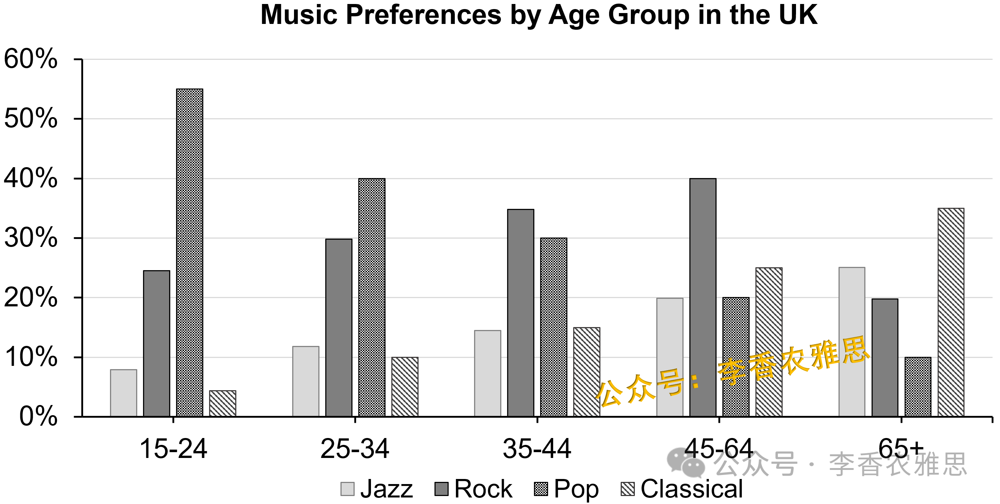

# 2026 年 1 月 24 日雅思写作真题
## Task 1

> **图表类型标注**：柱状图（多类音乐偏好占比）

**The chart below shows the percentage of people enjoying different kinds of music in the UK in 2014.**
**Summarise the information by selecting and reporting the main features, and make comparisons where relevant.**



The bar chart compares the percentages of people aged 15–24, 25–34, 35–44, 45–64, and 65 and over in the UK who enjoyed jazz, rock, pop, and classical music in 2014.

As shown, jazz and classical music were more popular among older age groups. Specifically, the proportion of jazz listeners rose consistently from about 8% among those aged 15–24 to 25% in the 65+ group. A similar but more pronounced trend was observed for classical music: despite having the lowest percentage of fans in the youngest group (almost 4%), it was the most favoured genre for the oldest cohort, with approximately 35% of that group enjoying it.

By contrast, the preference for pop music followed a downward trajectory. It was by far the most popular genre among 15–24-year-olds, attracting approximately 55% of people in that age group, but only 10% of those aged 65 and over liked it. Rock music illustrated a different pattern, with the highest proportions in the 35–44 and 45–64 age groups, at about 35% and 40%, respectively. Although about a quarter of the youngest age group showed a preference for it, the statistics peaked among people aged 45–64 before dropping to 20% in the oldest category.

Overall, jazz and classical music were enjoyed by a larger proportion of older people than younger people, whereas the opposite could be found for pop music.

---

### 精析

#### ① 结构分析（精简）

本题属于 **Bar Chart** 类 Task 1，涉及 4 种音乐类型（jazz, rock, pop, classical）在 5 个年龄组中的受欢迎比例数据。

本文采用 **"总-分-总"** 三段式结构：

- **Paragraph 1 — Introduction（开头段）**
  - 改写题目要素：`compares the percentages of people aged 15–24, 25–34, 35–44, 45–64, and 65 and over... who enjoyed jazz, rock, pop, and classical music`（替换原题 `the percentage of people enjoying different kinds of music`）
  - 明确对象：4 种音乐类型 + 5 个年龄组 + 2014 年英国

- **Paragraph 2 — Body Details（主体段：按趋势分组）**
  - **上升趋势组（老年偏好）**：jazz 从 8% 升至 25%，classical 从 4% 升至 35%
  - **下降趋势组（年轻偏好）**：pop 从 55% 降至 10%
  - **波动趋势组（中年峰值）**：rock 在 35–44 和 45–64 年龄组达峰值（35% 和 40%）

- **Paragraph 3 — Overview（总结段）**
  - jazz 和 classical：老年人比例高于年轻人
  - pop：相反趋势

> **结构亮点**：本文按"趋势类型"分组极为高效，将四种音乐分为"上升""下降""波动"三组，避免了按音乐类型逐一罗列的机械写法。每组内部再描述具体数据变化，既保证了比较的深度，又维持了行文的简洁。

#### ② 数据组织与对比策略（标注有效写法）

| 写法 | 原文示例 | 技巧说明 |
|------|---------|---------|
| **趋势概括** | `jazz and classical music were more popular among older age groups` | 先给出总体趋势判断 |
| **起点+终点** | `rose consistently from about 8% among those aged 15–24 to 25% in the 65+ group` | 用起点和终点勾勒变化 |
| **程度对比** | `A similar but more pronounced trend` | 用 pronounced 强调 classical 趋势更显著 |
| **极值标注** | `it was the most favoured genre for the oldest cohort, with approximately 35%` | 突出最高值 |
| **交叉描述** | `the statistics peaked among people aged 45–64 before dropping to 20%` | 描述 rock 的先升后降 |

> **数据亮点**：作者精准选择了每种音乐类型的关键数据点（起点、终点、峰值）进行描述，而非罗列所有 20 个数据。例如 jazz 只提 8% 和 25%，classical 突出 4% 和 35% 的反差，pop 强调 55% 和 10% 的对比，数据选择策略极具针对性。

#### ③ 四项能力维度分析（TA / CC / LR / GRA）

- **TA**：本文按"趋势类型"分组极为高效，将四种音乐分为"上升""下降""波动"三组，避免了按音乐类型逐一罗列的机械写法。每组内部再描述具体数据变化，既保证了比较的深度，又维持了行文的简洁。 作者精准选择了每种音乐类型的关键数据点（起点、终点、峰值）进行描述，而非罗列所有 20 个数据。例如 jazz 只提 8% 和 25%，classical 突出 4% 和 35% 的反差，pop 强调 55% 和 10% 的对比，数据选择策略极具针对性。
- **CC**：本文衔接词使用精准且多样。"A similar but more pronounced trend"的 but 转折精准指出同类趋势中的差异，"illustrated a different pattern"巧妙引出第三种独立模式，避免了重复的"By contrast"。
- **LR**：见模块⑤词汇表，含 `rose consistently`、`a more pronounced trend` 等精准词
- **GRA**：见模块⑤句式亮点

#### ④ 可迁移句型骨架（直接套用）（图表类型：柱状图（多类音乐偏好占比））

**骨架 1 — 开头改写（表格/图通用）**
> The [chart] illustrates changes in ______ in [entities] in [years], along with ______.

**骨架 2 — 极值+对比（Body 通用）**
> ______ had [number], which was considerably higher than the figures for the other [n] [entities].

**骨架 3 — 排名变化/超越（含动态时）**
> ______ saw the second-largest rise and surpassed ______, with its figure growing from ______ to ______.

**骨架 4 — 双维度收尾（Overview 通用）**
> Overall, ______ had by far the largest number..., while ______ recorded the lowest figures on both measures.

#### ⑤ 衔接 / 词汇 / 句式亮点（去水版）

| 衔接类型 | 原文表达 | 功能 |
|---------|---------|------|
| **总体衔接** | `As shown, jazz and classical music were more popular among older age groups` | 先给出总体趋势 |
| **递进衔接** | `Specifically, the proportion of jazz listeners rose consistently...` | 用 Specifically 展开细节 |
| **类比衔接** | `A similar but more pronounced trend was observed for classical music` | 连接同类趋势 |
| **让步衔接** | `despite having the lowest percentage of fans in the youngest group` | 先让步再强调 |
| **对比衔接** | `By contrast, the preference for pop music followed a downward trajectory` | 转向相反趋势 |
| **补充衔接** | `Rock music illustrated a different pattern` | 引出第三种模式 |
| **总结衔接** | `Overall... whereas...` | 用 whereas 对比总结 |

> **衔接亮点**：本文衔接词使用精准且多样。"A similar but more pronounced trend"的 but 转折精准指出同类趋势中的差异，"illustrated a different pattern"巧妙引出第三种独立模式，避免了重复的"By contrast"。

| 词汇/短语 | 中文含义 | 词性/用法 | 替代普通表达 |
|-----------|----------|----------|-------------|
| **rose consistently** | 持续稳定上升 | 动词短语 | went up |
| **a more pronounced trend** | 更为显著的趋势 | 名词短语 | a stronger trend |
| **the most favoured genre** | 最受青睐的音乐类型 | 名词短语 | the most popular |
| **followed a downward trajectory** | 呈下降走势 | 动词短语 | went down |
| **by far the most popular** | 遥遥领先、最受欢迎 | 程度修饰 | the most popular |
| **illustrated a different pattern** | 呈现出另一种模式 | 动词短语 | showed a different trend |
| **peaked among** | 在…人群中达到峰值 | 动词短语 | was highest in |
| **the opposite could be found** | 情况恰好相反 | 名词短语 | the opposite was true |

**1. 让步转折复合句**
> *"A similar but more pronounced trend was observed for classical music: **despite having** the lowest percentage of fans in the youngest group (almost 4%), it was the most favoured genre for the oldest cohort, with approximately 35% of that group enjoying it."*

**技巧**：用 despite having 引导让步状语（省略主语），先承认 classical 在年轻人中的低比例，再转折强调其在老年人中的最高比例，形成强烈反差。

**2. 对比并列句**
> *"It was by far the most popular genre among 15–24-year-olds, attracting approximately 55% of people in that age group, **but** only 10% of those aged 65 and over liked it."*

**技巧**：用 but 连接两个对比分句，attracting 现在分词短语补充说明，一句之内完成 pop 音乐在年龄两端的极端对比。

**3. 多信息整合句**
> *"Rock music illustrated a different pattern, **with** the highest proportions in the 35–44 and 45–64 age groups, at about 35% and 40%, respectively. **Although** about a quarter of the youngest age group showed a preference for it, the statistics peaked among people aged 45–64 before dropping to 20% in the oldest category."*

**技巧**：先用 with 独立主格结构描述峰值数据，再用 Although 让步从句补充年轻群体数据，主句用 peaked... before dropping 描述完整的变化轨迹。

**4. 对比总结句**
> *"Overall, jazz and classical music were enjoyed by a larger proportion of older people than younger people, **whereas** the opposite could be found for pop music."*

**技巧**：用 whereas 连接两个对比句，the opposite could be found 简洁表达相反趋势，避免了重复描述 pop 的数据，总结精炼。

---

#### ⑥ 可提升空间 + 仿写任务

**可提升空间（通用要点，按篇酌情采纳）：**
- Overview 建议前置或明确独立成段，让阅卷人先抓全局（TA 更稳）。
- 双维度数据（如比率/占比）尽量也收进 Overview，避免只在正文提一次。
- 跨段对比（如 A 反超 B）可集中到一句呈现，衔接更紧凑。

**本文针对性可改进点（按篇分析，点到即止）：**
- 末段 Overview 只对比了 jazz/classical 与 pop 两类走向，却漏掉 rock 这一"中年达峰"的第三种独立形态，而正文明明把它当作重点写了，总结与正文不对齐。
- rock 那句 `Although about a quarter of the youngest age group showed a preference for it, the statistics peaked among people aged 45–64...` 的让步关系并不成立（年轻组 25% 与中年组达峰之间不构成转折），改用 `Starting at about 25% among the youngest, it peaked...` 逻辑更顺。
- jazz、classical、pop 均只给首尾两端数值，25–34 与 35–44 两组几乎完全缺席，`rose consistently` 这类"持续性"判断因此缺少中间数据支撑，可各补一个中段数值。

**仿写任务**：用「极值+对比」骨架写一句：描述『2020 年 X 国指标远高于其他三国』。
## Task 2

> **话题与题型标注**：文化与传统类 · Agree/Disagree

**The government should protect culture. Therefore, some people believe that new buildings should be built in traditional styles. To what extent do you agree or disagree?**

**政府应当保护文化。因此，有些人认为新建建筑应采用传统风格。你在多大程度上同意或不同意这一观点？**

It is widely acknowledged that governments are obligated to protect culture, so some people claim that newly built constructions should maintain uniformity in traditional architectural styles. Although maintaining architectural uniformity can protect cultural heritage to some extent, I disagree that new buildings should be built in traditional styles in a one-size-fits-all approach.

人们普遍认为，政府有义务保护文化，因此一些人主张，新建建筑应当在建筑风格上与传统样式保持一致。尽管保持建筑风格的统一在一定程度上有助于保护文化遗产，但我不同意以“一刀切”的方式要求新建筑都采用传统风格。

Admittedly, ensuring architectural consistency with traditional styles helps protect cultural identity to some degree. In many regions, historic buildings represent the unique heritage and aesthetic values of a community, while ancient-style towns serve as popular tourist attractions and play crucial roles in a city's development. A notable example is Suzhou, where the local government has implemented strict regulations to ensure that new buildings in the old city center harmonize with traditional architectural features, such as white walls, black tiles, and classic courtyard designs. This uniformity not only helps retain the city's distinctive aesthetic charm and historical atmosphere but also boosts tourism and strengthens residents' sense of belonging, thereby creating a pleasing environment for inhabitants and effectively preserving local cultural character. In contrast, allowing modern designs that clash with these traditional styles could lead to visual disharmony and the gradual erosion of local cultural identity.

诚然，确保建筑与传统风格保持一致在某种程度上有助于保护文化认同。在许多地区，历史建筑代表着一个社区独特的文化遗产和审美价值，而古镇则作为热门旅游景点，在城市发展中发挥着重要作用。苏州就是一个典型例子，当地政府实施了严格的规定，确保老城区的新建筑与传统建筑特征相协调，例如白墙、黑瓦以及经典的庭院式设计。这种统一性不仅有助于保留城市独特的审美魅力和历史氛围，而且还能促进旅游业发展，增强居民的归属感，为居民营造宜人的生活环境，并有效地保护地方文化特色。相反，如果允许与传统风格相冲突的现代设计，可能会导致视觉上的不协调，并逐渐削弱地方文化认同。

Nevertheless, individuals should have greater flexibility to accommodate modern needs and express their creativity in constantly evolving cities, something that traditional architectural concepts cannot always achieve. Architectural preferences often reflect lifestyles of a particular era and contemporary cultural values; however, old-style buildings are frequently incompatible with modern demands. For instance, to pursue environmental protection or closer-to-nature lifestyles, homeowners today might prefer energy-efficient designs with solar panels to create eco-friendly houses, or extended balconies to grow plants that both decorate the home and provide relaxation. More importantly, as culture is constantly evolving, uncritically following the styles of surrounding old buildings could limit aesthetic innovation and make new buildings less functional or livable. This is particularly true because traditional buildings are typically dull in colour and lack designated sanitary facilities; requiring new houses to replicate such outdated layouts would represent a regression in both culture and aesthetics.

然而，在不断变化的城市中，个人应当拥有更大的灵活性，以适应现代需求并表达创造力，而这一点并非传统建筑理念总能实现。建筑偏好往往反映特定时代的生活方式和当代文化价值，但传统风格建筑常常难以满足现代需求。例如，为了追求环保或更亲近自然的生活方式，当今的房主可能更倾向于采用带有太阳能板的节能设计来建造环保住宅，或设计加长的阳台来种植植物，既美化居所，又提供放松空间。更重要的是，文化本身处于不断演变之中，若不加批判地模仿周围老建筑的风格，可能会限制审美创新，使新建筑在功能性和宜居性方面打折扣。尤其是由于传统建筑通常色彩单调，且缺乏完善的卫生设施，若要求新住宅复制这种过时的布局，无疑意味着文化与审美的倒退。

In conclusion, although architectural uniformity can preserve cultural identity and promote tourism, imposing traditional styles on all new buildings is impractical. Modern cities require flexibility, creativity, and functional innovation. Allowing contemporary designs better accommodates evolving cultural values and the realistic needs of today's residents.

总之，尽管建筑风格的统一有助于保护文化认同并促进旅游业发展，但将传统风格强加给所有新建筑并不现实。现代城市需要灵活性、创造力和功能创新，允许当代设计更有利于顺应不断变化的文化价值观以及当今居民的实际需求。

---

### 精析

#### ① 结构分析（精简）

本题属于 **Agree/Disagree** 类题型。此类题型的核心策略是：明确表明立场，然后展开论证。

本文采用 **"让步-反驳-综合"** 四段式结构：

- **Paragraph 1 — Introduction（开头段）**
  - 改写题目（paraphrase）：`newly built constructions should maintain uniformity in traditional architectural styles`（替换原题 `new buildings should be built in traditional styles`）
  - 表明立场：`I disagree that new buildings should be built in traditional styles in a one-size-fits-all approach`（明确反对一刀切）
  - 预告框架：先让步承认传统风格的价值，再反驳其局限性

- **Paragraph 2 — Body 1（让步段）**
  - 主题句：`ensuring architectural consistency with traditional styles helps protect cultural identity to some degree`
  - 论点1：历史建筑代表独特遗产和审美价值
  - 论点2：古镇作为旅游景点在城市发展中发挥重要作用
  - 例证：苏州严格规定老城区新建筑与传统特征协调（白墙、黑瓦、庭院）
  - 效果：保留审美魅力、促进旅游、增强归属感

- **Paragraph 3 — Body 2（反驳段）**
  - 主题句：`individuals should have greater flexibility to accommodate modern needs and express their creativity`
  - 论点1：建筑偏好反映时代生活方式和当代文化价值
  - 论点2：传统建筑难以满足现代需求（节能设计、阳台种植）
  - 论点3：文化不断演变，盲目模仿限制审美创新
  - 后果：传统建筑色彩单调、缺乏卫生设施，复制意味着倒退

- **Paragraph 4 — Conclusion（结尾段）**
  - 重申立场：`imposing traditional styles on all new buildings is impractical`
  - 总结升华：现代城市需要灵活性、创造力和功能创新

> **结构亮点**：本文采用经典的"先退后进"策略，先充分承认传统建筑风格的价值（甚至给出苏州的具体案例），再系统反驳"一刀切"做法的弊端。这种结构使论证更加全面和审慎，避免了极端立场的漏洞。

#### ② 论证逻辑链拆解（标注有效写法）

**Body 1（让步段）的逻辑链条：**

```
传统建筑风格的价值
    ↓ [核心论点]
→ 保护文化认同
    ↓ [具体表现]
├── 历史建筑代表独特遗产和审美价值
│
└── 古镇作为热门旅游景点
    ↓ [例证]
    苏州严格规定老城区新建筑与传统特征协调
    ↓ [具体措施]
    白墙、黑瓦、经典庭院设计
    ↓ [多重效果]
    ├── 保留城市审美魅力和历史氛围
    ├── 促进旅游业发展
    ├── 增强居民归属感
    └── 有效保护地方文化特色
    ↓ [反面论证]
    现代设计与传统风格冲突 → 视觉不协调 → 文化认同逐渐削弱
```

**Body 2（反驳段）的逻辑链条：**

```
反对一刀切传统风格
    ↓ [核心论点]
→ 个人需要灵活性以适应现代需求
    ↓ [论据一]
→ 建筑偏好反映时代生活方式和当代文化价值
    ↓ [论据二]
→ 传统建筑难以满足现代需求
    ↓ [例证]
    ├── 节能设计（太阳能板）
    └── 加长阳台种植植物
    ↓ [论据三]
→ 文化不断演变，盲目模仿限制审美创新
    ↓ [具体缺陷]
    ├── 传统建筑色彩单调
    └── 缺乏完善卫生设施
    ↓ [结论]
    复制过时布局 = 文化与审美的倒退
```

> **逻辑亮点**：本文论证采用了"以子之矛攻子之盾"策略。在让步段中充分建立"保护文化"的合理性，再在反驳段中指出"盲目模仿传统恰恰是文化倒退"，用对方的逻辑反证自己观点，说服力极强。

#### ③ 四项能力维度分析（TA / CC / LR / GRA）

- **TA**：本文采用经典的"先退后进"策略，先充分承认传统建筑风格的价值（甚至给出苏州的具体案例），再系统反驳"一刀切"做法的弊端。这种结构使论证更加全面和审慎，避免了极端立场的漏洞。 本文论证采用了"以子之矛攻子之盾"策略。在让步段中充分建立"保护文化"的合理性，再在反驳段中指出"盲目模仿传统恰恰是文化倒退"，用对方的逻辑反证自己观点，说服力极强。
- **CC**：本文衔接手段极为丰富，从"Admittedly"让步到"Nevertheless"转折，再到"More importantly"递进，层次分明。"not only... but also... thereby"的三重递进结构使苏州案例的效果描述极为饱满。
- **LR**：见模块⑤词汇表，含 `maintain uniformity`、`architectural styles` 等精准词
- **GRA**：见模块⑤句式亮点

#### ④ 可迁移句型骨架（直接套用）（题型：Agree/Disagree）

**骨架 1 — 先退后进亮立场（Intro）**
> Although ______ deserves a central place because ______, I disagree with the view that ______.

**骨架 2 — 分类论证起手（Body）**
> From the perspective of ______, doing X helps ______ and ______. Meanwhile, X also offers ______ that go beyond ______.

**骨架 3 — 抽象→具体例证（Body）**
> For example, a course on ______ may show how ______ have harmed ______, as illustrated by ______.

#### ⑤ 衔接 / 词汇 / 句式亮点（去水版）

| 衔接类型 | 原文表达 | 功能说明 |
|---------|---------|---------|
| **立场预告** | `Although maintaining architectural uniformity can protect... I disagree...` | 开头段先让步再明确反对 |
| **让步衔接** | `Admittedly, ensuring architectural consistency...` | 用 Admittedly 引出对方合理之处 |
| **例证衔接** | `A notable example is Suzhou...` | 用具体例子支撑论点 |
| **递进衔接** | `not only... but also... thereby...` | 多重效果层层递进 |
| **反面衔接** | `In contrast, allowing modern designs that clash...` | 用 In contrast 引出反面后果 |
| **转折衔接** | `Nevertheless, individuals should have greater flexibility...` | 用 Nevertheless 转向反驳 |
| **例证衔接** | `For instance, to pursue environmental protection...` | 用 For instance 引出具体例子 |
| **递进衔接** | `More importantly, as culture is constantly evolving...` | 用 More importantly 递进强调 |
| **总结衔接** | `In conclusion, although... imposing... is impractical` | 收束全文并重申立场 |

> **衔接亮点**：本文衔接手段极为丰富，从"Admittedly"让步到"Nevertheless"转折，再到"More importantly"递进，层次分明。"not only... but also... thereby"的三重递进结构使苏州案例的效果描述极为饱满。

| 词汇/短语 | 中文含义 | 词性/用法 | 替代普通表达 |
|-----------|----------|----------|-------------|
| **maintain uniformity** | 保持统一（风格一致） | 动词短语 | keep the same |
| **architectural styles** | 建筑风格 | 名词短语 | building styles |
| **a one-size-fits-all approach** | 一刀切的做法 | 名词短语 | the same way for all |
| **cultural identity** | 文化认同 | 名词短语 | culture |
| **aesthetic values** | 审美价值 | 名词短语 | beauty |
| **harmonize with** | 与…相协调 | 动词短语 | match with |
| **distinctive aesthetic charm** | 独特的审美魅力 | 名词短语 | special beauty |
| **visual disharmony** | 视觉上的不协调 | 名词短语 | not matching |
| **the gradual erosion** | 逐渐侵蚀、慢慢流失 | 名词短语 | slowly losing |
| **accommodate modern needs** | 满足现代需求 | 动词短语 | meet modern needs |
| **aesthetic innovation** | 审美创新 | 名词短语 | new beauty ideas |
| **a regression in both culture and aesthetics** | 文化与审美上的双重倒退 | 名词短语 | going backward |

**1. 多重递进效果句**
> *"This uniformity **not only helps retain** the city's distinctive aesthetic charm and historical atmosphere **but also boosts** tourism and strengthens residents' sense of belonging, **thereby creating** a pleasing environment for inhabitants and effectively preserving local cultural character."*

**技巧**：用 not only... but also... 连接两个并列效果，再用 thereby creating 现在分词短语引出最终结果，一句之内完成四重效果的描述，信息密度极高。

**2. 让步转折复合句**
> *"**Although** maintaining architectural uniformity can protect cultural heritage to some extent, **I disagree** that new buildings should be built in traditional styles in a one-size-fits-all approach."*

**技巧**：用 Although 引导让步从句，先承认对方观点的合理性，再在主句中用 I disagree 明确表明立场，使立场更加审慎有力。

**3. 条件后果推演句**
> *"**More importantly**, as culture is constantly evolving, uncritically following the styles of surrounding old buildings could limit aesthetic innovation and make new buildings less functional or livable."*

**技巧**：用 More importantly 递进强调，as 引导原因状语从句，主句用 could limit... and make... 连接双重负面后果，逻辑推导清晰。

**4. 因果总结句**
> *"This is particularly true because traditional buildings are typically dull in colour and lack designated sanitary facilities; requiring new houses to replicate such outdated layouts would represent a regression in both culture and aesthetics."*

**技巧**：用 because 引导原因从句说明传统建筑的缺陷，再用分号连接主句，用 requiring... would represent... 的动名词主语结构说明后果，因果链条完整。

#### ⑥ 可提升空间 + 仿写任务

**可提升空间（通用要点，按篇酌情采纳）：**
- 结论段避免复读开头，应「推进」而非「重复」立场。
- 让步段衔接词（this perspective 等）回指别太远，可加限定词收紧。
- 同一话题词（如 career / benefit）避免三现，用近义替换。

**本文针对性可改进点（按篇分析，点到即止）：**
- Body 2 铺开的论点偏多（灵活性、时代价值、太阳能板、阳台、审美创新、色彩、卫生设施），每点一句带过，缺一个像 Body 1 苏州那样的落地案例，两个主体段详略明显失衡。
- `traditional buildings are typically dull in colour and lack designated sanitary facilities` 断言过重且无出处，还与上一段盛赞苏州"白墙黑瓦"的审美魅力隐隐冲突；收窄为 `many older residential buildings` 之类的表述会更稳。
- `traditional` 全文出现十余次、`uniformity` 四次，可用 `vernacular`、`period-style`、`heritage-inspired`、`stylistic consistency` 等交替，LR 分项更占优。

**仿写任务**：用「先退后进」骨架重写：*Some think space exploration is a waste of money.*
