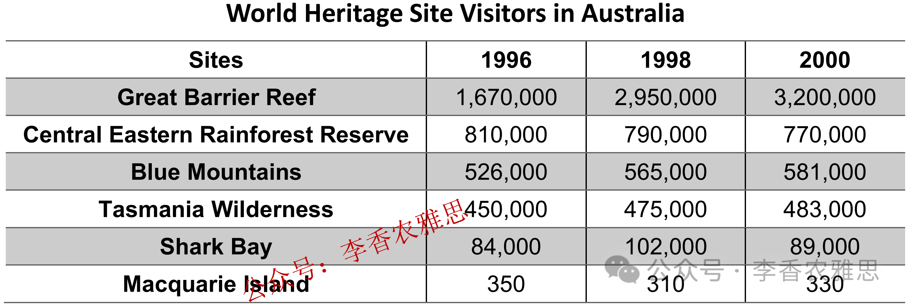

# 2026 年 1 月 31 日雅思写作真题
## Task 1

> **图表类型标注**：表格（世界遗产访客统计）

**The table blow gives information on visitor statistics for 1996, 1998, and 2000 for various world heritage sites in Australia.**
**Summarise the information by selecting and reporting the main features, and make comparisons where relevant.**



The table illustrates changes in the number of visitors to the Great Barrier Reef, the Central Eastern Rainforest Reserve, the Blue Mountains, the Tasmania Wilderness, Shark Bay, and Macquarie Island in Australia in 1996, 1998, and 2000.

As shown, the Great Barrier Reef attracted by far the largest number of visitors throughout the period and the number experienced substantial growth from 1.67 million in 1996 to nearly 3 million in 1998 before reaching 3.2 million in 2000. The Blue Mountains and the Tasmania Wilderness also experienced steady but modest upturns in their popularity, with the number of visitors to the former increasing from 526,000 to 581,000 and that to the latter rising from 450,000 to 483,000.

By contrast, the rate of visitors to the Central Eastern Rainforest Reserve recorded a gradual decrease, falling from 810,000 in 1996 to 770,000 by the end of the period. Shark Bay observed a more fluctuating pattern; despite the data peaking at 102,000 visitors in 1998, it declined slightly to 89,000 in 2000. Meanwhile, Macquarie Island experienced an opposite trend and consistently attracted very few visitors, with the figure dropping considerably from 350 in 1996 to 310 in 1998 before recovering slightly to just 330 in 2000.

Overall, the Great Barrier Reef had the highest volume of visitors, whereas Macquarie Island remained the least visited site by a considerable margin. Furthermore, most sites saw moderate overall increases in visitors, except for the Central Eastern Rainforest Reserve.

---

### 精析

#### ① 结构分析（精简）

本题属于 **Table** 类 Task 1，涉及 6 个澳大利亚世界遗产地在 1996、1998、2000 三年的游客数量变化。

本文采用 **"总-分-总"** 三段式结构：

- **Paragraph 1 — Introduction（开头段）**
  - 改写题目要素：`changes in the number of visitors to... in Australia in 1996, 1998, and 2000`（替换原题 `visitor statistics for 1996, 1998, and 2000`）
  - 明确对象：6 个世界遗产地 + 三年数据

- **Paragraph 2 — Body Details（主体段：按趋势分组）**
  - **大幅上升组**：Great Barrier Reef（167 万→320 万），Blue Mountains（52.6 万→58.1 万），Tasmania Wilderness（45 万→48.3 万）
  - **下降/波动组**：Central Eastern Rainforest Reserve（81 万→77 万， gradual decrease），Shark Bay（波动，10.2 万峰值后降至 8.9 万）
  - **极低访客组**：Macquarie Island（350→310→330， consistently very few）

- **Paragraph 3 — Overview（总结段）**
  - Great Barrier Reef 访客最多，Macquarie Island 最少
  - 大多数景点访客 moderate increase，除 Central Eastern Rainforest Reserve 外

> **结构亮点**：本文按"上升-下降/波动-极低"的趋势分组策略清晰高效。将六个景点分为三组，避免了按景点逐一罗列的机械写法。先写大幅上升的"明星景点"，再写下降波动的"例外"，最后写访客极少的"边缘景点"，层次分明。

#### ② 数据组织与对比策略（标注有效写法）

| 写法 | 原文示例 | 技巧说明 |
|------|---------|---------|
| **极值突出** | `attracted by far the largest number of visitors` | 用 by far 强调 Great Barrier Reef 的绝对领先地位 |
| **起点+峰值+终点** | `from 1.67 million in 1996 to nearly 3 million in 1998 before reaching 3.2 million in 2000` | 用 before reaching 描述先快后稳的增长 |
| **同组概括** | `also experienced steady but modest upturns` | 用 modest 准确描述 Blue Mountains 和 Tasmania Wilderness 的小幅增长 |
| **对比衔接** | `By contrast, the rate... recorded a gradual decrease` | 用 By contrast 转向下降趋势 |
| **例外标注** | `except for the Central Eastern Rainforest Reserve` | 在总结中明确标注例外情况 |

> **数据亮点**：作者对数据的选择极具策略性。Great Barrier Reef 用具体数字突出其"明星"地位，Blue Mountains 和 Tasmania Wilderness 用 modest 概括其小幅增长，Shark Bay 用 fluctuating pattern 概括其波动，Macquarie Island 用 consistently very few 概括其极低访客量，避免了数据堆砌。

#### ③ 四项能力维度分析（TA / CC / LR / GRA）

- **TA**：本文按"上升-下降/波动-极低"的趋势分组策略清晰高效。将六个景点分为三组，避免了按景点逐一罗列的机械写法。先写大幅上升的"明星景点"，再写下降波动的"例外"，最后写访客极少的"边缘景点"，层次分明。 作者对数据的选择极具策略性。Great Barrier Reef 用具体数字突出其"明星"地位，Blue Mountains 和 Tasmania Wilderness 用 modest 概括其小幅增长，Shark Bay 用 fluctuating pattern 概括其波动，Macquarie Island 用 consistently very few 概括其极低访客量，避免了数据堆砌。
- **CC**：本文衔接词使用精准且功能明确。"also"连接同类上升景点，"By contrast"转向下降趋势，"Meanwhile"引出独立的第三种情况，"despite"在 Shark Bay 段中先承认峰值再说明下降，使描述更加客观全面。
- **LR**：见模块⑤词汇表，含 `attracted by far the largest number`、`experienced substantial growth` 等精准词
- **GRA**：见模块⑤句式亮点

#### ④ 可迁移句型骨架（直接套用）（图表类型：表格（世界遗产访客统计））

**骨架 1 — 开头改写（表格/图通用）**
> The [chart] illustrates changes in ______ in [entities] in [years], along with ______.

**骨架 2 — 极值+对比（Body 通用）**
> ______ had [number], which was considerably higher than the figures for the other [n] [entities].

**骨架 3 — 排名变化/超越（含动态时）**
> ______ saw the second-largest rise and surpassed ______, with its figure growing from ______ to ______.

**骨架 4 — 双维度收尾（Overview 通用）**
> Overall, ______ had by far the largest number..., while ______ recorded the lowest figures on both measures.

#### ⑤ 衔接 / 词汇 / 句式亮点（去水版）

| 衔接类型 | 原文表达 | 功能 |
|---------|---------|------|
| **总体衔接** | `As shown, the Great Barrier Reef attracted by far...` | 先给出总体判断 |
| **同组递进** | `The Blue Mountains and the Tasmania Wilderness also experienced...` | 用 also 连接同类趋势 |
| **对比衔接** | `By contrast, the rate of visitors to... recorded a gradual decrease` | 转向相反趋势 |
| **补充衔接** | `Meanwhile, Macquarie Island experienced an opposite trend` | 用 Meanwhile 引出第三种情况 |
| **让步衔接** | `despite the data peaking at 102,000 visitors in 1998` | 先承认峰值再说明下降 |
| **总结衔接** | `Overall... whereas... Furthermore...` | 用 whereas 和 Furthermore 分层总结 |

> **衔接亮点**：本文衔接词使用精准且功能明确。"also"连接同类上升景点，"By contrast"转向下降趋势，"Meanwhile"引出独立的第三种情况，"despite"在 Shark Bay 段中先承认峰值再说明下降，使描述更加客观全面。

| 词汇/短语 | 中文含义 | 词性/用法 | 替代普通表达 |
|-----------|----------|----------|-------------|
| **attracted by far the largest number** | 吸引的数量遥遥领先 | 动词短语 | had the most visitors |
| **experienced substantial growth** | 经历了大幅增长 | 动词短语 | grew a lot |
| **steady but modest upturns** | 稳定但幅度不大的回升 | 名词短语 | small increases |
| **recorded a gradual decrease** | 呈现逐步下降 | 动词短语 | slowly went down |
| **observed a more fluctuating pattern** | 呈现出更为起伏波动的态势 | 动词短语 | went up and down |
| **experienced an opposite trend** | 呈现相反的走势 | 动词短语 | went the other way |
| **consistently attracted very few visitors** | 始终只吸引到极少访客 | 动词短语 | always had few visitors |
| **by a considerable margin** | 以相当大的差距 | 程度修饰 | by a lot |
| **moderate overall increases** | 总体上温和的增长 | 名词短语 | small increases overall |

**1. 复杂增长描述句**
> *"As shown, the Great Barrier Reef attracted by far the largest number of visitors throughout the period and the number experienced substantial growth from 1.67 million in 1996 to nearly 3 million in 1998 **before reaching** 3.2 million in 2000."*

**技巧**：用 before reaching 连接增长过程的阶段性变化，既说明了从 1996 到 1998 的快速增长，又说明了 1998 到 2000 的趋于平稳，增长描述更加细腻。

**2. 同组对比句**
> *"The Blue Mountains and the Tasmania Wilderness also experienced steady but modest upturns in their popularity, **with** the number of visitors to the former increasing from 526,000 to 581,000 **and that to the latter rising** from 450,000 to 483,000."*

**技巧**：用 with 独立主格结构描述两个景点的具体数据，the former... and that to the latter 的对比结构使同组内的比较清晰明了。

**3. 让步转折句**
> *"Shark Bay observed a more fluctuating pattern; **despite** the data peaking at 102,000 visitors in 1998, it declined slightly to 89,000 in 2000."*

**技巧**：用分号连接两个分句，despite 引导让步状语（省略主语），先承认 1998 年的峰值，再转折说明 2000 年的下降，使波动趋势的描述更加客观。

**4. 分层总结句**
> *"Overall, the Great Barrier Reef had the highest volume of visitors, **whereas** Macquarie Island remained the least visited site by a considerable margin. **Furthermore**, most sites saw moderate overall increases in visitors, **except for** the Central Eastern Rainforest Reserve."*

**技巧**：用 whereas 对比最高和最低，用 Furthermore 递进补充总体趋势，用 except for 标注例外，三层信息层次分明。

---

#### ⑥ 可提升空间 + 仿写任务

**可提升空间（通用要点，按篇酌情采纳）：**
- Overview 建议前置或明确独立成段，让阅卷人先抓全局（TA 更稳）。
- 双维度数据（如比率/占比）尽量也收进 Overview，避免只在正文提一次。
- 跨段对比（如 A 反超 B）可集中到一句呈现，衔接更紧凑。

**本文针对性可改进点（按篇分析，点到即止）：**
- `the rate of visitors to the Central Eastern Rainforest Reserve` 用词不当：表格给的是绝对人数而非比率，应作 `the number of visitors` 或 `visitor numbers`。
- Macquarie Island 一句中 `experienced an opposite trend`、`dropping considerably from 350 to 310`、`recovering slightly to just 330` 三处互相打架——与谁"相反"未交代，40 人的减幅也谈不上 considerably，改为 `edged down... before a marginal recovery` 更贴合数据量级。
- 结尾 `most sites saw moderate overall increases..., except for the Central Eastern Rainforest Reserve` 漏掉了同样净下降的 Shark Bay 与 Macquarie Island，例外清单不完整，与正文自相矛盾。

**仿写任务**：用「极值+对比」骨架写一句：描述『2020 年 X 国指标远高于其他三国』。
## Task 2

> **话题与题型标注**：社会与政府类 · Two-Part Question

**Some parents give their children everything that their children ask for or allow them to do whatever they want to do. Is this good for children? What are consequences for these children when they grow up?**

**一些父母对孩子有求必应，或允许他们想做什么就做什么。这样的做法对孩子有好处吗？当这些孩子长大成人后，可能会产生哪些后果？**

Some parents tend to satisfy all of their children's demands or grant them complete freedom. While this approach may offer children immediate pleasure, it is generally not beneficial in the long run. Allowing children to have everything they want can lead to several negative consequences as they grow into adulthood.

一些父母倾向于满足孩子的所有要求，或给予他们完全的自由。尽管这种做法可能给孩子带来即时的快乐，但从长远来看，它通常并不有利。让孩子想要什么就得到什么，往往会在其成年后引发一系列负面后果。

Although indulgent parenting may bring children temporary satisfaction, its negative effects on their long-term development are far more significant. Admittedly, children who are rarely refused may feel valued and may not fear parental punishment or criticism when exploring their interests. In some cases, such freedom can encourage creativity to a certain extent. However, children who grow up without limits often fail to develop self-discipline and a sense of responsibility. If they are not accustomed to being denied, they may struggle to cope with frustration or failure later in life. For example, when facing academic pressure or workplace competition, such individuals may withdraw easily or blame others instead of improving themselves. Even worse, always getting what they want can foster selfishness. Strict parenting helps instill obedience and respect for rules, whereas the absence of appropriate parental guidance makes it difficult for children to understand the consequences of their actions or conform to social expectations.

尽管溺爱式的养育方式可能在短期内让孩子感到满足，但其对孩子长期发展的负面影响要严重得多。不可否认，那些很少被父母拒绝的孩子可能会感到被重视，并且在探索自身兴趣时不太害怕父母的惩罚或批评。在某些情况下，这种自由在一定程度上可以促进创造力。然而，在没有界限的环境中长大的孩子往往难以形成自律意识和责任感。如果他们不习惯被拒绝，日后在面对挫折或失败时就可能难以应对。例如，当遭遇学业压力或职场竞争时，这类人往往容易退缩，或将责任归咎于他人，而不是反思并提升自己。更糟糕的是，总是得到自己想要的东西还可能助长自私的性格。严格的管教有助于培养孩子对规则的尊重和服从意识，而缺乏适当的父母引导则会使孩子难以理解自身行为的后果，也难以适应社会规范。

Children who grow up with their parents' unreasonable satisfaction of their needs may struggle in adulthood and lack the resilience required to face challenges. From an interpersonal relationship perspective, employers often value perseverance and accountability, qualities that are unlikely to develop in individuals who have never been required to respect boundaries. As a result, such individuals are unlikely to earn the trust of employers and colleagues in their future careers and may even have difficulty earning a basic living due to their failure to develop self-discipline and a sense of responsibility. From a skill cultivation perspective, when children can easily obtain whatever they want from their parents during childhood, they are unlikely to gain experience in working toward their own goals or coping with necessary setbacks. When they encounter problems in adulthood that their parents can no longer solve for them, they are very likely to lose motivation and abandon their efforts.

在父母不合理地满足其需求环境中成长的孩子，成年后往往会面临诸多困难，并缺乏应对挑战所必需的韧性。从人际关系角度来看，用人单位通常重视坚持不懈和责任感，而这些品质不太可能在从未被要求遵守界限的人身上形成。因此，这类人在未来的职业生涯中往往难以赢得雇主和同事的信任，甚至可能由于缺乏自律和责任意识而难以维持基本的生计。从技能培养角度来看，如果孩子在童年时期可以轻易从父母那里获得自己想要的一切，他们就难以积累为目标努力或应对必要挫折的经验。当他们在成年后遇到父母无法再替其解决的问题时，很可能会失去动力，并放弃继续努力。

In conclusion, although indulgent parenting may create short-term happiness, it often undermines children's long-term development. A lack of boundaries weakens self-discipline, responsibility, and resilience, leaving individuals poorly equipped to cope with pressure, build professional trust, and pursue goals independently in adult life.

总之，尽管溺爱式养育可能带来短期的快乐，但它往往削弱孩子的长期发展。缺乏界限会削弱自律性、责任感和抗挫能力，使个体在成年后难以应对压力、建立职业信任以及独立追求目标。

---

### 精析

#### ① 结构分析（精简）

本题属于 **Two-Part Question** 类题型。此类题型的核心策略是：分别回答两个问题（是否好+后果）。

本文采用 **"分别回答"** 四段式结构：

- **Paragraph 1 — Introduction（开头段）**
  - 改写题目（paraphrase）：`Some parents tend to satisfy all of their children's demands or grant them complete freedom`（替换原题 `Some parents give their children everything... or allow them to do whatever they want`）
  - 表明立场：`it is generally not beneficial in the long run`（明确否定）
  - 预告框架：先回答"是否好"，再回答"后果"

- **Paragraph 2 — Body 1（评价段：是否好）**
  - 主题句：`its negative effects on their long-term development are far more significant`
  - 让步：很少被拒绝的孩子感到被重视，自由可促进创造力
  - 主论：缺乏界限导致自律和责任感缺失
  - 后果：难以应对挫折，容易退缩或归咎他人
  - 更严重：助长自私，难以理解行为后果

- **Paragraph 3 — Body 2（后果段）**
  - 主题句：`may struggle in adulthood and lack the resilience required to face challenges`
  - 人际关系角度：缺乏毅力和责任感，难以赢得信任，甚至难以维持生计
  - 技能培养角度：缺乏为目标努力的经验，成年后易失去动力

- **Paragraph 4 — Conclusion（结尾段）**
  - 重申立场：`indulgent parenting may create short-term happiness, but it often undermines children's long-term development`
  - 总结升华：缺乏界限削弱自律、责任和韧性

> **结构亮点**：本文采用经典的"评价+后果"双段结构，每段内部都遵循"主题句→分论点→具体说明/举例"的递进逻辑。特别值得注意的是，作者在评价段中先让步承认短期好处（感到被重视、促进创造力），再用 However 转折强调长期负面，使论证更加全面和审慎。

#### ② 论证逻辑链拆解（标注有效写法）

**Body 1（评价段）的逻辑链条：**

```
溺爱式养育
    ↓ [让步]
→ 短期好处
    ↓ [具体表现]
├── 孩子感到被重视
├── 不害怕惩罚或批评
└── 一定程度上促进创造力
    ↓ [转折]
→ 长期负面影响更严重
    ↓ [具体表现]
├── 缺乏自律意识和责任感
│   ↓
│   不习惯被拒绝 → 难以应对挫折
│   ↓ [例证]
│   学业压力或职场竞争中退缩或归咎他人
│
└── 助长自私性格
    ↓ [对比]
    严格管教培养服从和规则尊重
    ↓
    缺乏引导 → 难以理解行为后果 → 难以适应社会规范
```

**Body 2（后果段）的逻辑链条：**

```
溺爱环境中成长的孩子
    ↓ [核心论点]
→ 成年后缺乏应对挑战的韧性
    ↓ [角度一：人际关系]
├── 用人单位重视毅力和责任感
│   ↓
│   从未被要求遵守界限的人难以形成这些品质
│   ↓ [结果]
│   ├── 难以赢得雇主和同事信任
│   └── 甚至可能难以维持基本生计
│
    ↓ [角度二：技能培养]
→ 童年轻易获得一切
    ↓
    缺乏为目标努力或应对挫折的经验
    ↓ [结果]
    成年后遇到父母无法解决的问题
    ↓
    失去动力并放弃努力
```

> **逻辑亮点**：本文论证采用了"分类论证"策略。在后果段中，从"人际关系"和"技能培养"两个角度分别论证，使后果分析更加全面。每个角度都遵循"前提→机制→结果"的推导路径，逻辑链条完整。

#### ③ 四项能力维度分析（TA / CC / LR / GRA）

- **TA**：本文采用经典的"评价+后果"双段结构，每段内部都遵循"主题句→分论点→具体说明/举例"的递进逻辑。特别值得注意的是，作者在评价段中先让步承认短期好处（感到被重视、促进创造力），再用 However 转折强调长期负面，使论证更加全面和审慎。 本文论证采用了"分类论证"策略。在后果段中，从"人际关系"和"技能培养"两个角度分别论证，使后果分析更加全面。每个角度都遵循"前提→机制→结果"的推导路径，逻辑链条完整。
- **CC**：本文衔接手段丰富且功能明确。"Admittedly""However""Even worse"的递进转折使评价段的论证层层深入，"From... perspective"的分类衔接使后果段的分析角度清晰，"As a result"的因果衔接使后果推导明确。
- **LR**：见模块⑤词汇表，含 `indulgent parenting`、`grant them complete freedom` 等精准词
- **GRA**：见模块⑤句式亮点

#### ④ 可迁移句型骨架（直接套用）（题型：Two-Part）

**骨架 1 — 先退后进亮立场（Intro）**
> Although ______ deserves a central place because ______, I disagree with the view that ______.

**骨架 2 — 分类论证起手（Body）**
> From the perspective of ______, doing X helps ______ and ______. Meanwhile, X also offers ______ that go beyond ______.

**骨架 3 — 抽象→具体例证（Body）**
> For example, a course on ______ may show how ______ have harmed ______, as illustrated by ______.

#### ⑤ 衔接 / 词汇 / 句式亮点（去水版）

| 衔接类型 | 原文表达 | 功能说明 |
|---------|---------|---------|
| **立场预告** | `While this approach may offer children immediate pleasure, it is generally not beneficial` | 开头段先让步再明确否定 |
| **让步衔接** | `Admittedly, children who are rarely refused may feel valued...` | 用 Admittedly 引出对方合理之处 |
| **转折衔接** | `However, children who grow up without limits often fail to develop...` | 用 However 转向主论 |
| **递进衔接** | `Even worse, always getting what they want can foster selfishness` | 用 Even worse 递进强调更严重的问题 |
| **对比衔接** | `Strict parenting helps instill obedience... whereas the absence of...` | 用 whereas 对比严格与溺爱 |
| **分类衔接** | `From an interpersonal relationship perspective... From a skill cultivation perspective...` | 用 From... perspective 引出不同角度 |
| **因果衔接** | `As a result, such individuals are unlikely to earn the trust...` | 用 As a result 引出后果 |
| **总结衔接** | `In conclusion, although... but...` | 收束全文并重申立场 |

> **衔接亮点**：本文衔接手段丰富且功能明确。"Admittedly""However""Even worse"的递进转折使评价段的论证层层深入，"From... perspective"的分类衔接使后果段的分析角度清晰，"As a result"的因果衔接使后果推导明确。

| 词汇/短语 | 中文含义 | 词性/用法 | 替代普通表达 |
|-----------|----------|----------|-------------|
| **indulgent parenting** | 溺爱式养育 | 名词短语 | giving children everything |
| **grant them complete freedom** | 给予他们完全的自由 | 动词短语 | let them do what they want |
| **temporary satisfaction** | 一时的满足感 | 名词短语 | short-term happiness |
| **self-discipline** | 自律 | 名词短语 | self-control |
| **a sense of responsibility** | 责任感 | 名词短语 | responsibility |
| **cope with frustration** | 应对挫折 | 动词短语 | deal with failure |
| **foster selfishness** | 助长自私 | 动词短语 | make them selfish |
| **instill obedience** | 灌输服从意识 | 动词短语 | teach them to obey |
| **resilience** | 韧性；抗挫折能力 | 名词短语 | ability to recover |
| **perseverance and accountability** | 坚持不懈与担当意识 | 名词短语 | persistence and responsibility |
| **poorly equipped to** | 缺乏做…的能力准备 | 形容词短语 | not ready to |

**1. 让步转折复合句**
> *"**Although** indulgent parenting may bring children temporary satisfaction, its negative effects on their long-term development are far more significant."*

**技巧**：用 Although 引导让步从句，先承认短期好处，再在主句中用 far more significant 强调长期负面，使立场更加审慎有力。

**2. 条件后果推演句**
> *"**If** they are not accustomed to being denied, they may struggle to cope with frustration or failure later in life."*

**技巧**：用 If 引导条件从句，主句用 may struggle to 描述可能的后果，因果机制清晰。be accustomed to being denied 的被动结构精准表达"习惯被拒绝"。

**3. 定语从句+结果推演句**
> *"employers often value perseverance and accountability, qualities **that are unlikely to develop in individuals who have never been required to respect boundaries**."*

**技巧**：用 qualities that 引导定语从句解释 perseverance and accountability，再用 who 引导定语从句修饰 individuals，层层嵌套却逻辑清晰，精准说明"为何溺爱环境中的人缺乏这些品质"。

**4. 综合总结句**
> *"A lack of boundaries weakens self-discipline, responsibility, and resilience, **leaving** individuals poorly equipped to cope with pressure, build professional trust, and pursue goals independently in adult life."*

**技巧**：用 leaving 现在分词短语作结果状语，连接三个并列的动宾结构（cope with, build, pursue），将缺乏界限的多重后果浓缩于一句，信息密度极高。

#### ⑥ 可提升空间 + 仿写任务

**可提升空间（通用要点，按篇酌情采纳）：**
- 结论段避免复读开头，应「推进」而非「重复」立场。
- 让步段衔接词（this perspective 等）回指别太远，可加限定词收紧。
- 同一话题词（如 career / benefit）避免三现，用近义替换。

**本文针对性可改进点（按篇分析，点到即止）：**
- `From an interpersonal relationship perspective` 这一标签与其下内容（雇主信任、谋生能力）并不对应，实际谈的是就业与职业发展，换成 `From an employability perspective` 才名实相符。
- `fail to develop self-discipline and a sense of responsibility` 在 Body 1 与 Body 2 几乎原样复现，两段论点重叠；Body 2 应专注"成年后的具体后果"，把成因留给 Body 1。
- Body 2 全段没有任何具体例证，只有 `such individuals`、`they` 的泛指推演；补一个可感场景（如首份工作受批评后立即离职）能明显提升说服力。

**仿写任务**：就本题用骨架写一句你的核心论证。
