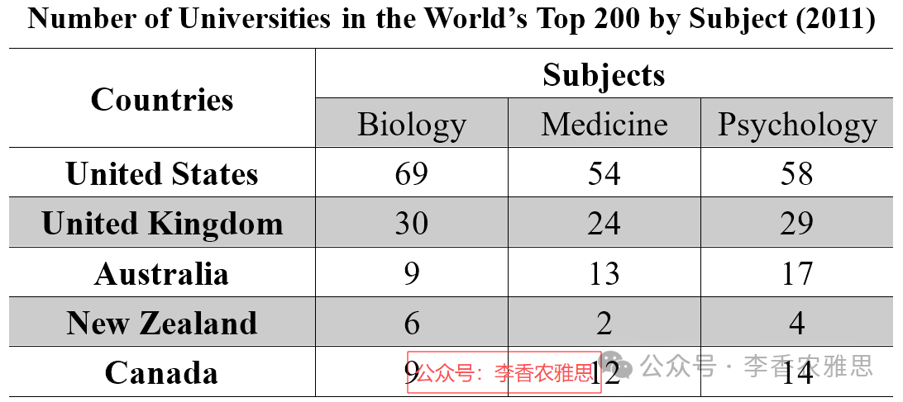

# 2026 年 2 月 7 日雅思写作真题
## Task 1

> **图表类型标注**：表格（五国顶尖学科排名）

**The table shows the number of universities ranked top 200 in the world (2011) in three subjects in five countries.**
**Summarise the information by selecting and reporting the main features, and make comparisons where relevant.**



The table compares how many universities from the USA, the UK, Australia, New Zealand, and Canada were ranked among the world’s top 200 in 2011 across three disciplines: biology, medicine, and psychology.

As shown, the United States dominated the rankings in all subjects by a substantial margin. In particular, in biology, the USA led overwhelmingly with 69 universities, more than double the figure for the UK (30). The remaining countries lagged far behind, with Australia and Canada each recording 9 institutions, while New Zealand had only 6 top universities. A similar pattern appeared in medicine, where American universities again topped the rankings with 54 institutions. Australia (13) and Canada (12) posted comparable results, whereas New Zealand had the lowest figure (2).

Psychology rankings followed the same overall hierarchy. The USA remained dominant with 58 universities, followed by the UK with half the number of US institutions (29), while New Zealand again recorded the lowest total, contributing 4 top universities.

Overall, across all three disciplines, the United States was by far the dominant contributor of top-ranking universities. In contrast, Australia and Canada recorded far fewer top-ranked institutions, although they demonstrated moderate strength across the three fields.

---

### 精析

#### ① 结构分析（精简）

本题属于 **Table** 类 Task 1，涉及 5 个国家（USA, UK, Australia, New Zealand, Canada）在 3 个学科（biology, medicine, psychology）中进入世界前 200 名的大学数量。

本文采用 **"总-分-总"** 三段式结构：

- **Paragraph 1 — Introduction（开头段）**
  - 改写题目要素：`compares how many universities from... were ranked among the world's top 200 in 2011 across three disciplines`（替换原题 `the number of universities ranked top 200... in three subjects`）
  - 明确对象：5 个国家 + 3 个学科 + 2011 年

- **Paragraph 2 — Body Details（主体段：按学科分组）**
  - **Biology**：USA 69 所（远超 UK 30 所），Australia 和 Canada 各 9 所，New Zealand 6 所
  - **Medicine**：USA 54 所（再次领先），Australia 13 所，Canada 12 所，New Zealand 2 所（最低）
  - **Psychology**：USA 58 所，UK 29 所（约为 USA 一半），New Zealand 4 所（再次最低）

- **Paragraph 3 — Overview（总结段）**
  - USA 在所有三个学科中均占主导地位
  - Australia 和 Canada 数量远少但 moderate strength

> **结构亮点**：本文按学科顺序展开，每个学科内部按国家排名描述。这种结构使读者可以清晰看到 USA 的绝对优势和 New Zealand 的持续落后。特别值得注意的是，作者在描述数据时灵活使用了"more than double""half the number"等倍数关系表达，使比较更加直观。

#### ② 数据组织与对比策略（标注有效写法）

| 写法 | 原文示例 | 技巧说明 |
|------|---------|---------|
| **倍数关系** | `more than double the figure for the UK (30)` | 用倍数直观表达 USA 与 UK 的差距 |
| **同组概括** | `The remaining countries lagged far behind` | 概括除 USA 和 UK 外的其他国家 |
| **排名变化** | `American universities again topped the rankings` | 用 again 强调 USA 的持续领先 |
| **数据对比** | `Australia (13) and Canada (12) posted comparable results` | 用 comparable 说明两国数据相近 |
| **倍数关系** | `followed by the UK with half the number of US institutions (29)` | 用 half the number 直观表达 UK 与 USA 的差距 |

> **数据亮点**：作者对数据的选择极具策略性。每个学科只选择关键数据点进行描述，避免了罗列所有 15 个数据。例如 biology 中突出 USA 69 所和 UK 30 所的对比，medicine 中突出 New Zealand 2 所的最低值，psychology 中突出 UK 29 所约为 USA 一半的关系。

#### ③ 四项能力维度分析（TA / CC / LR / GRA）

- **TA**：本文按学科顺序展开，每个学科内部按国家排名描述。这种结构使读者可以清晰看到 USA 的绝对优势和 New Zealand 的持续落后。特别值得注意的是，作者在描述数据时灵活使用了"more than double""half the number"等倍数关系表达，使比较更加直观。 作者对数据的选择极具策略性。每个学科只选择关键数据点进行描述，避免了罗列所有 15 个数据。例如 biology 中突出 USA 69 所和 UK 30 所的对比，medicine 中突出 New Zealand 2 所的最低值，psychology 中突出 UK 29 所约为 USA 一半的关系。
- **CC**：本文衔接词使用精准且功能明确。"dominated... by a substantial margin"的表述极具力度，"lagged far behind"概括其余国家的落后，"followed the same overall hierarchy"简洁引出第三个学科，避免了重复的"A similar pattern"。
- **LR**：见模块⑤词汇表，含 `dominated the rankings`、`by a substantial margin` 等精准词
- **GRA**：见模块⑤句式亮点

#### ④ 可迁移句型骨架（直接套用）（图表类型：表格（五国顶尖学科排名））

**骨架 1 — 开头改写（指标排名表）**
> The table ranks [n] [entities] by their performance in [field], with [A] at the top and [B] at the bottom.

**骨架 2 — 冠亚军位次**
> [A] topped the ranking in [field], followed by [B] in second place and [C] in third.

**骨架 3 — 领先差距**
> [A] led [B] by [number], the widest gap among all [entities].

**骨架 4 — 收尾（总体位次）**
> Overall, [A] dominated the table, while [B] lagged far behind in last place.

#### ⑤ 衔接 / 词汇 / 句式亮点（去水版）

| 衔接类型 | 原文表达 | 功能 |
|---------|---------|------|
| **总体衔接** | `As shown, the United States dominated the rankings in all subjects by a substantial margin` | 先给出总体判断 |
| **递进衔接** | `In particular, in biology...` | 用 In particular 展开细节 |
| **同组概括** | `The remaining countries lagged far behind` | 概括其余国家的落后 |
| **类比衔接** | `A similar pattern appeared in medicine` | 用 similar pattern 连接同类趋势 |
| **补充衔接** | `Psychology rankings followed the same overall hierarchy` | 用 same overall hierarchy 引出第三个学科 |
| **总结衔接** | `Overall... In contrast... although...` | 用 In contrast 和 although 分层总结 |

> **衔接亮点**：本文衔接词使用精准且功能明确。"dominated... by a substantial margin"的表述极具力度，"lagged far behind"概括其余国家的落后，"followed the same overall hierarchy"简洁引出第三个学科，避免了重复的"A similar pattern"。

| 词汇/短语 | 中文含义 | 词性/用法 | 替代普通表达 |
|-----------|----------|----------|-------------|
| **dominated the rankings** | 在排名中占据主导地位 | 动词短语 | was the highest |
| **by a substantial margin** | 以相当大的优势/差距 | 程度修饰 | by a lot |
| **led overwhelmingly** | 以压倒性优势领先 | 动词短语 | was far ahead |
| **lagged far behind** | 远远落后 | 动词短语 | was much lower |
| **posted comparable results** | 取得了相近的成绩 | 动词短语 | had similar numbers |
| **the lowest figure** | 最低数值 | 名词短语 | the smallest number |
| **remained dominant** | 始终保持主导地位 | 动词短语 | stayed the highest |
| **the dominant contributor** | 最主要的贡献方 | 名词短语 | the main source |
| **demonstrated moderate strength** | 表现出中等水平的实力 | 动词短语 | showed some ability |

**1. 倍数对比句**
> *"In particular, in biology, the USA led overwhelmingly with 69 universities, **more than double the figure for the UK (30)**."*

**技巧**：用 more than double the figure for 直观表达 USA 与 UK 的数量差距，括号内的 30 精确标注对比数据，使比较一目了然。

**2. 同组概括句**
> *"The remaining countries lagged far behind, **with** Australia and Canada each recording 9 institutions, **while** New Zealand had only 6 top universities."*

**技巧**：用 with 独立主格结构描述 Australia 和 Canada 的数据，再用 while 对比 New Zealand 的更低数据，一句之内完成三个国家的描述。

**3. 定语从句补充句**
> *"A similar pattern appeared in medicine, **where** American universities again topped the rankings with 54 institutions."*

**技巧**：用 where 引导非限制性定语从句补充 medicine 学科的具体数据，again 强调 USA 的持续领先，结构紧凑。

**4. 分层总结句**
> *"Overall, across all three disciplines, the United States was by far the dominant contributor of top-ranking universities. **In contrast**, Australia and Canada recorded far fewer top-ranked institutions, **although** they demonstrated moderate strength across the three fields."*

**技巧**：用 In contrast 对比 USA 与 Australia/Canada，再用 although 让步承认后者的 moderate strength，总结客观全面。

---

#### ⑥ 可提升空间 + 仿写任务

**可提升空间（通用要点，按篇酌情采纳）：**
- Overview 建议前置或明确独立成段，让阅卷人先抓全局（TA 更稳）。
- 双维度数据（如比率/占比）尽量也收进 Overview，避免只在正文提一次。
- 跨段对比（如 A 反超 B）可集中到一句呈现，衔接更紧凑。

**本文针对性可改进点（按篇分析，点到即止）：**
- 数据覆盖有缺口：medicine 一组漏写了 UK，psychology 一组漏写了 Australia 和 Canada，五国三科并未写全，TA 分项会受影响。
- 段落切分失衡：biology 与 medicine 挤在第二段，psychology 单独成段却只有两句；宜把 medicine 移入第三段，或改按"USA/UK 领先组 + 其余三国"重新分组。
- Overview 只对比了 USA 与 Australia/Canada，既没点出 UK 三科稳居第二，也没提 New Zealand 三科垫底——而后者恰是正文反复强调的特征。

**仿写任务**：用「极值+对比」骨架写一句：描述『2020 年 X 国指标远高于其他三国』。
## Task 2

> **话题与题型标注**：社会与政府类 · Agree/Disagree

**The best way for the government to tackle traffic congestion is to provide free public transport 24 hours a day, seven days a week. To what extent do you agree or disagree?**

**政府解决交通拥堵问题的最佳方法是全天候（每天24小时、一周7天）提供免费公共交通。你在多大程度上同意或不同意这一观点？**

Some claim that the most effective approach to solving traffic congestion is offering free public transport around the clock. While this proposal could contribute to easing traffic, I disagree that it is the so-called best solution to congestion, a complex issue requiring a broader set of measures.

一些人认为，解决交通拥堵最有效的方式是全天候提供免费的公共交通。尽管这一提议在一定程度上有助于缓解交通压力，但我并不认为它是解决交通拥堵的最佳方案，因为交通拥堵本身是一个复杂问题，需要更为全面的措施。

Admittedly, providing public transport 24/7 could encourage some commuters to leave their cars at home to a certain extent. Continuous, all-weather public transport is particularly appealing to night-shift employees, such as healthcare and service-sector workers, who often have limited travel options outside standard operating hours. By extending service availability throughout the night, these workers would no longer need to rely on private vehicles for commuting, thereby reducing the number of cars on the road during early morning and late-night periods. Over time, as traffic demand overlaps when night-shift workers travel home and day-shift workers begin their journeys, this shift could ease pressure on roads during peak commuting hours.

不可否认，全天候提供公共交通在一定程度上可能促使部分通勤者减少私家车使用。持续、全天候运行的公共交通对夜班工作者尤具吸引力，例如医疗行业和服务行业的从业人员，他们在非正常工作时间往往缺乏出行选择。通过延长夜间服务时间，这些人将不再依赖私家车通勤，从而减少清晨和深夜道路上的车辆数量。随着夜班下班与白班上班的出行需求逐渐重叠，这种转变有助于缓解高峰时段的道路压力。

However, treating free public transport as a cure for congestion oversimplifies the complexity of travel behavior. When fares are removed, some individuals who might otherwise stay at home may choose to travel simply because there is no cost. This induced demand could offset the reduction in private car use and even overwhelm public transport systems during peak hours, leading to overcrowding and reduced reliability. If services remain inconvenient or uncomfortable, eliminating fares alone is unlikely to persuade large numbers of drivers to give up their cars. More importantly, financing free 24-hour public transport would place a substantial strain on public budgets. Such expenditure could divert funds from improving infrastructure, expanding networks, and maintaining service quality, factors that are far more influential than ticket prices in shaping long-term travel choices.

然而，将免费公共交通视为解决拥堵的灵丹妙药，过于简化了出行行为的复杂性。当交通费用被取消时，一些原本可能待在家中的人可能会因为“零成本”而选择出行。这种被诱发的出行需求可能抵消私家车使用减少所带来的好处，甚至在高峰期使公共交通系统不堪重负，导致拥挤和可靠性下降。如果公共交通仍然不便或不舒适，仅靠取消票价并不足以说服大量司机放弃开车。更重要的是，全天候免费公共交通将给公共财政带来沉重负担，并可能挤占用于基础设施改善、线路扩展和服务质量维护的资金，而这些因素在长期出行选择中远比票价更为关键。

More effective solutions would combine investment in comprehensive transport systems with traffic management policies. In addition to public transport, promoting cycling could be an effective way to combat congestion and optimize the use of urban space. A single car occupies space that could accommodate multiple bicycles; therefore, if cycling becomes more convenient and safer through improved infrastructure, roads could become less crowded, allowing for smoother traffic flow. In densely populated areas, encouraging cycling can significantly reduce overall congestion.

更有效的解决方案应将综合交通系统投资与交通管理政策相结合。除了公共交通外，推广骑行也是缓解拥堵、优化城市空间利用的有效方式。一辆汽车占据的道路空间足以容纳多辆自行车，因此，如果通过完善基础设施使骑行更安全、更便利，道路拥堵状况将得到明显改善。在人口密集的城市地区，鼓励骑行可以显著降低整体交通压力。

In conclusion, although free 24-hour public transport may reduce car use among certain commuters, it risks inducing extra demand and straining public finances. Addressing congestion more effectively requires improving transport quality and promoting space-efficient alternatives such as cycling.

总之，尽管全天候免费公共交通可能会在一定程度上减少部分通勤者的私家车使用，但它也可能诱发额外的出行需求并加重公共财政负担。更有效地应对交通拥堵，需要提升交通质量，并推广高空间效率的替代出行方式，例如骑行。

---

### 精析

#### ① 结构分析（精简）

本题属于 **Agree/Disagree** 类题型。此类题型的核心策略是：明确表明立场，然后展开论证。

本文采用 **"让步-反驳-建议"** 四段式结构：

- **Paragraph 1 — Introduction（开头段）**
  - 改写题目（paraphrase）：`offering free public transport around the clock`（替换原题 `provide free public transport 24 hours a day, seven days a week`）
  - 表明立场：`I disagree that it is the so-called best solution`（明确反对）
  - 预告框架：先让步承认部分效果，再反驳其局限性，最后提出建议

- **Paragraph 2 — Body 1（让步段）**
  - 主题句：`providing public transport 24/7 could encourage some commuters to leave their cars at home`
  - 论点：对夜班工作者尤具吸引力（医疗、服务行业）
  - 机制：延长夜间服务→减少清晨和深夜道路上的车辆
  - 效果：缓解高峰时段道路压力

- **Paragraph 3 — Body 2（反驳段）**
  - 主题句：`treating free public transport as a cure for congestion oversimplifies the complexity`
  - 论点1：诱发额外出行需求，抵消私家车减少的好处
  - 论点2：服务不便或不舒适，取消票价不足以说服司机放弃开车
  - 论点3：给公共财政带来沉重负担，挤占基础设施改善资金

- **Paragraph 4 — Body 3（建议段）**
  - 主题句：`More effective solutions would combine investment in comprehensive transport systems with traffic management policies`
  - 建议：推广骑行，优化城市空间利用
  - 机制：一辆汽车空间可容纳多辆自行车→完善基础设施→道路更畅通

- **Paragraph 5 — Conclusion（结尾段）**
  - 重申立场：`free 24-hour public transport may reduce car use... but it risks inducing extra demand`
  - 总结升华：需要提升交通质量和推广空间高效替代方式

> **结构亮点**：本文采用"先退后进再建议"的三段式主体结构，先充分承认免费公共交通对部分群体的价值，再系统反驳其作为"最佳方案"的局限性，最后提出更实际的替代方案（骑行）。这种结构使论证从否定到建设性建议层层推进，极具说服力。

#### ② 论证逻辑链拆解（标注有效写法）

**Body 1（让步段）的逻辑链条：**

```
免费公共交通的价值
    ↓ [核心论点]
→ 促使部分通勤者减少私家车使用
    ↓ [特定群体]
→ 对夜班工作者尤具吸引力
    ↓ [例证]
    医疗行业和服务行业从业人员
    ↓ [机制]
    延长夜间服务时间
    ↓ [效果]
    ├── 不再依赖私家车通勤
    └── 减少清晨和深夜道路上的车辆
    ↓ [长期效果]
    夜班下班与白班上班重叠
    ↓
    缓解高峰时段道路压力
```

**Body 2（反驳段）的逻辑链条：**

```
免费公共交通的局限性
    ↓ [核心论点]
→ 过于简化出行行为的复杂性
    ↓ [问题一：诱发需求]
→ 零成本诱发额外出行
    ↓
    抵消私家车减少的好处
    ↓
    高峰期公共交通系统不堪重负
    ↓ [问题二：服务品质]
→ 服务不便或不舒适
    ↓
    取消票价不足以说服司机放弃开车
    ↓ [问题三：财政负担]
→ 给公共财政带来沉重负担
    ↓
    挤占基础设施改善、线路扩展、服务质量维护资金
    ↓ [结论]
    这些因素远比票价更关键
```

> **逻辑亮点**：本文论证采用了"归谬式推演"策略。先承认免费公共交通对部分群体的吸引力（让步），再推导出"诱发额外需求""财政负担"等负面后果，从而证明其作为"最佳方案"的荒谬性。最后提出骑行作为更实际的替代方案，论证完整。

#### ③ 四项能力维度分析（TA / CC / LR / GRA）

- **TA**：本文采用"先退后进再建议"的三段式主体结构，先充分承认免费公共交通对部分群体的价值，再系统反驳其作为"最佳方案"的局限性，最后提出更实际的替代方案（骑行）。这种结构使论证从否定到建设性建议层层推进，极具说服力。 本文论证采用了"归谬式推演"策略。先承认免费公共交通对部分群体的吸引力（让步），再推导出"诱发额外需求""财政负担"等负面后果，从而证明其作为"最佳方案"的荒谬性。最后提出骑行作为更实际的替代方案，论证完整。
- **CC**：本文衔接手段丰富且功能明确。"Admittedly""However""More importantly"的递进转折使论证层层深入，"induced demand"的专业术语增强了论证的学术性，"More effective solutions"的引出使文章从批判转向建设性建议。
- **LR**：见模块⑤词汇表，含 `around the clock`、`contribute to easing traffic` 等精准词
- **GRA**：见模块⑤句式亮点

#### ④ 可迁移句型骨架（直接套用）（题型：Agree/Disagree）

**骨架 1 — 先退后进亮立场（Intro）**
> Although ______ deserves a central place because ______, I disagree with the view that ______.

**骨架 2 — 分类论证起手（Body）**
> From the perspective of ______, doing X helps ______ and ______. Meanwhile, X also offers ______ that go beyond ______.

**骨架 3 — 抽象→具体例证（Body）**
> For example, a course on ______ may show how ______ have harmed ______, as illustrated by ______.

#### ⑤ 衔接 / 词汇 / 句式亮点（去水版）

| 衔接类型 | 原文表达 | 功能说明 |
|---------|---------|---------|
| **立场预告** | `While this proposal could contribute to easing traffic, I disagree...` | 开头段先让步再明确反对 |
| **让步衔接** | `Admittedly, providing public transport 24/7 could encourage...` | 用 Admittedly 引出对方合理之处 |
| **递进衔接** | `Over time, as traffic demand overlaps...` | 用 Over time 描述长期效果 |
| **转折衔接** | `However, treating free public transport as a cure...` | 用 However 转向反驳 |
| **因果衔接** | `This induced demand could offset...` | 用 induced demand 解释负面机制 |
| **递进衔接** | `More importantly, financing free 24-hour public transport...` | 用 More importantly 递进强调 |
| **建议衔接** | `More effective solutions would combine...` | 用 More effective solutions 引出建议 |
| **因果衔接** | `therefore, if cycling becomes more convenient...` | 用 therefore 推导建议的效果 |
| **总结衔接** | `In conclusion, although... but...` | 收束全文并重申立场 |

> **衔接亮点**：本文衔接手段丰富且功能明确。"Admittedly""However""More importantly"的递进转折使论证层层深入，"induced demand"的专业术语增强了论证的学术性，"More effective solutions"的引出使文章从批判转向建设性建议。

| 词汇/短语 | 中文含义 | 词性/用法 | 替代普通表达 |
|-----------|----------|----------|-------------|
| **around the clock** | 全天候；昼夜不停地 | 副词短语 | 24 hours a day |
| **contribute to easing traffic** | 有助于缓解交通压力 | 动词短语 | help reduce traffic |
| **the so-called best solution** | 所谓的最佳方案 | 名词短语 | the best way |
| **leave their cars at home** | 把私家车留在家里（不开车出行） | 动词短语 | stop driving |
| **all-weather public transport** | 全天候运行的公共交通 | 名词短语 | public transport in all weather |
| **induced demand** | 诱发性需求 | 名词短语 | extra demand caused by |
| **offset the reduction** | 抵消掉减少的部分 | 动词短语 | cancel out the decrease |
| **overwhelm public transport systems** | 使公共交通系统不堪重负 | 动词短语 | make public transport too busy |
| **place a substantial strain on** | 给…造成沉重负担 | 动词短语 | put heavy pressure on |
| **divert funds from** | 挤占原本用于…的资金 | 动词短语 | take money away from |
| **space-efficient alternatives** | 空间利用率更高的替代方式 | 名词短语 | ways that use less space |

**1. 让步转折复合句**
> *"**While** this proposal could contribute to easing traffic, **I disagree** that it is the so-called best solution to congestion, a complex issue requiring a broader set of measures."*

**技巧**：用 While 引导让步从句，先承认部分效果，再在主句中用 I disagree 明确反对"最佳方案"的说法，最后用同位语 a complex issue requiring... 补充说明交通拥堵的复杂性，使立场更加审慎有力。

**2. 因果机制推演句**
> *"**When** fares are removed, some individuals who might otherwise stay at home may choose to travel simply because there is no cost. **This induced demand** could offset the reduction in private car use and even overwhelm public transport systems during peak hours, **leading to** overcrowding and reduced reliability."*

**技巧**：用 When 引导条件从句，主句说明行为变化，再用 This induced demand 指代前文现象，could offset... and even overwhelm... 连接双重负面后果，最后用 leading to 现在分词短语补充最终结果，因果链条完整。

**3. 递进强调句**
> *"**More importantly**, financing free 24-hour public transport would place a substantial strain on public budgets. Such expenditure could divert funds from improving infrastructure, expanding networks, and maintaining service quality, **factors that are far more influential than ticket prices in shaping long-term travel choices**."*

**技巧**：用 More importantly 递进强调，再用 factors that 引导同位语从句总结前文三个因素，最后用 far more influential than 对比强调这些因素比票价更关键，论证力度十足。

**4. 建议效果推演句**
> *"A single car occupies space that could accommodate multiple bicycles; **therefore**, if cycling becomes more convenient and safer through improved infrastructure, roads could become less crowded, **allowing for** smoother traffic flow."*

**技巧**：用分号连接两个分句，therefore 推导因果关系，if 引导条件从句，主句用 allowing for 现在分词短语补充结果，建议的效果推导清晰。

#### ⑥ 可提升空间 + 仿写任务

**可提升空间（通用要点，按篇酌情采纳）：**
- 结论段避免复读开头，应「推进」而非「重复」立场。
- 让步段衔接词（this perspective 等）回指别太远，可加限定词收紧。
- 同一话题词（如 career / benefit）避免三现，用近义替换。

**本文针对性可改进点（按篇分析，点到即止）：**
- Body 3 主题句承诺 `combine investment in comprehensive transport systems with traffic management policies`，但整段只谈骑行，"交通管理政策"（拥堵收费、错峰出行等）一字未展开，主题句开的口没有兑现。
- 让步段末句 `Over time, as traffic demand overlaps when night-shift workers travel home and day-shift workers begin their journeys...` 从句套从句、读来吃力，且"两班需求重叠"为何反而"缓解高峰压力"缺一步推理，建议拆成两句并把机制补足。
- 全篇论证以纯推演为主，没有一个真实案例（如塔林的免费公交实践、伦敦拥堵收费）；在反驳段补一句实例，说服力会提升明显。

**仿写任务**：用「先退后进」骨架重写：*Some think space exploration is a waste of money.*
