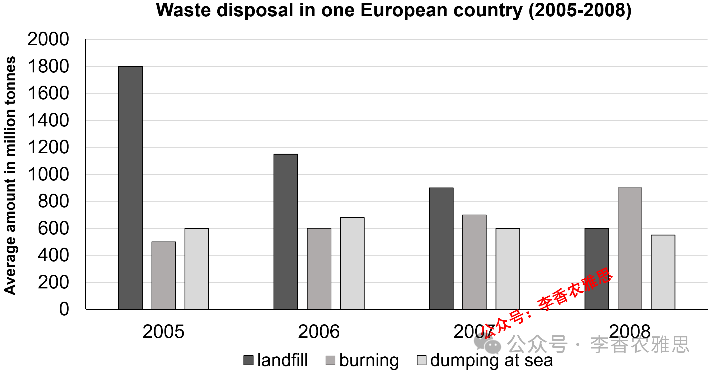

# 2026 年 2 月 28 日雅思写作真题
## Task 1

> **图表类型标注**：柱状图（四国废物处理）

**The chart below shows the waste disposal in one European country in four years: 2005, 2006, 2007, and 2008.**
**Summarise the information by selecting and reporting the main features, and make comparisons where relevant.**



The bar chart illustrates changes in the amounts of waste disposed of by landfill, burning, and dumping at sea in a European country between 2005 and 2008.

As shown, the amount of waste sent to landfill was by far the highest, with approximately 1,800 million tonnes disposed of in 2005, far exceeding the figures for those dealt with through burning and sea dumping. However, landfill use fell dramatically over the following years, with the volume of waste buried in landfills dropping to around 1,200 million tonnes in 2006 before reaching just 600 million tonnes in 2008.

On the other hand, the amount of waste incinerated rose consistently throughout the period. From the lowest figure (500 million tonnes) in 2005, it peaked at approximately 900 million tonnes in 2008, thereby causing incineration to overtake landfill as the primary disposal method. By contrast, the corresponding data on waste dumped at sea showed relatively minor fluctuations and remained comparatively stable. After rising slightly from 600 million tonnes in 2005 to a peak of 650 million tonnes in 2006, it declined gradually to 510 million tonnes in the final year.

Overall, landfill was the dominant method of waste disposal at the beginning of the period but its usage declined sharply over time, while burning increased steadily and became the most widely used method by 2008.

---

### 精析

#### ① 结构分析（精简）

本题属于 **Bar Chart** 类 Task 1，涉及 3 种垃圾处理方式（landfill, burning, dumping at sea）在 2005–2008 年间的数量变化。

本文采用 **"总-分-总"** 三段式结构：

- **Paragraph 1 — Introduction（开头段）**
  - 改写题目要素：`changes in the amounts of waste disposed of by landfill, burning, and dumping at sea`（替换原题 `waste disposal... by landfill, burning, and dumping at sea`）
  - 明确对象：3 种处理方式 + 2005–2008 年

- **Paragraph 2 — Body Details（主体段：按处理方式分组）**
  - **Landfill（大幅下降组）**：2005 年约 1800 百万吨（最高），2006 年降至约 1200，2008 年仅 600
  - **Burning（持续上升组）**：2005 年 500（最低），2008 年达约 900，超越 landfill 成为主要方式
  - **Dumping at sea（稳定波动组）**：2005 年 600，2006 年微升至 650，2008 年降至 510，整体相对稳定

- **Paragraph 3 — Overview（总结段）**
  - Landfill 从主导到大幅下降
  - Burning 稳步上升并成为最广泛使用的方式

> **结构亮点**：本文按"下降-上升-稳定"的趋势分组策略清晰高效。先写 landfill 因其初始值最高且降幅最大最具冲击力，再写 burning 因其持续上升并最终超越 landfill 最具分析价值，最后写 dumping at sea 因其相对稳定可作为参照。层次分明，对比鲜明。

#### ② 数据组织与对比策略（标注有效写法）

| 写法 | 原文示例 | 技巧说明 |
|------|---------|---------|
| **极值突出** | `by far the highest, with approximately 1,800 million tonnes` | 用 by far 强调 landfill 的绝对主导地位 |
| **降幅描述** | `fell dramatically... dropping to around 1,200... before reaching just 600` | 用 dramatically 和 just 强调降幅之大 |
| **倍数/排名变化** | `thereby causing incineration to overtake landfill as the primary disposal method` | 用 overtake 描述排名变化 |
| **稳定概括** | `showed relatively minor fluctuations and remained comparatively stable` | 用 minor fluctuations 概括波动不大的趋势 |
| **跨组对比** | `far exceeding the figures for those dealt with through burning and sea dumping` | 用 far exceeding 对比 landfill 与其他方式 |

> **数据亮点**：作者对数据的选择极具策略性。Landfill 突出 1800→600 的降幅，burning 突出 500→900 的升幅及超越 landfill 的排名变化，dumping at sea 用相对稳定概括。避免了罗列所有 12 个数据点。

#### ③ 四项能力维度分析（TA / CC / LR / GRA）

- **TA**：本文按"下降-上升-稳定"的趋势分组策略清晰高效。先写 landfill 因其初始值最高且降幅最大最具冲击力，再写 burning 因其持续上升并最终超越 landfill 最具分析价值，最后写 dumping at sea 因其相对稳定可作为参照。层次分明，对比鲜明。 作者对数据的选择极具策略性。Landfill 突出 1800→600 的降幅，burning 突出 500→900 的升幅及超越 landfill 的排名变化，dumping at sea 用相对稳定概括。避免了罗列所有 12 个数据点。
- **CC**：本文衔接词使用精准且功能明确。"thereby causing"的使用尤为出色，不仅说明了 burning 上升的结果，还自然引出了排名变化的关键信息。"corresponding data"的对应表达使第三种处理方式的引入不显突兀。
- **LR**：见模块⑤词汇表，含 `by far the highest`、`far exceeding` 等精准词
- **GRA**：见模块⑤句式亮点

#### ④ 可迁移句型骨架（直接套用）（图表类型：柱状图（四国废物处理））

**骨架 1 — 开头改写（表格/图通用）**
> The [chart] illustrates changes in ______ in [entities] in [years], along with ______.

**骨架 2 — 极值+对比（Body 通用）**
> ______ had [number], which was considerably higher than the figures for the other [n] [entities].

**骨架 3 — 排名变化/超越（含动态时）**
> ______ saw the second-largest rise and surpassed ______, with its figure growing from ______ to ______.

**骨架 4 — 双维度收尾（Overview 通用）**
> Overall, ______ had by far the largest number..., while ______ recorded the lowest figures on both measures.

#### ⑤ 衔接 / 词汇 / 句式亮点（去水版）

| 衔接类型 | 原文表达 | 功能 |
|---------|---------|------|
| **总体衔接** | `As shown, the amount of waste sent to landfill was by far the highest` | 先给出总体判断 |
| **对比衔接** | `However, landfill use fell dramatically over the following years` | 用 However 转折描述下降趋势 |
| **分类衔接** | `On the other hand, the amount of waste incinerated rose consistently` | 用 On the other hand 转向另一处理方式 |
| **结果衔接** | `thereby causing incineration to overtake landfill` | 用 thereby causing 说明上升的结果 |
| **补充衔接** | `By contrast, the corresponding data on waste dumped at sea showed...` | 用 By contrast 引出第三种情况 |
| **总结衔接** | `Overall... but... while...` | 用 but 和 while 对比总结 |

> **衔接亮点**：本文衔接词使用精准且功能明确。"thereby causing"的使用尤为出色，不仅说明了 burning 上升的结果，还自然引出了排名变化的关键信息。"corresponding data"的对应表达使第三种处理方式的引入不显突兀。

| 词汇/短语 | 中文含义 | 词性/用法 | 替代普通表达 |
|-----------|----------|----------|-------------|
| **by far the highest** | 遥遥领先的最高值 | 程度修饰 | much higher than others |
| **far exceeding** | 远远超过 | 动词短语 | much more than |
| **fell dramatically** | 急剧下降 | 动词短语 | dropped a lot |
| **dropping to** | 下降至 | 动词短语 | falling to |
| **rose consistently** | 持续稳定上升 | 动词短语 | kept going up |
| **peaked at** | 在…达到峰值 | 动词短语 | reached the highest |
| **overtake landfill** | 超越填埋、跃居其上 | 动词短语 | become more than landfill |
| **relatively minor fluctuations** | 相对轻微的起伏 | 名词短语 | small changes |
| **remained comparatively stable** | 保持相对稳定 | 动词短语 | stayed about the same |
| **declined gradually** | 逐步下降 | 动词短语 | slowly went down |

**1. 极值+对比复合句**
> *"As shown, the amount of waste sent to landfill was by far the highest, **with** approximately 1,800 million tonnes disposed of in 2005, **far exceeding** the figures for those dealt with through burning and sea dumping."*

**技巧**：用 with 独立主格结构补充具体数据，再用 far exceeding 现在分词短语作伴随状语对比其他两种方式，一句之内完成极值标注和跨组对比。

**2. 降幅描述句**
> *"However, landfill use fell dramatically over the following years, **with** the volume of waste buried in landfills dropping to around 1,200 million tonnes in 2006 **before reaching just** 600 million tonnes in 2008."*

**技巧**：用 with 独立主格结构描述降幅过程，before reaching just 强调最终值的低微，降幅描述细腻而有层次。

**3. 结果导向句**
> *"From the lowest figure (500 million tonnes) in 2005, it peaked at approximately 900 million tonnes in 2008, **thereby causing** incineration to overtake landfill as the primary disposal method."*

**技巧**：用 thereby causing 现在分词短语说明 burning 上升的直接结果——超越 landfill 成为主要方式，因果逻辑清晰。

**4. 对比总结句**
> *"Overall, landfill was the dominant method of waste disposal at the beginning of the period **but** its usage declined sharply over time, **while** burning increased steadily and became the most widely used method by 2008."*

**技巧**：用 but 转折描述 landfill 的变化，再用 while 对比 burning 的相反趋势，总结简洁而对比鲜明。

---

#### ⑥ 可提升空间 + 仿写任务

**可提升空间（通用要点，按篇酌情采纳）：**
- Overview 建议前置或明确独立成段，让阅卷人先抓全局（TA 更稳）。
- 双维度数据（如比率/占比）尽量也收进 Overview，避免只在正文提一次。
- 跨段对比（如 A 反超 B）可集中到一句呈现，衔接更紧凑。

**本文针对性可改进点（按篇分析，点到即止）：**
- 题目给的是四年数据，但正文三种处理方式都只写了 2005、2006、2008，2007 年整列缺席，属于关键数据遗漏。
- Overall 段只总结了 landfill 与 burning 的一降一升，完全没提 dumping at sea——而它恰恰是唯一"先升后降"的第三种形态，总结覆盖不全。
- `it peaked at approximately 900 million tonnes in 2008` 中 peaked 用得勉强（2008 是期末且一路上行，用 `rose to`/`reached` 更准确）；`the corresponding data on waste dumped at sea` 里的 corresponding 也属冗余，删掉更利落。

**仿写任务**：用「极值+对比」骨架写一句：描述『2020 年 X 国指标远高于其他三国』。
## Task 2

> **话题与题型标注**：犯罪与法律类 · Problem-Solution

**In all countries, there are laws designed to ensure road safety. However, some drivers still violate these regulations, for example by using mobile phones while driving or by speeding. What are the reasons for this behavior? What are the most effective solutions to this problem?**

**在所有国家，都制定了旨在确保道路安全的法律。然而，一些司机仍然违反这些规定，例如在驾驶时使用手机或超速行驶。造成这种行为的原因是什么？解决这一问题最有效的措施是什么？**

In every country, traffic regulations are implemented to reduce accidents. Nevertheless, many drivers continue to break these rules, particularly by speeding or using mobile phones while driving. There are several well-known causes of this issue, and a number of potentially effective measures to address this societal problem will be proposed.

在每个国家，交通法规的制定都是为了减少事故的发生。然而，许多司机仍然违反这些规定，尤其是在驾驶时超速或使用手机。造成这一问题的原因有多个，本文也将提出若干潜在的有效措施来应对这一社会问题。

As observed, a lack of safety awareness and weak traffic law enforcement encourage drivers to violate traffic regulations. From a driver's perspective, many who lack sufficient experience to identify hazards and drive defensively believe that they possess adequate skills to control their vehicles even when distracted or traveling at excessive speeds. This false sense of security is reinforced by the fact that accidents do not occur every time risky behavior takes place, leading individuals to assume that the danger is minimal. From a law enforcement perspective, the effectiveness of any legal system depends not merely on the existence of rules but on the certainty and severity of punishment. When traffic monitoring is inconsistent or penalties are lenient, drivers may conduct a subconscious cost–benefit analysis and conclude that breaking the law carries little real risk. Over time, such tolerance fosters a culture of impunity in which rule-breaking becomes socially acceptable.

可以看到，安全意识的缺乏以及交通执法力度薄弱促使司机违反交通法规。从司机的角度来看，许多缺乏足够经验来识别危险并进行防御性驾驶的人，往往认为自己即使在分心或高速行驶的情况下也具备足够的驾驶能力。这种错误的安全感由于事故并非每次危险行为都会发生而被进一步强化，从而使人们误以为危险程度很低。从执法角度来看，任何法律体系的有效性不仅取决于规则的存在，更取决于惩罚的确定性和严厉性。当交通监管不一致或处罚较轻时，司机可能会进行一种潜意识的成本收益分析，并得出违法成本不高的结论。随着时间推移，这种宽容会滋生一种有罪不罚的文化，使违规行为在社会上变得可以接受。

With the above-mentioned reasons in mind, a coordinated strategy that combines sustained public education with stricter enforcement is essential to curb illegal driving. First, long-term educational initiatives implemented by driving schools and media outlets should highlight the irreversible consequences of reckless behavior, including severe injuries and loss of life, rather than relying solely on abstract warnings. When individuals are exposed to authentic accounts of tragic accidents, they are more likely to internalize the seriousness of traffic violations. Such awareness can reshape social norms, fostering a culture in which dangerous driving is widely condemned. Second, traffic authorities should strengthen both the certainty and severity of punishment. The widespread use of advanced technologies, including road surveillance systems, can significantly increase the perceived likelihood of being caught, and once illegal driving is confirmed, license penalty points and temporary suspensions should be strictly enforced. When compliance becomes the safer and more rational choice, adherence to traffic laws naturally improves.

鉴于上述原因，结合持续性的公众教育与更严格的执法是一种遏制违法驾驶的必要策略。首先，由驾校和媒体实施的长期教育项目应当强调鲁莽驾驶所带来的不可逆后果，包括严重伤害和生命损失，而不是仅仅依赖抽象的警示。当人们接触到真实的悲惨事故案例时，他们更有可能真正认识到交通违法的严重性。这种认知能够重塑社会规范，营造一种广泛谴责危险驾驶的文化。其次，交通管理部门应当加强处罚的确定性和严厉性。广泛使用先进技术，包括道路监控系统，可以显著提高违法被发现的概率，一旦确认违法行为，应严格执行驾照扣分和暂扣等处罚措施。当守法成为更安全且更理性的选择时，人们自然会更好地遵守交通法规。

In conclusion, insufficient safety awareness and weak enforcement are the primary drivers of traffic violations. Combining long-term education with stricter monitoring and penalties is essential to reshape public attitudes and deter risky behavior, ultimately promoting a safer and more responsible driving culture.

总之，安全意识不足和执法力度薄弱是交通违法的主要原因。通过结合长期教育与更严格的监管和处罚，可以重塑公众态度，遏制危险行为，从而促进更加安全、更加负责任的驾驶文化。

---

### 精析

#### ① 结构分析（精简）

本题属于 **Problem-Solution** 类题型。此类题型的核心策略是：分析问题原因，然后提出解决措施。

本文采用 **"原因-措施"** 四段式结构：

- **Paragraph 1 — Introduction（开头段）**
  - 改写题目（paraphrase）：`traffic regulations are implemented to reduce accidents. Nevertheless, many drivers continue to break these rules`（替换原题 `there are laws designed to ensure road safety. However, some drivers still violate these regulations`）
  - 表明立场：先分析原因，再提出措施
  - 预告框架：原因段+措施段

- **Paragraph 2 — Body 1（原因段）**
  - 主题句：`a lack of safety awareness and weak traffic law enforcement encourage drivers to violate traffic regulations`
  - 角度1（司机视角）：缺乏经验者错误认为自己能控制车辆，事故并非每次发生→危险感 minimal
  - 角度2（执法视角）：监控不一致或处罚较轻→司机进行成本收益分析→违法成本低→有罪不罚文化

- **Paragraph 3 — Body 2（措施段）**
  - 主题句：`a coordinated strategy that combines sustained public education with stricter enforcement is essential`
  - 措施1：长期教育项目（驾校和媒体）强调不可逆后果→真实事故案例→重塑社会规范
  - 措施2：加强处罚确定性和严厉性→道路监控技术→扣分和暂扣严格执行

- **Paragraph 4 — Conclusion（结尾段）**
  - 重申原因：`insufficient safety awareness and weak enforcement are the primary drivers`
  - 重申措施：`Combining long-term education with stricter monitoring and penalties is essential`
  - 总结升华：促进更安全、更负责任的驾驶文化

> **结构亮点**：本文采用经典的"原因-措施"双段结构，每段内部都从两个角度展开（司机/执法、教育/处罚），使分析全面而对称。特别值得注意的是，作者在原因段中使用了"成本收益分析"这一经济学概念，使论证更具学术深度。

#### ② 论证逻辑链拆解（标注有效写法）

**Body 1（原因段）的逻辑链条：**

```
交通违法原因
    ↓ [核心论点]
→ 安全意识缺乏 + 执法力度薄弱
    ↓ [角度一：司机]
→ 缺乏经验者错误安全感
    ↓ [机制]
    认为自己能控制车辆（即使分心或超速）
    ↓ [强化因素]
    事故并非每次危险行为都发生
    ↓ [结果]
    误以为危险程度很低

    ↓ [角度二：执法]
→ 法律体系有效性取决于惩罚确定性和严厉性
    ↓ [问题]
    监控不一致或处罚较轻
    ↓ [司机反应]
    潜意识成本收益分析
    ↓ [结论]
    违法成本不高
    ↓ [长期后果]
    有罪不罚文化 → 违规被社会接受
```

**Body 2（措施段）的逻辑链条：**

```
解决策略
    ↓ [核心论点]
→ 持续公众教育 + 更严格执法
    ↓ [措施一：教育]
→ 驾校和媒体实施长期教育
    ↓ [内容]
    强调鲁莽驾驶的不可逆后果
    ↓ [方式]
    真实悲惨事故案例（而非抽象警示）
    ↓ [效果]
    内化交通违法严重性
    ↓ [深层效果]
    重塑社会规范 → 广泛谴责危险驾驶

    ↓ [措施二：执法]
→ 加强处罚确定性和严厉性
    ↓ [技术手段]
    道路监控系统
    ↓ [效果]
    提高违法被发现的概率
    ↓ [执行]
    扣分和暂扣严格执行
    ↓ [最终效果]
    守法成为更安全、更理性的选择
```

> **逻辑亮点**：本文论证采用了"双角度分析"策略。在原因段中，从"司机心理"和"执法机制"两个角度分析；在措施段中，从"教育"和"执法"两个角度提出方案。每个角度都遵循"前提→机制→结果"的推导路径，逻辑链条完整。

#### ③ 四项能力维度分析（TA / CC / LR / GRA）

- **TA**：本文采用经典的"原因-措施"双段结构，每段内部都从两个角度展开（司机/执法、教育/处罚），使分析全面而对称。特别值得注意的是，作者在原因段中使用了"成本收益分析"这一经济学概念，使论证更具学术深度。 本文论证采用了"双角度分析"策略。在原因段中，从"司机心理"和"执法机制"两个角度分析；在措施段中，从"教育"和"执法"两个角度提出方案。每个角度都遵循"前提→机制→结果"的推导路径，逻辑链条完整。
- **CC**：本文衔接手段丰富且功能明确。"From a driver's perspective""From a law enforcement perspective"的双角度切换使原因分析全面，"With the above-mentioned reasons in mind"的承上启下使文章从原因段自然过渡到措施段，"ultimately"的总结使全文收束有力。
- **LR**：见模块⑤词汇表，含 `traffic regulations`、`break these rules` 等精准词
- **GRA**：见模块⑤句式亮点

#### ④ 可迁移句型骨架（直接套用）（题型：Problem-Solution）

**骨架 1 — 问题+原因**
> A pressing problem is ______, largely caused by ______.

**骨架 2 — 解决措施**
> To tackle this, governments/individuals should ______, which would ______.

**骨架 3 — 措施效果**
> Such measures, if implemented, could ______ and ultimately ______.

#### ⑤ 衔接 / 词汇 / 句式亮点（去水版）

| 衔接类型 | 原文表达 | 功能说明 |
|---------|---------|---------|
| **立场预告** | `There are several well-known causes... and a number of potentially effective measures... will be proposed` | 开头段预告原因和措施 |
| **因果衔接** | `As observed, a lack of safety awareness and weak traffic law enforcement encourage...` | 用 As observed 引出原因 |
| **视角切换** | `From a driver's perspective... From a law enforcement perspective...` | 用 From... perspective 切换分析角度 |
| **因果衔接** | `This false sense of security is reinforced by the fact that...` | 用 reinforced by 解释错误安全感的来源 |
| **结果衔接** | `leading individuals to assume that...` | 用 leading 引出结果 |
| **递进衔接** | `Over time, such tolerance fosters a culture of impunity` | 用 Over time 描述长期后果 |
| **措施衔接** | `With the above-mentioned reasons in mind...` | 用 With... in mind 承上启下引出措施 |
| **分类衔接** | `First... Second...` | 用 First/Second 组织措施 |
| **总结衔接** | `In conclusion... ultimately...` | 收束全文并升华 |

> **衔接亮点**：本文衔接手段丰富且功能明确。"From a driver's perspective""From a law enforcement perspective"的双角度切换使原因分析全面，"With the above-mentioned reasons in mind"的承上启下使文章从原因段自然过渡到措施段，"ultimately"的总结使全文收束有力。

| 词汇/短语 | 中文含义 | 词性/用法 | 替代普通表达 |
|-----------|----------|----------|-------------|
| **traffic regulations** | 交通法规 | 名词短语 | traffic rules |
| **break these rules** | 违反这些规定 | 动词短语 | not follow rules |
| **a lack of safety awareness** | 安全意识的缺乏 | 名词短语 | not knowing about safety |
| **drive defensively** | 防御性驾驶（预判风险地开车） | 动词短语 | drive safely |
| **a false sense of security** | 虚假的安全感 | 名词短语 | wrong feeling of safety |
| **reinforced by** | 因…而被强化 | 动词短语 | made stronger by |
| **a subconscious cost-benefit analysis** | 潜意识里的成本收益权衡 | 名词短语 | thinking about costs and benefits |
| **a culture of impunity** | 有罪不罚的风气 | 名词短语 | culture of no punishment |
| **curb illegal driving** | 遏制违法驾驶 | 动词短语 | stop illegal driving |
| **irreversible consequences** | 不可逆转的后果 | 名词短语 | results that cannot be changed |
| **internalize the seriousness** | 从内心真正认识到其严重性 | 动词短语 | truly understand |
| **deter risky behavior** | 威慑并遏制危险行为 | 动词短语 | stop dangerous behavior |

**1. 因果机制推演句**
> *"This false sense of security **is reinforced by** the fact that accidents do not occur every time risky behavior takes place, **leading** individuals to assume that the danger is minimal."*

**技巧**：用 is reinforced by 说明错误安全感的强化机制，再用 leading 现在分词短语引出最终结果，因果链条清晰。

**2. 条件后果推演句**
> *"**When** traffic monitoring is inconsistent or penalties are lenient, drivers may conduct a subconscious cost-benefit analysis and conclude that breaking the law carries little real risk."*

**技巧**：用 When 引导条件从句，主句用 may conduct... and conclude... 连接两个动作，说明司机在执法薄弱时的理性计算，论证极具洞察力。

**3. 承上启下句**
> *"**With the above-mentioned reasons in mind**, a coordinated strategy that combines sustained public education with stricter enforcement is essential to curb illegal driving."*

**技巧**：用 With the above-mentioned reasons in mind 承上启下，自然从原因分析过渡到措施提出，使文章结构清晰。

**4. 综合效果句**
> *"Combining long-term education with stricter monitoring and penalties is essential to reshape public attitudes and deter risky behavior, **ultimately promoting** a safer and more responsible driving culture."*

**技巧**：用 ultimately promoting 现在分词短语作最终结果状语，将教育、执法与最终目标（安全驾驶文化）连接，总结升华有力。

#### ⑥ 可提升空间 + 仿写任务

**可提升空间（通用要点，按篇酌情采纳）：**
- 结论段避免复读开头，应「推进」而非「重复」立场。
- 让步段衔接词（this perspective 等）回指别太远，可加限定词收紧。
- 同一话题词（如 career / benefit）避免三现，用近义替换。

**本文针对性可改进点（按篇分析，点到即止）：**
- 原因段第一分论点打的标签是 `a lack of safety awareness`，可实际展开的是"过度自信与风险感知偏差"（自认技术够好、事故不是每次都发生），标签与论证内容不完全对应，换成 `misplaced confidence in one's own driving ability` 更贴切。
- 两个主体段全是抽象机制推演，没有任何具体例证（某国监控普及后事故率变化、扣分制的实际效果等）；Problem-Solution 题型补一处实例，说服力提升最明显。
- 开头段 `a number of potentially effective measures... will be proposed` 是论文式被动预告，考场作文中偏生硬，改为主动的 `this essay will suggest several workable measures` 更自然。

**仿写任务**：为『城市交通拥堵』写一句问题+原因，再写一句解决措施。
