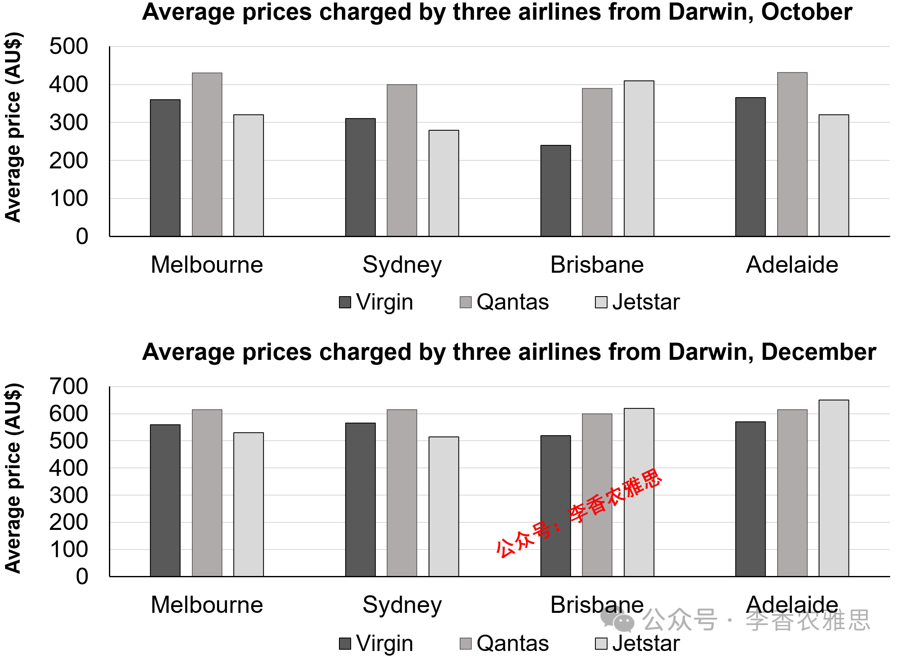

# 2026 年 3 月 7 日雅思写作真题
## Task 1

> **图表类型标注**：柱状图（双图对比（三航司票价：10月 vs 12月））

**The charts below show the average prices charged by three airlines for flights from Darwin to four cities in Austria in October, 2017 and during the holiday period in December, 2017.**
**Summarise the information by selecting and reporting the main features, and make comparisons where relevant.**



The two bar charts illustrate the average ticket prices charged by three airlines, Virgin, Qantas and Jetstar, for flights from Darwin to Melbourne, Sydney, Brisbane, and Adelaide in October and during the holiday period in December 2017.

In October, Qantas consistently charged the most for flights to Melbourne, Sydney and Adelaide, with the fares to Melbourne and Adelaide being the same at roughly 430 AUD each. Virgin’s prices were lower, ranging from about 240 AUD for Brisbane to around 350 AUD for Melbourne. In contrast, Jetstar usually offered the cheapest tickets, particularly for Sydney (almost 270 AUD) and Adelaide (nearly 320 AUD), although its fare for Brisbane was relatively high at approximately 410 AUD, exceeding those of both Virgin and Qantas.

In December, prices went up substantially across all airlines and destinations. Qantas maintained relatively high fares, charging around 620 AUD for routes to Melbourne, Sydney, and Adelaide, while Jetstar experienced the most dramatic increases in ticket prices, which climbed to about 620 AUD for Brisbane and reached roughly 650 AUD for Adelaide, making it the most expensive option on those routes. On the other hand, Virgin’s prices rose to approximately 530-560 AUD, depending on the destination.

Overall, fares soared in December across all routes and airlines. Qantas generally charged the highest prices in October, whereas Jetstar offered the lowest fares on most routes. However, Jetstar's prices rose sharply and became the highest on some routes in December.

---

### 精析

#### ① 结构分析（精简）

本题属于 **Bar Chart (Mixed/Comparison)** 类 Task 1，涉及两家航空公司（Qantas, Jetstar）在两个月份（October, December）飞往四个城市（Melbourne, Sydney, Brisbane, Adelaide）的平均票价对比。

本文采用 **"总-分-总"** 三段式结构：

- **Paragraph 1 — Introduction（开头段）**
  - 改写题目要素：`the average ticket prices charged by two airlines... for flights from Darwin to four cities... in October and during the holiday period in December 2017`（替换原题 `average prices charged by two airlines for flights... in October and during the holiday period in December`）
  - 明确对象：2 家航空公司 + 4 个城市 + 2 个时间点

- **Paragraph 2 — Body Details（主体段：按时间分组）**
  - **October（平日）**：Qantas 票价最高（Melbourne/Adelaide 约 430 AUD），Jetstar 最低（Sydney 约 270 AUD, Adelaide 约 320 AUD），但 Brisbane 例外（Jetstar 约 410 AUD，超过 Qantas）
  - **December（假期）**：所有航线票价大幅上涨。Qantas 维持高价（约 620 AUD），Jetstar 涨幅最大（Brisbane 约 620 AUD, Adelaide 约 650 AUD，成为最贵），Virgin 约 530–560 AUD

- **Paragraph 3 — Overview（总结段）**
  - 12 月所有航线和航空公司票价飙升
  - 10 月 Qantas 最高，Jetstar 最低；但 12 月 Jetstar 部分航线成为最贵

> **结构亮点**：本文按"时间维度"分组（先 October 后 December），在每个时间段内再按航空公司展开对比。这种结构使读者可以清晰看到"假期效应"对票价的影响，以及 Jetstar 从"最便宜"到"最贵"的戏剧性转变。

#### ② 数据组织与对比策略（标注有效写法）

| 写法 | 原文示例 | 技巧说明 |
|------|---------|---------|
| **极值突出** | `Qantas consistently charged the most` | 用 consistently 强调 Qantas 的高价持续性 |
| **例外标注** | `although its fare for Brisbane was relatively high at approximately 410 AUD, exceeding those of both Virgin and Qantas` | 用 although 标注 Jetstar 的例外情况 |
| **变化概括** | `prices went up substantially across all airlines and destinations` | 用 substantially 概括假期票价整体上涨 |
| **涨幅对比** | `Jetstar experienced the most dramatic increases` | 用 most dramatic 强调 Jetstar 涨幅最大 |
| **排名变化** | `making it the most expensive option on those routes` | 用 making 说明 Jetstar 从最低到最高的转变 |

> **数据亮点**：作者精准选择了关键数据点进行描述。October 中突出 Qantas 的 430 AUD 和 Jetstar 的 270 AUD 对比，December 中突出 Jetstar 的 650 AUD 和"成为最贵"的排名变化。避免了罗列所有 16 个数据点。

#### ③ 四项能力维度分析（TA / CC / LR / GRA）

- **TA**：本文按"时间维度"分组（先 October 后 December），在每个时间段内再按航空公司展开对比。这种结构使读者可以清晰看到"假期效应"对票价的影响，以及 Jetstar 从"最便宜"到"最贵"的戏剧性转变。 作者精准选择了关键数据点进行描述。October 中突出 Qantas 的 430 AUD 和 Jetstar 的 270 AUD 对比，December 中突出 Jetstar 的 650 AUD 和"成为最贵"的排名变化。避免了罗列所有 16 个数据点。
- **CC**：本文衔接词使用精准且功能明确。"although"的让步衔接使 Jetstar 的例外情况得到客观描述，"while"的对比衔接使 Qantas 和 Jetstar 的不同涨幅得以对比，"However"的转折衔接使 Jetstar 从最低到最高的戏剧性转变得以突出。
- **LR**：见模块⑤词汇表，含 `consistently charged the most`、`roughly 430 AUD each` 等精准词
- **GRA**：见模块⑤句式亮点

#### ④ 可迁移句型骨架（直接套用）（图表类型：柱状图（双图对比（三航司票价：10月 vs 12月）））

**骨架 1 — 开头改写（表格/图通用）**
> The [chart] illustrates changes in ______ in [entities] in [years], along with ______.

**骨架 2 — 极值+对比（Body 通用）**
> ______ had [number], which was considerably higher than the figures for the other [n] [entities].

**骨架 3 — 排名变化/超越（含动态时）**
> ______ saw the second-largest rise and surpassed ______, with its figure growing from ______ to ______.

**骨架 4 — 双维度收尾（Overview 通用）**
> Overall, ______ had by far the largest number..., while ______ recorded the lowest figures on both measures.

#### ⑤ 衔接 / 词汇 / 句式亮点（去水版）

| 衔接类型 | 原文表达 | 功能 |
|---------|---------|------|
| **时间衔接** | `In October... In December...` | 按时间顺序推进 |
| **对比衔接** | `In contrast, Jetstar usually offered the cheapest tickets` | 用 In contrast 对比 Qantas 和 Jetstar |
| **让步衔接** | `although its fare for Brisbane was relatively high...` | 用 although 标注例外 |
| **变化衔接** | `prices went up substantially across all airlines and destinations` | 用 went up substantially 描述整体变化 |
| **对比衔接** | `while Jetstar experienced the most dramatic increases...` | 用 while 对比 Qantas 和 Jetstar 的不同变化 |
| **补充衔接** | `On the other hand, Virgin's prices rose to approximately 530-560 AUD` | 用 On the other hand 补充 Virgin 的数据 |
| **总结衔接** | `Overall... whereas... However...` | 用 whereas 和 However 分层总结 |

> **衔接亮点**：本文衔接词使用精准且功能明确。"although"的让步衔接使 Jetstar 的例外情况得到客观描述，"while"的对比衔接使 Qantas 和 Jetstar 的不同涨幅得以对比，"However"的转折衔接使 Jetstar 从最低到最高的戏剧性转变得以突出。

| 词汇/短语 | 中文含义 | 词性/用法 | 替代普通表达 |
|-----------|----------|----------|-------------|
| **consistently charged the most** | 始终收费最高 | 动词短语 | always had the highest prices |
| **roughly 430 AUD each** | 各约 430 澳元 | 副词短语 | about 430 AUD |
| **ranging from... to...** | 从…到…不等 | 介词短语 | from... to... |
| **relatively high** | 相对偏高的 | 形容词短语 | quite high |
| **exceeding those of** | 超过…的相应数值 | 动词短语 | higher than |
| **went up substantially** | 大幅上涨 | 动词短语 | increased a lot |
| **maintained relatively high fares** | 维持在相对较高的票价水平 | 动词短语 | kept high prices |
| **the most dramatic increases** | 最为剧烈的涨幅 | 名词短语 | the biggest rises |
| **depending on the destination** | 视目的地而定 | 介词短语 | according to the city |
| **soared** | 飙升 | 动词 | increased sharply |

**1. 让步例外句**
> *"In contrast, Jetstar usually offered the cheapest tickets, particularly for Sydney (almost 270 AUD) and Adelaide (nearly 320 AUD), **although** its fare for Brisbane was relatively high at approximately 410 AUD, **exceeding those of both Virgin and Qantas**."*

**技巧**：用 although 引导让步从句，先承认 Jetstar 的例外情况（Brisbane 票价高），再用 exceeding 现在分词短语补充说明其超过其他两家航空公司，使描述客观全面。

**2. 涨幅描述句**
> *"Qantas maintained relatively high fares, charging around 620 AUD for routes to Melbourne, Sydney, and Adelaide, **while** Jetstar experienced the most dramatic increases in ticket prices, **which climbed to** about 620 AUD for Brisbane and **reached** roughly 650 AUD for Adelaide, **making it** the most expensive option on those routes."*

**技巧**：用 while 对比 Qantas 和 Jetstar 的不同变化，which 引导定语从句描述 Jetstar 的具体涨幅，making it 现在分词短语说明最终结果（成为最贵），信息密度极高。

**3. 变化概括句**
> *"In December, **prices went up substantially across all airlines and destinations**."*

**技巧**：用 across all airlines and destinations 强调变化的普遍性，substantially 准确描述涨幅程度，简洁有力。

**4. 对比总结句**
> *"Overall, fares **soared** in December across all routes and airlines. Qantas generally charged the highest prices in October, **whereas** Jetstar offered the lowest fares on most routes. **However**, Jetstar's prices rose sharply and became the highest on some routes in December."*

**技巧**：用 soared 强调假期票价整体飙升，whereas 对比 10 月 Qantas 和 Jetstar 的定价差异，However 转折突出 12 月 Jetstar 的排名逆转，总结层次分明。

---

#### ⑥ 可提升空间 + 仿写任务

**可提升空间（通用要点，按篇酌情采纳）：**
- Overview 建议前置或明确独立成段，让阅卷人先抓全局（TA 更稳）。
- 双维度数据（如比率/占比）尽量也收进 Overview，避免只在正文提一次。
- 跨段对比（如 A 反超 B）可集中到一句呈现，衔接更紧凑。

**本文针对性可改进点（按篇分析，点到即止）：**
- `Qantas maintained relatively high fares, charging around 620 AUD...` 中的 maintained 与数据不符——Qantas 从 10 月的约 430 涨到 620，是明显上涨而非持平；改为 `remained among the most expensive, rising to around 620 AUD` 才对得上图。
- 12 月段数据颗粒度不均：Jetstar 只写了 Brisbane 与 Adelaide，Melbourne、Sydney 的涨后价缺席；Virgin 更以 `approximately 530-560 AUD, depending on the destination` 一笔带过，四条航线无一落点。
- 10 月段 Virgin 仅给出 Brisbane（240）与 Melbourne（350）两个区间端点，Sydney、Adelaide 无从定位；`ranging from... to...` 虽省字，但至少应补一句"其余两地居于区间中段"。

**仿写任务**：用「极值+对比」骨架写一句：描述『2020 年 X 国指标远高于其他三国』。
## Task 2

> **话题与题型标注**：犯罪与法律类 · Agree/Disagree

**The best way to reduce youth crimes is to educate parents in parenting skills. To what extent do you agree or disagree?**

**最好的减少年轻人犯罪的方法是教育父母育儿技能。你在多大程度上同意或不同意这个观点？**

Some people argue that educating parents in effective parenting skills is the best strategy to reduce juvenile delinquency. While parental guidance plays a crucial role in shaping children's behavior, I disagree that it is the best solution.

一些人认为，通过向父母教授有效的育儿技能，是减少青少年犯罪的最佳策略。虽然父母的引导在塑造儿童行为方面起着至关重要的作用，但我并不认为这是最好的解决方案。

Admittedly, improving parents' parenting skills can significantly reduce the likelihood of young people engaging in criminal behavior. Parents are typically the first and most influential figures in a child's development, and their approaches to discipline, communication, and emotional support shape a child's values and behavioral patterns. For instance, parents who establish clear rules while maintaining open communication are more likely to raise children who understand social boundaries and develop self-control. In contrast, inadequate supervision or harsh, inconsistent discipline can increase the risk of rebellious or antisocial behavior. Parenting education programs can therefore equip caregivers with practical strategies, such as conflict resolution, emotional guidance, and effective monitoring, that help reduce the risk of children committing crimes.

诚然，提高父母的育儿技能可以显著降低青少年从事犯罪行为的可能性。父母通常是儿童成长过程中最早且最具影响力的人物，他们在纪律、沟通和情感支持方面的方式会塑造孩子的价值观和行为模式。例如，那些在保持开放沟通的同时建立明确规则的父母，更有可能培养出理解社会边界并具备自我控制能力的孩子。相反，监督不足或严厉而不一致的管教方式则可能增加叛逆或反社会行为的风险。因此，育儿教育项目可以为监护人提供实用策略，例如冲突解决、情感引导以及有效监督，从而帮助降低儿童实施犯罪的风险。

However, attributing youth crime primarily to poor parenting oversimplifies its underlying causes, as it is a complex issue that requires broader social and institutional responses. From a societal perspective, adolescents are strongly influenced by factors outside the family, including peer pressure, school environments, and community conditions. In disadvantaged neighborhoods, for example, limited educational opportunities and exposure to violence may push young people toward criminal activity regardless of their parents' efforts. Likewise, the growing influence of online communities and social media can expose teenagers to harmful behaviors beyond parental control. Consequently, policies aimed solely at improving parenting skills may fail to address these wider structural influences.

然而，将青少年犯罪主要归因于不良的家庭教育，是对这一问题根本原因的过度简化，因为青少年犯罪是一个需要更广泛社会和制度性回应的复杂问题。从社会层面来看，青少年还会受到家庭之外多种因素的强烈影响，包括同伴压力、学校环境以及社区条件。例如，在贫困社区中，有限的教育机会和暴力环境可能会促使年轻人走向犯罪，而不论父母多么努力。同样，网络社区和社交媒体日益增强的影响力，也可能使青少年接触到父母难以控制的有害行为。因此，仅仅旨在提高育儿技能的政策可能无法解决这些更广泛的结构性因素。

With these considerations in mind, a comprehensive approach is necessary. The brain's structure and function undergo considerable changes during adolescence, and the lack of full brain development makes young people more susceptible to committing crimes. Therefore, schools should provide moral education and counselling services to help students develop social responsibility and emotional resilience, while governments can invest in youth centers and mentorship programs that offer constructive alternatives to delinquency. When such social support systems operate alongside informed and supportive parenting, the likelihood of youth crime can be reduced more effectively.

基于这些考虑，必须采取更加综合的应对方式。青少年时期，大脑结构和功能会经历显著变化，而尚未完全成熟的大脑使年轻人更容易产生犯罪行为。因此，学校应提供道德教育和心理辅导服务，以帮助学生培养社会责任感和情绪韧性，同时政府也可以投资建设青少年中心和导师项目，为青少年提供远离违法行为的建设性选择。当这些社会支持体系与理性且有支持性的家庭教育相结合时，青少年犯罪发生的可能性就能更加有效地降低。

In conclusion, educating parents in effective parenting skills is an important measure for preventing youth crime by shaping young people's behavior. Nevertheless, it should not be regarded as the best solution. Addressing juvenile delinquency requires a broader strategy that combines parental education with strong educational institutions and supportive community programs.

总之，通过向父母教授有效的育儿技能，是预防青少年犯罪的重要措施，因为家庭教育能够塑造年轻人的行为。然而，这不应被视为最佳或唯一的解决方案。解决青少年犯罪问题需要更广泛的策略，将父母教育、健全的教育体系以及支持性的社区项目结合起来。

---

### 精析

#### ① 结构分析（精简）

本题属于 **Agree/Disagree** 类题型。此类题型的核心策略是：明确表明立场，然后展开论证。

本文采用 **"让步-反驳-建议"** 四段式结构：

- **Paragraph 1 — Introduction（开头段）**
  - 改写题目（paraphrase）：`educating parents in effective parenting skills is the best strategy to reduce juvenile delinquency`（替换原题 `The best way to reduce youth crimes is to educate parents in parenting skills`）
  - 表明立场：`I disagree that it is the best solution`（明确反对）
  - 预告框架：先承认育儿教育的重要性，再反驳其作为"最佳方案"的局限性

- **Paragraph 2 — Body 1（让步段）**
  - 主题句：`improving parents' parenting skills can significantly reduce the likelihood of young people engaging in criminal behavior`
  - 论点：父母是最早且最具影响力的人物
  - 机制：纪律、沟通和情感支持塑造价值观和行为模式
  - 例证：建立明确规则+开放沟通→培养理解社会边界和自我控制的孩子
  - 反面：监督不足或严厉不一致的管教→叛逆或反社会行为
  - 结论：育儿教育项目可提供实用策略（冲突解决、情感引导、有效监督）

- **Paragraph 3 — Body 2（反驳段）**
  - 主题句：`attributing youth crime primarily to poor parenting oversimplifies its underlying causes`
  - 论点1：青少年受家庭外因素影响（同伴压力、学校环境、社区条件）
  - 例证：贫困社区中有限教育机会和暴力环境→走向犯罪
  - 论点2：网络社区和社交媒体的影响超出父母控制
  - 结论：仅改善育儿技能无法解决更广泛的结构性因素

- **Paragraph 4 — Body 3（建议段）**
  - 主题句：`a comprehensive approach is necessary`
  - 论据：青少年大脑发育不完全→更容易犯罪
  - 建议1：学校提供道德教育和心理咨询→培养社会责任感和情绪韧性
  - 建议2：政府投资青少年中心和导师项目→提供建设性选择
  - 结论：社会支持体系与理性育儿结合→更有效降低青少年犯罪

- **Paragraph 5 — Conclusion（结尾段）**
  - 重申立场：`educating parents... is an important measure... Nevertheless, it should not be regarded as the best solution`
  - 总结升华：需要更广泛的策略，结合父母教育、教育机构和社区项目

> **结构亮点**：本文采用"先退后进再建议"的三段式主体结构，先充分承认育儿教育的价值，再系统反驳其作为"最佳方案"的局限性，最后提出更全面的综合方案。这种结构使论证从否定到建设性建议层层推进，极具说服力。

#### ② 论证逻辑链拆解（标注有效写法）

**Body 1（让步段）的逻辑链条：**

```
育儿教育的价值
    ↓ [核心论点]
→ 显著降低青少年犯罪可能性
    ↓ [前提]
→ 父母是最早且最具影响力的人物
    ↓ [机制]
    纪律、沟通、情感支持塑造价值观和行为模式
    ↓ [正面例证]
    明确规则 + 开放沟通
    ↓ [效果]
    培养理解社会边界和自我控制的孩子
    ↓ [反面]
    监督不足或严厉不一致的管教
    ↓ [后果]
    增加叛逆或反社会行为风险
    ↓ [结论]
    育儿教育项目提供实用策略
    ↓ [具体策略]
    冲突解决、情感引导、有效监督
```

**Body 2（反驳段）的逻辑链条：**

```
育儿教育的局限性
    ↓ [核心论点]
→ 将青少年犯罪主要归因于不良家庭教育是过度简化
    ↓ [原因一：社会因素]
→ 青少年受家庭外因素强烈影响
    ↓ [具体因素]
    ├── 同伴压力
    ├── 学校环境
    └── 社区条件
    ↓ [例证]
    贫困社区中有限教育机会和暴力环境
    ↓ [结论]
    不论父母多么努力，仍可能走向犯罪

    ↓ [原因二：网络影响]
→ 网络社区和社交媒体日益增强的影响力
    ↓ [后果]
    青少年接触到父母难以控制的有害行为
    ↓ [最终结论]
    仅改善育儿技能无法解决更广泛的结构性因素
```

> **逻辑亮点**：本文论证采用了"以子之矛攻子之盾"策略。在让步段中充分建立"家庭教育塑造行为"的合理性，再在反驳段中指出"家庭外因素同样塑造行为"，从而证明将青少年犯罪"主要归因于"家庭教育的片面性。最后提出综合方案，论证完整。

#### ③ 四项能力维度分析（TA / CC / LR / GRA）

- **TA**：本文采用"先退后进再建议"的三段式主体结构，先充分承认育儿教育的价值，再系统反驳其作为"最佳方案"的局限性，最后提出更全面的综合方案。这种结构使论证从否定到建设性建议层层推进，极具说服力。 本文论证采用了"以子之矛攻子之盾"策略。在让步段中充分建立"家庭教育塑造行为"的合理性，再在反驳段中指出"家庭外因素同样塑造行为"，从而证明将青少年犯罪"主要归因于"家庭教育的片面性。最后提出综合方案，论证完整。
- **CC**：本文衔接手段丰富且功能明确。"Admittedly""However""Nevertheless"的递进转折使论证层层深入，"For instance""In disadvantaged neighborhoods, for example"的具体例证增强了论证的可信度，"With these considerations in mind"的承上启下使文章从反驳自然过渡到建议。
- **LR**：见模块⑤词汇表，含 `juvenile delinquency`、`parental guidance` 等精准词
- **GRA**：见模块⑤句式亮点

#### ④ 可迁移句型骨架（直接套用）（题型：Agree/Disagree）

**骨架 1 — 先退后进亮立场（Intro）**
> Although ______ deserves a central place because ______, I disagree with the view that ______.

**骨架 2 — 分类论证起手（Body）**
> From the perspective of ______, doing X helps ______ and ______. Meanwhile, X also offers ______ that go beyond ______.

**骨架 3 — 抽象→具体例证（Body）**
> For example, a course on ______ may show how ______ have harmed ______, as illustrated by ______.

#### ⑤ 衔接 / 词汇 / 句式亮点（去水版）

| 衔接类型 | 原文表达 | 功能说明 |
|---------|---------|---------|
| **立场预告** | `While parental guidance plays a crucial role... I disagree that it is the best solution` | 开头段先让步再明确反对 |
| **让步衔接** | `Admittedly, improving parents' parenting skills can significantly reduce...` | 用 Admittedly 引出对方合理之处 |
| **例证衔接** | `For instance, parents who establish clear rules...` | 用 For instance 引出正面例子 |
| **对比衔接** | `In contrast, inadequate supervision or harsh, inconsistent discipline can increase...` | 用 In contrast 引出反面情况 |
| **因果衔接** | `Parenting education programs can therefore equip caregivers...` | 用 therefore 推导结论 |
| **转折衔接** | `However, attributing youth crime primarily to poor parenting oversimplifies...` | 用 However 转向反驳 |
| **例证衔接** | `In disadvantaged neighborhoods, for example...` | 用 for example 引出社会因素例证 |
| **递进衔接** | `Likewise, the growing influence of online communities...` | 用 Likewise 递进补充另一因素 |
| **建议衔接** | `With these considerations in mind, a comprehensive approach is necessary` | 承上启下引出建议 |
| **总结衔接** | `In conclusion... Nevertheless...` | 收束全文并重申立场 |

> **衔接亮点**：本文衔接手段丰富且功能明确。"Admittedly""However""Nevertheless"的递进转折使论证层层深入，"For instance""In disadvantaged neighborhoods, for example"的具体例证增强了论证的可信度，"With these considerations in mind"的承上启下使文章从反驳自然过渡到建议。

| 词汇/短语 | 中文含义 | 词性/用法 | 替代普通表达 |
|-----------|----------|----------|-------------|
| **juvenile delinquency** | 青少年犯罪 | 名词短语 | youth crime |
| **parental guidance** | 父母的引导 | 名词短语 | parents' help |
| **plays a crucial role** | 起着至关重要的作用 | 动词短语 | is very important |
| **engaging in criminal behavior** | 实施犯罪行为 | 动词短语 | committing crimes |
| **shape a child's values** | 塑造孩子的价值观 | 动词短语 | influence a child's values |
| **behavioral patterns** | 行为模式 | 名词短语 | behavior |
| **establish clear rules** | 确立明确的规则 | 动词短语 | set clear rules |
| **maintain open communication** | 保持开放的沟通 | 动词短语 | keep communication open |
| **social boundaries** | 社会行为的界限、分寸 | 名词短语 | social rules |
| **self-control** | 自控力 | 名词短语 | control oneself |
| **inadequate supervision** | 监管不足 | 名词短语 | not enough watching |
| **harsh, inconsistent discipline** | 严厉且反复无常的管教 | 名词短语 | strict and changing punishment |
| **rebellious or antisocial behavior** | 叛逆或反社会行为 | 名词短语 | bad behavior |
| **equip caregivers with** | 使照护者掌握（某种能力） | 动词短语 | give caregivers |
| **conflict resolution** | 冲突化解 | 名词短语 | solving conflicts |
| **emotional guidance** | 情绪疏导 | 名词短语 | emotional help |
| **effective monitoring** | 有效的监督 | 名词短语 | good watching |
| **oversimplifies its underlying causes** | 把其深层成因过度简化 | 动词短语 | makes the causes too simple |
| **peer pressure** | 同伴压力 | 名词短语 | pressure from friends |
| **disadvantaged neighborhoods** | 贫困弱势社区 | 名词短语 | poor areas |
| **beyond parental control** | 超出父母掌控范围 | 介词短语 | parents cannot control |
| **a comprehensive approach** | 综合施策的方案 | 名词短语 | a complete way |
| **emotional resilience** | 情绪韧性 | 名词短语 | ability to handle emotions |
| **constructive alternatives to delinquency** | 替代违法行为的建设性出路 | 名词短语 | good choices instead of crime |

**1. 因果推导句**
> *"Parents are typically the first and most influential figures in a child's development, and their approaches to discipline, communication, and emotional support **shape** a child's values and behavioral patterns."*

**技巧**：用 and 连接两个分句，先说明父母的地位，再说明其影响机制（shape），因果逻辑清晰。

**2. 对比论证句**
> *"**For instance**, parents who establish clear rules while maintaining open communication are more likely to raise children who understand social boundaries and develop self-control. **In contrast**, inadequate supervision or harsh, inconsistent discipline can increase the risk of rebellious or antisocial behavior."*

**技巧**：用 For instance 引出正面例子，再用 In contrast 引出反面情况，正反对比使论证更加全面。

**3. 让步转折复合句**
> *"**Although** maintaining architectural uniformity can protect cultural heritage to some extent, **I disagree** that new buildings should be built in traditional styles in a one-size-fits-all approach."*（注：此为其他范文句式，本范文类似结构为：`While parental guidance plays a crucial role in shaping children's behavior, I disagree that it is the best solution.`）

**技巧**：用 While 引导让步从句，先承认育儿教育的重要性，再在主句中用 I disagree 明确反对"最佳方案"的说法，使立场更加审慎有力。

**4. 综合建议句**
> *"Therefore, schools should provide moral education and counselling services to help students develop social responsibility and emotional resilience, **while** governments can invest in youth centers and mentorship programs that offer constructive alternatives to delinquency."*

**技巧**：用 Therefore 推导建议，再用 while 连接学校和政府两个层面的措施，最后用 that 引导定语从句说明 mentorship programs 的功能，建议全面而具体。

#### ⑥ 可提升空间 + 仿写任务

**可提升空间（通用要点，按篇酌情采纳）：**
- 结论段避免复读开头，应「推进」而非「重复」立场。
- 让步段衔接词（this perspective 等）回指别太远，可加限定词收紧。
- 同一话题词（如 career / benefit）避免三现，用近义替换。

**本文针对性可改进点（按篇分析，点到即止）：**
- Body 3 开头插入的 `The brain's structure and function undergo considerable changes during adolescence...` 讲的是"犯罪成因"，与该段 `a comprehensive approach is necessary` 的方案主题句脱节；移到 Body 2 或直接删去，段落会紧凑得多。
- Body 2 的两条论据轻重不均：贫困社区一条有场景有推理，社交媒体一条只剩 `can expose teenagers to harmful behaviors beyond parental control` 这句断言，既无机制也无实例。
- Body 3 的两项建议（学校道德教育、政府青少年中心）都停留在"应该做什么"，没有说明它们为何比育儿教育更有效——而这恰是支撑"并非最佳方案"这一立场的关键一步。

**仿写任务**：用「先退后进」骨架重写：*Some think space exploration is a waste of money.*
