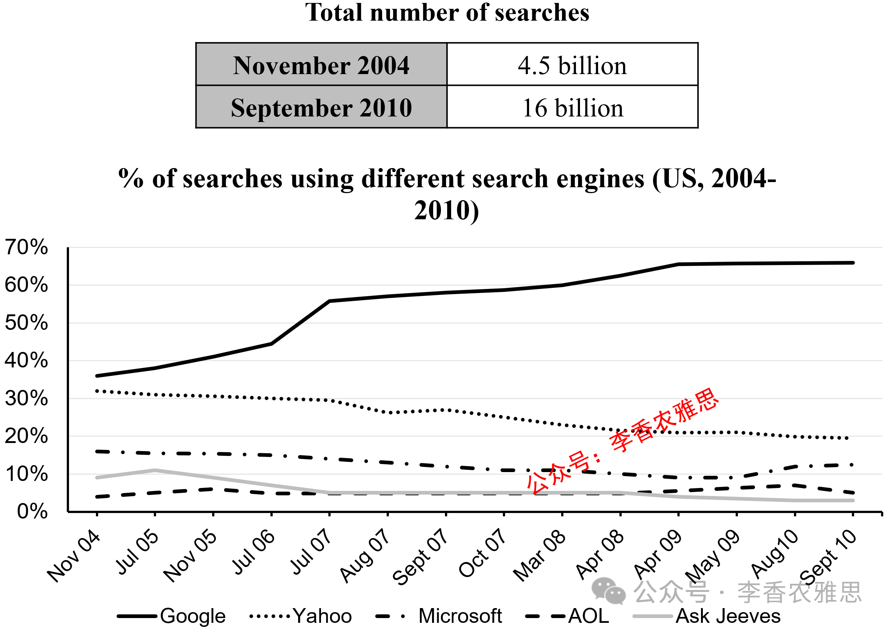

# 2026 年 3 月 28 日雅思写作真题
## Task 1

> **图表类型标注**：组合图（表格 + 折线图（美国网络搜索））

**The table and graph below give information about internet searches in the US between 2004 and 2010.**
**Summarise the information by selecting and reporting the main features, and make comparisons where relevant.**



The table and graph illustrate the total number of internet searches conducted in the US, alongside the proportions of searches carried out using Google, Yahoo, Microsoft, AOL, and Ask Jeeves from 2004 to 2010.

As shown in the table, there was a substantial expansion in internet usage and reliance on search engines during the given period; the number of searches increased more than threefold, from 4.5 billion in November 2004 to 16 billion in September 2010.

Regarding the shares of each search engine, that of Google climbed markedly from approximately 36% in November 2004 to around 65% by May 2009 and then stabilized towards the end. By contrast, the data on Yahoo started at about 32% but declined consistently to just above 20%. The figure for Ask Jeeves followed a similar downward trajectory overall, dropping from just below 10% to roughly 4% in July 2007, but it then remained relatively stable until the end.

The remaining search engines, Microsoft and AOL, had lower but relatively stable shares. Microsoft’s fell gradually from around 16% in November 2004 to about 10% in April 2009, before it recovered to approximately 16% by the end. Meanwhile, AOL accounted for by far the lowest proportion at the beginning (4%), but its share grew slightly to just 5% by the end, making it the second least utilized search engine.

Overall, the total volume of searches rose dramatically, while Google consolidated its dominant position, whereas Yahoo experienced a steady decline.

---

### 精析

#### ① 结构分析（精简）

本题属于 **Table + Line Graph (Mixed)** 类 Task 1，涉及美国互联网搜索总量（table）和 5 个搜索引擎市场份额（line graph）在 2004–2010 年间的变化。

本文采用 **"总-分-总"** 三段式结构：

- **Paragraph 1 — Introduction（开头段）**
  - 改写题目要素：`the total number of internet searches conducted in the US, alongside the proportions of searches carried out using Google, Yahoo, Microsoft, AOL, and Ask Jeeves from 2004 to 2010`（替换原题 `internet searches in the US between 2004 and 2010`）
  - 明确对象：搜索总量 + 5 个搜索引擎市场份额 + 2004–2010 年

- **Paragraph 2 — Body Details（主体段：按图表分组）**
  - **Table（总量）**：从 45 亿次增至 160 亿次，增长超过三倍
  - **Line Graph（市场份额）**：
    - **Google（上升主导）**：从 36% 升至 65%，然后稳定
    - **Yahoo（持续下降）**：从 32% 降至略高于 20%
    - **Ask Jeeves（下降后稳定）**：从略低于 10% 降至约 4%，然后稳定
    - **Microsoft（波动稳定）**：从约 16% 降至约 10%，后恢复至约 16%
    - **AOL（最低稳定）**：从 4% 微升至 5%，始终最低

- **Paragraph 3 — Overview（总结段）**
  - 搜索总量急剧上升
  - Google 巩固主导地位，Yahoo 稳步下降

> **结构亮点**：本文先描述 table 的总量变化，再描述 line graph 的市场份额变化。在市场份额部分，按"上升-下降-稳定"的趋势分组，先写 Google 的上升主导，再写 Yahoo 和 Ask Jeeves 的下降，最后写 Microsoft 和 AOL 的相对稳定。层次分明，对比鲜明。

#### ② 数据组织与对比策略（标注有效写法）

| 写法 | 原文示例 | 技巧说明 |
|------|---------|---------|
| **倍数关系** | `increased more than threefold, from 4.5 billion... to 16 billion` | 用 threefold 直观表达增长倍数 |
| **趋势概括** | `climbed markedly... and then stabilized` | 用 climbed markedly 描述 Google 的显著上升 |
| **对比衔接** | `By contrast, the data on Yahoo started at about 32% but declined consistently` | 用 By contrast 转向 Yahoo 的下降趋势 |
| **类比衔接** | `followed a similar downward trajectory overall` | 用 similar downward trajectory 连接 Ask Jeeves 与 Yahoo |
| **稳定概括** | `had lower but relatively stable shares` | 用 relatively stable 概括 Microsoft 和 AOL |
| **最低标注** | `accounted for by far the lowest proportion at the beginning (4%)` | 用 by far the lowest 强调 AOL 的最低份额 |

> **数据亮点**：作者对数据的选择极具策略性。总量用"超过三倍"概括，Google 突出 36%→65% 的升幅，Yahoo 突出 32%→20% 的降幅，Ask Jeeves 用"类似下降轨迹"概括，Microsoft 和 AOL 用"相对稳定"概括。避免了罗列所有数据点。

#### ③ 四项能力维度分析（TA / CC / LR / GRA）

- **TA**：本文先描述 table 的总量变化，再描述 line graph 的市场份额变化。在市场份额部分，按"上升-下降-稳定"的趋势分组，先写 Google 的上升主导，再写 Yahoo 和 Ask Jeeves 的下降，最后写 Microsoft 和 AOL 的相对稳定。层次分明，对比鲜明。 作者对数据的选择极具策略性。总量用"超过三倍"概括，Google 突出 36%→65% 的升幅，Yahoo 突出 32%→20% 的降幅，Ask Jeeves 用"类似下降轨迹"概括，Microsoft 和 AOL 用"相对稳定"概括。避免了罗列所有数据点。
- **CC**：本文衔接词使用精准且功能明确。"Regarding"的转向使文章从总量分析自然过渡到份额分析，"followed a similar downward trajectory"的类比使 Ask Jeeves 的描述简洁高效，"The remaining search engines"的概括使 Microsoft 和 AOL 的引入不显突兀。
- **LR**：见模块⑤词汇表，含 `a substantial expansion`、`increased more than threefold` 等精准词
- **GRA**：见模块⑤句式亮点

#### ④ 可迁移句型骨架（直接套用）（图表类型：组合图（表格 + 折线图（美国网络搜索）））

**骨架 1 — 开头改写（表格/图通用）**
> The [chart] illustrates changes in ______ in [entities] in [years], along with ______.

**骨架 2 — 极值+对比（Body 通用）**
> ______ had [number], which was considerably higher than the figures for the other [n] [entities].

**骨架 3 — 排名变化/超越（含动态时）**
> ______ saw the second-largest rise and surpassed ______, with its figure growing from ______ to ______.

**骨架 4 — 双维度收尾（Overview 通用）**
> Overall, ______ had by far the largest number..., while ______ recorded the lowest figures on both measures.

#### ⑤ 衔接 / 词汇 / 句式亮点（去水版）

| 衔接类型 | 原文表达 | 功能 |
|---------|---------|------|
| **总体衔接** | `As shown in the table, there was a substantial expansion in internet usage` | 先给出总体判断 |
| **递进衔接** | `Regarding the shares of each search engine` | 用 Regarding 转向市场份额分析 |
| **对比衔接** | `By contrast, the data on Yahoo started at about 32% but declined consistently` | 用 By contrast 转向下降趋势 |
| **类比衔接** | `The figure for Ask Jeeves followed a similar downward trajectory overall` | 用 similar 连接同类趋势 |
| **补充衔接** | `The remaining search engines, Microsoft and AOL, had lower but relatively stable shares` | 用 remaining 引出其余搜索引擎 |
| **总结衔接** | `Overall... while... whereas...` | 用 while 和 whereas 分层总结 |

> **衔接亮点**：本文衔接词使用精准且功能明确。"Regarding"的转向使文章从总量分析自然过渡到份额分析，"followed a similar downward trajectory"的类比使 Ask Jeeves 的描述简洁高效，"The remaining search engines"的概括使 Microsoft 和 AOL 的引入不显突兀。

| 词汇/短语 | 中文含义 | 词性/用法 | 替代普通表达 |
|-----------|----------|----------|-------------|
| **a substantial expansion** | 大幅扩张 | 名词短语 | a big increase |
| **increased more than threefold** | 增长了三倍多 | 动词短语 | increased more than three times |
| **climbed markedly** | 显著攀升 | 动词短语 | went up a lot |
| **stabilized towards the end** | 在末期趋于稳定 | 动词短语 | became stable at the end |
| **declined consistently** | 持续下降 | 动词短语 | kept going down |
| **followed a similar downward trajectory** | 呈类似的下降轨迹 | 动词短语 | had a similar downward trend |
| **relatively stable shares** | 相对稳定的份额 | 名词短语 | fairly stable percentages |
| **accounted for by far the lowest proportion** | 占比远远最低 | 动词短语 | had the lowest percentage by far |
| **consolidated its dominant position** | 巩固了其主导地位 | 动词短语 | strengthened its leading position |
| **experienced a steady decline** | 经历了稳步下降 | 动词短语 | kept going down steadily |

**1. 倍数增长句**
> *"As shown in the table, there was a substantial expansion in internet usage and reliance on search engines during the given period; the number of searches **increased more than threefold**, from 4.5 billion in November 2004 to 16 billion in September 2010."*

**技巧**：用 increased more than threefold 直观表达增长倍数，from... to... 精确标注起点和终点，增长描述简洁有力。

**2. 趋势描述句**
> *"Regarding the shares of each search engine, that of Google **climbed markedly** from approximately 36% in November 2004 to around 65% by May 2009 **and then stabilized** towards the end."*

**技巧**：用 climbed markedly 描述显著上升，and then stabilized 补充说明后期的稳定状态，趋势描述完整。

**3. 类比下降句**
> *"The figure for Ask Jeeves **followed a similar downward trajectory overall**, dropping from just below 10% to roughly 4% in July 2007, **but it then remained relatively stable until the end**."*

**技巧**：用 followed a similar downward trajectory 类比 Ask Jeeves 与 Yahoo 的下降趋势，dropping 现在分词短语补充具体数据，but 转折说明后期的稳定，描述细腻。

**4. 最低标注句**
> *"Meanwhile, AOL **accounted for by far the lowest proportion** at the beginning (4%), but its share grew slightly to just 5% by the end, **making it the second least utilized search engine**."*

**技巧**：用 by far the lowest proportion 强调 AOL 的最低份额，but 转折说明微升，making it 现在分词短语说明最终结果（第二少使用），信息密度极高。

**5. 分层总结句**
> *"Overall, the total volume of searches **rose dramatically**, while Google **consolidated its dominant position**, **whereas** Yahoo **experienced a steady decline**."*

**技巧**：用 while 连接总量和 Google 的变化，whereas 对比 Yahoo 的相反趋势，三个动词短语（rose, consolidated, experienced）并列使用，总结简洁有力。

---

#### ⑥ 可提升空间 + 仿写任务

**可提升空间（通用要点，按篇酌情采纳）：**
- Overview 建议前置或明确独立成段，让阅卷人先抓全局（TA 更稳）。
- 双维度数据（如比率/占比）尽量也收进 Overview，避免只在正文提一次。
- 跨段对比（如 A 反超 B）可集中到一句呈现，衔接更紧凑。

**本文针对性可改进点（按篇分析，点到即止）：**
- Overview 段只收了总量、Google 与 Yahoo 三个维度，未把 Microsoft「先降后回升」与 AOL「最低但稳定」这两个值得对比的点收进总结，双指标收束略显单薄（呼应通用要点第二条）。
- 正文对 Microsoft "fell gradually... before it recovered" 的转折只用 before 一句带过，与相邻段落缺乏集中对比，可按通用要点第三条把「下降 vs 回升」压缩到一句呈现，衔接更紧凑。

**仿写任务**：用「极值+对比」骨架写一句：描述『2020 年 X 国指标远高于其他三国』。
## Task 2

> **话题与题型标注**：社会与政府类 · Two-Part Question

**Young people are leaving their homes from rural areas to study or work in the cities. What are the reasons? Do advantages of this development outweigh its disadvantages?**

**年轻人正离开农村家乡前往城市学习或工作。这么做的原因是什么？这一趋势的好处大于坏处吗？**

In many countries, an increasing number of young people are leaving rural areas to pursue educational and employment opportunities in cities. This trend is primarily driven by disparities in education and job availability. Although it presents certain challenges, the advantages of this development outweigh its disadvantages overall.

在许多国家，越来越多的年轻人正离开农村地区，前往城市寻求教育和就业机会。这一趋势主要由教育资源和就业机会的不平衡所驱动。尽管这一现象带来了一些挑战，但总体而言，其优势大于劣势。

There are several key reasons why young individuals migrate to urban areas. From an educational perspective, cities typically host well-equipped institutions at all levels and offer diverse academic programs that are often lacking in rural regions. Young people move to cities not only to access professional skills training more easily but also to enable their children to benefit from more advanced compulsory education. From an employment perspective, many rural areas rely heavily on agriculture, which offers limited opportunities for career progression and is vulnerable to external factors such as weather and market fluctuations. By contrast, job opportunities in urban centers are far more abundant and varied, allowing young people to break away from monotonous rural routines and pursue personal growth and fulfilment. For younger generations, who increasingly view work as a means of self-development, dissatisfaction with limited prospects or rigid structures in rural areas often motivates them to seek opportunities in cities.

年轻人迁移到城市有几个主要原因。从教育角度来看，城市通常拥有各级设施完善的教育机构，并提供多样化的学术课程，而这些在农村地区往往是缺乏的。年轻人迁往城市，不仅是为了更方便地接受职业技能培训，也是为了让他们的子女能够享受到更优质的义务教育。从就业角度来看，许多农村地区高度依赖农业，而农业不仅职业发展空间有限，还容易受到天气和市场波动等外部因素的影响。相比之下，城市的就业机会更加丰富多样，使年轻人能够摆脱单调的农村生活方式，追求个人成长与自我实现。对于越来越将工作视为自我发展的年轻一代而言，对农村地区有限的发展前景或僵化结构的不满，往往促使他们到城市寻找机会。

While the movement of young people to cities brings certain drawbacks, its advantages are more substantial. Admittedly, this trend places considerable strain on local authorities, particularly in terms of public expenditure and equitable resource allocation. As urban populations rise, governments must invest heavily in infrastructure such as schools and medical facilities, thereby imposing a financial burden on the economy. Nevertheless, young migrants enhance labor market flexibility and contribute to regional economic development. Firstly, their presence expands the talent pool, providing businesses with a more diverse and skilled workforce that meets evolving industry demands. Even those who struggle to secure stable employment due to limited qualifications often take up service-oriented jobs, such as food delivery and courier services. Secondly, a high concentration of young workers stimulates economic prosperity. For instance, many young people prefer independent living, which increases demand for housing and household goods, thereby boosting growth in the real estate and retail sectors.

尽管年轻人向城市流动会带来一些弊端，但其优势更为显著。诚然，这一趋势给地方政府带来了相当大的压力，尤其是在公共支出和资源公平分配方面。随着城市人口的增加，政府必须在学校和医疗设施等基础设施上投入大量资金，从而对经济造成一定的财政负担。然而，年轻的流动人口提高了劳动力市场的灵活性，并促进了区域经济发展。首先，他们扩大了人才储备，使企业能够获得更加多元化和高技能的劳动力，以满足不断变化的产业需求。即使是那些由于技能有限而难以获得稳定工作的群体，也往往从事外卖配送和快递等服务类工作。其次，大量年轻劳动力的集中有助于促进经济繁荣。例如，许多年轻人倾向于独立居住，这增加了对住房和家庭用品的需求，从而推动了房地产和零售行业的发展。

In conclusion, migration to cities is largely driven by superior educational resources and broader employment prospects. Despite the pressure it places on urban infrastructure and public finances, the influx of young people strengthens the labor market and contributes more significantly to sustained economic development.

总之，人口向城市迁移主要是由更优质的教育资源和更广阔的就业前景所驱动。尽管这对城市基础设施和公共财政带来了压力，但年轻人口的流入增强了劳动力市场活力，并更大程度上促进了经济的可持续发展。

---

### 精析

#### ① 结构分析（精简）

本题属于 **Two-Part Question** 类题型。此类题型的核心策略是：分别回答两个问题（原因+利弊评价）。

本文采用 **"原因+利弊"** 四段式结构：

- **Paragraph 1 — Introduction（开头段）**
  - 改写题目（paraphrase）：`an increasing number of young people are leaving rural areas to pursue educational and employment opportunities in cities`（替换原题 `Young people are leaving their homes from rural areas to study or work in the cities`）
  - 表明立场：`the advantages of this development outweigh its disadvantages overall`（明确认为利大于弊）
  - 预告框架：先分析原因，再评价利弊

- **Paragraph 2 — Body 1（原因段）**
  - 主题句：`There are several key reasons why young individuals migrate to urban areas`
  - 角度1（教育）：城市拥有设施完善的教育机构和多样化课程，年轻人为职业技能培训和子女教育迁往城市
  - 角度2（就业）：农村依赖农业，职业发展空间有限且易受外部因素影响；城市就业机会丰富多样
  - 机制：年轻人将工作视为自我发展手段，对农村有限前景的不满促使他们到城市寻找机会

- **Paragraph 3 — Body 2（利弊段）**
  - 让步：`Admittedly, this trend places considerable strain on local authorities...`
  - 弊端：公共支出和资源分配压力，政府需在基础设施上大量投资
  - 转折：`Nevertheless, young migrants enhance labor market flexibility...`
  - 优势1：扩大人才储备，提供多元化高技能劳动力；即使技能有限者也可从事服务业
  - 优势2：大量年轻劳动力集中刺激经济繁荣，独立居住增加住房和日用品需求

- **Paragraph 4 — Conclusion（结尾段）**
  - 重申原因：`superior educational resources and broader employment prospects`
  - 重申立场：`the influx of young people strengthens the labor market and contributes more significantly to sustained economic development`

> **结构亮点**：本文采用经典的"原因+利弊"双段结构，每段内部都从两个角度展开（教育/就业、人才储备/经济繁荣）。特别值得注意的是，作者在利弊段中先让步承认弊端（对城市基础设施的压力），再用 Nevertheless 转折强调优势更大，使论证更加全面和审慎。

#### ② 论证逻辑链拆解（标注有效写法）

**Body 1（原因段）的逻辑链条：**

```
年轻人迁移到城市的原因
    ↓ [核心论点]
→ 教育和就业机会的不平衡
    ↓ [角度一：教育]
→ 城市拥有设施完善的教育机构
    ↓ [具体表现]
    ├── 各级教育机构设施完善
    └── 提供多样化的学术课程
    ↓ [对比]
    农村地区往往缺乏这些资源
    ↓ [迁移动机]
    ├── 更方便地接受职业技能培训
    └── 让子女享受更优质的义务教育

    ↓ [角度二：就业]
→ 农村高度依赖农业
    ↓ [局限性]
    ├── 职业发展空间有限
    └── 易受天气和市场波动等外部因素影响
    ↓ [对比]
    城市就业机会丰富多样
    ↓ [效果]
    年轻人能够摆脱单调的农村生活方式
    ↓ [深层动机]
    追求个人成长与自我实现
    ↓ [具体表现]
    对农村有限发展前景或僵化结构的不满
    ↓
    促使他们到城市寻找机会
```

**Body 2（利弊段）的逻辑链条：**

```
年轻人向城市流动的利弊
    ↓ [让步]
→ 弊端：给地方政府带来压力
    ↓ [具体表现]
    ├── 公共支出压力
    └── 资源公平分配压力
    ↓ [机制]
    城市人口增加 → 政府需在基础设施上大量投资
    ↓ [结果]
    对经济造成财政负担

    ↓ [转折]
→ 优势更为显著
    ↓ [优势一：劳动力市场]
→ 提高劳动力市场灵活性
    ↓ [具体表现]
    ├── 扩大人才储备
    ├── 提供多元化和高技能劳动力
    └── 满足不断变化的产业需求
    ↓ [补充]
    技能有限者从事外卖配送和快递等服务类工作

    ↓ [优势二：经济繁荣]
→ 大量年轻劳动力集中促进经济繁荣
    ↓ [例证]
    年轻人倾向于独立居住
    ↓ [效果]
    ├── 增加住房需求
    ├── 增加家庭用品需求
    └── 推动房地产和零售行业发展
```

> **逻辑亮点**：本文论证采用了"分类论证+让步转折"策略。在原因段中，从"教育"和"就业"两个角度分别论证；在利弊段中，先让步承认弊端，再转折强调优势更大。每个角度都遵循"前提→机制→结果"的推导路径，逻辑链条完整。

#### ③ 四项能力维度分析（TA / CC / LR / GRA）

- **TA**：本文采用经典的"原因+利弊"双段结构，每段内部都从两个角度展开（教育/就业、人才储备/经济繁荣）。特别值得注意的是，作者在利弊段中先让步承认弊端（对城市基础设施的压力），再用 Nevertheless 转折强调优势更大，使论证更加全面和审慎。 本文论证采用了"分类论证+让步转折"策略。在原因段中，从"教育"和"就业"两个角度分别论证；在利弊段中，先让步承认弊端，再转折强调优势更大。每个角度都遵循"前提→机制→结果"的推导路径，逻辑链条完整。
- **CC**：本文衔接手段丰富且功能明确。"From an educational perspective / From an employment perspective"的双角度切换使原因分析全面，"Admittedly / Nevertheless"的让步转折使利弊论证审慎有力，"Firstly / Secondly"的递进使优势分析层次分明。
- **LR**：见模块⑤词汇表，含 `pursue educational and employment opportunities`、`driven by disparities` 等精准词
- **GRA**：见模块⑤句式亮点

#### ④ 可迁移句型骨架（直接套用）（题型：Two-Part）

**骨架 1 — 先退后进亮立场（Intro）**
> Although ______ deserves a central place because ______, I disagree with the view that ______.

**骨架 2 — 分类论证起手（Body）**
> From the perspective of ______, doing X helps ______ and ______. Meanwhile, X also offers ______ that go beyond ______.

**骨架 3 — 抽象→具体例证（Body）**
> For example, a course on ______ may show how ______ have harmed ______, as illustrated by ______.

#### ⑤ 衔接 / 词汇 / 句式亮点（去水版）

| 衔接类型 | 原文表达 | 功能说明 |
|---------|---------|---------|
| **立场预告** | `the advantages of this development outweigh its disadvantages overall` | 开头段明确认为利大于弊 |
| **因果衔接** | `This trend is primarily driven by disparities in education and job availability` | 用 driven by 说明原因 |
| **视角切换** | `From an educational perspective... From an employment perspective...` | 用 From... perspective 切换分析角度 |
| **对比衔接** | `By contrast, job opportunities in urban centers are far more abundant and varied` | 用 By contrast 对比城乡就业 |
| **让步衔接** | `Admittedly, this trend places considerable strain on local authorities...` | 用 Admittedly 承认弊端 |
| **转折衔接** | `Nevertheless, young migrants enhance labor market flexibility...` | 用 Nevertheless 转折强调优势 |
| **递进衔接** | `Firstly... Secondly...` | 用 Firstly/Secondly 组织优势论证 |
| **例证衔接** | `For instance, many young people prefer independent living...` | 用 For instance 引出具体例子 |
| **总结衔接** | `In conclusion... Despite...` | 收束全文并重申立场 |

> **衔接亮点**：本文衔接手段丰富且功能明确。"From an educational perspective / From an employment perspective"的双角度切换使原因分析全面，"Admittedly / Nevertheless"的让步转折使利弊论证审慎有力，"Firstly / Secondly"的递进使优势分析层次分明。

| 词汇/短语 | 中文含义 | 词性/用法 | 替代普通表达 |
|-----------|----------|----------|-------------|
| **pursue educational and employment opportunities** | 追求教育与就业机会 | 动词短语 | go to cities for study and work |
| **driven by disparities** | 由差异驱动 | 动词短语 | caused by differences |
| **superior educational resources** | 优质教育资源 | 名词短语 | better education |
| **broader employment prospects** | 更广阔的就业前景 | 名词短语 | more job opportunities |
| **well-equipped institutions** | 设施完善的机构 | 名词短语 | good schools |
| **diverse academic programs** | 多样化的学术课程 | 名词短语 | many different courses |
| **professional skills training** | 职业技能培训 | 名词短语 | job training |
| **compulsory education** | 义务教育 | 名词短语 | required schooling |
| **rely heavily on agriculture** | 高度依赖农业 | 动词短语 | depend mostly on farming |
| **career progression** | 职业晋升 | 名词短语 | moving up in career |
| **vulnerable to external factors** | 易受外部因素影响的 | 形容词短语 | easily affected by outside things |
| **weather and market fluctuations** | 天气与市场波动 | 名词短语 | changes in weather and market |
| **abundant and varied** | 丰富多样的 | 形容词短语 | many and different |
| **break away from monotonous rural routines** | 摆脱单调的农村生活方式 | 动词短语 | leave boring country life |
| **personal growth and fulfilment** | 个人成长与自我实现 | 名词短语 | growing as a person |
| **self-development** | 自我发展 | 名词短语 | developing oneself |
| **rigid structures** | 僵化的结构 | 名词短语 | strict systems |
| **places considerable strain on** | 给…带来相当大的压力 | 动词短语 | puts a lot of pressure on |
| **public expenditure** | 公共支出 | 名词短语 | government spending |
| **equitable resource allocation** | 公平的资源分配 | 名词短语 | fair sharing of resources |
| **enhance labor market flexibility** | 提高劳动力市场灵活性 | 动词短语 | make the job market more flexible |
| **expand the talent pool** | 扩大人才储备 | 动词短语 | increase the number of skilled workers |
| **diverse and skilled workforce** | 多元化且高技能的劳动力 | 名词短语 | workers with different skills |
| **evolving industry demands** | 不断变化的行业需求 | 名词短语 | changing job needs |
| **service-oriented jobs** | 服务导向型工作 | 名词短语 | service jobs |
| **stimulate economic prosperity** | 促进经济繁荣 | 动词短语 | help the economy grow |
| **sustained economic development** | 可持续的经济发展 | 名词短语 | long-term economic growth |

**1. 因果机制句**
> *"This trend is primarily **driven by** disparities in education and job availability."*

**技巧**：用 driven by 的被动语态结构说明趋势的原因，简洁而正式。

**2. 多角度论证句**
> *"**From an educational perspective**, cities typically host well-equipped institutions at all levels and offer diverse academic programs that are often lacking in rural regions. **From an employment perspective**, many rural areas rely heavily on agriculture, which offers limited opportunities for career progression and is vulnerable to external factors such as weather and market fluctuations."*

**技巧**：用 From... perspective 明确切换分析角度，that 引导定语从句补充说明，which 引导非限制性定语从句解释农业的局限性，论证全面。

**3. 让步转折复合句**
> *"**Admittedly**, this trend places considerable strain on local authorities, particularly in terms of public expenditure and equitable resource allocation. **As** urban populations rise, governments must invest heavily in infrastructure such as schools and medical facilities, **thereby imposing** a financial burden on the economy. **Nevertheless**, young migrants enhance labor market flexibility and contribute to regional economic development."*

**技巧**：用 Admittedly 承认弊端，As 引导时间状语从句说明机制，thereby imposing 现在分词短语说明结果，Nevertheless 转折强调优势，论证层次分明。

**4. 例证效果句**
> *"**For instance**, many young people prefer independent living, **which increases** demand for housing and household goods, **thereby boosting** growth in the real estate and retail sectors."*

**技巧**：用 For instance 引出具体例子，which 引导非限制性定语从句说明效果，thereby boosting 现在分词短语进一步说明经济影响，因果链条完整。

**5. 综合总结句**
> *"**Despite** the pressure it places on urban infrastructure and public finances, the influx of young people **strengthens** the labor market and **contributes more significantly to** sustained economic development."*

**技巧**：用 Despite 引导让步状语，主句用 strengthens 和 contributes more significantly to 强调优势，总结有力。

#### ⑥ 可提升空间 + 仿写任务

**可提升空间（通用要点，按篇酌情采纳）：**
- 结论段避免复读开头，应「推进」而非「重复」立场。
- 让步段衔接词（this perspective 等）回指别太远，可加限定词收紧。
- 同一话题词（如 career / benefit）避免三现，用近义替换。

**本文针对性可改进点（按篇分析，点到即止）：**
- 结论段（In conclusion...）基本复读了开头与 Body2 的立场（superior educational resources / broader employment prospects / sustained economic development），未推进新信息，宜补一句「对政策或农村的反向启示」以落实通用要点第一条。
- 原因段与利弊段反复出现 career / opportunity(s) 家族词（educational opportunities、employment prospects、career progression、job opportunities 等），虽已部分替换仍略密集，可再依通用要点第三条做近义收束。
- 让步段提到「公共支出与资源分配压力」后直接跳转优势，缺乏一个量级衔接的例证（如具体财政数据），与 Body2 优势段的「独立居住」例证不对称。

**仿写任务**：就本题用骨架写一句你的核心论证。
