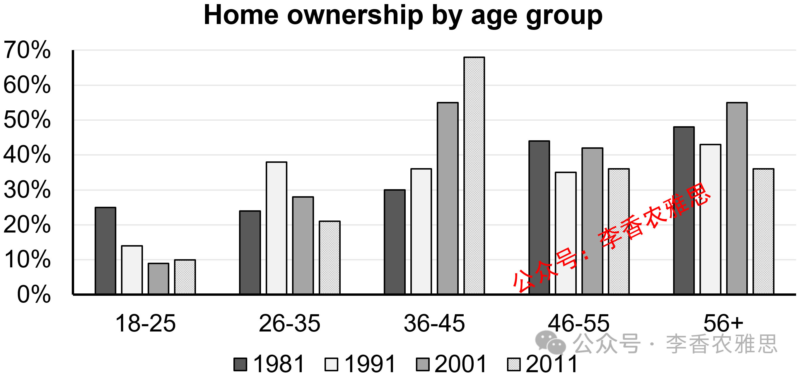

# 2026 年 4 月 11 日雅思写作真题
## Task 1

> **图表类型标注**：柱状图（英国住房自有率）

**The chart below shows the percentage of people owning their own residence in the UK between 1981 and 2011.**
**Summarise the information by selecting and reporting the main features, and make comparisons where relevant.**



The bar chart illustrates changes in the proportion of people aged 18–25, 26–35, 36–45, 46–55, and over 56 having their own homes in the UK from 1981 to 2011.

As shown, in the 18–25 age group, the percentage of homeowners remained the lowest throughout the period, falling from about 25% in 1981 to around 9% in 2001, and then moderately increased to 10% by 2011. An opposite pattern can be seen among those aged 26–35, whose rate of home ownership rose from approximately 24% in 1981 to 38% in 1991 before declining to just over 20% by 2011.

By contrast, older age groups exhibited higher ownership rates. Among individuals aged 36–45, the figure climbed steadily from 30% in 1981 to a peak of nearly 68% in 2011, making the age group the one with the highest home ownership. For those aged over 46, ownership of houses fluctuated but generally declined. Specifically, the proportion of those aged 46–55 who owned a home dropped from about 44% to around 36% over the period. Similarly, the corresponding data on the 56+ age group experienced a decline from nearly 48% to approximately 36% by the end of the period, despite a significant growth to 55% in 2001.

Overall, home ownership among all age groups generally decreased throughout the period, except for those aged 36–45, while the youngest group consistently recorded lower percentages compared to their older counterparts.

---

### 精析

#### ① 结构分析（精简）

本题属于 **Bar Chart** 类 Task 1，涉及 5 个年龄组（18–25, 26–35, 36–45, 46–55, 56+）在英国 1981–2011 年间自有住房比例的变化。

本文采用 **"总-分-总"** 三段式结构：

- **Paragraph 1 — Introduction（开头段）**
  - 改写题目要素：`changes in the proportion of people aged 18–25, 26–35, 36–45, 46–55, and over 56 having their own homes in the UK from 1981 to 2011`（替换原题 `the percentage of people owning their own residence in the UK between 1981 and 2011`）
  - 明确对象：5 个年龄组 + 1981–2011 年

- **Paragraph 2 — Body Details（主体段：按趋势分组）**
  - **年轻组（低比例组）**：18–25 岁始终最低（25%→9%→10%），26–35 岁先升后降（24%→38%→20%+）
  - **中年组（上升组）**：36–45 岁稳步上升（30%→68%，成为最高）
  - **老年组（下降组）**：46–55 岁下降（44%→36%），56+ 岁波动下降（48%→55%→36%）

- **Paragraph 3 — Overview（总结段）**
  - 大多数年龄组自有住房比例下降，除 36–45 岁外
  - 最年轻组始终低于年长组

> **结构亮点**：本文按"年轻-中年-老年"的年龄分组策略清晰高效。先写 18–25 和 26–35 的年轻组（低比例），再写 36–45 的中年组（唯一上升），最后写 46–55 和 56+ 的老年组（下降）。这种结构使读者可以清晰看到"中年组逆势上升"这一最显著特征。

#### ② 数据组织与对比策略（标注有效写法）

| 写法 | 原文示例 | 技巧说明 |
|------|---------|---------|
| **极值标注** | `remained the lowest throughout the period` | 强调 18–25 岁组的持续最低 |
| **相反模式** | `An opposite pattern can be seen among those aged 26–35` | 用 opposite pattern 连接对比组 |
| **峰值标注** | `rose from approximately 24%... to 38%... before declining to just over 20%` | 用 before declining 描述先升后降 |
| **排名变化** | `making the age group the one with the highest home ownership` | 用 making 说明 36–45 岁的排名跃升 |
| **让步衔接** | `despite a significant growth to 55% in 2001` | 先承认峰值再说明下降 |

> **数据亮点**：作者精准选择了关键数据点进行描述。18–25 岁突出"始终最低"，26–35 岁突出"先升后降"的相反模式，36–45 岁突出"稳步上升至最高"，56+ 岁用 despite 标注 2001 年的峰值。避免了罗列所有 15 个数据点。

#### ③ 四项能力维度分析（TA / CC / LR / GRA）

- **TA**：本文按"年轻-中年-老年"的年龄分组策略清晰高效。先写 18–25 和 26–35 的年轻组（低比例），再写 36–45 的中年组（唯一上升），最后写 46–55 和 56+ 的老年组（下降）。这种结构使读者可以清晰看到"中年组逆势上升"这一最显著特征。 作者精准选择了关键数据点进行描述。18–25 岁突出"始终最低"，26–35 岁突出"先升后降"的相反模式，36–45 岁突出"稳步上升至最高"，56+ 岁用 despite 标注 2001 年的峰值。避免了罗列所有 15 个数据点。
- **CC**：本文衔接词使用精准且功能明确。"An opposite pattern"的对比衔接使 26–35 岁组与 18–25 岁组形成鲜明对照，"Similarly"的类比衔接使 56+ 岁组与 46–55 岁组的下降趋势得以关联，"despite"的让步衔接使 56+ 岁组的波动描述更加客观。
- **LR**：见模块⑤词汇表，含 `remained the lowest throughout`、`moderately increased` 等精准词
- **GRA**：见模块⑤句式亮点

#### ④ 可迁移句型骨架（直接套用）（图表类型：柱状图（英国住房自有率））

**骨架 1 — 开头改写（表格/图通用）**
> The [chart] illustrates changes in ______ in [entities] in [years], along with ______.

**骨架 2 — 极值+对比（Body 通用）**
> ______ had [number], which was considerably higher than the figures for the other [n] [entities].

**骨架 3 — 排名变化/超越（含动态时）**
> ______ saw the second-largest rise and surpassed ______, with its figure growing from ______ to ______.

**骨架 4 — 双维度收尾（Overview 通用）**
> Overall, ______ had by far the largest number..., while ______ recorded the lowest figures on both measures.

#### ⑤ 衔接 / 词汇 / 句式亮点（去水版）

| 衔接类型 | 原文表达 | 功能 |
|---------|---------|------|
| **总体衔接** | `As shown, in the 18–25 age group, the percentage of homeowners remained the lowest` | 先给出总体判断 |
| **对比衔接** | `An opposite pattern can be seen among those aged 26–35` | 用 opposite pattern 连接对比组 |
| **转折衔接** | `By contrast, older age groups exhibited higher ownership rates` | 用 By contrast 转向老年组 |
| **递进衔接** | `Among individuals aged 36–45, the figure climbed steadily...` | 用 Among 展开细节 |
| **补充衔接** | `For those aged over 46, ownership of houses fluctuated but generally declined` | 用 For those aged 补充说明 |
| **类比衔接** | `Similarly, the corresponding data on the 56+ age group experienced a decline` | 用 Similarly 连接同类趋势 |
| **让步衔接** | `despite a significant growth to 55% in 2001` | 先承认峰值再说明下降 |
| **总结衔接** | `Overall... except for... while...` | 用 except for 和 while 分层总结 |

> **衔接亮点**：本文衔接词使用精准且功能明确。"An opposite pattern"的对比衔接使 26–35 岁组与 18–25 岁组形成鲜明对照，"Similarly"的类比衔接使 56+ 岁组与 46–55 岁组的下降趋势得以关联，"despite"的让步衔接使 56+ 岁组的波动描述更加客观。

| 词汇/短语 | 中文含义 | 词性/用法 | 替代普通表达 |
|-----------|----------|----------|-------------|
| **remained the lowest throughout** | 全程始终保持最低 | 动词短语 | was always the lowest |
| **moderately increased** | 小幅上升；温和增长 | 动词短语 | went up a little |
| **An opposite pattern** | 相反的走势 | 名词短语 | A different trend |
| **rose from approximately** | 从约……上升 | 动词短语 | went up from about |
| **before declining to** | 随后降至 | 介词短语 | then fell to |
| **just over 20%** | 略高于 20% | 副词短语 | a little more than 20% |
| **exhibited higher ownership rates** | 呈现出更高的自有率 | 动词短语 | showed higher rates |
| **climbed steadily** | 稳步攀升 | 动词短语 | went up steadily |
| **a peak of nearly 68%** | 近 68% 的峰值 | 名词短语 | the highest point of almost 68% |
| **fluctuated but generally declined** | 有所波动但总体下降 | 动词短语 | went up and down but overall went down |
| **corresponding data** | 相应的数据 | 名词短语 | similar data |
| **despite a significant growth** | 尽管出现了显著增长 | 介词短语 | although there was a big increase |
| **consistently recorded lower percentages** | 始终录得较低的百分比 | 动词短语 | always had lower percentages |

**1. 持续最低描述句**
> *"As shown, in the 18–25 age group, the percentage of homeowners **remained the lowest throughout the period**, falling from about 25% in 1981 to around 9% in 2001, and then moderately increased to 10% by 2011."*

**技巧**：用 remained the lowest throughout 强调持续最低状态，falling 现在分词短语补充降幅，and then moderately increased 说明后期微升，描述完整。

**2. 相反模式句**
> *"**An opposite pattern can be seen among those aged 26–35**, whose rate of home ownership rose from approximately 24% in 1981 to 38% in 1991 **before declining to** just over 20% by 2011."*

**技巧**：用 An opposite pattern can be seen 引出对比组，whose 引导定语从句描述数据，before declining to 说明先升后降的完整轨迹。

**3. 排名变化句**
> *"Among individuals aged 36–45, the figure climbed steadily from 30% in 1981 to a peak of nearly 68% in 2011, **making the age group the one with the highest home ownership**."*

**技巧**：用 making 现在分词短语说明 36–45 岁组的排名变化（成为最高），因果逻辑清晰。

**4. 让步波动句**
> *"Similarly, the corresponding data on the 56+ age group experienced a decline from nearly 48% to approximately 36% by the end of the period, **despite a significant growth to 55% in 2001**."*

**技巧**：用 despite 引导让步状语，先承认 2001 年的显著增长，再说明总体下降，使描述客观全面。

**5. 例外总结句**
> *"Overall, home ownership among all age groups generally decreased throughout the period, **except for those aged 36–45**, **while** the youngest group consistently recorded lower percentages compared to their older counterparts."*

**技巧**：用 except for 标注例外情况（36–45 岁组上升），while 对比最年轻组与年长组，总结层次分明。

---

#### ⑥ 可提升空间 + 仿写任务

**可提升空间（通用要点，按篇酌情采纳）：**
- Overview 建议前置或明确独立成段，让阅卷人先抓全局（TA 更稳）。
- 双维度数据（如比率/占比）尽量也收进 Overview，避免只在正文提一次。
- 跨段对比（如 A 反超 B）可集中到一句呈现，衔接更紧凑。

**本文针对性可改进点（按篇分析，点到即止）：**
- 第二段以 `As shown, in the 18–25 age group...` 直接切入单组细节，缺一句概括两个年轻组共同特征的主题句，读者要读到 `By contrast` 才反应过来前面是"低比例组"。
- 46–55 岁组只给了首尾两个数字（44%→36%），相比 56+ 组用 `despite a significant growth to 55% in 2001` 标注峰值，两组详略明显失衡，可补一个中间转折点。
- `climbed steadily from 30%... to a peak of nearly 68% in 2011` 中 steadily 与 peak 略有张力：终点即最高点时 peak 可省，写成 reaching nearly 68% 更干净。

**仿写任务**：用「极值+对比」骨架写一句：描述『2020 年 X 国指标远高于其他三国』。
## Task 2

> **话题与题型标注**：文化与传统类 · Agree/Disagree

**Some people believe that researching the past is a waste of time and money, and that we should instead focus on the issues facing today’s world. To what extent do you agree or disagree?**

**一些人认为研究过去是浪费时间和金钱，并认为我们应该专注当今世界的问题。你在多大程度上同意或不同意这个观点？**

Some argue that allocating resources to the study of history is both impractical and wasteful, contending that attention should instead be directed entirely toward contemporary issues. While this perspective is understandable in its prioritization of urgent modern problems, I disagree that historical research is a waste of resources.

一些人认为，将资源投入到历史研究既不切实际又是一种浪费，并主张应将注意力完全转向当代问题。尽管这种观点在优先考虑紧迫的现代问题方面可以理解，但我不同意历史研究是资源浪费这一看法。

Admittedly, many pressing challenges, such as geopolitical conflicts and global warming, require human society to prioritize financial and human resources. In the short term, due to ongoing conflicts in the Middle East, where residents are experiencing humanitarian crises, relevant states have allocated substantial funding to information organizations and think tanks to better understand their counterparts and gain strategic advantages. For example, the recent outbreak of a major war in the region has drawn neighboring countries into the conflict, forcing them to provide emergency funding to key sectors in order to develop coping strategies. In the long run, mitigating global warming remains one of the primary global issues to be addressed. The effects of climate change cannot be attributed to any single country producing greenhouse gas emissions; rather, all countries are affected by this problem. Therefore, greater financial and human resources should be prioritized to tackle this collective challenge, especially during periods of policy fluctuation in some nations.

诚然，许多紧迫的挑战，例如地缘政治冲突和全球变暖，确实需要人类社会优先配置资金和人力资源。从短期来看，由于**地区持续的冲突，当地居民正经历人道主义危机，相关国家已向**机构和智库投入大量资金，以更好地了解对手并获得战略优势。例如，近期该地区一场重大战争的爆发已将周边国家卷入冲突，迫使它们向关键领域提供紧急资金以制定应对策略。从长期来看，缓解全球变暖仍然是亟待解决的主要全球性问题之一。气候变化的影响不能归因于任何单一排放温室气体的国家，而是影响到所有国家。因此，应优先投入更多的资金和人力资源来应对这一共同挑战，尤其是在一些国家政策波动的时期。

However, it is widely acknowledged that history serves as a valuable repository of successes and lessons; thus, researching the past is crucial for understanding the present. To begin with, investigating history enables researchers to propose effective solutions to complex issues by examining how the past has shaped and continues to shape relationships between societies and individuals. Through the study of historical developments, individuals can gain insights into the mechanisms that have driven significant societal changes, thereby providing a more nuanced understanding of the evolution of humanity and technological advancement. In addition to the valuable experience gained from studying history, research into the past also contributes significantly to cultural identity and social cohesion. This is particularly evident among young people from immigrant families, who often show a strong interest in learning about the history of their parents' home countries. In turn, a profound understanding of historical heritage, which is highly transferable and essential for addressing modern challenges, fosters a sense of belonging and continuity within communities.

然而，人们普遍认为历史是成功经验与教训的重要宝库，因此研究过去对于理解当下至关重要。首先，历史研究通过考察过去如何塑造并持续影响社会与个体之间的关系，使研究者能够为复杂问题提出有效的解决方案。通过对历史发展的研究，人们可以深入了解推动重大社会变革的机制，从而更全面地理解人类演进和技术进步。此外，历史研究不仅带来宝贵经验，还对文化认同和社会凝聚力具有重要意义。这一点在移民家庭的年轻人中尤为明显，他们往往对父母祖国的历史表现出浓厚兴趣。进而，对历史遗产的深刻理解——这种理解具有高度的可迁移性，并且对解决现代问题至关重要——有助于增强群体的归属感和延续性。

In conclusion, while it is crucial to devote attention and resources to current global challenges, neglecting the study of the past is unacceptable. Studying history is not only valuable but also essential for effectively addressing present and future challenges.

总之，尽管将注意力和资源投入到当前的全球性挑战至关重要，但忽视对历史的研究是不可接受的。历史研究不仅具有价值，而且对于有效应对当下和未来的挑战也是不可或缺的。

---

### 精析

#### ① 结构分析（精简）

本题属于 **Agree/Disagree** 类题型。此类题型的核心策略是：明确表明立场，然后展开论证。

本文采用 **"让步-反驳-总结"** 四段式结构：

- **Paragraph 1 — Introduction（开头段）**
  - 改写题目（paraphrase）：`Some argue that allocating resources to the study of history is both impractical and wasteful, contending that attention should instead be directed entirely toward contemporary issues`（替换原题 `Some people believe that researching the past is a waste of time and money, and that we should instead focus on the issues facing today's world`）
  - 表明立场：`I disagree that historical research is a waste of resources`（明确反对）
  - 预告框架：先让步承认当代问题的重要性，再反驳历史研究的价值

- **Paragraph 2 — Body 1（让步段）**
  - 主题句：`many pressing challenges... require human society to prioritize financial and human resources`
  - 角度1（短期）：中东冲突等人道主义危机→国家向信息机构和智库投入大量资金
  - 例证：近期重大战争爆发→周边国家提供紧急资金制定应对策略
  - 角度2（长期）：缓解全球变暖→所有国家受影响→应优先投入资源应对

- **Paragraph 3 — Body 2（反驳段）**
  - 主题句：`history serves as a valuable repository of successes and lessons; thus, researching the past is crucial for understanding the present`
  - 论点1：历史研究通过考察过去如何塑造社会关系，为复杂问题提出有效解决方案
  - 机制：了解推动社会变革的机制→更 nuanced 地理解人类演进和技术进步
  - 论点2：历史研究对文化认同和社会凝聚力具有重要意义
  - 例证：移民家庭年轻人对父母祖国历史的兴趣→增强归属感和延续性

- **Paragraph 4 — Conclusion（结尾段）**
  - 重申立场：`neglecting the study of the past is unacceptable`
  - 总结升华：历史研究不仅 valuable 而且 essential

> **结构亮点**：本文采用经典的"先退后进"策略，先充分承认当代问题（地缘政治冲突、全球变暖）的紧迫性和资源投入的合理性，再系统论证历史研究的独特价值。这种结构使论证更加全面和审慎，避免了极端立场的漏洞。

#### ② 论证逻辑链拆解（标注有效写法）

**Body 1（让步段）的逻辑链条：**

```
当代问题的紧迫性
    ↓ [核心论点]
→ 许多紧迫挑战需要优先配置资源
    ↓ [角度一：短期]
→ 地缘政治冲突和全球变暖
    ↓ [例证]
    中东持续冲突
    ↓ [后果]
    居民经历人道主义危机
    ↓ [反应]
    相关国家向信息机构和智库投入大量资金
    ↓ [目的]
    更好地了解对手并获得战略优势
    ↓ [具体例证]
    近期重大战争爆发
    ↓ [连锁反应]
    周边国家卷入冲突
    ↓ [措施]
    向关键领域提供紧急资金以制定应对策略

    ↓ [角度二：长期]
→ 缓解全球变暖
    ↓ [特点]
    主要全球性问题之一
    ↓ [归因]
    不能归因于任何单一国家
    ↓ [影响范围]
    所有国家都受影响
    ↓ [结论]
    应优先投入更多资金和人力资源
    ↓ [特别时期]
    一些国家政策波动时期
```

**Body 2（反驳段）的逻辑链条：**

```
历史研究的价值
    ↓ [核心论点]
→ 历史是成功经验和教训的重要宝库
    ↓ [论点一：解决问题]
→ 研究过去对于理解当下至关重要
    ↓ [机制]
    考察过去如何塑造并持续影响社会与个体关系
    ↓ [效果]
    为复杂问题提出有效解决方案
    ↓ [深层理解]
    了解推动重大社会变革的机制
    ↓ [最终效果]
    更 nuanced 地理解人类演进和技术进步

    ↓ [论点二：文化认同]
→ 历史研究对文化认同和社会凝聚力具有重要意义
    ↓ [例证]
    移民家庭的年轻人
    ↓ [表现]
    对父母祖国历史表现出浓厚兴趣
    ↓ [深层效果]
    对历史遗产的深刻理解
    ↓ [特点]
    具有高度可迁移性
    ↓ [对现代问题的价值]
    对解决现代问题至关重要
    ↓ [最终效果]
    增强群体的归属感和延续性
```

> **逻辑亮点**：本文论证采用了"双角度论证"策略。在让步段中，从"短期"和"长期"两个角度论证当代问题的紧迫性；在反驳段中，从"解决问题"和"文化认同"两个角度论证历史研究的价值。每个角度都遵循"前提→机制→结果"的推导路径，逻辑链条完整。

#### ③ 四项能力维度分析（TA / CC / LR / GRA）

- **TA**：本文采用经典的"先退后进"策略，先充分承认当代问题（地缘政治冲突、全球变暖）的紧迫性和资源投入的合理性，再系统论证历史研究的独特价值。这种结构使论证更加全面和审慎，避免了极端立场的漏洞。 本文论证采用了"双角度论证"策略。在让步段中，从"短期"和"长期"两个角度论证当代问题的紧迫性；在反驳段中，从"解决问题"和"文化认同"两个角度论证历史研究的价值。每个角度都遵循"前提→机制→结果"的推导路径，逻辑链条完整。
- **CC**：本文衔接手段丰富且功能明确。"Admittedly""However"的递进转折使论证层层深入，"In the short term / In the long run"的时间切换使让步段分析全面，"To begin with / In addition to"的组织使反驳段结构清晰，"thereby providing"的结果衔接使因果推导明确。
- **LR**：见模块⑤词汇表，含 `allocating resources`、`impractical and wasteful` 等精准词
- **GRA**：见模块⑤句式亮点

#### ④ 可迁移句型骨架（直接套用）（题型：Agree/Disagree）

**骨架 1 — 先退后进亮立场（Intro）**
> Although ______ deserves a central place because ______, I disagree with the view that ______.

**骨架 2 — 分类论证起手（Body）**
> From the perspective of ______, doing X helps ______ and ______. Meanwhile, X also offers ______ that go beyond ______.

**骨架 3 — 抽象→具体例证（Body）**
> For example, a course on ______ may show how ______ have harmed ______, as illustrated by ______.

#### ⑤ 衔接 / 词汇 / 句式亮点（去水版）

| 衔接类型 | 原文表达 | 功能说明 |
|---------|---------|---------|
| **立场预告** | `While this perspective is understandable... I disagree that historical research is a waste of resources` | 开头段先让步再明确反对 |
| **让步衔接** | `Admittedly, many pressing challenges... require human society to prioritize...` | 用 Admittedly 引出对方合理之处 |
| **时间衔接** | `In the short term... In the long run...` | 用 In the short term / In the long run 切换时间角度 |
| **例证衔接** | `For example, the recent outbreak of a major war...` | 用 For example 引出具体例子 |
| **因果衔接** | `Therefore, greater financial and human resources should be prioritized...` | 用 Therefore 推导结论 |
| **转折衔接** | `However, it is widely acknowledged that history serves as...` | 用 However 转向反驳 |
| **递进衔接** | `To begin with... In addition to...` | 用 To begin with / In addition to 组织反驳论点 |
| **因果衔接** | `thereby providing a more nuanced understanding...` | 用 thereby providing 说明结果 |
| **例证衔接** | `This is particularly evident among young people from immigrant families...` | 用 This is particularly evident 引出例证 |
| **总结衔接** | `In conclusion, while... neglecting... is unacceptable` | 收束全文并重申立场 |

> **衔接亮点**：本文衔接手段丰富且功能明确。"Admittedly""However"的递进转折使论证层层深入，"In the short term / In the long run"的时间切换使让步段分析全面，"To begin with / In addition to"的组织使反驳段结构清晰，"thereby providing"的结果衔接使因果推导明确。

| 词汇/短语 | 中文含义 | 词性/用法 | 替代普通表达 |
|-----------|----------|----------|-------------|
| **allocating resources** | 配置／投入资源 | 动词短语 | giving resources |
| **impractical and wasteful** | 不切实际且浪费的 | 形容词短语 | not practical and wasteful |
| **contending that** | 主张／声称…… | 动词短语 | saying that |
| **directed entirely toward** | 完全转向；全部投向 | 动词短语 | focused completely on |
| **contemporary issues** | 当代问题 | 名词短语 | today's problems |
| **pressing challenges** | 紧迫的挑战 | 名词短语 | urgent problems |
| **geopolitical conflicts** | 地缘政治冲突 | 名词短语 | conflicts between countries |
| **global warming** | 全球变暖 | 名词短语 | the earth getting hotter |
| **prioritize financial and human resources** | 优先配置资金与人力资源 | 动词短语 | put money and people first |
| **humanitarian crises** | 人道主义危机 | 名词短语 | human suffering |
| **allocated substantial funding** | 投入了大量资金 | 动词短语 | gave a lot of money |
| **information organizations and think tanks** | 情报机构与智库 | 名词短语 | research groups |
| **strategic advantages** | 战略优势 | 名词短语 | advantages in planning |
| **emergency funding** | 应急资金 | 名词短语 | urgent money |
| **coping strategies** | 应对策略 | 名词短语 | ways to deal with problems |
| **mitigating global warming** | 缓解全球变暖 | 动词短语 | reducing global warming |
| **greenhouse gas emissions** | 温室气体排放 | 名词短语 | gases that trap heat |
| **collective challenge** | 共同（集体）挑战 | 名词短语 | problem for everyone |
| **policy fluctuation** | 政策波动 | 名词短语 | changes in policy |
| **a valuable repository of successes and lessons** | 成功经验与教训的宝库 | 名词短语 | a place where valuable successes and lessons are stored |
| **crucial for understanding the present** | 对理解当下至关重要 | 形容词短语 | very important for understanding now |
| **propose effective solutions** | 提出有效的解决方案 | 动词短语 | suggest good solutions |
| **complex issues** | 复杂问题 | 名词短语 | difficult problems |
| **nuanced understanding** | 细致入微的理解 | 名词短语 | detailed understanding |
| **evolution of humanity** | 人类的演进 | 名词短语 | how humans have developed |
| **technological advancement** | 技术进步 | 名词短语 | how technology has improved |
| **cultural identity** | 文化认同 | 名词短语 | sense of belonging to a culture |
| **social cohesion** | 社会凝聚力 | 名词短语 | people feeling connected |
| **highly transferable** | 可迁移性强的 | 形容词短语 | can be used in many situations |
| **a sense of belonging and continuity** | 归属感与延续感 | 名词短语 | feeling of being part of something and that it continues |

**1. 让步转折复合句**
> *"**While** this perspective is understandable in its prioritization of urgent modern problems, **I disagree** that historical research is a waste of resources."*

**技巧**：用 While 引导让步从句，先承认对方观点在优先处理紧迫现代问题方面的合理性，再在主句中用 I disagree 明确反对，使立场更加审慎有力。

**2. 多角度论证句**
> *"**In the short term**, due to ongoing conflicts in the Middle East, where residents are experiencing humanitarian crises, relevant states have allocated substantial funding to information organizations and think tanks to better understand their counterparts and gain strategic advantages. **In the long run**, mitigating global warming remains one of the primary global issues to be addressed."*

**技巧**：用 In the short term / In the long run 明确切换时间角度，where 引导非限制性定语从句补充说明中东冲突的背景，论证全面。

**3. 因果推导句**
> *"The effects of climate change **cannot be attributed to** any single country producing greenhouse gas emissions; **rather**, all countries are affected by this problem. **Therefore**, greater financial and human resources should be prioritized to tackle this collective challenge..."*

**技巧**：用 cannot be attributed to 排除单一归因，rather 转折说明普遍影响，Therefore 推导结论，因果逻辑清晰。

**4. 递进论证句**
> *"**To begin with**, investigating history enables researchers to propose effective solutions to complex issues by examining how the past has shaped and continues to shape relationships between societies and individuals. **Through** the study of historical developments, individuals can gain insights into the mechanisms that have driven significant societal changes, **thereby providing** a more nuanced understanding of the evolution of humanity and technological advancement."*

**技巧**：用 To begin with 引出第一个论点，Through 说明方式，thereby providing 现在分词短语说明结果，论证层层递进。

**5. 例证效果句**
> *"**This is particularly evident among** young people from immigrant families, who often show a strong interest in learning about the history of their parents' home countries. **In turn**, a profound understanding of historical heritage, which is highly transferable and essential for addressing modern challenges, fosters a sense of belonging and continuity within communities."*

**技巧**：用 This is particularly evident among 引出具体例证，who 引导定语从句描述年轻人特征，In turn 说明连锁反应，which 引导非限制性定语从句补充历史遗产理解的特点，论证饱满。

**6. 综合总结句**
> *"**In conclusion, while** it is crucial to devote attention and resources to current global challenges, **neglecting** the study of the past is unacceptable. Studying history is **not only valuable but also essential** for effectively addressing present and future challenges."*

**技巧**：用 while 引导让步从句，先承认当代问题的重要性，再主句用 neglecting... is unacceptable 强调忽视历史的不可接受性，最后用 not only... but also... 递进强调历史研究的双重价值，总结有力。

#### ⑥ 可提升空间 + 仿写任务

**可提升空间（通用要点，按篇酌情采纳）：**
- 结论段避免复读开头，应「推进」而非「重复」立场。
- 让步段衔接词（this perspective 等）回指别太远，可加限定词收紧。
- 同一话题词（如 career / benefit）避免三现，用近义替换。

**本文针对性可改进点（按篇分析，点到即止）：**
- 让步段只论证了"当代问题紧迫"，却没有回扣题目的对立面——即为何这会挤占历史研究的资源，与全文争议点稍有脱节。
- 让步段例证偏含糊：`the recent outbreak of a major war in the region`、`information organizations and think tanks` 都未具体化，且与"研究过去"的关联薄弱，说服力弱于反驳段。
- Body 2 末句嵌套 who / which 两层从句且一句到底，加上 `resources`、`challenges` 在全文反复出现，读感偏拥挤，可拆句并替换近义词。

**仿写任务**：用「先退后进」骨架重写：*Some think space exploration is a waste of money.*
