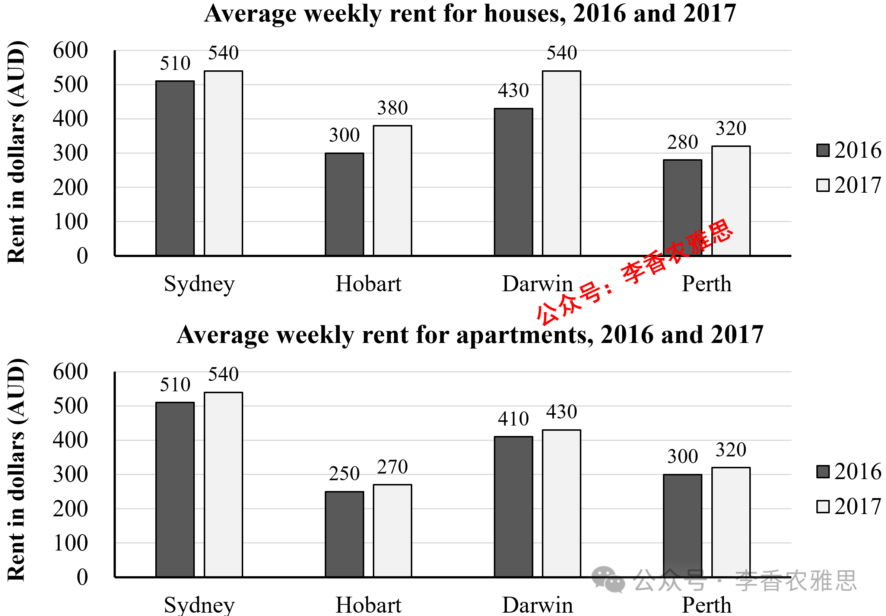

# 2026 年 4 月 25 日雅思写作真题
## Task 1

> **图表类型标注**：柱状图（双图对比（四城周租金：2016 vs 2017））

**The charts below give information about weekly rent for houses and apartments in four Australian cities in 2016 and 2017.**
**Summarise the information by selecting and reporting the main features, and make comparisons where relevant.**



The charts illustrate changes in the average weekly rental prices for houses and apartments in Sydney, Hobart, Darwin, and Perth from 2016 to 2017.

As shown, the average weekly rent for houses in the four given cities all increased considerably. Among these cities, Sydney was the most expensive market, with its rental costs rising from 510 Australian dollars (AUD) to 540 AUD per week. The rent in Darwin followed a similar upward trend, with a notable upturn from 430 AUD to 540 AUD, the same as Sydney’s price in 2017. Hobart and Perth remained comparatively affordable but rent there also climbed from 300 AUD to 380 AUD and from 280 AUD to 320 AUD, respectively.

A similar pattern can be observed in apartment rents, except in Perth, though at lower price levels overall. Sydney had the same average weekly rent for apartments as for houses, which grew from 510 AUD to 540 AUD per week, and again topped the list. The corresponding data for Hobart and Darwin saw a modest and identical rise of 20 AUD per week (from 410 AUD to 430 AUD and from 250 AUD to 270 AUD, respectively), while Perth’s apartment rent remained stable at 300 AUD in both years.

Overall, rents increased in most cities over the period, with Sydney consistently recording the highest prices for both housing types. Apartments were generally cheaper and the price for those rose more slowly than that for houses, although the gap varied by location.

---

### 精析

#### ① 结构分析（精简）

本题属于 **Bar Chart (Mixed/Comparison)** 类 Task 1，涉及四个澳大利亚城市（Sydney, Hobart, Darwin, Perth）在 2016 和 2017 年房屋和公寓的周租金对比。

本文采用 **"总-分-总"** 三段式结构：

- **Paragraph 1 — Introduction（开头段）**
  - 改写题目要素：`changes in the average weekly rental prices for houses and apartments in Sydney, Hobart, Darwin, and Perth from 2016 to 2017`（替换原题 `weekly rent for houses and apartments in four Australian cities in 2016 and 2017`）
  - 明确对象：4 个城市 + 2 种住房类型 + 2016–2017 年

- **Paragraph 2 — Body Details（主体段：按住房类型分组）**
  - **Houses（全部上涨）**：Sydney 最贵（510→540 AUD），Darwin 涨幅最大（430→540 AUD，与 Sydney 持平），Hobart（300→380 AUD）和 Perth（280→320 AUD）相对便宜
  - **Apartments（大部分上涨）**：Sydney 公寓与房屋同价（510→540 AUD），Hobart 和 Darwin 公寓均涨 20 AUD（410→430 和 250→270），Perth 公寓稳定（300 AUD）

- **Paragraph 3 — Overview（总结段）**
  - 大多数城市租金上涨，Sydney 两种住房类型均为最高
  - 公寓通常更便宜且涨幅更慢，但差距因城市而异

> **结构亮点**：本文按"住房类型"分组（先 houses 后 apartments），在每个类型内再按城市展开。这种结构使读者可以清晰对比同一住房类型在不同城市的价格差异，以及不同住房类型在同一城市的价格关系。

#### ② 数据组织与对比策略（标注有效写法）

| 写法 | 原文示例 | 技巧说明 |
|------|---------|---------|
| **极值突出** | `Sydney was the most expensive market` | 强调 Sydney 的最高租金地位 |
| **涨幅对比** | `Darwin followed a similar upward trend, with a notable upturn from 430 AUD to 540 AUD` | 用 notable upturn 强调 Darwin 的大幅上涨 |
| **价格持平** | `the same as Sydney's price in 2017` | 用 the same as 说明 Darwin 与 Sydney 的价格持平 |
| **相对便宜** | `Hobart and Perth remained comparatively affordable` | 用 comparatively affordable 概括相对低价 |
| **例外标注** | `except in Perth, though at lower price levels overall` | 用 except 标注公寓的例外情况 |
| **稳定标注** | `Perth's apartment rent remained stable at 300 AUD in both years` | 用 remained stable 概括 Perth 公寓的稳定 |

> **数据亮点**：作者精准选择了关键数据点进行描述。Houses 突出 Sydney 的 540 AUD 最高值和 Darwin 的 430→540 AUD 最大涨幅，Apartments 突出 Perth 的稳定（300 AUD）和 Hobart/Darwin 的相同涨幅（20 AUD）。避免了罗列所有 16 个数据点。

#### ③ 四项能力维度分析（TA / CC / LR / GRA）

- **TA**：本文按"住房类型"分组（先 houses 后 apartments），在每个类型内再按城市展开。这种结构使读者可以清晰对比同一住房类型在不同城市的价格差异，以及不同住房类型在同一城市的价格关系。 作者精准选择了关键数据点进行描述。Houses 突出 Sydney 的 540 AUD 最高值和 Darwin 的 430→540 AUD 最大涨幅，Apartments 突出 Perth 的稳定（300 AUD）和 Hobart/Darwin 的相同涨幅（20 AUD）。避免了罗列所有 16 个数据点。
- **CC**：本文衔接词使用精准且功能明确。"followed a similar upward trend"的类比使 Darwin 的描述简洁高效，"A similar pattern can be observed"的过渡使公寓数据的引入自然，"except in Perth"的例外标注使数据描述准确。
- **LR**：见模块⑤词汇表，含 `increased considerably`、`the most expensive market` 等精准词
- **GRA**：见模块⑤句式亮点

#### ④ 可迁移句型骨架（直接套用）（图表类型：柱状图（双图对比（四城周租金：2016 vs 2017）））

**骨架 1 — 开头改写（表格/图通用）**
> The [chart] illustrates changes in ______ in [entities] in [years], along with ______.

**骨架 2 — 极值+对比（Body 通用）**
> ______ had [number], which was considerably higher than the figures for the other [n] [entities].

**骨架 3 — 排名变化/超越（含动态时）**
> ______ saw the second-largest rise and surpassed ______, with its figure growing from ______ to ______.

**骨架 4 — 双维度收尾（Overview 通用）**
> Overall, ______ had by far the largest number..., while ______ recorded the lowest figures on both measures.

#### ⑤ 衔接 / 词汇 / 句式亮点（去水版）

| 衔接类型 | 原文表达 | 功能 |
|---------|---------|------|
| **总体衔接** | `As shown, the average weekly rent for houses in the four given cities all increased considerably` | 先给出总体趋势 |
| **递进衔接** | `Among these cities, Sydney was the most expensive market` | 用 Among these cities 展开细节 |
| **类比衔接** | `The rent in Darwin followed a similar upward trend` | 用 similar 连接同类趋势 |
| **补充衔接** | `Hobart and Perth remained comparatively affordable but rent there also climbed` | 用 but 转折补充低价城市的上涨 |
| **类比衔接** | `A similar pattern can be observed in apartment rents` | 用 similar pattern 连接公寓数据 |
| **例外衔接** | `except in Perth, though at lower price levels overall` | 用 except 标注例外 |
| **总结衔接** | `Overall... although...` | 用 although 让步总结 |

> **衔接亮点**：本文衔接词使用精准且功能明确。"followed a similar upward trend"的类比使 Darwin 的描述简洁高效，"A similar pattern can be observed"的过渡使公寓数据的引入自然，"except in Perth"的例外标注使数据描述准确。

| 词汇/短语 | 中文含义 | 词性/用法 | 替代普通表达 |
|-----------|----------|----------|-------------|
| **increased considerably** | 大幅上涨 | 动词短语 | went up a lot |
| **the most expensive market** | 价格最高的市场 | 名词短语 | the most expensive city |
| **rising from** | 从……上涨 | 动词短语 | going up from |
| **followed a similar upward trend** | 呈现出类似的上升趋势 | 动词短语 | had a similar increase |
| **a notable upturn** | 一次显著的上扬 | 名词短语 | a big increase |
| **the same as** | 与……相同 | 形容词短语 | equal to |
| **remained comparatively affordable** | 仍然相对实惠 | 动词短语 | stayed relatively cheap |
| **climbed from... to... respectively** | 分别从……攀升至…… | 动词短语 | went up from... to... |
| **topped the list** | 位居榜首 | 动词短语 | was the highest |
| **a modest and identical rise** | 一次小幅且完全相同的上涨 | 名词短语 | a small and same increase |
| **remained stable** | 保持稳定 | 动词短语 | stayed the same |
| **consistently recording the highest prices** | 始终录得最高价格 | 动词短语 | always having the highest prices |
| **rose more slowly** | 上涨得更为缓慢 | 动词短语 | went up more slowly |
| **the gap varied by location** | 差距因地区而异 | 名词短语 | the difference changed by city |

**1. 极值+涨幅句**
> *"Among these cities, Sydney was the most expensive market, **with** its rental costs rising from 510 Australian dollars (AUD) to 540 AUD per week."*

**技巧**：用 with 独立主格结构补充 Sydney 的具体涨幅，使最高值与涨幅关联，信息密度高。

**2. 类比+持平句**
> *"The rent in Darwin **followed a similar upward trend**, **with** a notable upturn from 430 AUD to 540 AUD, **the same as** Sydney's price in 2017."*

**技巧**：用 followed a similar upward trend 类比 Darwin 与 Sydney 的上升趋势，with 补充具体涨幅，the same as 说明最终价格持平，描述完整。

**3. 例外标注句**
> *"**A similar pattern can be observed in apartment rents, except in Perth**, though at lower price levels overall."*

**技巧**：用 A similar pattern can be observed 引出公寓数据，except in Perth 标注例外，though 让步说明整体价格水平更低，描述准确。

**4. 相同涨幅概括句**
> *"The corresponding data for Hobart and Darwin saw a modest and identical rise of 20 AUD per week (from 410 AUD to 430 AUD and from 250 AUD to 270 AUD, **respectively**), **while** Perth's apartment rent remained stable at 300 AUD in both years."*

**技巧**：用 modest and identical rise 概括 Hobart 和 Darwin 的相同涨幅，respectively 精确对应数据，while 对比 Perth 的稳定，信息密度极高。

**5. 综合总结句**
> *"Overall, rents increased in most cities over the period, **with** Sydney consistently recording the highest prices for both housing types. Apartments were generally cheaper and the price for those rose more slowly than that for houses, **although** the gap varied by location."*

**技巧**：用 with 独立主格结构补充 Sydney 的最高地位，although 让步说明差距因城市而异，总结全面而审慎。

---

#### ⑥ 可提升空间 + 仿写任务

**可提升空间（通用要点，按篇酌情采纳）：**
- Overview 建议前置或明确独立成段，让阅卷人先抓全局（TA 更稳）。
- 双维度数据（如比率/占比）尽量也收进 Overview，避免只在正文提一次。
- 跨段对比（如 A 反超 B）可集中到一句呈现，衔接更紧凑。

**本文针对性可改进点（按篇分析，点到即止）：**
- 第三段 `Hobart and Darwin... (from 410 AUD to 430 AUD and from 250 AUD to 270 AUD, respectively)` 存在内部矛盾：按此顺序 Hobart 公寓（410）反高于其房屋（300–380），与总结句"公寓普遍更便宜"相冲突，两城顺序疑与原图错配，需回图核对。
- `A similar pattern can be observed in apartment rents, except in Perth, though at lower price levels overall` 一句连用 except 与 though 两个插入成分，转折叠转折，读来卡顿，宜拆成两句。
- Overview 断言 `Apartments were generally cheaper`，但正文明写 Sydney 两类住房同价，这一例外未被收进总结，结论略显绝对。

**仿写任务**：用「极值+对比」骨架写一句：描述『2020 年 X 国指标远高于其他三国』。
## Task 2

> **话题与题型标注**：环境类 · Agree/Disagree

**Some people believe that air travel should be restricted because it causes serious pollution and consumes a large proportion of the world’s fuel resources. To what extent do you agree or disagree?**

**一些人认为坐飞机出行应该被限制，因为这导致严重的空气污染并消耗世界大部分燃料。你在多大程度上同意或者不同意这个观点？**

Some claim that aviation contributes significantly to environmental pollution and accounts for a greater share of fuel consumption, so air travel should be discouraged. Although aircraft consume fossil fuels and emit substantial amounts of greenhouse gases, I disagree that it should be restricted.

一些人认为，航空业对环境污染贡献显著，并占据了较大比例的燃料消耗，因此应当限制航空出行。尽管飞机消耗化石燃料并排放大量温室气体，我仍然不同意应当对其进行限制。

Admittedly, modern air travel consumes large amounts of aviation fuel and significantly increases environmental impacts. This is primarily because most commercial aircraft still rely on fossil-based jet fuels, which are not only finite but also highly carbon-intensive. During flights, the formation of contrails consisting of water vapor at high altitudes, where their warming effects are even more pronounced, can intensify atmospheric warming. Worse still, substantial quantities of carbon dioxide and nitrogen oxides emitted by aircraft not only exacerbate climate change but also greatly pollute the air that people breathe regularly. With global passenger demand rising steadily each year, the total volume of emissions from aviation continues to grow. If this trend remains unchecked, it will accelerate the depletion of limited energy resources and place immense pressure on already strained ecosystems, thereby undermining long-term environmental sustainability.

诚然，现代航空运输消耗大量航空燃料，并显著加剧环境影响。这主要是因为大多数商用飞机仍然依赖化石基喷气燃料，这类燃料不仅是有限资源，而且碳排放强度很高。在飞行过程中，高空中由水蒸气形成的凝结尾迹，其增温效应更为明显，会进一步加剧大气变暖。更糟糕的是，飞机排放的大量二氧化碳和氮氧化物不仅加剧气候变化，还严重污染人们日常呼吸的空气。随着全球航空客运需求逐年稳步上升，航空排放总量也在持续增长。如果这一趋势得不到遏制，将加速有限能源资源的消耗，并对本已承受巨大压力的生态系统施加沉重负担，从而破坏长期的环境可持续性。

However, imposing strict limits on air travel would not effectively eliminate pollution or reduce fuel consumption, but would instead generate far-reaching negative consequences. From a carbon emissions perspective, cars, rather than aircraft, are among the largest contributors to air pollution globally. They release large amounts of carbon dioxide and other harmful gases, which are major drivers of climate change and poor air quality. This impact is magnified by the sheer number of vehicles on the road, leading to traffic congestion that further exacerbates the problem. While air travel consumes significant amounts of fossil energy, it is less frequent for the average individual, and its per capita consumption is much lower than that of daily car use. From a socio-economic perspective, discouraging flights could have severe economic and social repercussions, particularly for the global tourism industry. Air travel plays a vital role in connecting people worldwide and facilitating business and tourism, despite planes consuming considerable amounts of energy per kilometer. For long-distance travel, there are few practical alternatives. A reduction in flights could harm industries reliant on tourism and international trade, resulting in job losses, economic downturns, and decreased living standards.

然而，对航空出行施加严格限制并不能有效消除污染或减少燃料消耗，反而会带来深远的负面影响。从碳排放的角度来看，汽车而非飞机，才是全球空气污染的主要来源之一。汽车排放大量二氧化碳及其他有害气体，这些都是气候变化和空气质量恶化的重要驱动因素。由于道路上车辆数量庞大，这一影响被进一步放大，并导致交通拥堵，从而加剧问题。尽管航空出行消耗大量化石能源，但对普通人而言其发生频率较低，人均能耗远低于日常汽车使用。从社会经济角度来看，限制航班可能带来严重的经济和社会影响，尤其是对全球旅游业而言。航空运输在连接全球人口、促进商业往来和旅游发展方面发挥着至关重要的作用，尽管飞机在单位距离上消耗大量能源。对于长途出行而言，几乎没有切实可行的替代方案。减少航班可能会损害依赖旅游和国际贸易的产业，导致失业、经济衰退以及生活水平下降。

In conclusion, although aviation undeniably intensifies environmental degradation through high fuel consumption and emissions, restricting it is neither effective nor practical. Compared with widespread car use, its overall impact is relatively limited, while its economic and social significance remains indispensable, making alternative solutions far more viable.

总而言之，尽管航空业确实通过高燃料消耗和排放加剧环境恶化，但对其进行限制既不有效，也不现实。与广泛的汽车使用相比，其总体影响相对有限，而其经济和社会重要性又不可替代，因此寻找其他解决方案更为可行。

---

### 精析

#### ① 结构分析（精简）

本题属于 **Agree/Disagree** 类题型。此类题型的核心策略是：明确表明立场，然后展开论证。

本文采用 **"让步-反驳-总结"** 四段式结构：

- **Paragraph 1 — Introduction（开头段）**
  - 改写题目（paraphrase）：`Some claim that aviation contributes significantly to environmental pollution and accounts for a greater share of fuel consumption, so air travel should be discouraged`（替换原题 `Some people believe that air travel should be restricted because it causes serious pollution and consumes a large proportion of the world's fuel resources`）
  - 表明立场：`I disagree that it should be restricted`（明确反对）
  - 预告框架：先让步承认航空业的环境影响，再反驳限制航空的有效性

- **Paragraph 2 — Body 1（让步段）**
  - 主题句：`modern air travel consumes large amounts of aviation fuel and significantly increases environmental impacts`
  - 原因：大多数商用飞机仍依赖化石基喷气燃料，碳排放强度高
  - 机制：高空中水蒸气形成的凝结尾迹增温效应更明显→加剧大气变暖
  - 更严重：大量二氧化碳和氮氧化物排放→加剧气候变化+严重污染空气
  - 趋势：全球客运需求逐年上升→排放总量持续增长
  - 后果：加速能源资源消耗+对生态系统施加沉重负担→破坏环境可持续性

- **Paragraph 3 — Body 2（反驳段）**
  - 主题句：`imposing strict limits on air travel would not effectively eliminate pollution or reduce fuel consumption, but would instead generate far-reaching negative consequences`
  - 角度1（碳排放）：汽车而非飞机是全球空气污染主要来源→道路上车辆数量庞大→交通拥堵加剧问题
  - 对比：航空出行对普通人频率较低→人均能耗远低于日常汽车使用
  - 角度2（社会经济）：限制航班对全球旅游业有严重经济和社会影响
  - 机制：航空运输连接全球人口、促进商业和旅游发展→长途出行几乎没有替代方案
  - 后果：减少航班损害旅游和国际贸易产业→失业、经济衰退、生活水平下降

- **Paragraph 4 — Conclusion（结尾段）**
  - 重申立场：`restricting it is neither effective nor practical`
  - 总结升华：与汽车使用相比影响有限，经济和社会重要性不可替代

> **结构亮点**：本文采用经典的"先退后进"策略，先充分承认航空业的环境影响（凝结尾迹、二氧化碳、氮氧化物），再系统反驳限制航空的有效性。反驳段中采用了"碳排放"和"社会经济"双角度论证，使反驳更加全面。特别值得注意的是，作者用"汽车vs飞机"的对比论证极具说服力。

#### ② 论证逻辑链拆解（标注有效写法）

**Body 1（让步段）的逻辑链条：**

```
航空业的环境影响
    ↓ [核心论点]
→ 消耗大量航空燃料，显著加剧环境影响
    ↓ [原因]
→ 大多数商用飞机仍依赖化石基喷气燃料
    ↓ [特点]
    ├── 有限资源
    └── 碳排放强度高
    ↓ [机制一]
→ 高空中水蒸气形成凝结尾迹
    ↓ [特点]
    增温效应更为明显
    ↓ [效果]
    进一步加剧大气变暖
    ↓ [机制二]
→ 大量二氧化碳和氮氧化物排放
    ↓ [双重后果]
    ├── 加剧气候变化
    └── 严重污染人们日常呼吸的空气
    ↓ [趋势]
→ 全球客运需求逐年稳步上升
    ↓ [结果]
    航空排放总量持续增长
    ↓ [最坏后果]
    加速有限能源资源消耗
    ↓
    对本已承受巨大压力的生态系统施加沉重负担
    ↓
    破坏长期环境可持续性
```

**Body 2（反驳段）的逻辑链条：**

```
限制航空的无效性
    ↓ [核心论点]
→ 严格限制不能有效消除污染或减少燃料消耗
    ↓ [反而带来深远负面后果]
    ↓ [角度一：碳排放]
→ 汽车而非飞机是全球空气污染主要来源之一
    ↓ [具体表现]
    汽车排放大量二氧化碳及其他有害气体
    ↓ [影响]
    气候变化和空气质量恶化的重要驱动因素
    ↓ [放大因素]
    道路上车辆数量庞大
    ↓ [连锁反应]
    交通拥堵 → 进一步加剧问题
    ↓ [对比]
    航空出行对普通人频率较低
    ↓ [结论]
    人均能耗远低于日常汽车使用

    ↓ [角度二：社会经济]
→ 限制航班带来严重经济和社会影响
    ↓ [受影响最大]
    全球旅游业
    ↓ [航空的价值]
    连接全球人口、促进商业往来和旅游发展
    ↓ [现实]
    长途出行几乎没有切实可行的替代方案
    ↓ [负面后果]
    ├── 损害依赖旅游和国际贸易的产业
    ├── 导致失业
    ├── 经济衰退
    └── 生活水平下降
```

> **逻辑亮点**：本文论证采用了"对比论证"策略。在反驳段中，用"汽车vs飞机"的碳排放对比证明限制航空并非解决污染的最佳途径，再用"社会经济影响"论证限制航空的负面后果。两个角度都遵循"前提→机制→结果"的推导路径，逻辑链条完整。

#### ③ 四项能力维度分析（TA / CC / LR / GRA）

- **TA**：本文采用经典的"先退后进"策略，先充分承认航空业的环境影响（凝结尾迹、二氧化碳、氮氧化物），再系统反驳限制航空的有效性。反驳段中采用了"碳排放"和"社会经济"双角度论证，使反驳更加全面。特别值得注意的是，作者用"汽车vs飞机"的对比论证极具说服力。 本文论证采用了"对比论证"策略。在反驳段中，用"汽车vs飞机"的碳排放对比证明限制航空并非解决污染的最佳途径，再用"社会经济影响"论证限制航空的负面后果。两个角度都遵循"前提→机制→结果"的推导路径，逻辑链条完整。
- **CC**：本文衔接手段丰富且功能明确。"Admittedly""However"的递进转折使论证层层深入，"Worse still"的强调使航空业的环境问题描述更加饱满，"From a carbon emissions perspective / From a socio-economic perspective"的双角度切换使反驳段结构清晰。
- **LR**：见模块⑤词汇表，含 `contributes significantly to`、`environmental pollution` 等精准词
- **GRA**：见模块⑤句式亮点

#### ④ 可迁移句型骨架（直接套用）（题型：Agree/Disagree）

**骨架 1 — 先退后进亮立场（Intro）**
> Although ______ deserves a central place because ______, I disagree with the view that ______.

**骨架 2 — 分类论证起手（Body）**
> From the perspective of ______, doing X helps ______ and ______. Meanwhile, X also offers ______ that go beyond ______.

**骨架 3 — 抽象→具体例证（Body）**
> For example, a course on ______ may show how ______ have harmed ______, as illustrated by ______.

#### ⑤ 衔接 / 词汇 / 句式亮点（去水版）

| 衔接类型 | 原文表达 | 功能说明 |
|---------|---------|---------|
| **立场预告** | `Although aircraft consume fossil fuels... I disagree that it should be restricted` | 开头段先让步再明确反对 |
| **让步衔接** | `Admittedly, modern air travel consumes large amounts of aviation fuel...` | 用 Admittedly 引出对方合理之处 |
| **因果衔接** | `This is primarily because most commercial aircraft still rely on...` | 用 This is primarily because 解释原因 |
| **递进衔接** | `Worse still, substantial quantities of carbon dioxide...` | 用 Worse still 递进强调更严重的问题 |
| **条件衔接** | `If this trend remains unchecked, it will accelerate...` | 用 If 引导条件推导后果 |
| **转折衔接** | `However, imposing strict limits on air travel would not effectively eliminate...` | 用 However 转向反驳 |
| **视角切换** | `From a carbon emissions perspective... From a socio-economic perspective...` | 用 From... perspective 切换分析角度 |
| **对比衔接** | `While air travel consumes significant amounts of fossil energy...` | 用 While 对比航空与汽车 |
| **因果衔接** | `thereby undermining long-term environmental sustainability` | 用 thereby undermining 说明最终结果 |
| **总结衔接** | `In conclusion, although... restricting it is neither effective nor practical` | 收束全文并重申立场 |

> **衔接亮点**：本文衔接手段丰富且功能明确。"Admittedly""However"的递进转折使论证层层深入，"Worse still"的强调使航空业的环境问题描述更加饱满，"From a carbon emissions perspective / From a socio-economic perspective"的双角度切换使反驳段结构清晰。

| 词汇/短语 | 中文含义 | 词性/用法 | 替代普通表达 |
|-----------|----------|----------|-------------|
| **contributes significantly to** | 对……起到显著的助推作用 | 动词短语 | adds a lot to |
| **environmental pollution** | 环境污染 | 名词短语 | harm to the environment |
| **accounts for a greater share** | 占据更大的份额 | 动词短语 | uses a larger part |
| **fuel consumption** | 燃料消耗 | 名词短语 | fuel use |
| **should be discouraged** | 应予以抑制／不予鼓励 | 动词短语 | should be stopped |
| **aviation fuel** | 航空燃料 | 名词短语 | plane fuel |
| **fossil-based jet fuels** | 化石基喷气燃料 | 名词短语 | fuels from oil |
| **carbon-intensive** | 碳排放强度高的 | 形容词 | producing a lot of carbon |
| **contrails** | 飞机凝结尾迹 | 名词短语 | white lines left by planes |
| **water vapor** | 水蒸气 | 名词短语 | water in the air |
| **warming effects** | 增温效应 | 名词短语 | effects that make it warmer |
| **intensify atmospheric warming** | 加剧大气变暖 | 动词短语 | make the air warmer |
| **nitrogen oxides** | 氮氧化物 | 名词短语 | harmful gases from planes |
| **exacerbate climate change** | 加剧气候变化 | 动词短语 | make climate change worse |
| **global passenger demand** | 全球客运需求 | 名词短语 | worldwide demand for flying |
| **remains unchecked** | 得不到遏制 | 动词短语 | is not controlled |
| **accelerate the depletion** | 加速（资源）枯竭 | 动词短语 | speed up the use up |
| **strained ecosystems** | 不堪重负的生态系统 | 名词短语 | damaged natural systems |
| **undermine long-term environmental sustainability** | 损害长期的环境可持续性 | 动词短语 | hurt the environment in the long run |
| **imposing strict limits** | 施加严格限制 | 动词短语 | putting strict rules |
| **generate far-reaching negative consequences** | 引发深远的负面后果 | 动词短语 | cause many bad effects |
| **the largest contributors** | 最主要的诱因／来源 | 名词短语 | the biggest causes |
| **sheer number of vehicles** | 车辆的庞大数量 | 名词短语 | very large number of cars |
| **traffic congestion** | 交通拥堵 | 名词短语 | traffic jams |
| **per capita consumption** | 人均消耗量 | 名词短语 | amount used per person |
| **socio-economic perspective** | 社会经济视角 | 名词短语 | from a social and economic view |
| **repercussions** | （不良）连带影响 | 名词短语 | bad effects |
| **facilitating business and tourism** | 促进商务与旅游 | 动词短语 | helping business and tourism |
| **indispensable** | 不可或缺的 | 形容词 | essential |
| **alternative solutions** | 替代性解决方案 | 名词短语 | other ways to solve the problem |
| **far more viable** | 可行得多的 | 形容词短语 | much more practical |

**1. 让步转折复合句**
> *"**Although** aircraft consume fossil fuels and emit substantial amounts of greenhouse gases, **I disagree** that it should be restricted."*

**技巧**：用 Although 引导让步从句，先承认航空业的环境影响，再在主句中用 I disagree 明确反对限制，使立场更加审慎有力。

**2. 因果机制句**
> *"This is **primarily because** most commercial aircraft still rely on fossil-based jet fuels, **which are not only finite but also highly carbon-intensive**."*

**技巧**：用 This is primarily because 解释原因，which 引导非限制性定语从句说明燃料特点，not only... but also... 连接双重特征，因果逻辑清晰。

**3. 递进强调句**
> *"**Worse still**, substantial quantities of carbon dioxide and nitrogen oxides emitted by aircraft **not only exacerbate** climate change **but also greatly pollute** the air that people breathe regularly."*

**技巧**：用 Worse still 递进强调更严重的问题，not only... but also... 连接双重负面后果，that 引导定语从句修饰 air，论证力度十足。

**4. 条件后果推演句**
> *"**If** this trend remains unchecked, it will accelerate the depletion of limited energy resources and place immense pressure on already strained ecosystems, **thereby undermining** long-term environmental sustainability."*

**技巧**：用 If 引导条件从句，主句用 will accelerate... and place... 连接双重后果，thereby undermining 现在分词短语说明最终结果，因果链条完整。

**5. 对比论证句**
> *"**While** air travel consumes significant amounts of fossil energy, it is less frequent for the average individual, and its per capita consumption is much lower than that of daily car use."*

**技巧**：用 While 引导让步从句，先承认航空的能源消耗，再转折强调其频率较低和人均能耗更低，对比论证有力。

**6. 综合总结句**
> *"**Compared with** widespread car use, its overall impact is relatively limited, **while** its economic and social significance remains indispensable, **making** alternative solutions far more viable."*

**技巧**：用 Compared with 引出对比对象，while 连接两个对比分句，making 现在分词短语说明结论，总结简洁有力。

#### ⑥ 可提升空间 + 仿写任务

**可提升空间（通用要点，按篇酌情采纳）：**
- 结论段避免复读开头，应「推进」而非「重复」立场。
- 让步段衔接词（this perspective 等）回指别太远，可加限定词收紧。
- 同一话题词（如 career / benefit）避免三现，用近义替换。

**本文针对性可改进点（按篇分析，点到即止）：**
- 反驳段角度一"汽车才是最大污染源"属于转移焦点：即使汽车更脏，也不能直接推出航空不该被限制，中间缺一句"限制航空所能换来的减排收益远小于其代价"来补足逻辑跳跃。
- 全文没有一个具体例证（无 For example、无具体国家或行业），`could harm industries reliant on tourism and international trade` 停留在断言层面，可补一个高度依赖航空客源的岛国或旅游经济体。
- 反驳段单段塞进"碳排放"与"社会经济"两个角度加大量细节，篇幅明显重于让步段，段内层次不易辨认，可拆段或压缩汽车部分。

**仿写任务**：用「先退后进」骨架重写：*Some think space exploration is a waste of money.*
