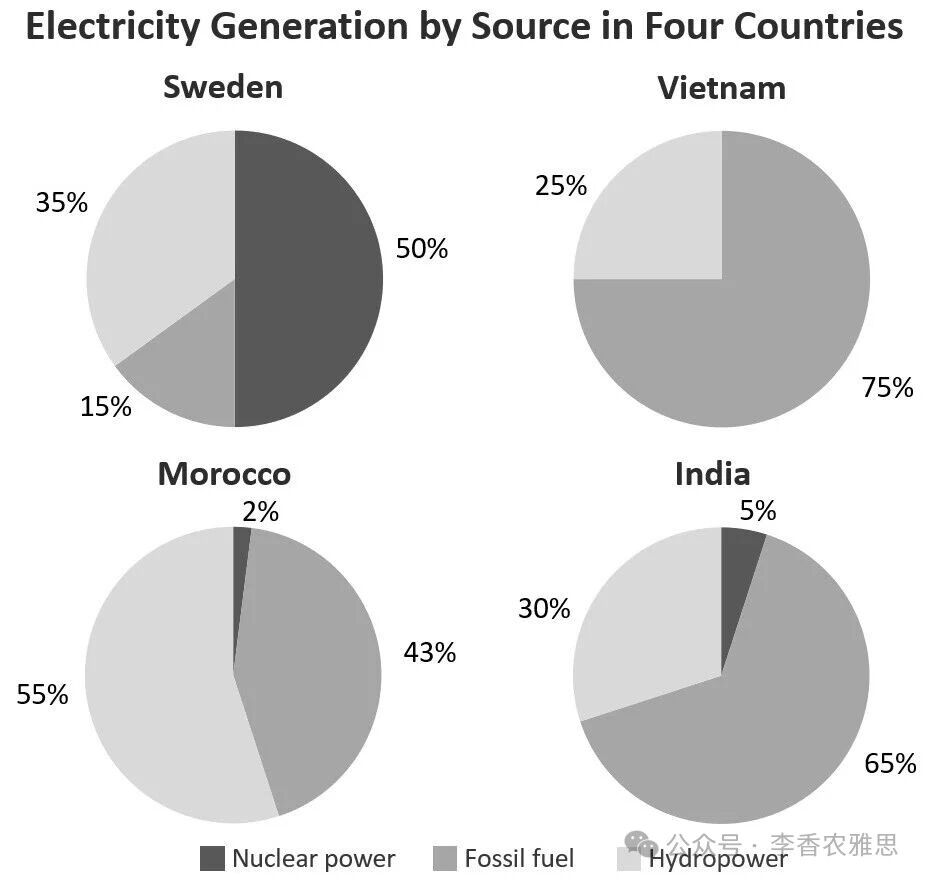

# 2026 年 7 月 11 日雅思写作真题
## Task 1

> **图表类型标注**：饼图（四国电力来源占比：瑞典/越南/摩洛哥/印度，核能/化石燃料/水电，2008）

**The charts below show the percentages of electricity produced from different sources in four countries in 2008.**
**Summarise the information by selecting and reporting the main features, and make comparisons where relevant.**




The pie charts compare the proportions of electricity generated from nuclear power, fossil fuels and hydropower in Sweden, Vietnam, Morocco and India in 2008. 

As shown, nuclear power was the largest source of electricity in Sweden, supplying half of the country’s total. This was far higher than the corresponding proportions in India and Morocco, where nuclear energy made up only 5% and 2% respectively. Vietnam, by contrast, produced no electricity from nuclear power. Fossil fuels, however, were the dominant source in Vietnam and India. In the former, three quarters of electricity came from this source, the highest proportion among the four countries. India showed a similar pattern (65%), while Sweden recorded the lowest share (15%).

Regarding hydropower, it made a substantial contribution in all four countries, although its importance varied considerably. Morocco relied most heavily on this source, with hydropower providing 55% of its total electricity. In Sweden, 35% of electricity also came from hydropower, while the figures for India and Vietnam were slightly lower, at 30% and 25% respectively.

Overall, the dominant source of electricity varied markedly among the four countries: fossil fuels led in Vietnam and India, hydropower was the main source in Morocco, and nuclear power accounted for the largest share in Sweden.

---

### 精析

#### ① 结构分析（精简）

本题属于 **Pie Chart（饼图）** 类 Task 1，涉及 4 个国家（Sweden, Vietnam, Morocco, India）在 2008 年三种电力来源（nuclear power, fossil fuels, hydropower）的占比。

本文采用 **"按能源类别横切"** 的 4 段式结构（开头段 + 两个主体段按能源分组 + 概述段），而非按国家逐个铺开：

- **Paragraph 1 — Introduction（开头段）**
  - 改写题目要素：`The pie charts compare the proportions of electricity generated from nuclear power, fossil fuels and hydropower in Sweden, Vietnam, Morocco and India in 2008`（替换原题 `The charts below show the percentages of electricity produced from different sources in four countries in 2008`）
  - 明确对象：4 个国家 + 3 种能源 + 时间点（2008）；把原题模糊的 `different sources` 具体化为三类能源，信息量高于原题

- **Paragraph 2 — Body 1（主体段：核能 + 化石燃料合并段）**
  - **主题切分**：先用 `As shown, nuclear power was the largest source of electricity in Sweden, supplying half of the country’s total`（50%）领起核能维度；再用 `Fossil fuels, however, were the dominant source in Vietnam and India` 自然切到化石燃料维度
  - **核能维度**（段内前半）：**Sweden** 50% 居首；**India / Morocco** 仅 5% 与 2%，用 `far higher than the corresponding proportions` 与瑞典形成落差；**Vietnam**：`produced no electricity from nuclear power`（零值），构成该能源维度的下限
  - **化石维度**（段内后半）：**Vietnam** 75% 四国最高（`three quarters of electricity came from this source, the highest proportion among the four countries`）；**India** `showed a similar pattern (65%)`；**Sweden** `recorded the lowest share (15%)`
  - **段内联动**：把核能与化石塞进同一段并非偶然——段内主题句从核能"瑞典居首"过渡到化石"越南/印度居首"，**瑞典在两能源栏的对调、越南在两能源栏的对调**在同一个段落里被直接对照，"此消彼长"的镜像关系无需跨段就能看到

- **Paragraph 3 — Body 2（主体段：水电）**
  - 先给共性判断：`it made a substantial contribution in all four countries, although its importance varied considerably`
  - **Morocco**：依赖最深（55%）；**Sweden** 35%；**India / Vietnam** 略低（30%、25%）
  - 由高到低串成一条降序链，读者可一眼排序

- **Paragraph 4 — Overview（概述段）**
  - 用冒号分述三国主导能源：`fossil fuels led in Vietnam and India, hydropower was the main source in Morocco, and nuclear power accounted for the largest share in Sweden`

> **结构亮点**：饼图最容易写成"四国 × 三能源"的十二格清单，本文选择了更聪明的切法——**以能源为纲、以国家为目**。两个主体段中，水电段单独领起 `Regarding hydropower`，而核能与化石燃料被压进同一段、由 `Fossil fuels, however,` 在段内自然切到第二能源——这种"三能源只占两段"的安排本身就是一种段内经济。更值得学的是核能+化石合并段里**此消彼长的镜像关系**：瑞典在核能栏 50% 居首却在化石燃料栏 15% 垫底，越南在化石燃料栏 75% 居首却在核能栏 0%，两国在同一个段落里就被直接对照，无需跨段比较就能让读者一眼看出"哪种能源看哪个国家"。水电段则用一条降序链收口四国（摩洛哥 55% > 瑞典 35% > 印度 30% > 越南 25%），三种能源的领跑者最后用 Overview 段的冒号分述一次性收口。

#### ② 数据组织与对比策略（标注有效写法）

| 写法 | 原文示例 | 技巧说明 |
|------|---------|---------|
| **极值先行+分词补充** | `nuclear power was the largest source of electricity in Sweden, supplying half of the country’s total` | 先定性（largest source）再定量，且用 half 把 50% 换算成文字，避免整篇百分号堆积 |
| **一句绑两国** | `far higher than the corresponding proportions in India and Morocco, where nuclear energy made up only 5% and 2% respectively` | where 定语从句 + respectively 把两国数据压进同一句，比分写两句省一半篇幅 |
| **零值的自然表达** | `Vietnam, by contrast, produced no electricity from nuclear power` | 0% 不写作 "0%"，改用 produced no electricity，句子更像英语而非表格朗读 |
| **同类归并+括号补数** | `India showed a similar pattern (65%), while Sweden recorded the lowest share (15%)` | similar pattern 先归类再补数，while 顺势带出同段最低值，一句完成"同类 + 极值"两件事 |
| **共性判断+让步限定** | `it made a substantial contribution in all four countries, although its importance varied considerably` | 先给四国共性（都可观），再用 although 预告差异，为随后的 55/35/30/25 降序链铺路 |

> **数据亮点**：全图共 12 个数据点，作者一个也没漏成"清单"，而是提炼出三条主线：**瑞典靠核能（唯一 50% 级别）、越南与印度靠化石燃料（75%、65%）、摩洛哥靠水电（55%）**。尤其精彩的是对"极端值"的处理——越南核能 0% 与瑞典化石燃料 15% 都是各段的下限，作者分别用 `produced no electricity` 与 `recorded the lowest share` 两种不同措辞点出，既避免重复也让两处极值都被读到。第三段（水电段）的 `55%…35%…30% and 25% respectively` 是标准的降序串联写法，四个数字排成一条线，比逐国另起一句更紧凑。

#### ③ 四项能力维度分析（TA / CC / LR / GRA）

- **TA**：饼图最容易写成"四国 × 三能源"的十二格清单，本文选择了以能源为纲、以国家为目的切法。两个主体段中，水电段单独领起 `Regarding hydropower`，段内按 55%/35%/30%/25% 降序排列国家；核能+化石燃料合并段则用 `As shown...` 与 `Fossil fuels, however,` 在段内完成能源切换，段内既能看到核能维度（瑞典 50% ≫ 印度 5% > 摩洛哥 2% > 越南 0%），也能看到化石维度（越南 75% > 印度 65% ≫ 瑞典 15%）——两国（瑞典/越南）在两种能源上的对调被压进同一段直接对照，读者一眼看出"此消彼长"的结构性差异。全部 12 个数据点未被平铺，而是收束为"瑞典靠核能、越南与印度靠化石燃料、摩洛哥靠水电"三条主线，最后用冒号分述一次性收口，选点与概述高度一致。
- **CC**：本文衔接以"话题切换"为主轴。`As shown` 引出图示信息进入第一个主体段，`by contrast` 在段内制造零值与 50% 的落差，`Fossil fuels, however,` 在同一段中把能源从核能切到化石燃料；`Regarding hydropower` 则开启第二个主体段，把水电维度单独拎出来。读者从头段读到 Overview 时，每一次"现在换到哪一种能源"都靠具体衔接词点出，未靠段落标题或重复罗列；`In the former`（回指 Vietnam）与 `this source`（回指 fossil fuels）两处回指连用，一句之内避开了两次重复；段内则靠 `while`、`although`、`respectively` 完成并列与让步，衔接词数量不多，但每一个都落在结构关节上。
- **LR**：见模块⑤词汇表，含 `the dominant source`、`relied most heavily on`、`accounted for the largest share` 等精准词
- **GRA**：见模块⑤句式亮点

#### ④ 可迁移句型骨架（直接套用）（图表类型：饼图（四国电力来源占比））

**骨架 1 — 开头改写（饼图通用）**
> The pie charts compare the proportions of ______ generated from ______, ______ and ______ in [countries] in [year].

**骨架 2 — 极值先行+分词补充（Body 起手）**
> ______ was the largest source of ______ in ______, supplying ______ of the country’s total.

**骨架 3 — 一句绑两个对象（跨对象对比）**
> This was far higher than the corresponding proportions in ______ and ______, where ______ made up only __% and __% respectively.

**骨架 4 — 冒号分述收尾（Overview 通用）**
> Overall, the dominant ______ varied markedly among the four ______: ______ led in ______, ______ was the main ______ in ______, and ______ accounted for the largest share in ______.

#### ⑤ 衔接 / 词汇 / 句式亮点（去水版）

| 衔接类型 | 原文表达 | 功能 |
|---------|---------|------|
| **总体引入** | `The pie charts compare the proportions of electricity generated from nuclear power, fossil fuels and hydropower...` | 开头段改写题目，并把原题的 different sources 具体化为三类能源 |
| **图示指引** | `As shown, nuclear power was the largest source of electricity in Sweden` | 用 As shown 引出读图结果，自然进入第一个能源维度 |
| **段内反差** | `Vietnam, by contrast, produced no electricity from nuclear power` | by contrast 把零值与瑞典 50% 直接对撞，段末落在极端处 |
| **话题切换** | `Fossil fuels, however, were the dominant source in Vietnam and India` | however 插在主语后，完成从核能到化石燃料的能源切换 |
| **回指避重复** | `In the former, three quarters of electricity came from this source` | the former 回指 Vietnam、this source 回指 fossil fuels，一句避开两次重复 |
| **分项过渡** | `Regarding hydropower, it made a substantial contribution in all four countries` | Regarding 引出第二个主体段（水电维度），并先给四国共性判断 |

> **衔接亮点**：本文衔接的高明处在于"衔接词都长在关节上"。两处能源切换各用不同手法：第一处在第一个主体段内完成——`As shown` 引出核能维度，`Fossil fuels, however,` 在段中把能源切到化石燃料，段内自洽；第二处靠 `Regarding hydropower` 开启第二个主体段，把水电维度单独拎出。段内则用 `by contrast` 制造落差、`while` 制造并列、`although` 埋下差异伏笔，三处衔接词出现在不同位置（段首 / 段中 / 句间），既不重复也不显机械。最经济的一处是 `In the former, three quarters of electricity came from this source`——the former 与 this source 两个回指并置，在不重复 "Vietnam" 与 "fossil fuels" 的前提下把上一句的两个信息全部承接下来。

| 词汇/短语 | 中文含义 | 词性/用法 | 替代普通表达 |
|-----------|----------|----------|-------------|
| **the proportions of electricity generated** | 发电量占比 | 名词短语 | how much electricity is made |
| **supplying half of the country’s total** | 供应该国总量的一半 | 分词短语 | giving 50% of all the electricity |
| **the corresponding proportions** | 相应（对应）比例 | 名词短语 | the same figures in other countries |
| **the dominant source** | 最主要的来源 | 名词短语 | the biggest source |
| **made a substantial contribution** | 作出了可观的贡献 | 动词短语 | helped a lot |
| **relied most heavily on** | 对……依赖最深 | 动词短语 | used this source the most |
| **varied markedly / considerably** | 差异显著 / 相差很大 | 动词短语 | was very different |
| **accounted for the largest share** | 占据最大份额 | 动词短语 | had the biggest part |

**1. 极值+分词伴随句**
> *"As shown, nuclear power was the largest source of electricity in Sweden, **supplying half of the country’s total**."*

**技巧**：主句先定性（largest source），现在分词短语 supplying... 补上定量信息，主次分明；用 half 而非 50% 表述，既避免百分号密集，也让句子读起来更接近自然英语。这是饼图开篇最稳的一句写法：一句之内完成"谁最大 + 大到多少"。

**2. 回指+定语从句压缩句**
> *"**This** was far higher than **the corresponding proportions** in India and Morocco, **where** nuclear energy made up only 5% and 2% **respectively**."*

**技巧**：This 回指上句的 50%，避免重复数字；the corresponding proportions 精准表达"对应比例"这一比较基准；where 引导定语从句把两国数据挂在同一句上，再用 respectively 完成一对一映射——本可写成两句的内容被压成一句，信息密度显著提升。

**3. 双重回指+同位语句**
> *"**In the former**, three quarters of electricity came from **this source**, **the highest proportion among the four countries**."*

**技巧**：the former 回指 Vietnam、this source 回指 fossil fuels，两个回指并置使句子不带任何重复词；句末同位语 the highest proportion among the four countries 不另起句子就补上了"四国最高"的极值定位。一句话完成"点名 + 数据 + 极值"三层。

**4. 冒号分述总结句**
> *"Overall, the dominant source of electricity **varied markedly** among the four countries**:** fossil fuels led in Vietnam and India, hydropower was the main source in Morocco, and nuclear power accounted for the largest share in Sweden."*

**技巧**：先用 varied markedly 给出总判断，冒号之后接三个结构相似的分句排比，分别对应三种能源的领跑者；三个动词短语 led / was the main source / accounted for the largest share 表达同一含义却不重复用词，是 Overview 段"同义不同形"的教科书示范。

---

#### ⑥ 可提升空间 + 仿写任务

**可提升空间（通用要点，按篇酌情采纳）：**
- Overview 建议前置或明确独立成段，让阅卷人先抓全局（TA 更稳）。
- 双维度数据（如比率/占比）尽量也收进 Overview，避免只在正文提一次。
- 跨段对比（如 A 反超 B）可集中到一句呈现，衔接更紧凑。

**本文针对性可改进点（按篇分析，点到即止）：**
- 化石燃料段只交代了越南（75%）、印度（65%）与瑞典（15%），唯独漏掉摩洛哥在这一能源上的占比（中文版写到 43%），四国之一在该维度缺席；而核能段与水电段都做到了四国齐全，写法前后不一致。
- 同一段内数据呈现方式不统一：`three quarters of electricity` 用文字表达，紧接着的 `a similar pattern (65%)` 与 `the lowest share (15%)` 却改用括号数字，读者需要在两种计量口径间切换。
- 第三段（水电段）已建立"水电在四国普遍重要"这条横向主线（`made a substantial contribution in all four countries`，55%/35%/30%/25%），但 Overview 只写各国的"主导能源"，未把这条唯一的共性结论收进总结，全局图景略有缺口。

**仿写任务**：用「极值先行+分词伴随」骨架写一句：描述『2015 年 X 国的可再生能源为其最大电力来源，占总量的三分之一』。
## Task 2

> **话题与题型标注**：教育类 · Positive/Negative development

**English is now widely used as the primary language of instruction, particularly in the education systems of some non-English-speaking countries. Do you think this is a positive or negative development?**

**英语如今被广泛用作主要教学语言，尤其在一些非英语国家的教育体系中。你认为这是一种积极还是消极的发展？**


English has increasingly become the principal language of instruction in schools and universities across many non-English-speaking countries. Although its widespread use in education may place pressure on local languages and create difficulties for some students, I believe this is largely a positive development.

英语越来越多地成为许多非英语国家中小学和大学的主要教学语言。虽然英语在教育中的广泛使用可能会给本土语言带来压力，并给部分学生造成困难，但我认为这总体上是一种积极的发展。

Admittedly, the widespread adoption of English may diminish cultural diversity and disadvantage students from less privileged backgrounds, as many of them have had fewer opportunities to learn the language well. Linguistic vitality depends on daily use, and this trend may gradually weaken the status of local languages, especially if English becomes dominant in higher education. As carriers of culture, local languages play an important role in passing on local traditions and values to younger generations, so their reduced presence in education may make cultural transmission more difficult. Meanwhile, in non-English-speaking countries, access to English-learning resources is often unevenly distributed, and students from remote areas frequently lack opportunities to develop strong English skills. If English becomes the primary medium of instruction, students without a solid foundation in the language may suffer from poor academic performance. This may further widen the gap between these students and peers with stronger English abilities, running counter to the goal of educational equity.

诚然，广泛采用英语可能会削弱文化多样性，也可能让来自较弱势背景的学生处于不利地位，因为他们中的许多人没有足够机会学好英语。语言活力依赖日常使用，因此如果英语在高等教育中占据主导地位，本土语言的地位可能会逐渐被削弱。作为文化载体，本土语言在向年轻一代传递地方传统和价值观方面发挥重要作用，因此它们在教育中的存在感下降，可能会使文化传承变得更加困难。同时，在非英语国家，英语学习资源的分布往往并不均衡，偏远地区学生经常缺少培养较强英语能力的机会。如果英语成为主要教学媒介，英语基础薄弱的学生可能会出现学业表现不佳的问题。这还可能进一步扩大他们与英语能力更强的同龄人之间的差距，违背教育公平的目标。

Nevertheless, the advantages of English-medium education are far more significant than the aforementioned risks. From an academic perspective, a substantial proportion of influential textbooks, scientific journals, online courses and research databases are published in English. Students proficient in the language can therefore obtain up-to-date information directly, rather than relying on translations that may be unavailable, delayed or inaccurate. This is particularly important in rapidly developing fields such as medicine, engineering and information technology, as access to recent discoveries can directly improve the quality of education and research. From an employability perspective, English-language education can also strengthen students’ career prospects. Many multinational companies use English as their working language, even in countries where it is not the native tongue. Graduates educated in English are consequently better prepared to communicate with overseas clients, work in international teams and pursue careers abroad.

然而，英语媒介教育的优势远比上述风险更重要。从学术角度看，大量有影响力的教材、科学期刊、在线课程和研究数据库都是用英语出版的。精通英语的学生因此可以直接获取最新信息，而不是依赖可能不存在、滞后或不准确的翻译。这一点在医学、工程和信息技术等快速发展的领域尤其重要，因为接触最新发现可以直接提升教育和研究质量。从就业角度看，英语教育也能增强学生的职业前景。许多跨国公司使用英语作为工作语言，即使它们在英语不是母语的国家运营。接受英语教育的毕业生因此更有能力与海外客户沟通、在国际团队中工作，并到国外发展职业。

In conclusion, although English-medium education may weaken local languages and create unfair barriers for students with limited English exposure, its value in expanding academic access, improving educational quality and strengthening graduates’ global employability makes it a largely positive development.

总之，虽然英语媒介教育可能会削弱本土语言，并为英语接触有限的学生制造不公平障碍，但它在扩大知识获取、提升教育质量和增强毕业生全球就业竞争力方面的价值，使其总体上成为一种积极的发展。

---


### 精析

#### ① 结构分析（精简）

本题属于 **Positive/Negative development** 类题型。此类题型的核心策略是：先给出明确判断（积极/消极/总体偏向某一方），再分别处理"代价"与"收益"，并在两者之间做出显性权衡。

本文采用 **"让步-权衡-综合"** 四段式结构：

- **Paragraph 1 — Introduction（开头段）**
  - 改写题目（paraphrase）：`English has increasingly become the principal language of instruction in schools and universities across many non-English-speaking countries`（替换原题 `English is now widely used as the primary language of instruction, particularly in the education systems of some non-English-speaking countries`）
  - 表明立场：`Although its widespread use in education may place pressure on local languages and create difficulties for some students, I believe this is largely a positive development`
  - 关键限定：用 `largely` 收窄断言强度，同时用 Although 从句预告了 Body 1 的两条风险（本土语言压力 + 部分学生困难），全篇框架在第一段已经定型

- **Paragraph 2 — Body 1（让步段 Admittedly：两条代价）**
  - 主题句：`the widespread adoption of English may diminish cultural diversity and disadvantage students from less privileged backgrounds`
  - 代价一（语言与文化）：`Linguistic vitality depends on daily use` → 英语在高等教育占主导 → 本土语言地位被削弱 → 作为 `carriers of culture` 的本土语言存在感下降 → 文化传承更困难
  - 代价二（教育公平）：英语学习资源 `unevenly distributed` → 偏远地区学生机会不足 → 若英语成为主要教学媒介 → 学业表现不佳 → 差距扩大 → `running counter to the goal of educational equity`

- **Paragraph 3 — Body 2（主论段 Nevertheless：两条收益）**
  - 权衡句：`the advantages of English-medium education are far more significant than the aforementioned risks`
  - 收益一（学术获取）：多数教材/期刊/在线课程/数据库以英语出版 → 直接获取 `up-to-date information`，不必依赖 `unavailable, delayed or inaccurate` 的翻译 → 在 medicine, engineering, information technology 等快速发展领域尤为关键
  - 收益二（就业竞争力）：跨国公司以英语为工作语言 → 毕业生更能与海外客户沟通、在国际团队工作、赴海外发展

- **Paragraph 4 — Conclusion（结尾段）**
  - 让步重申：`although English-medium education may weaken local languages and create unfair barriers...`
  - 落回立场：`its value in expanding academic access, improving educational quality and strengthening graduates’ global employability makes it a largely positive development`

> **结构亮点**：本文最值得学的是**"先付代价、再收收益"的顺序安排与显性称重动作**。开头段用 Although 把两条风险摆在明面上并以 `largely` 限定立场，避免了 Positive/Negative 题型最常见的"一边倒"；Body 1 不是敷衍两句的假让步，而是把文化传承与教育公平两条链完整推到底（甚至推到"违背教育公平"这样的价值判断）；正因为让步足够重，Body 2 段首那句 `far more significant than the aforementioned risks` 才成为真正的权衡而非空话——the aforementioned 一词把上一整段收进比较范围，两侧被放在同一杆秤上。结论段再以 although 复现让步、以三项价值落回判断，首尾的"限定—权衡—落定"完全咬合。

#### ② 论证逻辑链拆解（标注有效写法）

**Body 1（让步段）的双链条：**

```
英语成为主要教学语言（前提A）
    ↓ [代价一：语言与文化维度]
→ 语言活力依赖日常使用（Linguistic vitality depends on daily use）
    ↓ [条件]
→ 若英语在高等教育中占据主导
    ↓
→ 本土语言地位被逐渐削弱
    ↓ [身份定位]
→ 本土语言是文化载体（carriers of culture），承担传统与价值观的代际传递
    ↓
→ 其在教育中存在感下降 → 文化传承更困难

    ↓ [代价二：教育公平维度]
→ 非英语国家英语学习资源分布不均（unevenly distributed）
    ↓
→ 偏远地区学生缺少发展英语能力的机会
    ↓ [条件推导]
→ 若英语成为主要教学媒介 → 基础薄弱者学业表现不佳
    ↓ [后果放大]
→ 与英语更强的同龄人差距进一步扩大
    ↓ [价值判断]
→ 违背教育公平目标（running counter to the goal of educational equity）
```

**Body 2（主论段）的双链条：**

```
英语媒介教育的优势远大于上述风险（前提B）
    ↓ [收益一：学术获取]
→ 大量有影响力的教材 / 期刊 / 在线课程 / 研究数据库以英语出版
    ↓
→ 精通英语者可直接获取最新信息（obtain up-to-date information directly）
    ↓ [排除替代方案]
→ 不必依赖可能 unavailable / delayed / inaccurate 的翻译
    ↓ [领域限定]
→ 在医学、工程、信息技术等快速发展领域尤其重要
    ↓
→ 接触最新发现 → 直接提升教育与研究质量

    ↓ [收益二：就业竞争力]
→ 许多跨国公司以英语为工作语言（即便所在国英语非母语）
    ↓
→ 英语教育的毕业生更能与海外客户沟通、在国际团队工作、赴海外发展
    ↓ [汇总]
→ 扩大知识获取 + 提升教育质量 + 增强全球就业力 → 总体积极
```

> **逻辑亮点**：两个主体段采用**完全对称的"双子链"设计**——Body 1 是"文化代价 + 公平代价"，Body 2 是"学术收益 + 就业收益"，每条链都从一个可验证的事实前提出发（语言活力依赖日常使用 / 资源分布不均 / 多数学术资源以英语出版 / 跨国公司以英语为工作语言），再逐步推到后果，没有跳跃。特别值得注意的是让步段两条链都推到了"价值层"（文化传承困难、违背教育公平），而主论段两条链则推到了"能力层"（教育与研究质量、全球就业力）；论证维度不同却互不重叠，这才使 `far more significant than the aforementioned risks` 的权衡有内容可称。`rather than relying on translations that may be unavailable, delayed or inaccurate` 一句更是把"若无英语能力会怎样"的反面情形具体化为三种缺陷，使收益一不止是断言。

#### ③ 四项能力维度分析（TA / CC / LR / GRA）

- **TA**：立场明确且有分寸——`I believe this is largely a positive development` 中的 largely 既给出判断又留出让步空间，完全对应 Positive/Negative 题型的评分期待。两条风险与两条收益一一对位（文化传承 / 教育公平 vs 学术获取 / 就业竞争力），题目问的"发展是积极还是消极"被真正回答而非绕开；`far more significant than the aforementioned risks` 是全篇的称重动作，使文章不是"优点清单 + 缺点清单"的并置，而是有取舍的判断。结论段的三项价值（expanding academic access / improving educational quality / strengthening graduates’ global employability）与 Body 2 两条链严格对应，无新增论点。
- **CC**："Admittedly → Nevertheless"构成全篇主轴，前者引入代价、后者完成权衡；让步段内部用 `Meanwhile` 分出第二条风险链，主论段内部用 `From an academic perspective` 与 `From an employability perspective` 形成对称的视角切换，四条子链各有其入口，读者不会迷路。句间衔接则大量依靠回指与结果连接：`this trend` 回指英语主导教育的趋势、`these students` 回指基础薄弱者、`the aforementioned risks` 回指整段让步、`consequently` 标示就业结论，衔接手段分布在段首与句间两个层级。
- **LR**：见模块⑤词汇表，含 `linguistic vitality`、`carriers of culture`、`running counter to`、`the aforementioned risks` 等精准词
- **GRA**：见模块⑤句式亮点

#### ④ 可迁移句型骨架（直接套用）（题型：Positive/Negative development）

**骨架 1 — 让步预告+限定立场（Intro）**
> Although ______ may ______ and ______, I believe this is largely a positive / negative development.

**骨架 2 — 显性权衡转折（Body 2 起手，本题型核心句）**
> Nevertheless, the advantages of ______ are far more significant than the aforementioned risks.

**骨架 3 — 视角切换+排除替代方案（Body 展开）**
> From an academic / employability perspective, ______ can ______ directly, rather than relying on ______ that may be ______, ______ or ______.

**骨架 4 — 让步复现+三项价值收尾（Conclusion）**
> In conclusion, although ______ may ______ and ______, its value in ______, ______ and ______ makes it a largely positive development.

#### ⑤ 衔接 / 词汇 / 句式亮点（去水版）

| 衔接类型 | 原文表达 | 功能说明 |
|---------|---------|---------|
| **立场预告** | `Although its widespread use in education may place pressure on local languages..., I believe this is largely a positive development` | 开头段先摆代价再亮判断，largely 限定强度 |
| **让步引入** | `Admittedly, the widespread adoption of English may diminish cultural diversity and disadvantage students...` | Admittedly 领起整段让步，并预告两条风险 |
| **原因补充** | `as many of them have had fewer opportunities to learn the language well` | as 引导原因从句，解释"弱势学生为何受损" |
| **条件限定** | `especially if English becomes dominant in higher education` | especially if 缩小适用范围，使断言更谨慎 |
| **段内换链** | `Meanwhile, in non-English-speaking countries, access to English-learning resources is often unevenly distributed` | Meanwhile 从"文化代价"切换到"公平代价" |
| **条件推导** | `If English becomes the primary medium of instruction, students without a solid foundation... may suffer from poor academic performance` | If + may 推导后果，避免绝对化 |
| **显性权衡** | `Nevertheless, the advantages of English-medium education are far more significant than the aforementioned risks` | Nevertheless 转入主论，并把上一整段收进比较范围 |
| **视角切换** | `From an academic perspective... / From an employability perspective...` | 两个平行视角切分主论段的两条收益 |
| **结果衔接** | `Graduates educated in English are consequently better prepared to communicate with overseas clients...` | consequently 把前句事实推成就业结论 |
| **总结让步** | `In conclusion, although English-medium education may weaken local languages..., its value in... makes it a largely positive development` | although 复现让步 + 三项价值落回立场 |

> **衔接亮点**：本文衔接的结构感极强——四条论证子链各配一个专属入口（`Admittedly` / `Meanwhile` / `From an academic perspective` / `From an employability perspective`），入口词一出现，读者立刻知道正在进入第几条链。真正的高分细节在两处回指：`the aforementioned risks` 用一个名词短语把整个让步段打包进比较对象，省去了任何复述；`This may further widen the gap between these students and peers with stronger English abilities` 中 This 回指前句后果、these students 回指基础薄弱者，一句之内两次回指却毫无歧义。此外 `especially if` 与 `may` 的反复使用，使全篇在观点鲜明的同时始终保持学术性的谨慎语气。

| 词汇/短语 | 中文含义 | 词性/用法 | 替代普通表达 |
|-----------|----------|----------|-------------|
| **the principal language of instruction** | 主要教学语言 | 名词短语 | the main language used for teaching |
| **linguistic vitality** | 语言活力 | 名词短语 | how alive a language stays |
| **carriers of culture** | 文化载体 | 名词短语 | things that carry culture |
| **unevenly distributed** | 分布不均 | 形容词短语 | not shared equally |
| **a solid foundation in the language** | 扎实的语言基础 | 名词短语 | good basic skills in the language |
| **running counter to** | 与……相违背 | 分词短语 | going against |
| **the aforementioned risks** | 上述风险 | 名词短语 | the risks mentioned above |
| **strengthen students’ career prospects** | 增强学生的职业前景 | 动词短语 | help students get better jobs |

**1. 让步预告+限定立场句（开头段）**
> *"**Although** its widespread use in education may place pressure on local languages and create difficulties for some students, **I believe this is largely a positive development**."*

**技巧**：Although 从句一次装入两条风险（本土语言压力 + 学生困难），等于为 Body 1 预先列好提纲；主句用 I believe... largely 明确判断却不绝对，`largely` 一词是 Positive/Negative 题型的分寸所在——既回答了题目要求的取向，又保留了后文承认代价的空间。

**2. 身份定位+因果推论句（让步段）**
> *"**As carriers of culture**, local languages play an important role in passing on local traditions and values to younger generations, **so** their reduced presence in education may make cultural transmission more difficult."*

**技巧**：As + 名词短语先给本土语言一个身份定位（文化载体），把抽象概念可视化；主句陈述其功能，再用 so 推出后果。"定性 → 功能 → 推论"三步走，使"文化传承受损"不是断言而是有中间环节的推理。

**3. 条件因果链句（让步段）**
> *"**If** English becomes the primary medium of instruction, students without a solid foundation in the language **may suffer from** poor academic performance. **This may further widen the gap** between these students and peers with stronger English abilities, **running counter to** the goal of educational equity."*

**技巧**：If 引导条件、may 弱化断言，两句之间用 This 承接，最后以现在分词短语 running counter to... 把具体后果拉高到价值层面（教育公平）。一条链完整走过"条件 → 后果 → 后果放大 → 价值冲突"，是让步段写"真让步"的标准做法。

**4. 显性权衡+排除替代方案句（主论段）**
> *"**Nevertheless**, the advantages of English-medium education are **far more significant than the aforementioned risks**." … "Students proficient in the language can therefore obtain up-to-date information directly, **rather than relying on translations that may be unavailable, delayed or inaccurate**."*

**技巧**：前句是本题型的核心动作——用比较级把两侧放上同一杆秤，且以 the aforementioned risks 精确回指整段让步；后句用 rather than + 分词把"没有英语能力时的替代方案"具体化为三种缺陷（不存在、滞后、不准确），使"直接获取最新信息"的优势有了对照面，说服力远高于单纯罗列好处。

#### ⑥ 可提升空间 + 仿写任务

**可提升空间（通用要点，按篇酌情采纳）：**
- 结论段避免复读正文，应「推进」而非「重复」立场（可补一句条件或折中方案）。
- 让步段与主论段的证据密度应对等，两侧都需具体领域、群体或案例支撑。
- 判断类题型（positive/negative）需交代"为何一方更重要"的权衡标准，而非只给结论。

**本文针对性可改进点（按篇分析，点到即止）：**
- 权衡只有结论没有标准：`the advantages of English-medium education are far more significant than the aforementioned risks` 直接断言优势更重要，却未说明依据（如受影响人数、可逆性、是否存在补偿手段）；若补一句"本土语言可通过课外与社区渠道维系，而学术资源的获取窗口一旦错过难以弥补"，权衡就从断言变成论证。
- 两段证据密度不对等：主论段有 `medicine, engineering and information technology` 这样的具体领域，让步段两条风险链却通篇只有 `students from remote areas` 一处具象表达，其余全是机制推演，无国别或学科例证。
- 开头承诺与展开略有落差：让步段主题句提出 `may diminish cultural diversity`，但正文实际只论证了"本土语言地位被削弱"这一分支，"文化多样性"这一更大命题未再回收；结论段的三项价值也基本是 Body 2 两条链的原样复述，未就"如何在推行英语教学的同时保护本土语言"给出任何推进。

**仿写任务**：用「显性权衡」骨架写一句回应：*Some argue that online learning will replace classroom teaching.*


