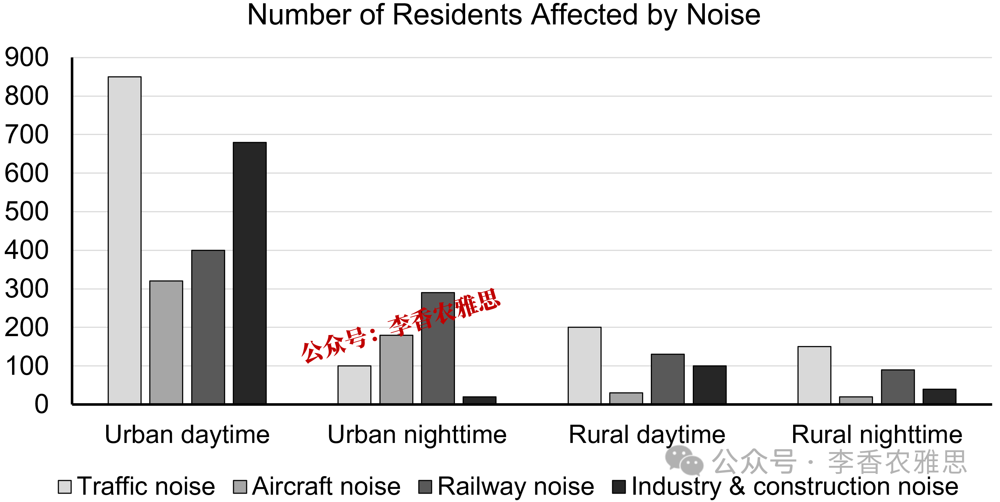

# 2026 年 7 月 25 日雅思写作真题
## Task 1

> **图表类型标注**：柱状图（英国某地区城乡昼夜受交通/飞机/铁路/工业建筑噪音影响人数，2020）

**The chart below shows the number of residents affected by different types of noise during the day and at night in the urban and rural areas of a particular part of the UK in 2020. Summarise the information by selecting and reporting the main features, and make comparisons where relevant.**




The bar chart compares how many urban and rural residents in one part of the UK were affected by traffic, aircraft and railway noise, as well as noise from industry and construction, during the day and at night in 2020. 

As shown, daytime noise affected more people than nighttime noise in both urban and rural areas. In urban areas, traffic noise affected approximately 850 residents during the day, followed by noise from industry and construction, with about 680 people exposed. At night, railway noise became the leading source, affecting around 290 people, nearly three times the figure for traffic noise (100). By contrast, the number of people affected by noise from industry and construction was the smallest, at only 15. 

In rural areas, far fewer residents were affected. Specifically, the number of people disturbed by traffic noise stood at 200 during the day and 150 at night. The figures for railway noise were considerably lower, at roughly 130 and 90 respectively, while aircraft noise affected the fewest rural residents, at 30 during the day and 20 after dark.

Overall, urban residents were affected in much greater numbers, particularly during the day. Traffic noise was the leading source in most settings, whereas railway noise affected the largest number of urban residents at night.

---

### 精析

#### ① 结构分析（精简）

本题属于 **Bar chart（柱状图）** 类 Task 1，涉及英国某地区城市（urban）与农村（rural）居民在 **白天（day）与夜晚（night）** 两个时段，受 **交通（traffic）、飞机（aircraft）、铁路（railway）及工业和建筑（industry and construction）** 四类噪音影响的人数。

本文采用 **"总-分-总"** 思路下的 4 段式结构（开头段改写题目 → 主体段 1（城市 urban，段首以 As shown 领起）→ 主体段 2（农村 rural）→ 收尾概述段（Overall））：

- **Paragraph 1 — Introduction（开头段）**
  - 改写题目要素：`The bar chart compares how many urban and rural residents in one part of the UK were affected by traffic, aircraft and railway noise, as well as noise from industry and construction, during the day and at night in 2020`（替换原题 `The chart below shows the number of residents affected by different types of noise during the day and at night in the urban and rural areas`）

- **Paragraph 2 — Body 1（主体段：城市 urban）**
  - 段首话题句：`As shown, daytime noise affected more people than nighttime noise in both urban and rural areas`（点明"白天 > 夜晚"这一贯穿城乡的全局规律，是主体段 1 的话题句，并非独立总览段）
  - 白天：交通噪音约 850 人最高，工业和建筑噪音约 680 人居次
  - 夜晚：铁路噪音跃居首位（约 290 人，近交通噪音 100 人的三倍）；工业和建筑噪音最少（仅 15 人）

- **Paragraph 3 — Body 2（主体段：农村 rural）**
  - 总体：受影响人数远少于城市
  - 交通噪音：白天 200、夜晚 150；铁路噪音：约 130 与 90；飞机噪音最少（白天 30、夜晚 20）

- **Paragraph 4 — Overview（收尾概述段）**
  - 城市居民受影响人数远多于农村，尤其白天
  - 交通噪音在多数场景居首；铁路噪音在夜晚影响最多城市居民

> **结构亮点**：作者按"城乡"这一空间维度把六类数据拆成两组，每组内部又按"白天→夜晚"的时间轴推进，使一张含 4 种噪音 × 2 时段 × 2 地区的复杂柱状图读来层次分明。尤其值得注意的是，城市段先写白天交通噪音主导、再写夜晚铁路噪音反超，暗含"时段切换导致主导源变化"的线索；农村段则用"far fewer"作段首定调，与城市段形成体量上的强烈对照，城乡对比一目了然。

#### ② 数据组织与对比策略（标注有效写法）

| 写法 | 原文示例 | 技巧说明 |
|------|---------|---------|
| **段首定调（全局规律）** | `As shown, daytime noise affected more people than nighttime noise in both urban and rural areas` | 用 more than + both...and 一句锁定"白天>夜晚"的跨维度规律，作为主体段 1 话题句为全文定调 |
| **城乡分组** | `In urban areas, traffic noise affected approximately 850 residents during the day, followed by noise from industry and construction, with about 680 people exposed` | In urban areas 明确分组，followed by + with 复合结构串联两种噪音 |
| **极值 + 倍数** | `At night, railway noise became the leading source, affecting around 290 people, nearly three times the figure for traffic noise (100)` | leading source 标极值，倍数 + 括号数据 (100) 强化对比 |
| **最小值的强调** | `By contrast, the number of people affected by noise from industry and construction was the smallest, at only 15` | By contrast 转折 + the smallest + only 15，凸显夜间极小值 |
| **双时段并列** | `Specifically, the number of people disturbed by traffic noise stood at 200 during the day and 150 at night` | stood at 表数据，and 并列双时段，信息成对出现 |

> **数据亮点**：作者没有被 4 种噪音 × 2 时段 × 2 地区的 16 个数据点淹没，而是抓出三条主线：① 全局"白天>夜晚"规律；② 城市段"白天交通主导、夜晚铁路反超"的时段分化；③ 城乡体量的悬殊（城市以百/十万计，农村以十/百计）。特别聪明的是，倍数（铁路夜晚 290 ≈ 交通 100 的三倍）与极小值（工业建筑夜晚仅 15）都被用作"锚点"，让数据之间产生关系而非孤立罗列。

#### ③ 四项能力维度分析（TA / CC / LR / GRA）

- **TA**：作者按"城乡"空间维度拆分数据，每组内部再按"白天→夜晚"时间轴推进，并清晰概括出"白天>夜晚"的全局规律与"城市远多于农村"的总体结论，任务回应完整、特征选取得当。三条数据主线（全局规律、时段分化、城乡悬殊）相互支撑，避免了逐格罗列。
- **CC**：`In urban areas... / In rural areas, far fewer residents were affected` 构成清晰的空间分组衔接；`At night` 由白天推进到夜晚；`By contrast` 在段内强调极小值；`while aircraft noise affected the fewest...` 用 while 并列对比，整体衔接轻量且精准。
- **LR**：见模块⑤词汇表，含 `approximately`、`the leading source`、`considerably lower` 等精准表达。
- **GRA**：见模块⑤句式亮点。

#### ④ 可迁移句型骨架（直接套用）（图表类型：柱状图（城乡噪音影响人数））

**骨架 1 — 开头改写（柱状图通用）**
> The bar chart compares how many [groups] in [place] were affected by [categories], during [time periods].

**骨架 2 — 主体段 1 起手（双维度）**
> As shown, [dimension A] affected more people than [dimension B] in both [group 1] and [group 2].

**骨架 3 — 极值 + 倍数（Body 通用）**
> ______ became the leading source, affecting around [number], nearly three times the figure for ______ ([number]).

**骨架 4 — 双时段并列（收尾/对比）**
> The number of people disturbed by ______ stood at [n] during the day and [n] at night.

#### ⑤ 衔接 / 词汇 / 句式亮点（去水版）

| 衔接类型 | 原文表达 | 功能 |
|---------|---------|------|
| **总体引入** | `The bar chart compares how many urban and rural residents... were affected by... during the day and at night` | 开头段改写题目，点明比较对象与双时段 |
| **段首定调** | `As shown, daytime noise affected more people than nighttime noise in both urban and rural areas` | 主体段 1 段首给出贯穿城乡的首要特征（话题句，非总览段） |
| **地点分组** | `In urban areas, traffic noise affected approximately 850 residents...` / `In rural areas, far fewer residents were affected` | 按城乡分两组展开主体段 |
| **时段推进** | `At night, railway noise became the leading source...` | 由白天推进到夜晚，揭示主导源变化 |
| **对比衔接** | `By contrast, the number of people affected by noise from industry and construction was the smallest, at only 15` | 强调夜间极小值 |
| **并列对比** | `The figures for railway noise were considerably lower... while aircraft noise affected the fewest rural residents` | while 并列铁路与飞机噪音，强化最小项 |

> **衔接亮点**：本文衔接以"分组 + 时段"双轴展开。`In urban areas / In rural areas` 完成空间跳转，`At night` 完成时间跳转，`By contrast` 与 `while` 在段内制造极值对照。尤其 `while aircraft noise affected the fewest rural residents, at 30 during the day and 20 after dark` 一句，把"最少项 + 双时段数据"压实在一处，既不重复主语又收束农村段，衔接紧凑。

| 词汇/短语 | 中文含义 | 词性/用法 | 替代普通表达 |
|-----------|----------|----------|-------------|
| **affected by** | 受……影响 | 动词短语 | were troubled by |
| **during the day and at night** | 在白天和夜晚 | 介词短语 | in daytime and nighttime |
| **approximately** | 大约；近似 | 副词 | about / around |
| **followed by** | 其次是 | 过去分词短语 | next was |
| **the leading source** | 主要来源 | 名词短语 | the main cause |
| **nearly three times** | 接近三倍 | 倍数表达 | almost three times as many |
| **by contrast** | 相比之下 | 副词短语 | on the other hand |
| **considerably lower** | 明显更低 | 程度比较 | much lower |

**1. 主体段 1 起手句**
> *"**As shown**, daytime noise affected more people than nighttime noise **in both urban and rural areas**."*

**技巧**：As shown 引话题句，用 more than 比较级 + both...and 双维度，一句话即锁定本段主线（白天>夜晚），作为主体段 1 的起手，避免开头段空泛。

**2. 极值 + 倍数句**
> *"**At night**, railway noise **became the leading source**, affecting around 290 people, **nearly three times the figure for traffic noise (100)**."*

**技巧**：At night 时间推进，leading source 标极值，nearly three times 倍数 + 括号数据 (100) 在单句内完成"反超 + 量化对比"，信息密度高。

**3. 双时段数据句**
> *"**Specifically**, the number of people disturbed by traffic noise **stood at 200 during the day and 150 at night**."*

**技巧**：Specifically 由总到分，stood at 表静态数据，and 并列双时段，使农村交通噪音一读即得昼夜两值。

**4. 并列对比句**
> *"The figures for railway noise were **considerably lower**, at roughly 130 and 90 respectively, **while** aircraft noise affected the fewest rural residents, at 30 during the day and 20 after dark."*

**技巧**：considerably lower 程度比较，respectively 将 130/90 与前述昼夜配对，while 引出最少项并补双时段，一句收束农村段。

---

#### ⑥ 可提升空间 + 仿写任务

**可提升空间（通用要点，按篇酌情采纳）：**
- Overview 建议前置或明确独立成段，让阅卷人先抓全局（TA 更稳）。
- 双维度数据（如比率/占比）尽量也收进 Overview，避免只在正文提一次。
- 跨段对比（如 A 反超 B）可集中到一句呈现，衔接更紧凑。

**本文针对性可改进点（按篇分析，点到即止）：**
- 农村段只给了交通、铁路、飞机三种噪音（200/150、130/90、30/20），却漏掉了"工业和建筑噪音"在农村白天与夜晚的数据——城市段有工业和建筑（680、15），农村段完全未交代，城乡对比因此不完整。
- 结尾 Overview 写 `Traffic noise was the leading source in most settings, whereas railway noise affected the largest number of urban residents at night`，但城市段明明给出交通噪音白天 850 远高于铁路夜晚 290，用 "leading source in most settings" 略含糊，未点明"白天交通主导、夜晚铁路主导"的时段分化。
- 城市段把工业和建筑噪音（680）与交通（850）并列，农村段却完全不提工业和建筑噪音，两组数据维度不一致，读来像在描述两张不同的图。

**仿写任务**：用「极值+倍数」骨架写一句：描述『某噪音源在夜晚影响人数是另一来源的三倍』。

## Task 2

> **话题与题型标注**：媒体类 · Positive/Negative development

**People these days prefer to watch films and TV programmes alone rather than with other people. Why is that? Do you think it is a positive or negative development?**

**如今，人们更喜欢独自观看电影和电视节目，而不是和其他人一起观看。为什么会出现这种情况？你认为这是积极的发展还是消极的发展？**


In contemporary society, many people choose to watch films and television programmes alone rather than share this experience with others. This trend is mainly driven by the convenience of personalised digital media and the difficulty of coordinating leisure time in a busy lifestyle. I believe it is largely negative because it reduces meaningful interaction and weakens community ties.

在当代社会，许多人选择独自观看电影和电视节目，而不是与他人分享这种体验。这一趋势主要是由个性化数字媒体的便利性以及忙碌生活中难以协调休闲时间所推动的。我认为它在很大程度上是消极的，因为它减少了有意义的互动，并削弱了邻里联系。

As observed, personalised media consumption and demanding lifestyles are two major reasons why solitary viewing has become increasingly common. First, streaming platforms allow viewers to watch content whenever it is convenient, pause it freely and choose films or programmes that closely match their individual tastes. Watching with family or friends, by contrast, often requires compromise, as people may disagree about genres, viewing times or even playback speed, while solitary viewing removes these constraints and offers greater freedom and immediate satisfaction. Second, long working hours, intensive study schedules and conflicting social commitments leave people with fewer opportunities to share leisure time. Rather than postponing a film until suitable companions are available, many people watch it independently, thereby making efficient use of their limited and often fragmented leisure time.

显然，个性化的媒体消费和高强度的生活方式，是独自观看变得越来越普遍的两个主要原因。首先，流媒体平台允许观众在方便的时候观看内容，自由暂停，并选择与个人兴趣高度匹配的电影或节目。相比之下，与家人或朋友一起观看通常需要妥协，因为人们可能在题材、观看时间甚至播放速度方面产生分歧。独自观看消除了这些限制，并带来更大的自由度和即时满足感。其次，长时间工作、紧张的学习安排以及相互冲突的社交事务，使人们更少有机会共享休闲时间。人们不会一直等到合适的同伴有空再看电影，而是选择独自观看，从而更有效地利用自己有限且经常碎片化的休闲时间。

Despite these practical benefits, I consider this trend a negative development because it can damage personal relationships and reinforce social isolation. At the individual level, watching films or programmes together provides a natural opportunity to strengthen emotional bonds. Laughing at a comedy, reacting to a dramatic scene or discussing unexpected plot developments can stimulate meaningful conversations and create shared memories. If people habitually consume entertainment alone, however, they may lose these informal opportunities to communicate with family and friends, gradually increasing the emotional distance between them. At the societal level, this habit may reinforce an increasingly individualistic lifestyle. As people become accustomed to enjoying cultural content without interacting with others, they may become less willing to participate in face-to-face activities or exchange ideas, which could weaken their sense of community and intensify feelings of loneliness. This means a convenient personal choice may gradually become a barrier to social connection.

尽管这些实际因素具有一定合理性，但我认为这一趋势是一种消极发展，因为它可能损害人际关系，并加剧社会孤立。在个人层面，共同观看电影或节目为加强情感联系提供了自然机会。一起因喜剧而发笑、对戏剧性场景作出反应，或讨论出人意料的剧情发展，都可以激发有意义的交流，并创造共同记忆。然而，如果人们习惯性地独自消费娱乐内容，他们可能会失去这些与家人和朋友沟通的非正式机会，从而逐渐增加彼此之间的情感距离。在社会层面，这种习惯可能会强化一种日益个人主义化的生活方式。当人们习惯于在不与他人互动的情况下享受文化内容时，他们可能会变得不太愿意参与面对面的活动或交流想法，这可能削弱他们的社区意识，并加剧孤独感。这意味着一种便利的个人选择可能会逐渐变成社会联系的障碍。

In conclusion, personalised streaming services and increasingly demanding lifestyles have made solitary viewing more attractive. Nevertheless, this trend is largely negative because it reduces valuable interaction with family and friends, encourages individualistic habits and may ultimately weaken community ties while worsening social isolation.

总之，个性化流媒体服务和越来越高强度的生活方式，使独自观看变得更具吸引力。然而，这一趋势在很大程度上是消极的，因为它减少了与家人和朋友之间有价值的互动，助长个人主义习惯，并最终可能削弱社区联系，同时加剧社会孤立。

---


### 精析

#### ① 结构分析（精简）

本题属于 **Positive/Negative development** 类题型。此类题型的核心策略是：先回应"为何如此"（原因分析），再明确判断"积极/消极"并展开论证。

本文采用 **"立场先行 + 原因段 + 影响段 + 综合结论"** 的四段式结构：

- **Paragraph 1 — Introduction（开头段）**
  - 改写题目（paraphrase）：`In contemporary society, many people choose to watch films and television programmes alone rather than share this experience with others`（替换原题 `People these days prefer to watch films and TV programmes alone rather than with other people`）
  - 预告框架：`This trend is mainly driven by the convenience of personalised digital media and the difficulty of coordinating leisure time in a busy lifestyle`
  - 表明立场：`I believe it is largely negative because it reduces meaningful interaction and weakens community ties`

- **Paragraph 2 — Body 1（原因段：为何独自观看兴起）**
  - 主题句：`As observed, personalised media consumption and demanding lifestyles are two major reasons why solitary viewing has become increasingly common`
  - 原因一（技术便利）：流媒体随时看、自由暂停、匹配口味；与家人朋友看需妥协（题材/时间/速度分歧），独自看消除约束、获自由与即时满足
  - 原因二（生活节奏）：长工时/紧学业/冲突社交 → 共享时间少；不等同伴、独自看 → 高效利用碎片化时间

- **Paragraph 3 — Body 2（影响段：为何是消极发展）**
  - 转折主题句：`Despite these practical benefits, I consider this trend a negative development because it can damage personal relationships and reinforce social isolation`
  - 个人层面：共同观看强化情感纽带（笑/反应/讨论 → 交流 + 共同记忆）；若习惯独看 → 失去沟通机会 → 情感距离拉大
  - 社会层面：强化个人主义生活方式 → 不互动 → 不愿面对面/交流 → 削弱社区感、加剧孤独
  - 收束：便利的个人选择渐成社会联系障碍

- **Paragraph 4 — Conclusion（结尾段）**
  - 重申现象：`personalised streaming services and increasingly demanding lifestyles have made solitary viewing more attractive`
  - 重申立场：`Nevertheless, this trend is largely negative because it reduces valuable interaction... encourages individualistic habits and may ultimately weaken community ties while worsening social isolation`

> **结构亮点**：本文采用"现象 → 原因 → 影响 → 结论"的清晰推进，且把 Positive/Negative 题的"判断"前置到开头（`I believe it is largely negative`），再分两段分别处理"为何如此"（Body 1 原因）与"为何负面"（Body 2 影响），逻辑不混。Body 2 用 `At the individual level / At the societal level` 由小及大递进，并以 `Despite these practical benefits` 先承接 Body 1 的"便利"再转折，体现对对立面的充分理解，比单纯一边倒更具说服力。

#### ② 论证逻辑链拆解（标注有效写法）

**Body 1（原因段）的逻辑链条：**

```
独自观看趋势兴起（现象）
    ↓ [驱动因素一：技术]
→ 个性化流媒体：随时看、自由暂停、匹配个人口味
    ↓ [对比]
→ 与家人朋友看需妥协（题材/时间/播放速度分歧）
    ↓
→ 独自观看消除约束，获更大自由与即时满足
    ↓ [驱动因素二：生活节奏]
→ 长工时 / 紧学业 / 冲突社交 → 共享休闲时间少
    ↓
→ 不等合适同伴，选择独自看 → 高效利用碎片化时间
```

**Body 2（影响段）的逻辑链条：**

```
承认便利（前提）
    ↓ [转折]
→ 但趋势负面：损害人际关系、加剧社会孤立
    ↓ [个人层面]
→ 共同观看强化情感纽带（笑/反应/讨论 → 交流+共同记忆）
    ↓ [反面推导]
→ 若习惯独自消费 → 失去沟通机会 → 情感距离拉大
    ↓ [社会层面]
→ 强化个人主义生活方式
    ↓
→ 不互动 → 不愿参与面对面/交流 → 削弱社区感、加剧孤独
    ↓ [收束]
→ 便利的个人选择渐成社会联系的障碍
```

> **逻辑亮点**：Body 1 用"双因并列（技术便利 + 生活节奏）"解释现象，且每个原因都配"共看 vs 独看"的对照，使因果可信；Body 2 则用"个人 → 社会"的由小及大递进，并以 `If people habitually consume entertainment alone...` 的条件句推导负面后果，形成"理解便利 → 指出代价"的闭环。两段一正一反，把"为何负面"论证得层次分明。

#### ③ 四项能力维度分析（TA / CC / LR / GRA）

- **TA**：本文立场明确（largely negative），且分"原因"与"影响"两段分别回应题目的两个提问（Why / Positive or negative），任务覆盖完整。Body 2 从个人与社会两层展开负面影响，论证不浮于表面；结尾回扣开头立场，首尾呼应。
- **CC**：`As observed / First / Second` 构成原因段主轴；`By contrast` 在原因一内部对比共看与独看；`Despite these practical benefits` 完成"原因→影响"的转折；`At the individual level / At the societal level` 在影响段内部分层；`If... however...` 条件推导，衔接张弛有度。
- **LR**：见模块⑤词汇表，含 `solitary viewing`、`personalised digital media`、`fragmented leisure time` 等精准词。
- **GRA**：见模块⑤句式亮点。

#### ④ 可迁移句型骨架（直接套用）（题型：Positive/Negative development）

**骨架 1 — 现象 + 立场（Intro）**
> Some people prefer to ______ rather than ______. I believe it is largely negative because ______.

**骨架 2 — 双因总起（Body 1）**
> This trend is mainly driven by ______ and ______. First, ______. Second, ______.

**骨架 3 — 转折亮负面立场（Body 2 起手）**
> Despite these practical benefits, I consider this trend a negative development because ______.

**骨架 4 — 个人→社会分层（Body 2）**
> At the individual level, ______ provides a natural opportunity to ______. At the societal level, ______.

#### ⑤ 衔接 / 词汇 / 句式亮点（去水版）

| 衔接类型 | 原文表达 | 功能说明 |
|---------|---------|---------|
| **立场预告** | `I believe it is largely negative because it reduces meaningful interaction and weakens community ties` | 开头段明确负面立场 |
| **原因总起** | `As observed, personalised media consumption and demanding lifestyles are two major reasons why...` | 概括两大原因 |
| **分点列举** | `First, streaming platforms allow viewers...` / `Second, long working hours...` | 两点原因并列展开 |
| **对比衔接** | `Watching with family or friends, by contrast, often requires compromise...` | by contrast 对比共看与独看 |
| **转折反驳** | `Despite these practical benefits, I consider this trend a negative development...` | 承认便利后转向负面判断 |
| **分层展开** | `At the individual level...` / `At the societal level...` | 由个人到社会的递进 |
| **条件因果** | `If people habitually consume entertainment alone, however, they may lose...` | If 推导负面后果 |
| **总结重申** | `In conclusion, ... Nevertheless, this trend is largely negative because...` | while 让步 + 重申立场 |

> **衔接亮点**：`As observed → First / Second` 把原因段铺陈得条理清晰；`By contrast` 与 `while` 在句内制造"共看 vs 独看"的微观对照；`Despite these practical benefits` 一句承接 Body 1 再转折，体现"理解对方 → 建设己方"的论证张力；`At the individual level / At the societal level` 使影响段由小及大，结构稳。

| 词汇/短语 | 中文含义 | 词性/用法 | 替代普通表达 |
|-----------|----------|----------|-------------|
| **solitary viewing** | 独自观看 | 名词短语 | watching alone |
| **personalised digital media** | 个性化数字媒体 | 名词短语 | customised media |
| **meaningful interaction** | 有意义的互动 | 名词短语 | real communication |
| **community ties** | 社区纽带／邻里联系 | 名词短语 | connections with others |
| **fragmented leisure time** | 碎片化的休闲时间 | 名词短语 | broken free time |
| **reinforce social isolation** | 加剧社会孤立 | 动词短语 | make loneliness worse |
| **emotional bonds** | 情感纽带 | 名词短语 | emotional connections |
| **individualistic lifestyle** | 个人主义化的生活方式 | 名词短语 | self-centred way of living |

**1. 现象 + 双因句（开头段）**
> *"This trend is **mainly driven by** the convenience of personalised digital media **and** the difficulty of coordinating leisure time in a busy lifestyle."*

**技巧**：be driven by 引出双因，and 并列"技术便利"与"生活节奏"，一句预告 Body 1 的全部内容，结构经济。

**2. 对比复合句（原因段）**
> *"Watching with family or friends, **by contrast**, often requires compromise, as people may disagree about genres, viewing times or even playback speed, **while** solitary viewing removes these constraints and offers greater freedom and immediate satisfaction."*

**技巧**：by contrast 引出对照，as 说明妥协原因，while 并列"共看受限 vs 独看自由"，微观对比强化论点。

**3. 条件后果句（影响段）**
> *"**If** people habitually consume entertainment alone, however, they may lose these informal opportunities to communicate with family and friends, **gradually increasing** the emotional distance between them."*

**技巧**：If 引导条件，主句用 may lose 推导可能后果，gradually increasing 现在分词作结果状语，把"独看"与"情感疏远"自然挂钩。

**4. 让步亮立场句（影响段起手）**
> *"**Despite these practical benefits**, I consider this trend a negative development because it can damage personal relationships and reinforce social isolation."*

**技巧**：Despite 先承认 Body 1 的便利，主句立刻亮明负面立场，转折利落、立场鲜明，是 Positive/Negative 题的标准起手式。

#### ⑥ 可提升空间 + 仿写任务

**可提升空间（通用要点，按篇酌情采纳）：**
- 结论段避免复读开头，应「推进」而非「重复」立场。
- 让步段衔接词（this perspective 等）回指别太远，可加限定词收紧。
- 同一话题词（如 benefit / interaction）避免三现，用近义替换。

**本文针对性可改进点（按篇分析，点到即止）：**
- 立场词前后不一：开头 thesis 用 `weakens community ties`（社区/邻里联系），Body 2 用 `reinforce social isolation`（社会孤立）、`weaken their sense of community`，结尾又回 `weakens community ties`；"community ties" 与 "sense of community" 概念相近但措辞摇摆，可统一。
- Body 1 把"便利"写得十分充分（自由、即时满足、高效利用碎片时间），但 Body 2 段首只一句 `Despite these practical benefits` 带过，未对"便利"做具体回应再反驳，转折略显突兀。
- 结论 `encourages individualistic habits and may ultimately weaken community ties while worsening social isolation` 几乎把 Body 2 的关键词复述一遍，推进感不足。

**仿写任务**：用「现象+负面立场」骨架重写：*Some people prefer to order food online rather than cook at home.*
