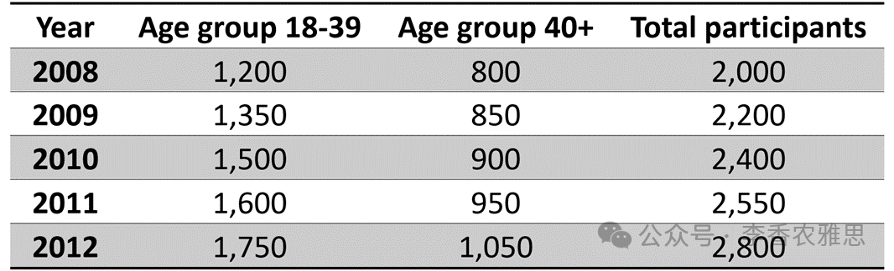

# 2026 年 8 月 8 日雅思写作真题
## Task 1

> **图表类型标注**：表格（2008–2012 两个年龄组马拉松参赛人数及总数）

**The table shows the number of people in two age groups who participated in a marathon from 2008 to 2012. Summarise the information by selecting and reporting the main features, and make comparisons where relevant.**




The table illustrates changes in marathon participation among two age groups, 18-39 and 40+, between 2008 and 2012, alongside the total number of participants. 

Overall, both age groups grew steadily, leading to a continuous rise in total marathon participation. Those aged 18-39 remained the larger group throughout, and the gap between the two groups widened gradually over the five-year period. 

In detail, the number of participants aged 18-39 increased by 550 over the five-year period, making this group the main contributor to the overall rise. Specifically, the figure rose from 1,200 in 2008 to 1,500 in 2010, an increase of 300, before climbing further to 1,750 by 2012.

A similar but slower upward trend can be seen among those aged 40 and above. Starting at 800 in 2008, the figure rose to 900 in 2010 and then reached 1,050 in 2012. In line with these increases, the total number of marathon participants climbed steadily from 2,000 to 2,800, while the gap between the two age groups expanded from 400 to 700, showing that growth was stronger among younger participants.

---

### 精析

#### ① 结构分析（精简）

本题属于 **Table（表格）** 类 Task 1，涉及两个年龄组（18-39 与 40+）在 2008、2010、2012 三年的马拉松参赛人数，以及逐年总人数。

本文采用 **"总-分-总"** 思路下的 4 段式结构（开头段改写题目 → 总览段 → 主体段 1（18-39 岁组详细数据）→ 主体段 2（40 岁及以上组详细数据 + 总数与差距收尾））：

- **Paragraph 1 — Introduction（开头段）**
  - 改写题目要素：`The table illustrates changes in marathon participation among two age groups, 18-39 and 40+, between 2008 and 2012, alongside the total number of participants`（替换原题 `The table shows the number of people in two age groups who participated in a marathon from 2008 to 2012`）

- **Paragraph 2 — Overview（总览段）**
  - 总览全局：`Overall, both age groups grew steadily, leading to a continuous rise in total marathon participation`（双组均增 → 总数升，先抓主旨）
  - 主线预览：`Those aged 18-39 remained the larger group throughout, and the gap between the two groups widened gradually over the five-year period`（点明 18-39 始终领先、差距拉大，统领后文）

- **Paragraph 3 — Body 1（主体段：18-39 岁组，详细数据）**
  - 主线：该组五年始终为人数更多的一方，且差距逐步拉大，为主要增长来源
  - 关键句：`the number of participants aged 18-39 increased by 550 over the five-year period, making this group the main contributor to the overall rise`
  - 数据细节：1,200（2008）→ 1,500（2010，+300）→ 1,750（2012）

- **Paragraph 4 — Body 2（主体段：40 岁及以上组，详细数据 + 总数与差距收尾）**
  - 主线：趋势相似但更缓
  - 关键句：`A similar but slower upward trend can be seen among those aged 40 and above`
  - 数据细节：800（2008）→ 900（2010）→ 1,050（2012）
  - 总数与差距收尾：2,000 → 2,800；差距 400 → 700，点明年轻组增长更强
  - 关键句：`In line with these increases, the total number of marathon participants climbed steadily from 2,000 to 2,800, while the gap between the two age groups expanded from 400 to 700, showing that growth was stronger among younger participants`

> **结构亮点**：作者把两个年龄组拆成两个对称的主体段，每段都走"趋势判断 → 起点 → 中间年 → 终点"的一致脉络，读者可逐段对照；更妙的是，Body 1 用 "main contributor to the overall rise" 与 Body 2 用 "slower upward trend" 形成隐性对比，最后在主体段 2 末尾用 "gap... expanded from 400 to 700" 把两组差距量化收口，使"分组描写"自然汇入"总趋势"——静态表格被读成了"年轻人拉开差距"的动态故事。

#### ② 数据组织与对比策略（标注有效写法）

| 写法 | 原文示例 | 技巧说明 |
|------|---------|---------|
| **总览先于细节** | `Overall, both age groups grew steadily, leading to a continuous rise in total marathon participation` | 先给全局结论（双组均增 → 总数升），让阅卷人先抓主旨，再展开 |
| **定位+差距主线** | `Those aged 18-39 remained the larger group throughout, and the gap between the two groups widened gradually over the five-year period` | 用 "larger group" 与 "gap widened" 确立两组关系，统领整段 |
| **增量标注+归因** | `the number of participants aged 18-39 increased by 550 over the five-year period, making this group the main contributor to the overall rise` | 用括号式总增量（+550）点明贡献度，比逐点罗列更高效 |
| **锚点+中途增量** | `Specifically, the figure rose from 1,200 in 2008 to 1,500 in 2010, an increase of 300, before climbing further to 1,750 by 2012` | 以起点、中点、终点三锚点串起曲线，并补中途绝对增量（300） |
| **同构对比** | `A similar but slower upward trend can be seen among those aged 40 and above` | 用 similar but slower 把第二组与第一组对齐，一键完成跨段对比 |
| **总数+差距收尾** | `In line with these increases, the total number of marathon participants climbed steadily from 2,000 to 2,800, while the gap between the two age groups expanded from 400 to 700` | 用总数 + 差距双线收束，并以 "showing that growth was stronger among younger participants" 给出解读 |

> **数据亮点**：作者没有逐年逐组罗列 2 组 × 3 年 = 6 个数据再加总数，而是抓出三条主线：18-39 组的绝对领先与主力贡献（五年 +550）、40+ 组的同源但更缓增长、以及两组差距从 400 扩大到 700 的"拉开"过程。最聪明的是把"总数"用作第二条分析线（2,000→2,800），并以"差距扩大"作为两组关系的最终注脚，让表格读出了"年轻组加速、年长组跟跑"的叙事。

#### ③ 四项能力维度分析（TA / CC / LR / GRA）

- **TA**：作者按年龄组将两组合理分段（18-39 为主力、40+ 为跟跑），并抓住"差距扩大"这一核心特征；总览段（P2）点明双组均增与总数上升，主体段 2 末尾用总数与差距双线收束，覆盖题目要求的所有主要特征与比较。但见模块⑥针对性可改进点关于基线交代与小标签一致的提示。
- **CC**：本文衔接轻量而精准。"Overall" 在总览段（P2）段首总览全局；"In detail / Specifically" 在 Body 1 内由概括推进到数据点；"A similar but slower upward trend" 在 Body 2 开头以 similar 回指第一组、but slower 制造对比；"In line with these increases" 在主体段 2 末尾把两组增长汇入总数。整体层层推进、不见堆砌。
- **LR**：见模块⑤词汇表，含 `marathon participation`、`main contributor`、`climbed steadily` 等精准词
- **GRA**：见模块⑤句式亮点

#### ④ 可迁移句型骨架（直接套用）（图表类型：表格（马拉松参赛人数））

**骨架 1 — 开头改写（表格/图通用）**
> The [chart] illustrates changes in ______ among [groups] between [years], alongside the total number of ______.

**骨架 2 — 总览（通用）**
> Overall, both [groups] grew steadily, leading to a continuous rise in total ______.

**骨架 3 — 分组+差距主线（Body 通用）**
> ______ remained the larger group throughout, and the gap between the two groups widened gradually over the [period].

**骨架 4 — 同构对比起手（跨段）**
> A similar but slower upward trend can be seen among ______.

#### ⑤ 衔接 / 词汇 / 句式亮点（去水版）

| 衔接类型 | 原文表达 | 功能 |
|---------|---------|------|
| **总体引入** | `The table illustrates changes in marathon participation among two age groups...` | 开头段改写题目并点明"变化"主题 |
| **总览定位** | `Overall, both age groups grew steadily, leading to a continuous rise in total marathon participation` | Overall 总览，建立"双增→总数升"的判断 |
| **分组主线** | `Those aged 18-39 remained the larger group throughout, and the gap... widened gradually` | 用 larger group + gap 确立两组关系 |
| **细节递进** | `In detail... / Specifically, the figure rose from 1,200... to 1,500... before climbing further to 1,750` | In detail / Specifically 由概括推进到锚点数据 |
| **同构对比** | `A similar but slower upward trend can be seen among those aged 40 and above` | similar 回指、but slower 制造对比，完成跨段衔接 |
| **收尾汇总** | `In line with these increases, the total number... climbed steadily from 2,000 to 2,800, while the gap... expanded from 400 to 700` | 用 In line with 汇入总数，while 对比差距 |

> **衔接亮点**：本文衔接轻量但精准。"Overall" 在总览段（P2）段首总览全局；"In detail / Specifically" 在 Body 1 内由概括推进到数据点；"A similar but slower upward trend" 在 Body 2 开头以 similar 回指第一组、but slower 制造对比；"In line with these increases" 在主体段 2 末尾把两组增长汇入总数。整体层层推进、不见堆砌。

| 词汇/短语 | 中文含义 | 词性/用法 | 替代普通表达 |
|-----------|----------|----------|-------------|
| **marathon participation** | 马拉松参赛（情况） | 名词短语 | people joining the marathon |
| **two age groups** | 两个年龄组 | 名词短语 | two groups by age |
| **grew steadily** | 稳步增长 | 动词短语 | went up slowly and regularly |
| **main contributor (to the overall rise)** | （总增长中的）主要贡献者 | 名词短语 | the biggest reason for the increase |
| **an increase of 300** | 增加了 300 | 名词短语 | a rise of 300 |
| **a similar but slower upward trend** | 类似但较缓的上升趋势 | 名词短语 | a like but slower rise |
| **climbed steadily** | 稳步攀升 | 动词短语 | went up steadily |
| **widened gradually / expanded from 400 to 700** | 逐渐扩大／从 400 扩大到 700 | 动词短语 | grew wider slowly |

**1. 总览因果句（开头段）**
> *"Overall, both age groups **grew steadily**, **leading to** a continuous rise in total marathon participation."*

**技巧**：grew steadily 给出双组共性，leading to 用现在分词把"双增"自然推导为"总数持续上升"，一句完成总览，避免另起一句写结论。

**2. 分组+差距主线句（Body 1）**
> *"Those aged 18-39 **remained the larger group throughout**, and the gap between the two groups **widened gradually** over the five-year period."*

**技巧**：remained... throughout 强调持续性领先，and 并列用 widened gradually 量化两组关系，既交代排名又埋下"差距"暗线，为 主体段 2 末尾呼应。

**3. 增量归因句（Body 1）**
> *"the number of participants aged 18-39 **increased by 550** over the five-year period, **making this group the main contributor** to the overall rise."*

**技巧**：increased by 550 给总增量，making... 用现在分词作结果状语，把"增量"直接归因为"主力贡献"，提升信息密度与逻辑紧凑度。

**4. 同构对比+收尾解读句（主体段 2 末尾）**
> *"**In line with these increases**, the total number of marathon participants climbed steadily from 2,000 to 2,800, **while** the gap between the two age groups expanded from 400 to 700, **showing that** growth was stronger among younger participants."*

**技巧**：In line with 回指两组增长汇入总数；while 并列总数与差距；showing that 用现在分词给出解读（年轻组更强），使数据收束于明确判断而非单纯罗列。

---

#### ⑥ 可提升空间 + 仿写任务

**可提升空间（通用要点，按篇酌情采纳）：**
- Overview 建议前置或明确独立成段，让阅卷人先抓全局（TA 更稳）。
- 双维度数据（如总数/差距）尽量也收进 Overview，避免只在正文提一次。
- 跨段对比（如 A 组快于 B 组）可集中到一句呈现，衔接更紧凑。

**本文针对性可改进点（按篇分析，点到即止）：**
- 开头段承诺写 `alongside the total number of participants`，但总数 2,000→2,800 直到主体段 2 末尾才出现，开头未给基线、略显滞后，可把起点总数提前到总览句。
- 标签前后不一致：导入段用 `40+`，主体段用 `those aged 40 and above`，同一对象两种写法，建议统一为其中之一。
- 18-39 组明确标注"五年 +550、中点 +300"，而 40+ 组只给起点终点（800→1,050，即 +250）未补中途绝对增量，两段写法密度不一，可对称补充。

**仿写任务**：用「分组+差距主线」骨架写一句：描述『2015–2020 年城市 A 与城市 B 的游客量，前者始终更多且差距逐年扩大』。

## Task 2

> **话题与题型标注**：环境/政府类 · Discussion（经济发展 vs 环境保护，双边讨论+个人观点）

**Some people argue that governments should prioritize economic development, while others believe that protecting the natural environment is more important.**

**一些人认为政府应优先考虑经济发展，而另一些人则认为保护自然环境更为重要。**


In my opinion, although economic growth is essential for improving living standards, environmental protection should become the more fundamental priority once a certain level of economic development has been achieved.

在我看来，尽管经济增长对于提高生活水平至关重要，但当经济发展达到一定水平后，环境保护应成为更根本的优先事项。

On the one hand, focusing on the economy is understandable, especially in countries facing unemployment, poverty and limited public resources. Giving priority to economic growth creates jobs in manufacturing, services, infrastructure and emerging industries, allowing ordinary people to earn stable incomes and thereby expanding the government's revenue base. As prosperity grows, not only are unemployment and poverty likely to be reduced, but more fiscal resources can also be allocated to public services, poverty-reduction programmes and environmental projects. For example, over the past few decades, China has consistently prioritized economic development and improvements in living standards. The country has since grown into the world's second-largest economy, giving it the fiscal capacity to alleviate extreme poverty and address environmental challenges. In this sense, economic development provides the material foundation needed to improve overall national welfare and solve wider social problems.

一方面，重视经济发展是可以理解的，尤其是在面临失业、贫困和公共资源有限等问题的国家。优先推动经济增长能够在制造业、服务业、基础设施和新兴产业中创造就业，使普通人获得稳定收入，并由此扩大政府的税收基础。随着经济日益繁荣，不仅失业和贫困有望得到缓解，更多财政资源也能投入公共服务、减贫项目和环境治理。例如，在过去几十年里，中国一直优先发展经济并改善人民生活水平。此后，中国成长为世界第二大经济体，从而具备缓解极端贫困、应对环境挑战所需的财政能力。从这个意义上说，经济发展为提高整体国民福祉和解决更广泛的社会问题提供了物质基础。

On the other hand, environmental protection deserves greater attention once resource-intensive economic growth has reached a certain stage. In the early stages of development, governments and the public often pay insufficient attention to environmental protection, which may gradually weaken the natural systems on which people depend. If environmental protection continues to be neglected after a certain level of economic development has been achieved, the balance between economic growth and the environment may be disrupted, and past economic achievements may eventually be undermined by environmental degradation. More importantly, since natural resources are essential for human survival, exploiting them excessively for short-term financial gain creates significant ethical and environmental dilemmas. Once natural assets such as forests and wildlife habitats are destroyed, they are often impossible to restore, giving rise not only to the loss of flora and fauna but also to the disruption of the delicate ecological balance.

另一方面，当资源密集型经济增长达到一定阶段后，环境保护理应得到更多重视。在发展初期，政府和公众往往对环境保护重视不足，这可能逐渐削弱人们赖以生存的自然系统。如果一个国家在达到一定经济发展水平后仍然忽视环境保护，经济增长与环境之间的平衡可能被打破，过去取得的经济成果最终也可能被环境退化侵蚀。更重要的是，自然资源对人类生存不可或缺，为了短期经济利益而过度开发资源，会造成严重的伦理和环境困境。森林、野生动物栖息地等自然资产一旦遭到破坏，往往无法恢复，这不仅会导致动植物资源流失，还会扰乱脆弱的生态平衡。

In conclusion, economic growth can reduce poverty, create jobs and provide the fiscal foundation for public welfare. However, once basic development has been achieved, protecting the environment should take priority, because ecological damage can ultimately undermine both human well-being and economic progress.

总而言之，经济增长能够减少贫困、创造就业，并为公共福利奠定财政基础。然而，一旦基本发展目标已经实现，环境保护就应获得优先地位，因为生态破坏最终可能同时损害人类福祉与经济进步。

---


### 精析

#### ① 结构分析（精简）

本题属于 **Discussion（双边讨论 + 个人观点）** 类题型。题干给出对立两方（优先经济 vs 优先环保），要求讨论并给出个人立场。核心策略是：充分理解一方合理性，再转向并论证己方观点，最后综合。

本文采用 **"理解对方—建设己方—综合"** 四段式结构：

- **Paragraph 1 — Introduction（开头段）**
  - 改写题目（paraphrase）：以 `Some people argue... while others believe...` 的双方立场为背景，未在开头段复读题干长句，而是直接进入己方立场
  - 表明立场：`In my opinion, although economic growth is essential for improving living standards, environmental protection should become the more fundamental priority once a certain level of economic development has been achieved`（承认经济重要，但达标后环保更根本）
  - 预告框架：先理解经济优先的合理性，再论证环保应升级为根本优先

- **Paragraph 2 — Body 1（让步段 On the one hand：经济优先可理解）**
  - 主题句：`focusing on the economy is understandable, especially in countries facing unemployment, poverty and limited public resources`
  - 机制：经济增长创造多行业就业 → 普通人稳定收入 → 扩大税基
  - 繁荣效应：失业贫困缓解 + 财政资源投入公共服务/减贫/环保
  - 例证：中国数十年优先经济 → 世界第二大经济体 → 具备治污与减贫财力
  - 结论：经济发展为国民福祉与社会问题提供物质基础

- **Paragraph 3 — Body 2（主论段 On the other hand：环保应更受重视）**
  - 主题句：`environmental protection deserves greater attention once resource-intensive economic growth has reached a certain stage`
  - 初期问题：发展初期忽视环保 → 削弱自然系统
  - 反面机制：达标后仍忽视 → 经济环境平衡被打破 → 经济成果被环境退化侵蚀
  - 伦理维度：自然资源为生存必需 → 过度开发逐短期利 → 严重伦理与环境困境
  - 不可逆转：森林/栖息地一旦破坏难恢复 → 动植物流失 + 生态失衡

- **Paragraph 4 — Conclusion（结尾段）**
  - 重申：经济增长能减贫、创就业、提供财政基础
  - 综合立场：`once basic development has been achieved, protecting the environment should take priority, because ecological damage can ultimately undermine both human well-being and economic progress`

> **结构亮点**：本文采用经典"先退后进"结构。开头用 although 让步承认经济增长对提高生活水平的必要性，再用 environmental protection should become the more fundamental priority 明确己方升级立场，张力十足。Body 1 充分承认对方合理之处（经济的就业与税基价值，并以中国为证），Body 2 才系统展开环保维度，从"初期忽视的代价"到"过度开发的不可逆转"层层递进，最后用 In conclusion 综合双方、回归"达标后环保优先"的平衡立场。这种"理解对方 → 建设己方"的推进，比一边倒更具说服力。

#### ② 论证逻辑链拆解（标注有效写法）

**Body 1（让步段：经济优先可理解）的逻辑链条：**

```
经济发展优先可理解（前提A）
    ↓ [尤其针对]
→ 面临失业 / 贫困 / 公共资源有限的国家
    ↓ [机制]
→ 经济增长创造制造业 / 服务业 / 基建 / 新兴产业就业
    ↓ [效果]
→ 普通人获稳定收入 + 扩大政府税基
    ↓ [繁荣效应]
→ 失业贫困缓解 + 财政资源投入公共服务 / 减贫 / 环保
    ↓ [例证]
→ 中国数十年优先经济 → 世界第二大经济体 → 具备缓解极端贫困 / 治污财力
    ↓ [结论]
→ 经济发展为整体国民福祉与社会问题提供物质基础
```

**Body 2（主论段：环保应更受重视）的逻辑链条：**

```
环保在发展达标后应更受重视（前提B）
    ↓ [初期问题]
→ 发展初期政府公众忽视环保 → 削弱人们赖以生存的自然系统
    ↓ [反面机制]
→ 若达标后仍忽视 → 经济与环境平衡被打破 → 经济成果被环境退化侵蚀
    ↓ [伦理维度]
→ 自然资源为生存必需 → 过度开发逐短期利 → 严重伦理与环境困境
    ↓ [不可逆转]
→ 森林 / 野生动物栖息地一旦破坏难恢复
    ↓ [后果]
→ 动植物流失 + 脆弱生态平衡被扰乱
    ↓ [结论]
→ 环保应成更根本优先，因生态破坏最终损害人类福祉与经济进步
```

> **逻辑亮点**：Body 1 用"链式因果 + 国家例证"承认经济优先的合理性（就业→收入→税基→繁荣→可投环保），体现对对立立场的充分理解；Body 2 则用"渐进升级"从初期代价、反面机制、伦理维度到不可逆转性，层层加码论证环保的紧迫，并以"森林/栖息地难恢复"作具象收束。两段形成"理解对方 → 建设己方"的递进，逻辑闭环且与开头立场呼应。

#### ③ 四项能力维度分析（TA / CC / LR / GRA）

- **TA**：本文采用经典"先退后进"结构。开头用 although 让步承认经济增长对提高生活水平的必要性，再用 environmental protection should become the more fundamental priority 明确己方升级立场，张力十足。Body 1 充分承认对方合理之处（经济的就业与税基价值，并以中国为证），Body 2 才系统展开环保维度，从"初期忽视的代价"到"过度开发的不可逆转"层层递进。但见模块⑥针对性可改进点关于中国例证链与关键词复现的提示。
- **CC**："On the one hand → On the other hand" 构成全篇论证主轴，先充分理解经济优先的合理性，再转向环保升级，张弛有度；"As prosperity grows, not only... but more..." 在 Body 1 内部用 not only... but 并列双重效应；"More importantly" 在 Body 2 内把论证从"平衡被打破"推到"伦理不可逆转"，层次升级；"If... continues to be neglected... may be disrupted, and... may eventually be undermined" 用条件链推导后果。
- **LR**：见模块⑤词汇表，含 `limited public resources`、`fiscal resources`、`resource-intensive`、`ecological balance` 等精准词
- **GRA**：见模块⑤句式亮点

#### ④ 可迁移句型骨架（直接套用）（题型：Discussion）

**骨架 1 — 让步亮立场（Intro）**
> In my opinion, although ______ is essential for ______, ______ should become the more fundamental priority once ______.

**骨架 2 — 理解对方起手（Body 1）**
> On the one hand, focusing on ______ is understandable, especially in countries facing ______.

**骨架 3 — 反面机制推导（Body）**
> If ______ continues to be neglected after ______, the balance between ______ may be disrupted, and past achievements may eventually be undermined by ______.

**骨架 4 — 综合收尾（Conclusion）**
> However, once ______ has been achieved, ______ should take priority, because ______ can ultimately undermine both ______ and ______.

#### ⑤ 衔接 / 词汇 / 句式亮点（去水版）

| 衔接类型 | 原文表达 | 功能说明 |
|---------|---------|---------|
| **立场预告** | `In my opinion, although economic growth is essential..., environmental protection should become the more fundamental priority...` | 开头段先退后进，明确"达标后环保优先" |
| **让步理解** | `On the one hand, focusing on the economy is understandable, especially in countries facing unemployment, poverty and limited public resources` | On the one hand 引出对方合理之处 |
| **并列效应** | `As prosperity grows, not only are unemployment and poverty likely to be reduced, but more fiscal resources can also be allocated to...` | not only... but 并列经济繁荣的双重正面效应 |
| **举例支撑** | `For example, over the past few decades, China has consistently prioritized economic development...` | For example 用国家案例锚定抽象论证 |
| **转折主论** | `On the other hand, environmental protection deserves greater attention once resource-intensive economic growth has reached a certain stage` | On the other hand 转向己方主论 |
| **条件后果** | `If environmental protection continues to be neglected..., the balance... may be disrupted, and past economic achievements may eventually be undermined by environmental degradation` | If 引导反面条件，推导递进后果 |
| **递进升级** | `More importantly, since natural resources are essential for human survival...` | More importantly 把论证从平衡推到伦理不可逆转 |
| **总结综合** | `In conclusion, economic growth can reduce poverty... However, once basic development has been achieved, protecting the environment should take priority...` | while/However 让步 + 重申综合立场 |

> **衔接亮点**："On the one hand → On the other hand" 构成全篇论证主轴，先充分理解经济优先的合理性，再转向环保升级，张弛有度；"As prosperity grows, not only... but more..." 在 Body 1 内部用 not only... but 并列双重效应；"More importantly" 在 Body 2 内把论证从"平衡被打破"推到"伦理不可逆转"，层次升级；"For example... China" 将抽象"经济为环保打基础"落到具体国家案例，增强可信度。

| 词汇/短语 | 中文含义 | 词性/用法 | 替代普通表达 |
|-----------|----------|----------|-------------|
| **limited public resources** | 有限的公共资源 | 名词短语 | not much public money |
| **revenue base** | 税收基础 | 名词短语 | tax income |
| **fiscal resources** | 财政资源 | 名词短语 | government money |
| **poverty-reduction programmes** | 减贫项目 | 名词短语 | plans to reduce poverty |
| **resource-intensive economic growth** | 资源密集型经济增长 | 名词短语 | growth that uses a lot of resources |
| **ecological balance** | 生态平衡 | 名词短语 | balance of nature |
| **environmental degradation** | 环境退化 | 名词短语 | damage to the environment |
| **material foundation** | 物质基础 | 名词短语 | basic physical basis |

**1. 让步转折复合句（开头段）**
> *"**Although** economic growth is essential for improving living standards, **environmental protection should become the more fundamental priority** once a certain level of economic development has been achieved."*

**技巧**：Although 让步承认经济的必要性，主句用 should become the more fundamental priority 明确升级立场，并用 once 条件状语限定"达标后"，立场审慎而鲜明，避免一边倒。

**2. 并列效应句（让步段）**
> *"**As prosperity grows**, **not only are** unemployment and poverty likely to be reduced, **but** more fiscal resources can also be allocated to public services, poverty-reduction programmes and environmental projects."*

**技巧**：As 时间/因果状语引出繁荣效应，not only... but 倒装并列双重正面结果，把"经济好"自然连接到"可投环保"，为后文环保维度埋下伏笔。

**3. 条件后果链句（主论段）**
> *"**If** environmental protection continues to be neglected after a certain level of economic development has been achieved, the balance between economic growth and the environment **may be disrupted**, and past economic achievements **may eventually be undermined by** environmental degradation."*

**技巧**：If 引导反面条件，and 并列两层递进后果（平衡被打破 → 成果被侵蚀），may / may eventually 逐级加强语气，论证"忽视环保"的累积代价，是反面推导的优质写法。

**4. 不可逆性收束句（主论段）**
> *"**Once** natural assets such as forests and wildlife habitats are destroyed, they are often **impossible to restore**, giving rise not only to the loss of flora and fauna but also to the disruption of the delicate ecological balance."*

**技巧**：Once 引导"一旦发生即不可逆"的条件，impossible to restore 强调不可挽回，giving rise not only... but also 并列生态后果，把抽象"环保紧迫"落到森林/栖息地具象案例，层次丰富且具说服力。

#### ⑥ 可提升空间 + 仿写任务

**可提升空间（通用要点，按篇酌情采纳）：**
- 结论段避免复读开头，应「推进」而非「重复」立场。
- 让步段衔接词（this sense 等）回指别太远，可加限定词收紧。
- 同一话题词（如 development / priority）避免三现，用近义替换。

**本文针对性可改进点（按篇分析，点到即止）：**
- 中国例证与立场链略断：作者用中国证明"经济先行为环保打基础"，但案例只说到"具备缓解极端贫困、应对环境挑战所需的财政能力"，未展示任何实际环保成效，论证链在"有能力"处止步，可补一句治污成果以闭合。
- 标题是双边讨论，但全文没有单独成段呈现"纯环保派"的逻辑，Body 2 实为己方主论；若想更贴合 Discussion，可在 Body 2 开头先一句话转述对方"环保优先"的初衷，再展开，过渡更自然。
- `once a certain level of economic development has been achieved` 在 intro、Body 2 主题句、conclusion 三现，属关键词复现，conclusion 可换为 `once basic development has been achieved`（文末已用）以保持前后变化。

**仿写任务**：用「让步亮立场」骨架重写：*Some think a country should invest in military strength, while others believe healthcare matters more.*
