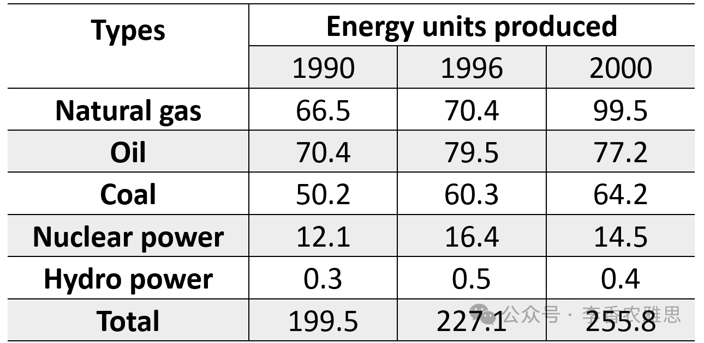

# 2026 年 8 月 15 日雅思写作真题
## Task 1

> **图表类型标注**：表格（1990/1996/2000 五种能源产量及总量）

**The table below shows the energy units produced from different sources in 1990, 1996 and 2000. Summarise the information by selecting and reporting the main features, and make comparisons where relevant.**




The table illustrates changes in the amount of energy produced from five sources, namely natural gas, oil, coal, nuclear power and hydropower, alongside total production in 1990, 1996 and 2000. 

Overall, total energy production increased steadily over the period, reaching its highest level in 2000. Oil was the largest source in 1990 and 1996, but by 2000 it had been overtaken by natural gas, which recorded by far the largest overall increase.

In detail, oil was the leading energy source in 1990, generating 70.4 units. Its output then rose to 79.5 units in 1996 before declining slightly to 77.2 units in 2000. Nuclear and hydropower followed the same pattern, albeit at far lower levels: nuclear output increased from 12.1 units in 1990 to 16.4 units in 1996 before slipping to 14.5 units in 2000, while the figure for hydropower changed only marginally, rising from 0.3 units to 0.5 units and then easing to 0.4 units.

By contrast, coal and natural gas both experienced upward trends. The former increased steadily from 50.2 units in 1990 to 60.3 units in 1996 and then to 64.2 units in 2000. Natural gas recorded a much sharper rise, climbing from 66.5 units in 1990 to 99.5 units in 2000 and overtaking oil by 22.3 units to become the largest contributor. Across the same period, total production rose steadily from 199.5 units to 255.8 units.

---

### 精析

#### ① 结构分析（精简）

本题属于 **Table（表格）** 类 Task 1，涉及五种能源（natural gas、oil、coal、nuclear power、hydropower）在 1990、1996、2000 三年的产量，以及逐年总产量。

本文采用 **"总-分-总"** 思路下的 4 段式结构（开头段改写题目 → 总览段 → 主体段 1（石油 + 核能/水电）→ 主体段 2（煤炭 + 天然气 + 总数收尾））：

- **Paragraph 1 — Introduction（开头段）**
  - 改写题目要素：`The table illustrates changes in the amount of energy produced from five sources, namely natural gas, oil, coal, nuclear power and hydropower, alongside total production in 1990, 1996 and 2000`（替换原题 `The table below shows the energy units produced from different sources in 1990, 1996 and 2000`）

- **Paragraph 2 — Overview（总览段）**
  - 总览全局：`Overall, total energy production increased steadily over the period, reaching its highest level in 2000`
  - 头条变化：`Oil was the largest source in 1990 and 1996, but by 2000 it had been overtaken by natural gas, which recorded by far the largest overall increase`（点明"石油被天然气反超"这一核心看点，先于正文铺开）

- **Paragraph 3 — Body 1（主体段：石油 + 核能/水电，先升后降或低位徘徊组）**
  - 石油：1990 年最大（70.4）→ 1996 升至 79.5 → 2000 微降至 77.2
  - 关键句：`In detail, oil was the leading energy source in 1990, generating 70.4 units`
  - 核/水同构：核能 12.1→16.4→14.5；水电 0.3→0.5→0.4，均"升后回落"且量级极低
  - 关键句：`Nuclear and hydropower followed the same pattern, albeit at far lower levels`

- **Paragraph 4 — Body 2（主体段：煤炭 + 天然气，持续上升组 + 总数收尾）**
  - 主线：By contrast 引出两源齐升，天然气尤为猛烈并反超石油
  - 关键句：`By contrast, coal and natural gas both experienced upward trends`
  - 煤炭稳升：50.2→60.3→64.2；天然气猛升：66.5→99.5，以 22.3 优势超石油成最大
  - 总数收束：`Across the same period, total production rose steadily from 199.5 units to 255.8 units`（呼应总览段"总数达峰"判断）

> **结构亮点**：作者把五种能源按"曲线形态"而非机械罗列分成两组——Body 1 收"石油领衔却先升后降 + 核能水电低位同构（升后回落）"，Body 2 收"煤炭天然气齐升、天然气猛超车石油"。最妙的是在总览段（P2）就把"石油被天然气反超"这一全表最具动态的看点提前抖出，再在 Body 2 用 "overtaking oil by 22.3 units to become the largest contributor" 收口，形成"总览预告 → 正文兑现"的呼应，静态表格被读成了"能源格局洗牌"的故事。

#### ② 数据组织与对比策略（标注有效写法）

| 写法 | 原文示例 | 技巧说明 |
|------|---------|---------|
| **总览+头条变化** | `Oil was the largest source in 1990 and 1996, but by 2000 it had been overtaken by natural gas, which recorded by far the largest overall increase` | 先给总数总览，再抖出"反超"头条，抓住全表最具动态看点 |
| **峰值+回落** | `Its output then rose to 79.5 units in 1996 before declining slightly to 77.2 units in 2000` | 用 rose... before declining 串起"先升后降"曲线，并标回落幅度轻微 |
| **同类合并+降调** | `Nuclear and hydropower followed the same pattern, albeit at far lower levels` | 把核/水并入一句，albeit at far lower levels 一键降调，避免逐源罗列 |
| **对比转折起手** | `By contrast, coal and natural gas both experienced upward trends` | By contrast 与第二组"齐升"形成对照，完成跨段跳转 |
| **极值+超越量化** | `Natural gas recorded a much sharper rise, climbing from 66.5 units in 1990 to 99.5 units in 2000 and overtaking oil by 22.3 units to become the largest contributor` | 用 by 22.3 units 量化反超优势，并以 largest contributor 收束排名变化 |

> **数据亮点**：作者没有逐源逐年罗列 5 源 × 3 年 = 15 个数据，而是抓出三条主线：石油"领衔却先升后降"被天然气反超、核能水电低位同构（升后回落）、煤炭天然气齐升且天然气猛超车石油。最聪明的是把"曲线形态"用作分组依据（升后降组 vs 持续升组）而非按产量高低排序，并给天然气反超标注精确差值（22.3），让"能源格局洗牌"这一隐藏叙事得以释放。

#### ③ 四项能力维度分析（TA / CC / LR / GRA）

- **TA**：作者按曲线形态把五源合理分成两组（升后降/低位组 vs 持续升组），并抓住"石油被天然气反超"与"总数达峰"两大核心特征；总览段（P2）预告、主体段 2 末尾以总数收束，覆盖题目要求的所有主要特征与比较。但见模块⑥针对性可改进点关于总数基线交代与水电量级的提示。
- **CC**：本文衔接精准且有层次。"Overall" 在总览段（P2）段首总览全局；"In detail" 在 Body 1 内由概括推进到石油数据点；"Nuclear and hydropower followed the same pattern, albeit at far lower levels" 用 same pattern 回指石油曲线、albeit 降调；"By contrast" 在 Body 2 开头与升后降组形成对照；"The former" 回指 coal 避免重复；"Across the same period" 在主体段 2 末尾把三组增长汇入总数。
- **LR**：见模块⑤词汇表，含 `the largest source`、`overtaken by`、`declining slightly`、`changed only marginally` 等精准词
- **GRA**：见模块⑤句式亮点

#### ④ 可迁移句型骨架（直接套用）（图表类型：表格（能源产量））

**骨架 1 — 开头改写（表格/图通用）**
> The [chart] illustrates changes in the amount of ______ produced from [sources], alongside total production in [years].

**骨架 2 — 总览+头条变化（Overview 通用）**
> Overall, total ______ increased steadily over the period. ______ was the largest in [early years], but by [late year] it had been overtaken by ______.

**骨架 3 — 同类合并+降调（Body 通用）**
> ______ and ______ followed the same pattern, albeit at far lower levels: ______ increased from ______ before slipping to ______.

**骨架 4 — 极值+超越量化（Body 通用）**
> ______ recorded a much sharper rise, climbing from ______ to ______ and overtaking ______ by ______ units to become the largest contributor.

#### ⑤ 衔接 / 词汇 / 句式亮点（去水版）

| 衔接类型 | 原文表达 | 功能 |
|---------|---------|------|
| **总体引入** | `The table illustrates changes in the amount of energy produced from five sources...` | 开头段改写题目并点明"变化"主题 |
| **总览定位** | `Overall, total energy production increased steadily over the period, reaching its highest level in 2000` | Overall 总览，建立"总数稳步升、2000 达峰" |
| **头条变化** | `Oil was the largest source in 1990 and 1996, but by 2000 it had been overtaken by natural gas` | but 转折抖出"反超"头条，统领全文 |
| **细节递进** | `In detail... / Its output then rose to 79.5 units in 1996 before declining slightly to 77.2 units` | In detail / then... before 由概括推进到锚点数据 |
| **同类并列** | `Nuclear and hydropower followed the same pattern... while the figure for hydropower changed only marginally` | same pattern 回指、while 并列核/水两源 |
| **对比+收尾** | `By contrast, coal and natural gas both experienced upward trends` / `Across the same period, total production rose steadily from 199.5 units to 255.8 units` | By contrast 对照分组，Across the same period 汇入总数 |

> **衔接亮点**：本文衔接精准且有层次。"Overall" 在总览段（P2）段首总览全局；"In detail" 在 Body 1 内由概括推进到石油数据点；"Nuclear and hydropower followed the same pattern, albeit at far lower levels" 用 same pattern 回指石油曲线、albeit 降调；"By contrast" 在 Body 2 开头与升后降组形成对照；"The former" 回指 coal 避免重复；"Across the same period" 在主体段 2 末尾把三组增长汇入总数。

| 词汇/短语 | 中文含义 | 词性/用法 | 替代普通表达 |
|-----------|----------|----------|-------------|
| **energy units produced** | 能源产量（单位） | 名词短语 | amount of energy made |
| **five sources** | 五种（能源）来源 | 名词短语 | five kinds of energy |
| **the largest source** | 最大的（能源）来源 | 名词短语 | the biggest type |
| **overtaken by** | 被超过；被反超 | 动词短语（被动） | passed / surpassed by |
| **declining slightly** | 轻微下降 | 动词短语 | going down a little |
| **followed the same pattern** | 呈现相同的变化模式 | 动词短语 | changed in the same way |
| **changed only marginally** | 变化甚微 | 动词短语 | changed very little |
| **by far the largest overall increase** | 遥遥领先的总体增幅 | 名词短语 | clearly the biggest total rise |

**1. 总览+反超头条句（开头段）**
> *"Overall, total energy production increased steadily over the period, reaching its highest level in 2000. **Oil was the largest source in 1990 and 1996, but by 2000 it had been overtaken by natural gas, which recorded by far the largest overall increase.**"*

**技巧**：Overall 总览总数，随后用 but 转折把"石油领衔 → 被天然气反超"这一动态看点提前抛出；过去完成时 had been overtaken 标示"到 2000 已完成"的排名变化，which 从句补"最大增幅"，一句完成预告。

**2. 峰值+回落句（Body 1）**
> *"Its output **then rose to 79.5 units in 1996 before declining slightly to 77.2 units in 2000**."*

**技巧**：then... before 把"先升后降"曲线串成一句，declining slightly 精准标注回落幅度轻微，比另写两句更紧凑，信息密度高。

**3. 同类合并+降调句（Body 1）**
> *"Nuclear and hydropower **followed the same pattern, albeit at far lower levels**: nuclear output increased from 12.1 units in 1990 to 16.4 units in 1996 before slipping to 14.5 units in 2000, **while** the figure for hydropower changed only marginally..."*

**技巧**：followed the same pattern 回指石油曲线、albeit at far lower levels 用介词短语一键降调，避免逐源罗列；while 并列核/水，before slipping 与 changed only marginally 分别刻画两源微幅回落，合并高效。

**4. 极值+超越量化句（Body 2）**
> *"Natural gas **recorded a much sharper rise, climbing from 66.5 units in 1990 to 99.5 units in 2000 and overtaking oil by 22.3 units to become the largest contributor**."*

**技巧**：a much sharper rise 与石油"先升后降"形成对比；climbing from... to... 给区间；overtaking oil by 22.3 units 用精确差值量化反超优势，to become the largest contributor 收束排名变化，一句兑现开头预告，闭环有力。

---

#### ⑥ 可提升空间 + 仿写任务

**可提升空间（通用要点，按篇酌情采纳）：**
- Overview 建议前置或明确独立成段，让阅卷人先抓全局（TA 更稳）。
- 双维度数据（如总数/占比）尽量也收进 Overview，避免只在正文提一次。
- 跨段对比（如 A 反超 B）可集中到一句呈现，衔接更紧凑。

**本文针对性可改进点（按篇分析，点到即止）：**
- 开头段承诺写 `alongside total production`，但总数 199.5→255.8 直到主体段 2 末尾才出现，总览段只说"稳步上升、2000 达峰"未给基线，可把起点总数提前到总览句。
- 核能（12.1→16.4→14.5）与水电（0.3→0.5→0.4）被合并为"far lower levels"，但水电量级不足 0.5、几乎可忽略，仍与核能同等描述，可点明其"可忽略贡献"以更客观。
- `overtaking oil by 22.3 units` 中 22.3 是 99.5−77.2 之差，正文未说明来源，读者需自算；可与石油 2000 年的 77.2 并置明示"99.5 比 77.2 多 22.3"，更直观。

**仿写任务**：用「极值+超越量化」骨架写一句：描述『2025 年可再生能源产量从 X 升至 Y，并以 Z 单位优势超过煤炭成为最大来源』。

## Task 2

> **话题与题型标注**：工作类 · Agree/Disagree

**Many factors motivate people in the workplace. Some people think money is the most important. Do you agree or disagree?**

**许多因素激励着职场中的人们。一些人认为金钱是最重要的因素。你在多大程度上同意或不同意？**


People's willingness to work productively can be shaped by numerous factors, including financial rewards, promotion prospects and professional recognition. Although competitive salaries are an important source of motivation, I disagree that money is necessarily the most important, as promotion opportunities and formal recognition can be equally powerful in sustaining employees' effort and commitment.

人们高效工作的意愿会受到多种因素影响，包括经济回报、晋升前景和职业认可。尽管有竞争力的薪资是一项重要动力，我仍不同意金钱必然最重要，因为晋升机会和正式认可同样能够有效维持员工的努力与投入。

Admittedly, financial rewards are a major workplace motivator. Higher salaries give employees financial security and provide access to better housing, high-quality education for their children, reliable healthcare for ageing parents and leisure activities, all essential to a comfortable lifestyle. Without predictable income growth, workers may face uncertainty that undermines their ability to plan for the future. This direct connection between effort and material well-being explains why performance-related bonuses or salary increments often encourage employees to work more efficiently and contribute to project success. Substantial compensation can also motivate employees to remain in leadership or technically demanding positions involving complex operations and significant financial or reputational risks. When remuneration reflects workload and responsibility, employees are more willing to undertake difficult tasks and maintain high performance. Financial incentives are therefore particularly powerful for those under economic pressure or deciding whether additional effort is worthwhile.

诚然，经济回报是职场中的一项重要动力。较高的薪资能够为员工提供经济保障，使他们有条件获得更好的住房、让子女接受优质教育、为年迈的父母提供可靠的医疗保障，并享受休闲活动；这些都是舒适生活不可或缺的组成部分。如果缺少可预期的收入增长，员工可能会面临不确定性，从而削弱其规划未来的能力。努力程度与物质福祉之间的这种直接联系，可以解释为什么绩效奖金或加薪往往能够促使员工提高工作效率并推动项目成功。优厚的薪酬还可以激励员工继续留在领导岗位或技术要求高的岗位，而这些岗位往往涉及复杂的运营以及重大的财务或声誉风险。当薪酬能够体现工作量和责任时，员工会更愿意承担困难任务并保持高水平表现。因此，对于面临经济压力，或者正在权衡额外付出是否值得的人而言，金钱激励尤其有效。

Nevertheless, promotion opportunities and formal recognition can be as important as money in sustaining workplace motivation. A promotion does more than increase income: it demonstrates that an employee's expertise and contribution are valued, while providing greater authority, responsibility and a visible route towards career advancement. Employees who can see such progression are more likely to refine their skills, take initiative and remain committed to their organisation. Similarly, honouring high performers through professional awards or public acknowledgement not only recognises exceptional effort and talent but also establishes benchmarks for others to emulate. For experienced professionals whose financial needs have already been met, another pay rise may be less meaningful than a respected title, greater influence or recognition from their peers. Acknowledgement of progress can foster stronger intrinsic motivation and a deeper sense of purpose. These psychological and professional rewards can sustain engagement long after the immediate appeal of extra money has faded.

然而，在维持职场动力方面，晋升机会和正式认可与金钱同等重要。晋升带来的不仅是收入增加：它还表明员工的专业能力和贡献受到重视，同时赋予其更大的权限和责任，并提供一条清晰可见的职业晋升路径。能够看到这种发展前景的员工，更可能提升技能、主动担当，并保持对组织的投入。同样，通过专业奖项或公开认可来表彰高绩效员工，不仅肯定了他们非凡的努力和才华，也为他人树立可供效仿的标杆。对于经济需求已经得到满足的资深专业人士而言，再次加薪的意义可能不及一个受人尊重的头衔、更大的影响力或同行认可。对进步的肯定能够培养更强的内在动力和更深层的目标感。这些心理和职业层面的回报能够维持投入度，其作用远比额外收入带来的即时吸引力更加持久。

In conclusion, money remains an important motivator because it provides financial security and connects additional effort with tangible rewards. It is not invariably the most important, however: promotion and professional recognition also satisfy employees' needs for growth, status, achievement and purpose, making them equally powerful sources of long-term motivation.

总之，金钱仍然是一项重要动力，因为它能够提供经济保障，并将额外付出与切实可见的回报联系起来。然而，金钱并非在任何情况下都是最重要的：晋升与职业认可同样能够满足员工对成长、地位、成就和价值感的需要，因此也是同样强大的长期动力。

---


### 精析

#### ① 结构分析（精简）

本题属于 **Agree/Disagree** 类题型。题干给出"金钱是否最重要动力"的争议，要求明确立场并论证。核心策略是：先承认对方合理之处（金钱确重要），再反驳"必然最重要"，以晋升与认可论证其同等甚至更长尾的力量。

本文采用 **"先退后进—双维反驳"** 四段式结构：

- **Paragraph 1 — Introduction（开头段）**
  - 改写题目（paraphrase）：`People's willingness to work productively can be shaped by numerous factors, including financial rewards, promotion prospects and professional recognition`（替换题干 `Many factors motivate people... Some people think money is the most important`）
  - 表明立场：`Although competitive salaries are an important source of motivation, I disagree that money is necessarily the most important, as promotion opportunities and formal recognition can be equally powerful in sustaining employees' effort and commitment`（不同意"金钱必然最重要"）
  - 预告框架：先承认金钱价值，再论证晋升与认可同等有力

- **Paragraph 2 — Body 1（让步段 Admittedly：金钱确为重要动力）**
  - 主题句：`Admittedly, financial rewards are a major workplace motivator`
  - 保障维度：高薪→经济保障+优质住房/教育/医疗/休闲
  - 反面机制：缺可预期收入增长→不确定性→削弱规划能力
  - 机制解释：努力与物质福祉直接挂钩→绩效奖金促效率
  - 高风险岗位：优厚薪酬留任领导/技术岗（复杂运营+财务声誉风险）
  - 条件结论：薪酬体现工作量责任→愿担难任务保高绩效；经济压力者金钱尤强

- **Paragraph 3 — Body 2（主论反驳段 Nevertheless：晋升与认可可等同重要）**
  - 主题句：`promotion opportunities and formal recognition can be as important as money in sustaining workplace motivation`
  - 晋升价值：不止加薪→肯定贡献+更大权限责任+可见晋升路径
  - 行为效应：见前景者更提升技能/主动/留任
  - 认可价值：专业奖项/公开认可→肯定才华+树标杆供效仿
  - 资深群体：财务已满足者→头衔/影响/同行认可 > 再加薪
  - 心理层面：对进步的肯定→更强内在动力+目标感，长尾持久

- **Paragraph 4 — Conclusion（结尾段）**
  - 重申：金钱仍重要（提供经济保障+连接努力与切实回报）
  - 综合立场：`It is not invariably the most important, however: promotion and professional recognition also satisfy employees' needs for growth, status, achievement and purpose, making them equally powerful sources of long-term motivation`

> **结构亮点**：本文采用经典"先退后进"结构。开头用 Although 让步承认薪资是重要动力，再用 I disagree that money is necessarily the most important 明确反对"必然最重要"的命题，立场审慎而有张力。Body 1 充分承认金钱的多维价值（保障、风险岗留任、经济压力者尤强），Body 2 才以"晋升+认可"双维系统展开，从"可见晋升路径"到"内在动力长尾"，最后用 In conclusion 综合双方、回归"金钱非恒最重要"的平衡立场。这种"理解对方 → 建设己方"的推进，比一边倒更具说服力。

#### ② 论证逻辑链拆解（标注有效写法）

**Body 1（让步段：金钱确为重要动力）的逻辑链条：**

```
金钱是重要职场动力（前提A）
    ↓ [保障维度]
→ 高薪提供经济保障 + 优质住房 / 教育 / 医疗 / 休闲
    ↓ [反面]
→ 缺可预期收入增长 → 不确定性 → 削弱规划未来能力
    ↓ [机制]
→ 努力与物质福祉直接挂钩 → 绩效奖金促效率 / 项目成功
    ↓ [高风险岗位]
→ 优厚薪酬留任领导 / 技术岗（复杂运营 + 财务声誉风险）
    ↓ [条件]
→ 薪酬体现工作量责任 → 员工愿担难任务保高绩效
    ↓ [适用]
→ 经济压力者 / 权衡付出者 → 金钱激励尤强
```

**Body 2（主论反驳段：晋升与认可可等同重要）的逻辑链条：**

```
晋升与认可可等同重要（前提B）
    ↓ [晋升价值]
→ 不止加薪：肯定专业贡献 + 更大权限责任 + 可见晋升路径
    ↓ [行为效应]
→ 见前景者更提升技能 / 主动 / 留任
    ↓ [认可价值]
→ 专业奖项 / 公开认可 → 肯定才华 + 树标杆供效仿
    ↓ [资深群体]
→ 财务已满足者：头衔 / 影响 / 同行认可 > 再加薪
    ↓ [心理层面]
→ 对进步的肯定 → 更强内在动力 + 目标感
    ↓ [结论]
→ 心理职业回报在额外金钱吸引力消退后仍持久
```

> **逻辑亮点**：Body 1 用"保障维度 + 反面推导 + 风险岗适用"承认金钱价值的边界（经济压力者尤强），体现对对立立场的充分理解；Body 2 则用"分类论证"从晋升维度与认可维度展开，并以"资深专业人士财务已满足→头衔 > 再加薪"作为"金钱非恒最重要"的具象证据，使抽象论证落地。两段形成"理解对方 → 建设己方"的递进，逻辑闭环。

#### ③ 四项能力维度分析（TA / CC / LR / GRA）

- **TA**：本文采用经典"先退后进"结构。开头用 Although 让步承认薪资是重要动力，再用 I disagree that money is necessarily the most important 明确反对"必然最重要"的命题。Body 1 充分承认金钱的多维价值（保障、风险岗留任、经济压力者尤强），Body 2 才以"晋升+认可"双维系统展开，最后用 In conclusion 综合双方、回归平衡立场。但见模块⑥针对性可改进点关于概念边界与关键词复现的提示。
- **CC**："Admittedly → Nevertheless" 构成全篇论证主轴，先充分承认金钱价值，再转向晋升与认可，张弛有度；"This direct connection... explains why..." 在 Body 1 内部用因果链解释机制；"Similarly" 在 Body 2 内并列"晋升"与"认可"两维度；"For experienced professionals whose financial needs have already been met" 用定语从句锁定特定群体，使"头衔 > 再加薪"的论点精准落地。
- **LR**：见模块⑤词汇表，含 `financial security`、`performance-related bonuses`、`technically demanding positions`、`intrinsic motivation` 等精准词
- **GRA**：见模块⑤句式亮点

#### ④ 可迁移句型骨架（直接套用）（题型：Agree/Disagree）

**骨架 1 — 先退后进亮立场（Intro）**
> Although ______ are an important source of motivation, I disagree that ______ is necessarily the most important, as ______ can be equally powerful in ______.

**骨架 2 — 保障维度起手（Body 1）**
> Higher ______ give people ______ and provide access to ______, all essential to ______.

**骨架 3 — 分类论证起手（Body）**
> ______ does more than increase income: it demonstrates that ______ is valued, while providing ______ and a visible route towards ______.

**骨架 4 — 长尾收束（Body / Conclusion）**
> These psychological and professional rewards can sustain ______ long after the immediate appeal of ______ has faded.

#### ⑤ 衔接 / 词汇 / 句式亮点（去水版）

| 衔接类型 | 原文表达 | 功能说明 |
|---------|---------|---------|
| **立场预告** | `Although competitive salaries are an important source of motivation, I disagree that money is necessarily the most important...` | 开头段先退后进，明确反对"金钱必然最重要" |
| **让步衔接** | `Admittedly, financial rewards are a major workplace motivator.` | 用 Admittedly 引出对方合理之处 |
| **反面条件** | `Without predictable income growth, workers may face uncertainty that undermines their ability to plan for the future.` | Without 引导反面条件，推导后果 |
| **机制解释** | `This direct connection between effort and material well-being explains why performance-related bonuses... often encourage employees to work more efficiently` | This... explains why 用回指衔接解释机制 |
| **转折反驳** | `Nevertheless, promotion opportunities and formal recognition can be as important as money in sustaining workplace motivation.` | Nevertheless 转向己方主论 |
| **并列维度** | `Similarly, honouring high performers through professional awards or public acknowledgement...` | Similarly 并列"晋升"与"认可"两维度 |
| **群体限定** | `For experienced professionals whose financial needs have already been met, another pay rise may be less meaningful than...` | 用定语从句锁定特定群体，论点精准 |
| **总结综合** | `In conclusion, money remains an important motivator... It is not invariably the most important, however: promotion and professional recognition also...` | however 让步 + 重申综合立场 |

> **衔接亮点**："Admittedly → Nevertheless" 构成全篇论证主轴，先充分承认金钱价值（保障、风险岗、经济压力者），再转向晋升与认可，张弛有度；"This direct connection... explains why" 用回指衔接把"努力—物质福祉"机制串成因果；"Similarly" 在 Body 2 内并列晋升与认可两维度；"For experienced professionals whose financial needs have already been met" 将"头衔 > 再加薪"的抽象论点落到具体人群，增强可信度。

| 词汇/短语 | 中文含义 | 词性/用法 | 替代普通表达 |
|-----------|----------|----------|-------------|
| **financial security** | 经济保障 | 名词短语 | money safety |
| **performance-related bonuses** | 与绩效挂钩的奖金 | 名词短语 | bonuses for good work |
| **salary increments** | 加薪 | 名词短语 | pay rises |
| **technically demanding positions** | 技术要求高的岗位 | 名词短语 | hard technical jobs |
| **remuneration** | 薪酬；报酬 | 名词（正式） | pay |
| **intrinsic motivation** | 内在动力 | 名词短语 | inner drive |
| **professional recognition** | 职业认可 | 名词短语 | being recognised at work |
| **tangible rewards** | 切实可见的回报 | 名词短语 | real rewards |

**1. 让步转折复合句（开头段）**
> *"**Although** competitive salaries are an important source of motivation, **I disagree that money is necessarily the most important**, as promotion opportunities and formal recognition can be equally powerful in sustaining employees' effort and commitment."*

**技巧**：Although 让步承认薪资重要，主句用 I disagree that... necessarily the most important 明确反对"必然最重要"的极端命题，as 从句给出己方替代维度（晋升/认可），立场审慎而鲜明。

**2. 保障维度+总结句（让步段）**
> *"Higher salaries give employees **financial security** and provide access to better housing, high-quality education for their children, reliable healthcare for ageing parents and leisure activities, **all essential to a comfortable lifestyle**."*

**技巧**：give... and provide access to 并列"经济保障"与多项具体福利，尾句 all essential to... 用名词短语作总结同位语，把一长串列举收束于"舒适生活"一个概念，紧凑不散。

**3. 分类论证起手句（主论段）**
> *"A promotion **does more than increase income**: it demonstrates that an employee's expertise and contribution are valued, **while providing** greater authority, responsibility and a visible route towards career advancement."*

**技巧**：does more than 先抑（不止加薪）后扬，it demonstrates that 点明"贡献被重视"的深层价值，while providing 并列权限/责任/晋升路径三重积极效果，是展开分论点的标准起手式。

**4. 群体限定+长尾句（主论段）**
> *"**For experienced professionals whose financial needs have already been met**, another pay rise may be less meaningful than a respected title, greater influence or recognition from their peers... These psychological and professional rewards can sustain engagement **long after the immediate appeal of extra money has faded**."*

**技巧**：For... whose... 用定语从句锁定"财务已满足的资深者"群体，使"头衔 > 再加薪"的论点精准落地；long after... has faded 用时间状语强调心理/职业回报的长尾性，直击"金钱非恒最重要"的核心，是收束主论的优质写法。

#### ⑥ 可提升空间 + 仿写任务

**可提升空间（通用要点，按篇酌情采纳）：**
- 结论段避免复读开头，应「推进」而非「重复」立场。
- 让步段衔接词（this connection 等）回指别太远，可加限定词收紧。
- 同一话题词（如 motivation / reward）避免三现，用近义替换。

**本文针对性可改进点（按篇分析，点到即止）：**
- 概念边界略糊：Body 2 把 `professional recognition` 与 `promotion` 作为并列两维展开，但段内又出现 `recognition from their peers` 与 `professional awards / public acknowledgement`，认可维度内部略有重叠；若先定义"晋升=结构性认可、奖项=象征性认可"再分述，层次更清。
- 结论段 `money remains an important motivator because it provides financial security` 与 Body 1 首句 `financial rewards are a major workplace motivator` + `give employees financial security` 近义复读，结论偏复述而非推进，可改为点明"金钱是必要非充分"。
- `equally powerful` 在 intro（equally powerful in sustaining...）与 conclusion（equally powerful sources of long-term motivation）两现，属关键词复现，conclusion 可换为 `equally enduring` 或 `equally decisive` 以保持变化。

**仿写任务**：用「先退后进」骨架重写：*Some think a high salary is the only thing that keeps teachers in the job.*
